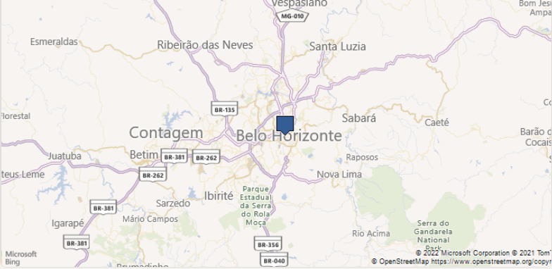
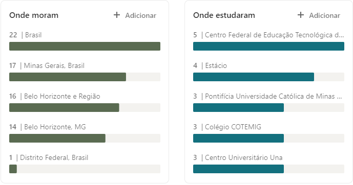
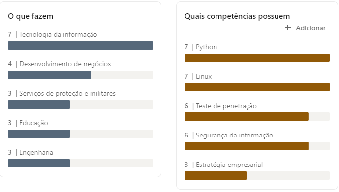
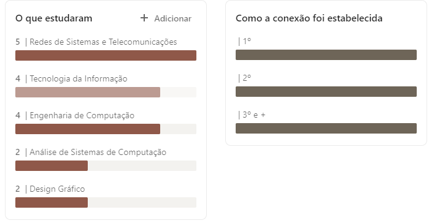
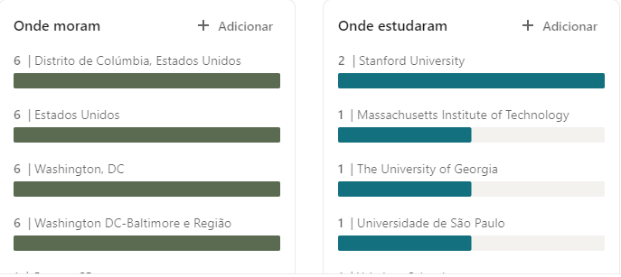
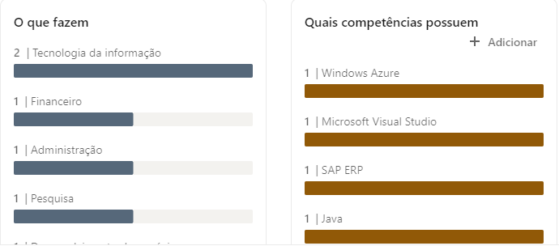
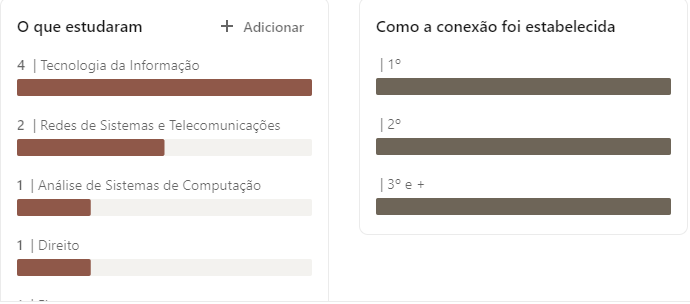

# **Information Gathering - Business | Sonael de A. Angelos Neto**

## **◦ Pacific Sec**
 A Pacific Security tem como missão promover a segurança da informação de forma eficiente e eficaz, através de serviços de consultoria e treinamentos, visando a proteção de dados e informações de seus clientes.

--- 

### ***• Pesquisa no Google***

Através de uma consulta no google é possível encontrar a página oficial da empresa.

> https://www.pacificsec.com.br/

onde é possível encontrar informações sobre a empresa, como:

#### ***Princípios:***
> A Pacific Security é uma empresa que acumula mais de 13 anos em experiência dedicados a Segurança da Informação. Nosso time é composto por consultores que acumularam experiências nas maiores empresas de tecnologia e segurança do mundo!

#### ***Virtudes:***
> Muito mais que uma empresa somos um time que tem como foco central o ótimo e mais qualificado atendimento aos nossos clientes. Temos orgulho de hoje poder afirmar que não colecionamos clientes e sim amigos. Atendemos hoje as principais empresas nos segmentos bancário, industrial e alimentício.

#### ***Motivação:***
> Nós acreditamos que Segurança da Informação é um dever e direito de todos, e para isso fazemos nossa parte promovendo em nossa comunidade local treinamentos técnicos e de conscientização gratuitos para empresas e pessoas.

### ***Outras informações encontradas na página:***

Algumas outras informações encontradas na página são:

#### **- Localidade:**

|***Endereços***            |***Valores***           
|---------------------------|------------------------------- 
|País                       |`Brasil`             
|Estado                     |`Minas Gerais (MG)`
|Cidade                     |`Belo Horizonte`
|Rua                        |`Av do Contorno 2905`

#### **- Contatos:**

|***Contatos***             |***Valores***
|---------------------------|-------------------------------
|Telefone                   |`+55 31 3236 1490`
|Telefone                   |`+55 31 9 9236 0427`

--- 

### ***• Pesquisa no linkedin***

Através de uma consulta no linkedin é possível encontrar o perfil oficial da empresa.

> https://www.linkedin.com/company/pacific-sec

### **Perfil da empresa**

No [perfil da empresa](https://www.linkedin.com/company/pacific-sec/about/) é possível encontrar informações sobre a empresa, como:

#### ***- Visão geral***

|***Informações***          |***Resultados***
|---------------------------|-------------------------------
|setor                      |`Serviços e consultoria de TI`
|tamanho da empresa         |`11-50 funcionários`
|Fundada em                 |`2013`

#### ***- Localidades***

Através da pagina inicial da empresa é possível encontrar a localização da empresa.
>  

#### ***- Informações sobre os Funcionários***

Através da aba [Pessoas](https://www.linkedin.com/company/pacific-sec/people/) é possível encontrar informações sobre os funcionários da empresa.

> 
---
> 
---
> 

---
---
## **◦ eLSFoo**

eLSFoo fornece serviços de TI de alta qualidade, software, aplicativos para clientes em segmentos como e-business, telecomunicações, militares, bancários e serviços de TI financeiros.

---
### ***• Pesquisa no Google***

O site da empresa não está mais disponivel através de uma pesquisa por buscadores convencionais, porém é possível encontrar o site através de uma pesquisa no [Wayback Machine](https://web.archive.org/web/20210715000000*/elsfoo.com).

No site é possível encontrar informações sobre a empresa, como:

#### ***About eLSFoo***
>eLSFoo is a technology company that provide software solutions, IT services, applications in such segments such as telecommunications, military, banking and financial. eLSFoo develops and delivers a comprehensive suite of computer-based and mobile-based services for enterprise IT management. Our applications are field-proven by some of the leading companies in the business.
    >>A eLSFoo é uma empresa de tecnologia que fornece soluções de software, serviços de TI, aplicativos em segmentos como telecomunicações, militar, bancário e financeiro. A eLSFoo desenvolve e fornece um conjunto abrangente de serviços baseados em computador e em dispositivos móveis para gerenciamento corporativo de TI. Nossos aplicativos são comprovados em campo por algumas das principais empresas do setor.

### ***Our Mission***
> Our mission is to merge th latest technologies benefits to promote customer profit, and economic growth. We offer clients increased efficiency and productivity while saving them money and time.
    >> Nossa missão é mesclar os benefícios das tecnologias mais recentes para promover o lucro do cliente e o crescimento econômico. Oferecemos aos clientes maior eficiência e produtividade, economizando tempo e dinheiro.

**também é possível encontrar informações sobre os serviços da empresa, como:**

 ### ***Solutions We Provide***
> eLSFoo solution are thought and developed to fit your needs and improves your business processes. We provide applications for all kind of business.Our team of highly skilled and qualified with great experience on VB.NET, ASP.NET, C#, PHP, Java and more. eLSFoo software give organisations the ability to improve performance, increase efficiencies, and grow competitive advantage.
    >> As soluções eLSFoo são pensadas e desenvolvidas para atender às suas necessidades e melhorar seus processos de negócios. Fornecemos aplicações para todo tipo de negócio. Nossa equipe é altamente capacitada e qualificada com grande experiência em VB.NET, ASP.NET, C#, PHP, Java e muito mais. O software eLSFoo oferece às organizações a capacidade de melhorar o desempenho, aumentar a eficiência e aumentar a vantagem competitiva.

### ***Basic Solution***

- Fast and easy configuration
- Inventory Control
- Accounting
- Management
- Marketing
- Service & Billing

**Preço $59**

### ***Medium Solution***

- Fast and easy configuration
- Inventory Control
- Accounting
- Management
- Marketing
- Service & Billing
- Share and access business information in total security
- Be always in touch with customers and collegues

**Preço $159**

### ***Premium Solution***

- Fully custom
- Add a wide variety of new capabilities to you business solution
- Support 24/7
- Integration with other products

**Não há um preço disponível no site**

**Há também uma página sobre os parceiros da empresa, que são:**

**Junto com uma seção de comentários sobre os serviços prestados, que são:**
>### **Daniel Davidyan**
>>***eLSFoo have been superb. Their customer service is great, as their work is. They did a great job and we wholeheartedly recommend them to all colleagues and associates.***

>### **Marie Stanktovik, Dooodle Inc.**
>>***eLSFoo is definitely the best company I have ever interacted with.***

>### **Bernard McDofie**
>> ***eLSFoo is doing a fantastic job! I've submitted a few support requests to my account manager and he got me the answers I was looking for very quickly.***

### ***Outras informações encontradas na página:***

#### **- Contatos:**

|***Contatos***             |***Valores***
|---------------------------|-------------------------------
|Email                      |`contactus@elsfoo.com`
|Telefone                   |`555-800-123456`

#### **- Localidade:**

|***Endereços***            |***Valores***           
|---------------------------|------------------------------- 
|País                       |`United States`             
|Estado                     |`Columbia`
|Cidade                     |` Washington D.C`
|Rua                        |`4th Street Northwest`

---

### ***• Pesquisa no Linkedin***

Através de uma consulta no linkedin é possível encontrar o perfil oficial da empresa.

> https://www.linkedin.com/company/elsfoo

### **Perfil da empresa**

No [perfil da empresa](https://www.linkedin.com/company/elsfoo/about/) é possível encontrar informações sobre a empresa, como:

#### ***- Visão geral***

|***Informações***          |***Resultados***
|---------------------------|-------------------------------
|site                       |`http://www.elsfoo.com`
|setor                      |`Serviços e consultoria de TI`
|tamanho da empresa         |`11-50 funcionários`
|Fundada em                 |`2005`
|Especializações            |`Software Solutions e Mobile Applications`

### ***• Enumeração de Funcionários***

Através da aba [Pessoas](https://www.linkedin.com/company/elsfoo/people/) é possível encontrar informações sobre os funcionários da empresa.

|***Funcionário***          |***Nome***                     |***Cargo***                                                |***Localização***
|---------------------------|-------------------------------|-----------------------------------------------------------|-------------------------------
|    |`Frank Otavalli`               |`Chief Executive Officer on eLSFoo`                        |`Washington, DC`
|    |`Berny Reed`                   |`CIO at eLSFoo`                                            |`Washington, DC`
|    |                               |`Research and development at eLSFoo`                       |`Washington, DC`
|    |                               |`CTO at eLSFoo`                                            |`Washington, DC`
|    |`Teresa Simons`                |`Executive Secretary to Managing Director at eLSFoo`       |`Washington, DC`
|    |                               |`Chief financial officer at eLSFoo`                        |`Washington, DC`

#### ***- Informações adicionais sobre os Funcionários:***

> 
---
> 
---
> 

---

