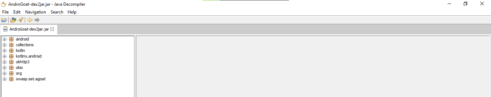
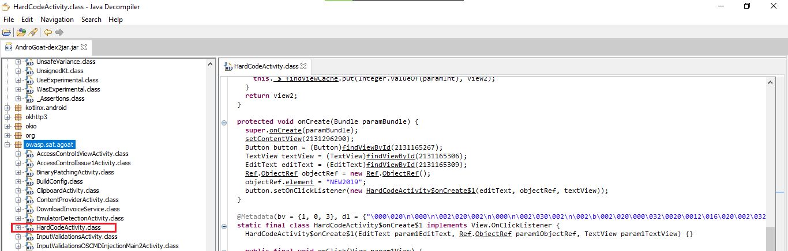
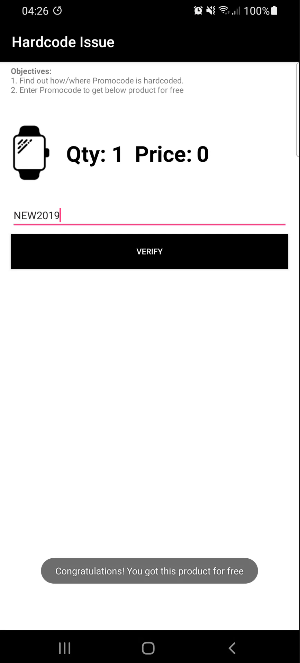
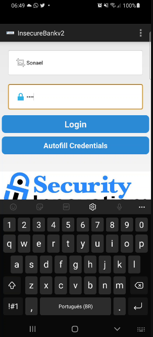
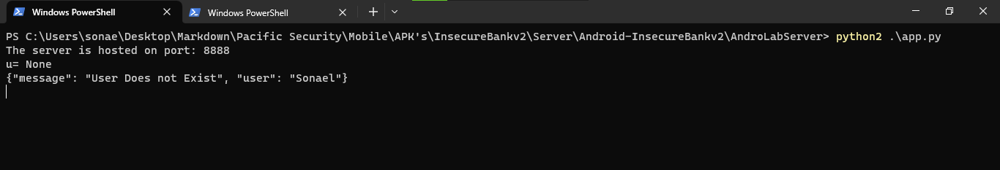
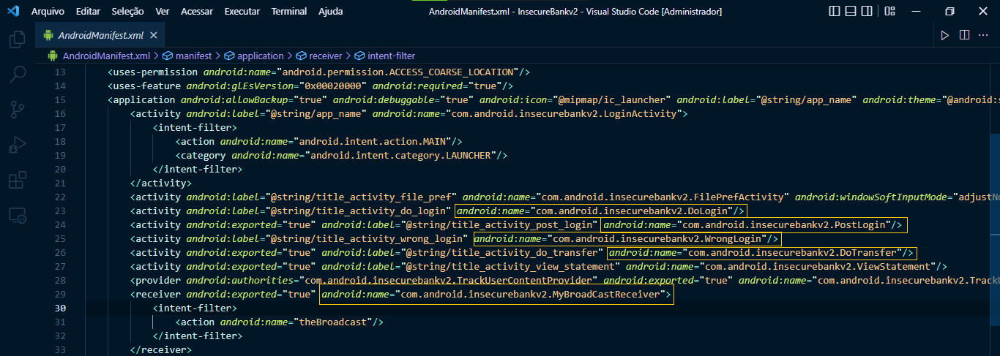
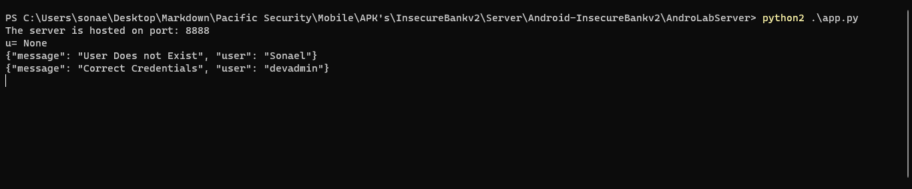
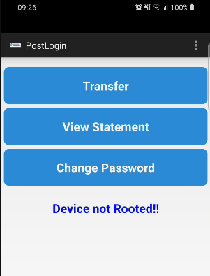

<div class="page"/>

# **Mobile - Exploração Estática | Sonael de A. Angelos Neto**

- ### **O que é Exploração Estática**

  A exploração estática em aplicativos mobile refere-se ao processo de analisar o código-fonte ou o binário de um aplicativo móvel sem executá-lo. É uma técnica utilizada na segurança da informação para identificar vulnerabilidades potenciais, más práticas de codificação e outros problemas de segurança. A exploração estática pode ser realizada manualmente por um especialista em segurança da informação ou automatizada com a ajuda de ferramentas especializadas.

  O objetivo da exploração estática é encontrar pontos fracos no aplicativo antes que eles sejam explorados por atacantes mal-intencionados. Além disso, a exploração estática pode ajudar a identificar o uso inadequado de bibliotecas ou APIs, problemas de desempenho e outras questões relacionadas ao desenvolvimento de aplicativos.

  Em resumo, a exploração estática é uma etapa importante na validação da segurança de um aplicativo móvel e pode ajudar a garantir que os dados do usuário e as informações confidenciais estejam protegidos contra ameaças de segurança.

- ### **O que um atacante pode conseguir ao realizar esse tipo de exploração?**

  Um atacante pode conseguir várias informações valiosas ao realizar uma exploração estática em um aplicativo móvel, incluindo:

  - **Informações sensíveis do usuário**: a exploração estática pode revelar informações confidenciais do usuário, como senhas, tokens de autenticação, informações bancárias e dados de localização, que estão armazenados no aplicativo ou transmitidos pela rede.

  - **Vulnerabilidades de segurança**: a exploração estática pode ajudar a identificar vulnerabilidades de segurança no aplicativo, como a falta de criptografia adequada, a exposição de informações sensíveis e a falta de autenticação adequada.

  - **Dados sensíveis do sistema**: a exploração estática pode revelar informações sensíveis do sistema, como a versão do sistema operacional, a versão do aplicativo, as bibliotecas usadas, as informações da conta do usuário e outras informações confidenciais.

  - **Fluxo de execução do aplicativo**: a exploração estática pode ajudar a entender como o aplicativo funciona e como as informações são processadas, o que pode ser usado para identificar pontos fracos na segurança do aplicativo.

  Em resumo, a exploração estática pode ajudar um atacante a coletar informações valiosas que possam ser usadas para comprometer a segurança do aplicativo e dos dados do usuário. Portanto, é importante que os desenvolvedores de aplicativos móveis tomem medidas para proteger o aplicativo contra essas ameaças, incluindo a realização de testes de segurança rigorosos e a implementação de medidas de segurança adequadas.
---

## **<center>Sumário</center>**

  **Nesse documento, iremos analisar o código de **2** aplicativos mobile.**

  1. #### ***<a href="#1">Encontre o cupom de desconto hardcoded na aplicação AndroGoat.</a>***
  2. #### ***<a href="#2">Análise estática na aplicação InsecureBankv2.</a>***

### **Complementos:**

   3. #### ***<a href="#3">Mitigação.</a>***
   4. #### ***<a href="#4">Dificuldades.</a>***
   5. #### ***<a href="#5">Conclusão.</a>***
   6. #### ***<a href="#6">Referências.</a>***
   7. #### ***<a href="#7">Links p/ Aplicativos.</a>***
  
---

### **Ferramentas utilizadas:**

- #### [Apktool](https://ibotpeaches.github.io/Apktool/) :
    - Utilizaremos o `apktool` para descompilar o apk.

- #### [dex2jar](https://github.com/pxb1988/dex2jar) :
    - Utilizaremos o `dex2jar` para converter o arquivo `.apk` para `.jar`.

- #### [jd-gui](http://java-decompiler.github.io)
    - Utilizaremos o `jd-gui` para descompilar o arquivo `.jar` e visualizar o código fonte.

- #### [Python](https://www.python.org) :
    - Utilizaremos o `python` para criar o script.

---

<div class="page"/>

## **<a id="1"> • Encontre o cupom de desconto hardcoded na aplicação AndroGoat.</a>**

O `AndroGoat` é uma aplicação desenvolvida pela OWASP para auxiliar no aprendizado de segurança mobile. Nesse tópico, iremos explorar uma vulnerabilidade de `Hardcoded Credentials` na aplicação `AndroGoat`.
    
Para baixar o `AndroGoat`,temos que acessar o link: [AndroGoat](https://github.com/satishpatnayak/AndroGoat) e baixar o arquivo `.apk` da aplicação.

Primeiramente, iremos descompilar o arquivo `.apk` para `.jar` utilizando o `dex2jar`:

```text
PS C:\Users\sonae\Desktop\Markdown\Pacific Security\Mobile\APK's\AndroGoat> ..\..\tools\dex-tools-2.1\d2j-dex2jar.bat .\AndroGoat.apk

dex2jar .\AndroGoat.apk -> .\AndroGoat-dex2jar.jar
```

Agora que temos o arquivo `AndroGoat-dex2jar.jar`, iremos utilizar o `jd-gui` para descompilar o arquivo `.jar` e visualizar o código fonte.

Ao abrir o arquivo `.jar` no `jd-gui`, nos deparamos com o seguinte sistema de pastas:



teremos que navegar pelas pastas até encontrar algum arquivo que contenha o cupom de desconto.

Ao dar uma olhada nos nomes das classes, podemos ver que temos uma classe chamada `HardcodeActivity` que fica dentro da pasta `owasp.sat.agoat`.




Dentro dessa classe, temos o seguinte código:

```java
  protected void onCreate(Bundle paramBundle) {
    super.onCreate(paramBundle);
    setContentView(2131296290);
    Button button = (Button)findViewById(2131165267);
    TextView textView = (TextView)findViewById(2131165306);
    EditText editText = (EditText)findViewById(2131165309);
    Ref.ObjectRef objectRef = new Ref.ObjectRef();
    objectRef.element = "NEW2019";
    button.setOnClickListener(new HardCodeActivity$onCreate$1(editText, objectRef, textView));
```

Aqui, podemos ver que o cupom de desconto ´NEW2019´ está hardcoded na aplicação, ou seja, o cupom de desconto está fixo no código fonte da aplicação.


Para confirmar que esse cupom é valido e que podemos utilizá-lo, iremos abrir o aplicativo `AndroGoat` no nosso celular e tentar utilizar o cupom de desconto.

<center>

**Sem Cupom** | **Com Cupom** 
:---------: | :------:
 |

</center>


---

## **<a id="2"> • Análise estática na aplicação InsecureBankv2.</a>**

O `InsecureBankv2` é uma aplicação desenvolvida para auxiliar no aprendizado de segurança mobile. Nesse tópico, iremos explorar uma vulnerabilidade de `Hardcoded Credentials` na aplicação `InsecureBankv2`.

Para baixar o `InsecureBankv2`,temos que acessar o link: [InsecureBankv2](https://github.com/dineshshetty/Android-InsecureBankv2) e baixar o arquivo `.apk` da aplicação.

Também é necessário baixar a pasta `AndroLabServer` que contém o servidor que o aplicativo `InsecureBankv2` irá se comunicar.

Uma vez instalado o aplicativo no nosso celular, temos a seguinte tela:

<center>


</center>

Vamos tentar fazer login com as credencias `Sonael:Neto` para ver o que acontece:

<center>



</center>

Ao fazer login com as credenciais `Sonael:Neto`, o aplicativo nos retorna uma mensagem de erro dizendo que as credenciais estão incorretas.



Vamos tentar analisar o código fonte do aplicativo para ver se conseguimos encontrar alguma credencial hardcoded.

<div class="page"/>

Primeiramente, iremos descompilar o arquivo `.apk` utilizando o `apktool` para fazer uma analise dos arquivos:

```text
╭─[LAPTOP-HRI3FQ3J] as root in /mnt/c/Users/sonae/Desktop/Markdown/Pacific Security/Mobile/APK's/InsecureBankv2
╰──➤ apktool d InsecureBankv2.apk
I: Using Apktool 2.6.1-dirty on InsecureBankv2.apk
I: Loading resource table...
I: Decoding AndroidManifest.xml with resources...
I: Loading resource table from file: /root/.local/share/apktool/framework/1.apk
I: Regular manifest package...
I: Decoding file-resources...
I: Decoding values */* XMLs...
I: Baksmaling classes.dex...
I: Copying assets and libs...
I: Copying unknown files...
I: Copying original files...
```

Vamos analisar primeiro o arquivo `AndroidManifest.xml` pois lá contém as permissões e as dependências do aplicativo.



Através da analise desse arquivo podemos listar algumas classes que podem conter credenciais hardcoded.

Porém da forma que está o código agora, não conseguimos visualizar tão facilmente o código fonte das classes, para isso, iremos descompilar o arquivo `.apk` para `.jar` utilizando o `dex2jar`:

```text
PS C:\Users\sonae\Desktop\Markdown\Pacific Security\Mobile\APK's\InsecureBankv2> ..\..\tools\dex-tools-2.1\d2j-dex2jar.bat .\InsecureBankv2.apk

dex2jar .\InsecureBankv2.apk -> .\InsecureBankv2-dex2jar.jar
```

E agora, iremos utilizar o `jd-gui` para descompilar o arquivo `.jar` e visualizar o código fonte.

Então vamos direto olhar as classes que estava listadas no arquivo `AndroidManifest.xml`. Começando com a classe `com.android.insecurebankv2.DoLogin`:

A classe `DoLogin` é responsável por fazer a autenticação do usuário no aplicativo. Nela, temos o seguinte código:

```java
      if (DoLogin.this.username.equals("devadmin")) {
        httpPost2.setEntity((HttpEntity)new UrlEncodedFormEntity(arrayList));
        httpResponse = defaultHttpClient.execute((HttpUriRequest)httpPost2);
      } else {
        httpResponse.setEntity((HttpEntity)new UrlEncodedFormEntity(arrayList));
        httpResponse = defaultHttpClient.execute((HttpUriRequest)httpResponse);
      } 
      InputStream inputStream = httpResponse.getEntity().getContent();
      DoLogin.this.result = convertStreamToString(inputStream);
      DoLogin.this.result = DoLogin.this.result.replace("\n", "");
      if (DoLogin.this.result != null) {
        if (DoLogin.this.result.indexOf("Correct Credentials") != -1) {
          Log.d("Successful Login:", ", account=" + DoLogin.this.username + ":" + DoLogin.this.password);
          saveCreds(DoLogin.this.username, DoLogin.this.password);
          trackUserLogins();
          Intent intent1 = new Intent(DoLogin.this.getApplicationContext(), PostLogin.class);
          intent1.putExtra("uname", DoLogin.this.username);
          DoLogin.this.startActivity(intent1);
          return;
        } 
      } else {
        return;
      } 
```

Onde o programa verificar se o username inserido é igual a `devadmin`, ser for, ele loga com sucesso, caso contrário, ele retorna uma mensagem de erro.

Vamos testar esse username no aplicativo e ver a resposta:



<div class="page"/>

Isso acontece porque ao inserir o username `devadmin`, o aplicativo envia a solicitação para o endpoint `/devlogin` e não para o endpoint `/login` ignorando totalmente a senha do usuário, como vemos no código fonte.

```java
    public void postData(String param1String) throws ClientProtocolException, IOException, JSONException, InvalidKeyException, NoSuchAlgorithmException, NoSuchPaddingException, InvalidAlgorithmParameterException, IllegalBlockSizeException, BadPaddingException {
      HttpResponse httpResponse;
      DefaultHttpClient defaultHttpClient = new DefaultHttpClient();
      HttpPost httpPost1 = new HttpPost(DoLogin.this.protocol + DoLogin.this.serverip + ":" + DoLogin.this.serverport + "/login");
      HttpPost httpPost2 = new HttpPost(DoLogin.this.protocol + DoLogin.this.serverip + ":" + DoLogin.this.serverport + "/devlogin");
      ArrayList<BasicNameValuePair> arrayList = new ArrayList(2);
      arrayList.add(new BasicNameValuePair("username", DoLogin.this.username));
      arrayList.add(new BasicNameValuePair("password", DoLogin.this.password));
      if (DoLogin.this.username.equals("devadmin")) {
        httpPost2.setEntity((HttpEntity)new UrlEncodedFormEntity(arrayList));
        httpResponse = defaultHttpClient.execute((HttpUriRequest)httpPost2);
      } else {
        httpResponse.setEntity((HttpEntity)new UrlEncodedFormEntity(arrayList));
        httpResponse = defaultHttpClient.execute((HttpUriRequest)httpResponse);
      } 
```

### **• Decodificar a string: "kmA/7KlZaGQL4Tfj0GWSLVHlLY9EcLz0b6GzMX2YjbcMa+Z+HWXB4NeupVghMygM"**

Para decodificar a string `kmA/7KlZaGQL4Tfj0GWSLVHlLY9EcLz0b6GzMX2YjbcMa+Z+HWXB4NeupVghMygM` vamos ter que analizar a classe `com.android.insecurebankv2.CryptoClass` pois é nela que ocorre toda a criptografia do aplicativo.

Ao analisar a classe percebemos que a criptografia utilizada é a `AES` usando o modo `CBC`, que a chave utilizada para criptografar a string é a string `This is the super secret key 123` e que seu `iv` *(initialization vector)* consiste em 16 bytes de zeros.

```java
public class CryptoClass {
  String base64Text;
  
  byte[] cipherData;
  
  String cipherText;
  
  byte[] ivBytes = new byte[] { 
      0, 0, 0, 0, 0, 0, 0, 0, 0, 0, 
      0, 0, 0, 0, 0, 0 };
  
  String key = "This is the super secret key 123";
  
  String plainText;
  
  public static byte[] aes256decrypt(byte[] paramArrayOfbyte1, byte[] paramArrayOfbyte2, byte[] paramArrayOfbyte3) throws UnsupportedEncodingException, NoSuchAlgorithmException, NoSuchPaddingException, InvalidKeyException, InvalidAlgorithmParameterException, IllegalBlockSizeException, BadPaddingException {
    IvParameterSpec ivParameterSpec = new IvParameterSpec(paramArrayOfbyte1);
    SecretKeySpec secretKeySpec = new SecretKeySpec(paramArrayOfbyte2, "AES");
    Cipher cipher = Cipher.getInstance("AES/CBC/PKCS5Padding");
    cipher.init(2, secretKeySpec, ivParameterSpec);
    return cipher.doFinal(paramArrayOfbyte3);
  }
```

Sabendo disso podemos criar um script em python para decodificar a string:

```python
from Crypto.Cipher import AES
import base64

key = b'This is the super secret key 123'

iv = 16*b'\x00'

password = "kmA/7KlZaGQL4Tfj0GWSLVHlLY9EcLz0b6GzMX2YjbcMa+Z+HWXB4NeupVghMygM"

def decrypt(encrypted, key, iv):
    cipher = AES.new(key, AES.MODE_CBC, iv)
    return cipher.decrypt(base64.b64decode(encrypted))

decrypted = decrypt(encrypted=password,key=key,iv=iv)

print(decrypted)
```

Executando o script acima temos a seguinte saída:

```bash
╭─[LAPTOP-HRI3FQ3J] as root in /mnt/c/Users/sonae/Desktop/Markdown/Pacific Security/Mobile/tools                                           08:54:05
╰──➤ python3 decrypt.py
b'treinamento pacific security android\x0c\x0c\x0c\x0c\x0c\x0c\x0c\x0c\x0c\x0c\x0c\x0c'
```

Então temos que a String decodificada é `treinamento pacific security android`.

<div class="page"/>

### **• Encontrar alguma outra vulnerabilidade local no aplicativo.**

Voltando a analisar o `manifest.xml` do aplicativo, temos uma classe chamada `com.android.insecurebankv2.PostLogin` que tem a seguinte função:

```java
  void showRootStatus() {
    boolean bool;
    if (doesSuperuserApkExist("/system/app/Superuser.apk") || doesSUexist()) {
      bool = true;
    } else {
      bool = false;
    } 
    if (bool == true) {
      this.root_status.setText("Rooted Device!!");
      return;
    } 
    this.root_status.setText("Device not Rooted!!");
  }
```

Onde o aplicativo verifica se o dispositivo está rootado ou não, e mostra uma mensagem na tela de acordo com o resultado da verificação. Podemos presumir que essa tela é uma das telas internas do aplicativo, sendo acessível apenas após o login.

Pois ao logar no aplicativo com a credencial `devadmin` temos essa mesma mensagem na tela junto com o nome da classe `PostLogin`:

<center>



</center>

<div class="page"/>

Utilizando o adb(Android Debug Bridge) podemos acessar essa tela bypassando o login, para isso vamos utilizar o comando "`.\adb.exe shell am start -n com.android.insecurebankv2/com.android.insecurebankv2.PostLogin`":

```powershell
PS C:\adb> .\adb.exe shell am start -n com.android.insecurebankv2/com.android.insecurebankv2.PostLogin
Starting: Intent { cmp=com.android.insecurebankv2/.PostLogin }
```


<center>


</center>

Dessa forma conseguimos acessar a tela `PostLogin` bypassando o login utilizando o adb.

---

<div class="page"/>

## **<a id="3">• Mitigação.</a>**

***Existem várias maneiras de mitigar as vulnerabilidades identificadas durante a exploração estática em aplicativos móveis, incluindo:***

- **Criptografia forte**: é importante garantir que todas as informações sensíveis armazenadas no aplicativo ou transmitidas pela rede sejam criptografadas de forma segura, usando algoritmos de criptografia fortes e chaves seguras.

- **Autenticação forte**: é importante implementar medidas de autenticação fortes, como autenticação de dois fatores ou autenticação por biometria, para garantir que apenas usuários autorizados possam acessar informações sensíveis.

- **Validação de entrada**: é importante validar todas as entradas do usuário antes de processá-las, para evitar ataques como injeção de SQL ou de comandos.

- **Atualizações regulares**: é importante manter o aplicativo atualizado com as últimas correções de segurança e outras atualizações para garantir a proteção contra novas ameaças.

- **Testes de segurança rigorosos**: é importante realizar testes de segurança rigorosos antes de lançar o aplicativo, incluindo testes de invasão e testes de exploração estática, para identificar e corrigir vulnerabilidades antes que sejam exploradas por atacantes.

- **Privacidade**: é importante que o aplicativo seja projetado com privacidade em mente, garantindo que as informações do usuário sejam coletadas, armazenadas e compartilhadas de maneira apropriada.

- **Minimização de permissões**: é importante garantir que o aplicativo solicite apenas as permissões necessárias para sua funcionalidade, minimizando a exposição a ameaças de segurança.

Em resumo, mitigar as vulnerabilidades identificadas durante a exploração estática em aplicativos móveis envolve a implementação de medidas de segurança adequadas, a realização de testes de segurança rigorosos e a atualização constante do aplicativo com as últimas correções de segurança.

---


## **<a id="4">• Dificuldades.</a>**

*Tive dificuldade em fazer com que o servidor do aplicativo `InsecureBankv2` funcionasse corretamente utilizando python3, no final tive que usar python2. =}* 

---

## **<a id="5">• Conclusão.</a>**

Em conclusão, a **exploração estática** é uma técnica importante para identificar vulnerabilidades em aplicativos móveis e garantir que eles sejam seguros para seus usuários. No entanto, é importante destacar que a **exploração estática** por si só não é suficiente para garantir a segurança de um aplicativo. É necessário implementar medidas de segurança adequadas, realizar testes de segurança rigorosos e manter o aplicativo atualizado com as últimas correções de segurança para garantir a proteção contra ameaças de segurança. Além disso, é importante levar em consideração a privacidade dos usuários, garantindo que suas informações sejam coletadas, armazenadas e compartilhadas de maneira apropriada. Em suma, a **exploração estática** é uma parte importante da segurança de aplicativos móveis, mas é apenas uma peça do quebra-cabeça mais amplo da segurança de aplicativos.

---

## **<a id="6">• Referências.</a>**

- [convisoappsec - diferenças entre testes de aplicações dinâmicos e estáticos](https://blog.convisoappsec.com/entenda-as-diferencas-entre-testes-de-aplicacoes-dinamicos-e-estaticos/)

- [dev.to - Análise estática de código](https://dev.to/alexandrefreire/analise-estatica-de-codigo-4ik5)

- [ChatGPT](https://chat.openai.com/chat)

---

## **<a id="7">• Aplicativos.</a>**

  1. [AndroGoat](https://github.com/satishpatnayak/AndroGoat)
   
  2. [InsecureBankv2](https://github.com/dineshshetty/Android-InsecureBankv2)

