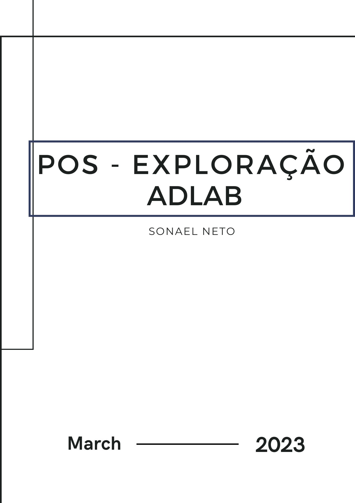

# **Pós-Exploração - ADLab | Sonael de A. Angelos Neto**

- ### **Como é feito a exploração e o reconhecimento em ambientes com Active Directory?**

  Podem ser realizados de várias maneiras, algumas das quais incluem:

  - **Escaneamento de portas**: Um invasor pode usar ferramentas de escaneamento de portas, como Nmap, para identificar os sistemas que estão em execução no ambiente e os serviços que estão sendo executados nesses sistemas. Isso pode ajudar a identificar sistemas vulneráveis que podem ser explorados.

  - **Enumeração de usuários e grupos**: A enumeração de usuários e grupos pode ser realizada para identificar contas de usuário com privilégios elevados ou contas de serviço que possam ser exploradas.

  - **Coleta de informações do Active Directory**: Um invasor pode usar ferramentas como o PowerView para coletar informações do Active Directory, como informações sobre usuários, grupos, permissões, políticas de grupo e muito mais. Essas informações podem ser usadas para identificar sistemas e usuários vulneráveis.

  - **Exploração de vulnerabilidades**: Depois que as informações sobre o ambiente foram coletadas, um invasor pode usar ferramentas de exploração de vulnerabilidades para identificar sistemas e aplicativos vulneráveis que possam ser explorados para obter acesso não autorizado ao ambiente.

  - **Ataques de phishing**: Ataques de phishing podem ser usados para obter acesso às credenciais de usuários com privilégios elevados. Esses ataques podem ser realizados por meio de e-mails de spear-phishing, que parecem ser enviados por remetentes confiáveis, ou por meio de ataques de engenharia social, nos quais um invasor se passa por um funcionário do suporte técnico e solicita as credenciais do usuário.

  Para reduzir o risco de exploração e reconhecimento em um ambiente Active Directory, é importante implementar medidas de segurança, como a aplicação de atualizações de segurança, práticas de segurança de senha fortes, controle de acesso baseado em função, monitoramento de atividade de usuário e detecção de anomalias. Além disso, é importante educar os usuários sobre os perigos dos ataques de phishing e outras técnicas de engenharia social para que possam estar mais vigilantes e alertas.

- ### **Como se da a elevação de privilégios em um ambiente Active Directory?**

  A elevação de privilégios em um ambiente Active Directory pode ser realizada de diversas formas, algumas delas incluem:

  - **Uso de credenciais privilegiadas roubadas**: Se um invasor conseguir obter acesso às credenciais de um usuário com privilégios elevados, ele poderá usá-las para se autenticar em outros sistemas e obter acesso privilegiado.

  - **Exploração de vulnerabilidades em software**: Muitas vezes, sistemas e aplicativos em um ambiente Active Directory podem ter vulnerabilidades que permitem que um invasor execute código arbitrário com privilégios elevados. Essa exploração pode permitir que o invasor assuma o controle total do sistema.

  - **Ataques de engenharia social**: Ataques de engenharia social, como phishing ou spear-phishing, podem ser usados para obter acesso às credenciais de usuários com privilégios elevados. Isso pode permitir que o invasor se autentique em outros sistemas e obtenha acesso privilegiado.

  - **Uso de técnicas de escalonamento de privilégios**: Técnicas como "Pass-the-Hash" ou "Pass-the-Ticket" podem ser usadas para obter acesso com privilégios elevados sem a necessidade de obter as credenciais reais do usuário. Essas técnicas exploram vulnerabilidades em protocolos de autenticação.

  - **Uso de backdoors ou malware**: Se um invasor conseguir instalar um backdoor ou malware em um sistema com privilégios elevados, ele poderá usá-lo para obter acesso privilegiado em outros sistemas.

  Para reduzir o risco de elevação de privilégios em um ambiente Active Directory, é importante implementar medidas de segurança como o controle de acesso baseado em função, monitoramento de atividade de usuário e detecção de anomalias, além de aplicar atualizações de segurança e práticas de segurança de senha fortes.

---

## **
Sumário
**

  **Nesse documento iremos explorar um Active Directory.**

  1. #### ***<a href="#1">Qual o “nome” do domínio?</a>***
  2. #### ***<a href="#2">Qual o nome de todos os computadores do domínio?</a>***
  3. #### ***<a href="#3">Qual o IP do controlador de domínio?</a>***
  4. #### ***<a href="#4">Qual o servidor dns da rede?</a>***
  5. #### ***<a href="#5">Qual a police de senhas do domínio?</a>***
  6. #### ***<a href="#6">Quantos grupos esse domínio possui?</a>***
  7. #### ***<a href="#7">Quantos usuários são Administradores de domínio? E enterprise admins?</a>***
  8. #### ***<a href="#8">Quais usuários são administradores do domínio?a>***
  9. #### ***<a href="#9">Existe algum administrador de domínio que a senha não expira? Se sim, qual?</a>***
  10. #### ***<a href="#10">Algum administrador possui algum comentário interessante no seu usuário? Se sim, qual?</a>***

### **Complementos:**

   11. #### ***<a href="#11">Dificuldades.</a>***
   12. #### ***<a href="#12">Conclusão.</a>***
   13. #### ***<a href="#13">Referências.</a>***
   14. #### ***<a href="#14">Links p/ Laboratório.</a>***
  
---

### **Ferramentas utilizadas:**

- #### [Active Directory Explorer](https://learn.microsoft.com/en-us/sysinternals/downloads/adexplorer)
    - Utilizaremos o  Active Directory Explorer para explorar o Active Directory.

- #### [ldapdomaindump](https://github.com/dirkjanm/ldapdomaindump)
    - Utilizaremos o ldapdomaindump para explorar o Active Directory.

---

## **<a id="1"> • Qual o “nome” do domínio?</a>**

Para saber o nome do domínio, utilizaremos o comando "`wmic computersystem get domain`":

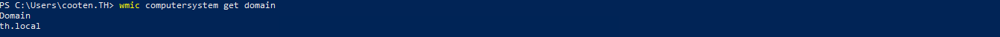

Também podemos utilizar o comando `systeminfo`:

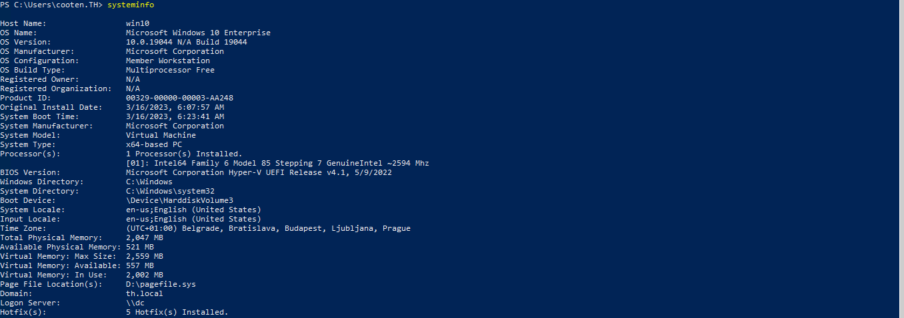

Com isso, temos o nome do domínio: `th.local`.

---

## **<a id="2"> • Qual o nome de todos os computadores do domínio?</a>**

Para saber o nome de todos os computadores do domínio, utilizaremos o comando "`net group "domain computers" /domain`":

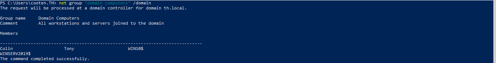

Note que apenas os nomes que possuem **$** no final são computadores do domínio.

Então, temos os seguintes computadores do domínio:

- `WINSERV2019$`
- `WIN10$`

---

## **<a id="3"> • Qual o IP do controlador de domínio?</a>**

Para saber o IP do controlador de domínio, utilizaremos o comando "`nslookup th.local`":

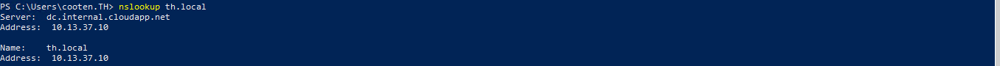

Também podemos utilizar o comando `ipconfig \all` pois normalmente o controlador de domínio é o primeiro servidor DNS:

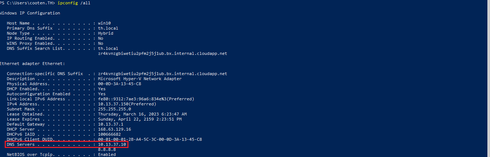

Com isso temos que o IP do controlador de domínio é "`10.13.37.10`".

---

## **<a id="4"> • Qual o servidor dns da rede?</a>**

Como visto anteriormente o servidor DNS é o controlador de domínio, então o ip do servidor DNS é o mesmo do controlador de domínio "`10.13.37.10`".

---

## **<a id="5"> • Qual a police de senhas do domínio?</a>**

Para saber a police de senhas do domínio, utilizaremos o comando "`net accounts /domain`":

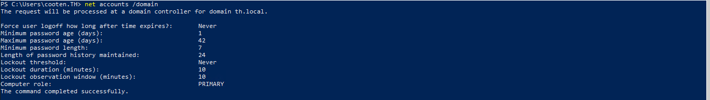

Também podemos utilizar o script "`ldapdomaindump.py`" para obter a police de senhas do domínio.

Primeiro vamos gerar um dump do domínio com o comando "`python .\ldapdomaindump.py -u "th.local\cooten" -p "OlIrk8VS0ARWHGbP"-o domainthlocal -m 10.13.37.10`"

Agora vamos abrir o arquivo "`domain_policy.html`" e ver a police de senhas do domínio:

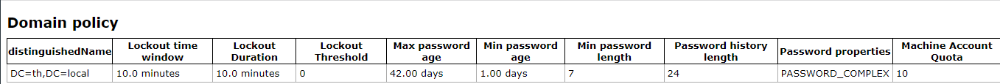

onde temos que a police de senhas do domínio é:

- **Force user logoff how long after time expires:** `Never`
- **Minimum password age (days):** `1`
- **Maximum password age (days):** `42`
- **Minimum password length:** `7`
- **Length of password history maintained:** `24`
- **Lockout threshold:** `Never`
- **Lockout duration (minutes):** `10`
- **Lockout observation window (minutes):** `10`
- **Computer role:** `PRIMARY`

---

## **<a id="6"> • Quantos grupos esse domínio possui?</a>**

Para saber quantos grupos esse domínio possui, utilizaremos o comando "`net group /domain`":

Com isso temos que o domínio possui `144` grupos.

---

## **<a id="7"> • Quantos usuários são Administradores de domínio? E enterprise admins?</a>**

Para saber quantos usuários são **Domain Admins**, utilizaremos o comando "`net group /domain "Domain Admins"`":

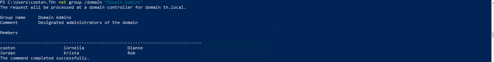

E para saber quantos usuários são **Enterprise admins**, utilizaremos o comando "`net group /domain "Enterprise Admins"`":

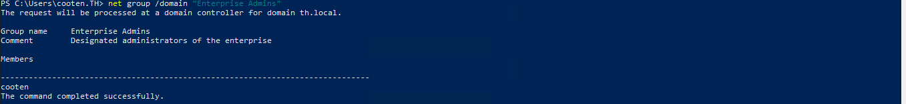

Então temos que o domínio possui `6` membros **Domain Admins** e `1` membros **Enterprise admins**.

---

## **<a id="8"> • Quais usuários são administradores do domínio?</a>**

De acordo com o resultado anterior, temos que os membros que pertencem ao grupo **Domain Admins** são:

- `cooten`
- `Jordan`
- `Cornelia`
- `Krista`
- `Dianne`
- `Rob`

---

## **<a id="9"> • Existe algum administrador de domínio que a senha não expira? Se sim, qual?</a>**

Para saber se existe algum administrador de domínio que a senha não expira, utilizaremos o comando "`net user /domain NAME_USER`" para cada usuário do grupo **Domain Admins**:

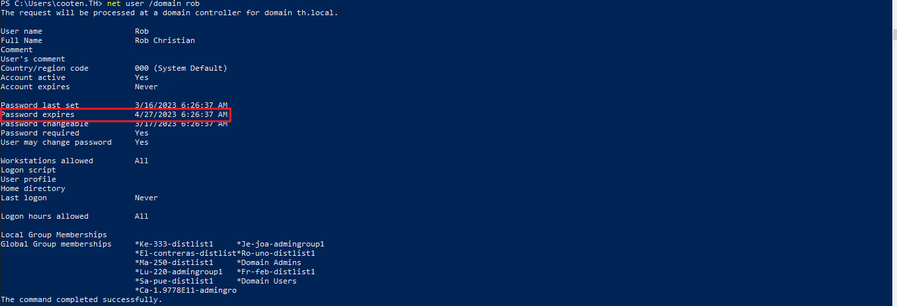

Com isso, verificando todos os usuários do grupo **Domain Admins**, temos que não existe nenhum administrador de domínio que a senha não expira.

---

## **<a id="10"> • Algum administrador possui algum comentário interessante no seu usuário? Se sim, qual?</a>**

O único membro do grupo **Domain Admins** que possui um comentário é o usuário `cooten`:

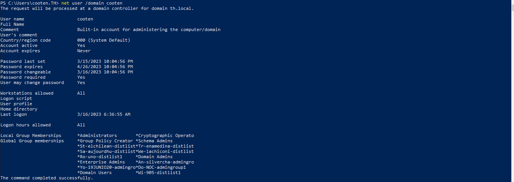

Seu comentário diz: **Built-in account for administering the computer/domain**
  > Conta integrada para administrar o computador/domínio

Porém olhando o aquivo "`domain_users.html`" gerado pelo script "`ldapdomaindump.py`", podemos ver que o usuário Kerry membro do grupo **Domain Users** possui um comentário interessante:

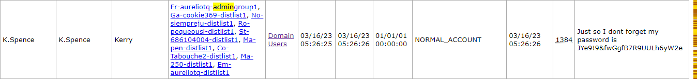

Seu comentário diz: **Just so I dont forget my password is JYe9!9&fwGgfB7R9UULh6yW2e**
  > Só para não esquecer minha senha é JYe9!9&fwGgfB7R9UULh6yW2e

Temos aqui então uma senha que pode ser utilizada para logar no usuário `Kerry`.

---

## **<a id="11">• Dificuldades.</a>**

*Nenhuma dificuldade relevante. =}* 

---

## **<a id="12">• Conclusão.</a>**

O ambiente Active Directory é amplamente utilizado em empresas e organizações para gerenciar usuários, grupos e recursos de rede. No entanto, esse ambiente também pode ser alvo de invasores que buscam obter acesso não autorizado a sistemas e informações confidenciais.

Para proteger o ambiente Active Directory contra ameaças de segurança, é necessário implementar medidas de segurança, como o controle de acesso baseado em função, monitoramento de atividade de usuário e detecção de anomalias, além de aplicar atualizações de segurança e práticas de segurança de senha fortes. É importante também educar os usuários sobre os perigos dos ataques de phishing e outras técnicas de engenharia social.

Por outro lado, para invasores que buscam explorar e reconhecer o ambiente Active Directory, é possível realizar várias técnicas, como escaneamento de portas, enumeração de usuários e grupos, coleta de informações do Active Directory, exploração de vulnerabilidades e ataques de phishing. Com essas técnicas, os invasores podem obter informações valiosas sobre o ambiente e identificar sistemas e usuários vulneráveis que podem ser explorados.

Portanto, é fundamental que empresas e organizações estejam cientes das ameaças de segurança que existem no ambiente Active Directory e implementem medidas de segurança robustas para proteger seus sistemas e informações confidenciais. Além disso, é importante manter-se atualizado sobre as últimas ameaças e vulnerabilidades e estar preparado para agir rapidamente em caso de incidentes de segurança.

---

## **<a id="13">• Referências.</a>**

- [Post-Exploitation Basics In Active Directory Environment](https://infosecwriteups.com/post-exploitation-basics-in-active-directory-enviorment-by-hashar-mujahid-d46880974f87)
  
- [Windows Active Directory Post Exploitation Cheatsheet](https://bbinfosec.medium.com/windows-active-directory-reconnaissance-48c2bd70388)

- [Active Directory Exploitation Cheat Sheet](https://github.com/S1ckB0y1337/Active-Directory-Exploitation-Cheat-Sheet)

- [ChatGPT](https://chat.openai.com/chat)

---

## **<a id="14">• Laboratório.</a>**

  - [ADLab](https://github.com/thehackerish/ADLab)