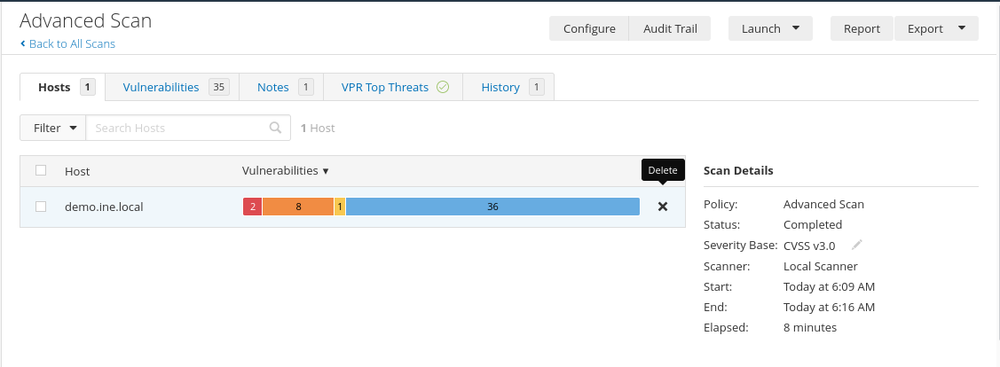
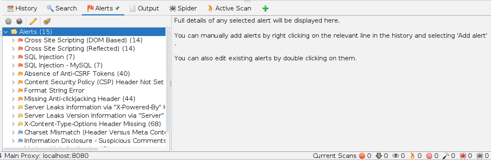

# **Scans de Vulnerabilidade | Sonael de A. Angelos Neto**

## ***• INE (Penetration Testing Basics) - Nessus Lab***

Nesse laboratório, iremos utilizar o Nessus para realizar um scan de vulnerabilidade em uma rede.

O alvo do scan será um servidor web, que está hospedado em uma máquina virtual.

> demo.ine.local

Alterando oa configurações do scan podemos criar um scan personalizado para web.

---

### ***◦ Resultado do Scan***

> 

---

### ***◦ Vulnerabilidades Encontradas***

|***Nome***                                                                                                                          |***Score***| ***Família***      | ***Severidade***    |
|------------------------------------------------------------------------------------------------------------------------------------|-----------|--------------------|---------------------|
|**[phpMyAdmin prior to 4.8.6 SQLi vulnerablity (PMASA-2019-3)](https://cve.mitre.org/cgi-bin/cvename.cgi?name=CVE-2019-11768)**     | `9.8`     | `CGI abuses`       | *`High`*            |
|**phpMyAdmin Installation Not Password Protected**                                                                                  | `7.5`     | `CGI abuses`       | *`High`*            |
|**[JQuery 1.2 < 3.5.0 Multiple XSS](https://cve.mitre.org/cgi-bin/cvename.cgi?name=CVE-2020-11023)**                                | `6.1`     | `CGI abuses : XSS` | *`Medium`*          |
|**Browsable Web Directories**                                                                                                       | `5.3`     | `CGI abuses`       | *`Medium`*          |
|**phpinfo.php Detection**                                                                                                           | `5.3`     | `CGI abuses`       | *`Medium`*          |
|**Git Repository Served by Web Server**                                                                                             | `5.0`     | `CGI abuses`       | *`Medium`*          |
|**[PHP Parameter Traversal](https://cve.mitre.org/cgi-bin/cvename.cgi?name=CVE-2001-1204)**                                         | `5.0`     | `CGI abuses`       | *`Medium`*          |
|**[Web Application Potentially Vulnerable to Clickjacking](https://cwe.mitre.org/data/definitions/693)**                            | `4.3`     | `Web Server`       | *`Medium`*          |
|**[Xitami testssi.ssi HTTP Header XSS](https://cwe.mitre.org/data/definitions/931)**                                                | `4.3`     | `CGI abuses : XSS` | *`Medium`*          |

---

### ***Introdução as Vulnerabilidades***

- #### ***phpMyAdmin prior to 4.8.6 SQLi vulnerablity (PMASA-2019-3)***
    > **Descrição:** phpMyAdmin é uma ferramenta de software gratuita escrita em PHP, destinada a lidar com a administração do MySQL na Web. Essa vulnerabilidade pode ser explorada por um invasor para executar comandos SQL arbitrários no servidor de banco de dados subjacente. A vulnerabilidade está relacionada ao CVE-2019-11767.

    > **CWE:** [CWE-89](https://cwe.mitre.org/data/definitions/89.html)

- #### ***phpMyAdmin Installation Not Password Protected***
    > **Descrição:** A má configuração do phpMyAdmin permite que qualquer pessoa acesse o phpMyAdmin sem a necessidade de uma senha.

    > **CWE:** [CWE-287](https://cwe.mitre.org/data/definitions/287.html)

- #### ***JQuery 1.2 < 3.5.0 Multiple XSS***
    > **Descrição:** A vulnerabilidade permite que um invasor execute código JavaScript arbitrário no contexto do navegador do usuário. Isso pode ser usado para roubar cookies de sessão, executar ataques de phishing, etc.A vulnerabilidade está relacionada ao CVE-2020-11023.

    > **CWE:** [CWE-79](https://cwe.mitre.org/data/definitions/79.html)

- #### ***Browsable Web Directories***
    > **Descrição:** O servidor web está configurado para exibir diretórios. Isso pode ser usado para descobrir arquivos e diretórios que não deveriam ser acessíveis.

    > **CWE:** [CWE-548](https://cwe.mitre.org/data/definitions/548.html)

- #### ***phpinfo.php Detection***
   > **Descrição:** O phpinfo.php é um arquivo que contém informações sobre a configuração do PHP. Essas informações podem ser usadas para descobrir vulnerabilidades no servidor web.

    > **CWE:** [CWE-548](https://cwe.mitre.org/data/definitions/548.html)

- #### ***Git Repository Served by Web Server***
    > **Descrição:** O servidor web está configurado para servir repositórios Git. Isso pode ser usado para descobrir arquivos e diretórios que não deveriam ser acessíveis.

    > **CWE:** [CWE-548](https://cwe.mitre.org/data/definitions/548.html)

- #### ***PHP Parameter Traversal***
    > **Descrição:** O servidor web está configurado para permitir que os parâmetros de consulta sejam usados ​​para acessar arquivos fora do diretório raiz. Isso pode ser usado para descobrir arquivos e diretórios que não deveriam ser acessíveis.A vulnerabilidade está relacionada ao CVE-2001-1204.

    > **CWE:** [CWE-548](https://cwe.mitre.org/data/definitions/548.html)

- #### ***Web Application Potentially Vulnerable to Clickjacking***
    > **Descrição:** O servidor web está configurado para permitir que o navegador do usuário execute o conteúdo de um site em um quadro ou iframe de outro site. Isso pode ser usado para criar um ataque de clickjacking.

    > **CWE:** [CWE-693](https://cwe.mitre.org/data/definitions/693.html)

- #### ***Xitami testssi.ssi HTTP Header XSS***
    > **Descrição:** A vulnerabilidade permite que um invasor execute código JavaScript arbitrário no contexto do navegador do usuário. Isso pode ser usado para roubar cookies de sessão, executar ataques de phishing, etc.

    > **CWE:** [CWE-79](https://cwe.mitre.org/data/definitions/79.html)

---

## ***• Scanner [testphp.vulnweb](http://testphp.vulnweb.com/)***

Nesse teste foi utilizado o [OWASP ZAP](https://www.zaproxy.org/) para realizar o scan no site:
> http://testphp.vulnweb.com/
---

### ***◦ Resultado do Scan***

---

### ***◦ Vulnerabilidades Encontradas***

|***Nome***                                                                                                | ***Severidade***    |
|----------------------------------------------------------------------------------------------------------|---------------------|
|**[Cross Site Scripting (DOM Based))](https://owasp.org/www-community/attacks/DOM_Based_XSS)**            | *`High`*            |
|**[Cross Site Scripting (Reflected)](https://owasp.org/www-community/attacks/xss/)**                      | *`High`*            |
|**[SQL Injection](https://owasp.org/www-community/attacks/SQL_Injection)**                                | *`High`*          |
|**[Absence of Anti-CSRF Tokens](https://scanrepeat.com/web-security-knowledge-base/absence-of-anti-csrf-tokens#:~:text=The%20absence%20of%20Anti-CSRF,executed%20from%20the%20administrator%20account.)**               | *`Low`*          |
|**[Content Security Policy (CSP) Header Not Set](https://owasp.org/www-community/controls/Content_Security_Policy)**  | *`Medium`*          |
|**[Format String Error](https://owasp.org/www-community/attacks/Format_string_attack)**                      | *`Medium`*          |
|**[Missing Anti-clickjacking Header](https://owasp.org/www-community/attacks/Clickjacking)**              | *`Medium`*          |
|**[Server Leaks Information via "X-Powered-By" HTTP Response Header Field(s)](https://owasp.org/www-project-web-security-testing-guide/latest/4-Web_Application_Security_Testing/01-Information_Gathering/08-Fingerprint_Web_Application_Framework)**  | *`Low`*          |
|**[Server Leaks Version Information via "Server" HTTP Response Header Field](https://owasp.org/www-project-web-security-testing-guide/latest/4-Web_Application_Security_Testing/01-Information_Gathering/08-Fingerprint_Web_Application_Framework)**              | *`Low`*          |
|**[X-Content-Type-Options Header Missing](https://www.zaproxy.org/docs/alerts/10021/)**              | *`Low`*          |

---

### ***Introdução as Vulnerabilidades***

- #### ***Cross Site Scripting (DOM Based))***
    > **Descrição:** A vulnerabilidade permite que um invasor execute código JavaScript arbitrário no contexto do navegador do usuário. Isso pode ser usado para roubar cookies de sessão, executar ataques de phishing, etc.

    > **CWE:** [CWE-79](https://cwe.mitre.org/data/definitions/79.html)

- #### ***Cross Site Scripting (Reflected)***
    > **Descrição:** A vulnerabilidade permite que um invasor execute código JavaScript arbitrário no contexto do navegador do usuário. Isso pode ser usado para roubar cookies de sessão, executar ataques de phishing, etc.

    > **CWE:** [CWE-79](https://cwe.mitre.org/data/definitions/79.html)

- #### ***SQL Injection***
    > **Descrição:** A vulnerabilidade permite que um invasor execute comandos SQL arbitrários no banco de dados do servidor. Isso pode ser usado para recuperar dados sensíveis, modificar dados ou executar comandos do sistema operacional.

    > **CWE:** [CWE-89](https://cwe.mitre.org/data/definitions/89.html)

- #### ***Absence of Anti-CSRF Tokens***
    > **Descrição:** O servidor web não está configurado para exigir tokens CSRF para proteger contra ataques de falsificação de solicitação entre sites. Isso pode ser usado para executar comandos arbitrários no servidor.

    > **CWE:** [CWE-352](https://cwe.mitre.org/data/definitions/352.html)

- #### ***Content Security Policy (CSP) Header Not Set***
    > **Descrição:** O servidor web não está configurado para enviar um cabeçalho CSP. Isso pode ser usado para executar ataques de injeção de conteúdo.

    > **CWE:** [CWE-693](https://cwe.mitre.org/data/definitions/693.html)

- #### ***Format String Error***
    > **Descrição:** A vulnerabilidade permite que um invasor execute comandos arbitrários no servidor. Isso pode ser usado para recuperar dados sensíveis, modificar dados ou executar comandos do sistema operacional.

    > **CWE:** [CWE-134](https://cwe.mitre.org/data/definitions/134.html)

- #### ***Missing Anti-clickjacking Header***
    > **Descrição:** O servidor web não está configurado para enviar um cabeçalho anti-clickjacking. Isso pode ser usado para executar ataques de clickjacking.

    > **CWE:** [CWE-693](https://cwe.mitre.org/data/definitions/693.html)

- #### ***Server Leaks Information via "X-Powered-By" HTTP Response Header Field(s)***
    > **Descrição:** O servidor web está configurado para enviar um cabeçalho HTTP "X-Powered-By" que revela informações sobre o servidor web. Isso pode ser usado para executar ataques de fingerprinting.

    > **CWE:** [CWE-200](https://cwe.mitre.org/data/definitions/200.html)

- #### ***Server Leaks Version Information via "Server" HTTP Response Header Field***
    > **Descrição:** O servidor web está configurado para enviar um cabeçalho HTTP "Server" que revela informações sobre o servidor web. Isso pode ser usado para executar ataques de fingerprinting.

    > **CWE:** [CWE-200](https://cwe.mitre.org/data/definitions/200.html)

- #### ***X-Content-Type-Options Header Missing***
    > **Descrição:** O servidor web não está configurado para enviar um cabeçalho X-Content-Type-Options. Isso pode ser usado para executar ataques de injeção de conteúdo.

    > **CWE:** [CWE-693](https://cwe.mitre.org/data/definitions/693.html)
