# **Path & File Enumeration / Directory Traversal | Sonael de A. Angelos Neto**

- ## **Introdução a vulnerabilidade Path & File Enumeration / Directory Traversal**

  - ### **O que é?**

    **Path & File Enumeration / Directory Traversal** permite ao atacante obter informações sobre o sistema de arquivos do servidor, como diretórios e arquivos, além de permitir que o atacante obtenha acesso a arquivos que não deveriam ser acessíveis.

  - ### **Como funciona?**

    A vulnerabilidade **Path & File Enumeration / Directory Traversal** ocorre quando o desenvolvedor não valida corretamente os dados de entrada do usuário, permitindo que o atacante envie uma requisição com um caminho de arquivo ou diretório que não deveria ser acessível.

  ### Nesse documento, iremos explorar a vulnerabilidade `"Path & File Enumeration / Directory Traversal"`, utilizando **6** laboratórios diferentes do [TryHackMe](https://tryhackme.com/) em conjunto com a [Portswigger Academy](https://portswigger.net/web-security/all-labs), sendo eles:

  - #### ***Content Discovery (THM).***
  - #### ***File path traversal, simple case (portswigger).***
  - #### ***File path traversal, traversal sequences blocked with absolute path bypass (portswigger).***
  - #### ***File path traversal, traversal sequences stripped non-recursively (portswigger).***
  - #### ***File path traversal, validation of start of path (portswigger).***
  - #### ***File path traversal, validation of file extension with null byte bypass (portswigger).***

---

### Ferramentas utilizadas:

- #### [ffuf](https://github.com/ffuf/ffuf) :
    - Utilizaremos o `ffuf` para realizar o brute force de diretórios e arquivos.

- #### [Burp Suite](https://portswigger.net/burp) :
    - Utilizaremos o `Burp Suite` para interceptar as requisições e analisar o que está sendo enviado para o back-end.

---

## **• Content Discovery.**

  ### 1.  **Manual Discovery - Robots.txt.**

  Nessa task do laboratório, o objetivo é encontrar o arquivo `robots.txt` e analisar o que está escrito nele.

  - #### **O que é o arquivo `robots.txt`?**

    O arquivo `robots.txt` é um arquivo de texto que contém instruções para os robôs de busca, como o Googlebot, Bingbot, YandexBot, etc. O arquivo `robots.txt` é colocado na raiz do site, ou seja, na pasta `/` do site.

  - #### **O que está escrito no arquivo `robots.txt`?**

    No arquivo `robots.txt` está escrito o seguinte:

    ```txt
    User-agent: *
    Allow: /
    Disallow: /staff-portal
    ```

  Apos isso, vemos que a resposta para a task é `staff-portal`.

  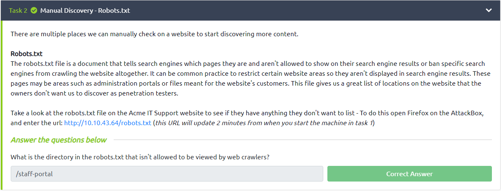

---

  ###  2. **Manual Discovery - Sitemap.xml.**

  Nessa task do laboratório, o objetivo é encontrar o arquivo `sitemap.xml` e analisar o que está escrito nele.

  - #### **O que é o arquivo `sitemap.xml`?**

    O arquivo `sitemap.xml` é um arquivo de texto que contém informações sobre os arquivos e páginas do site, como a data de modificação, a frequência de modificação, a prioridade, etc.

  - #### **O que está escrito no arquivo `sitemap.xml`?**

    No arquivo `sitemap.xml` está escrito o seguinte:

    ```xml
    <urlset xmlns:xsi="http://www.w3.org/2001/XMLSchema-instance">
      <url>
      <loc>http://10.10.43.64/</loc>
      <lastmod>2021-07-19T13:07:32+00:00</lastmod>
      <priority>1.00</priority>
      </url>
      <url>
      <loc>http://10.10.43.64/news</loc>
      <lastmod>2021-07-19T13:07:32+00:00</lastmod>
      <priority>0.80</priority>
      </url>
      <url>
      <loc>http://10.10.43.64/news/article?id=1</loc>
      <lastmod>2021-07-19T13:07:32+00:00</lastmod>
      <priority>0.80</priority>
      </url>
      <url>
      <loc>http://10.10.43.64/news/article?id=2</loc>
      <lastmod>2021-07-19T13:07:32+00:00</lastmod>
      <priority>0.80</priority>
      </url>
      <url>
      <loc>http://10.10.43.64/news/article?id=3</loc>
      <lastmod>2021-07-19T13:07:32+00:00</lastmod>
      <priority>0.80</priority>
      </url>
      <url>
      <loc>http://10.10.43.64/contact</loc>
      <lastmod>2021-07-19T13:07:32+00:00</lastmod>
      <priority>0.80</priority>
      </url>
      <url>
      <loc>http://10.10.43.64/customers/login</loc>
      <lastmod>2021-07-19T13:07:32+00:00</lastmod>
      <priority>0.80</priority>
      </url>
      <url>
      <loc>http://10.10.43.64/s3cr3t-area</loc>
      <lastmod>2021-07-19T13:07:32+00:00</lastmod>
      <priority>0.80</priority>
      </url>
      </urlset>

    ```

    A task pede qual o diretório para a área secreta, então a resposta é `/s3cr3t-area`.

    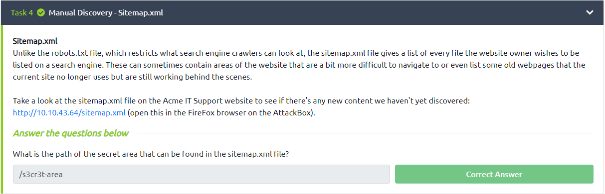


---

  ###  3. **Automated Discovery.**

  Nessa task do laboratório, o objetivo é listar os diretório, e pra isso vamos utilizar o `ffuf` junta com o `wordlist` do `seclists` chamada `common.txt`.
  
  Utilizaremos o seguinte comando:

  ```bash

  ╭─[LAPTOP-HRI3FQ3J] as root in ~                                                                               03:01:53
╰──➤ ffuf -w /usr/share/wordlists/seclists/Discovery/Web-Content/common.txt -u http://10.10.105.119/FUZZ

        /'___\  /'___\           /'___\
       /\ \__/ /\ \__/  __  __  /\ \__/
       \ \ ,__\\ \ ,__\/\ \/\ \ \ \ ,__\
        \ \ \_/ \ \ \_/\ \ \_\ \ \ \ \_/
         \ \_\   \ \_\  \ \____/  \ \_\
          \/_/    \/_/   \/___/    \/_/

       v1.5.0 Kali Exclusive <3
________________________________________________

 :: Method           : GET
 :: URL              : http://10.10.105.119/FUZZ
 :: Wordlist         : FUZZ: /usr/share/wordlists/seclists/Discovery/Web-Content/common.txt
 :: Follow redirects : false
 :: Calibration      : false
 :: Timeout          : 10
 :: Threads          : 40
 :: Matcher          : Response status: 200,204,301,302,307,401,403,405,500
________________________________________________

assets                  [Status: 301, Size: 178, Words: 6, Lines: 8, Duration: 235ms]
contact                 [Status: 200, Size: 3108, Words: 747, Lines: 65, Duration: 228ms]
customers               [Status: 302, Size: 0, Words: 1, Lines: 1, Duration: 220ms]
development.log         [Status: 200, Size: 27, Words: 5, Lines: 1, Duration: 217ms]
monthly                 [Status: 200, Size: 28, Words: 4, Lines: 1, Duration: 238ms]
news                    [Status: 200, Size: 2538, Words: 518, Lines: 51, Duration: 224ms]
private                 [Status: 301, Size: 178, Words: 6, Lines: 8, Duration: 221ms]
robots.txt              [Status: 200, Size: 46, Words: 4, Lines: 3, Duration: 220ms]
sitemap.xml             [Status: 200, Size: 1391, Words: 260, Lines: 43, Duration: 234ms]
:: Progress: [4713/4713] :: Job [1/1] :: 176 req/sec :: Duration: [0:00:27] :: Errors: 0 ::


```

  A task pede qual o nome do diretório que começa com **"/mo...."** então a resposta é `/monthly`.

  Também pede qual o nome do arquivo de log que foi achado durante a varredura, então a resposta é `/development.log`.

  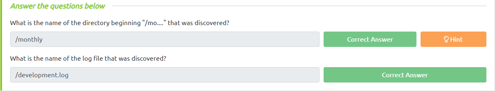


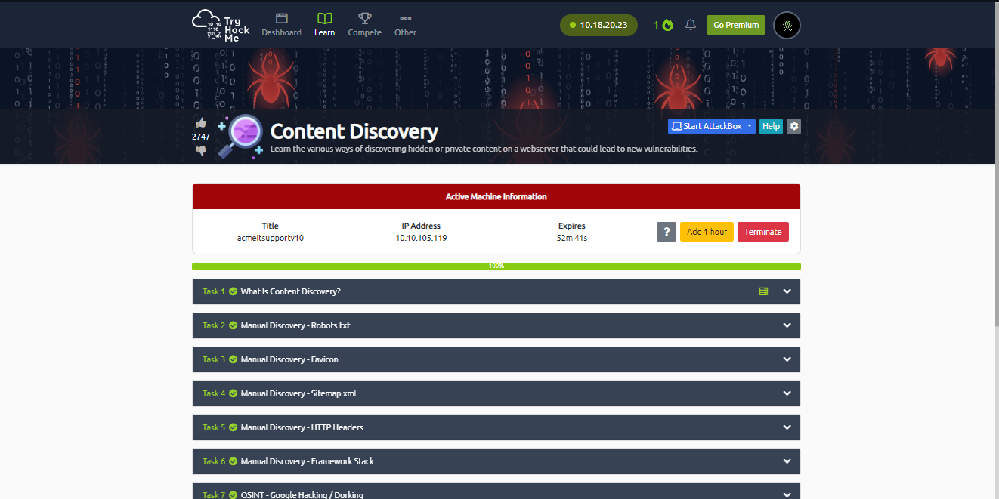

---

## **• File path traversal, simple case.**

Nesse laboratório, o objetivo é acessar o arquivo `"/etc/passwd"` através de um `file path traversal`.

Utilizando o burp suite, é possível ver que as requisições das imagens do site são feitas através de um parâmetro chamado `filename` que recebe o nome da imagem.

> https://0a9800280489b797c29a6c9400d900dc.web-security-academy.net/image?filename=15.jpg

Sabendo disso é possível fazer um `file path traversal` alterando o parâmetro `filename` com o seguinte valor:

> https://0a9800280489b797c29a6c9400d900dc.web-security-academy.net/image?filename=../../../etc/passwd

e fazer com que o burp a envie para o servidor.

**Request** | **Response** 
:---------: | :------:
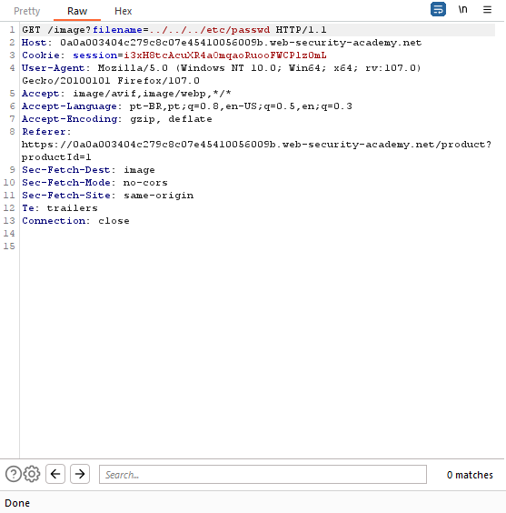 |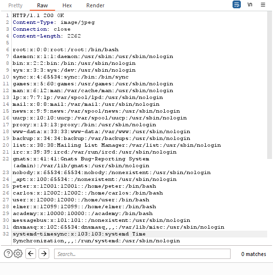

Dessa forma o laboratório é concluído.

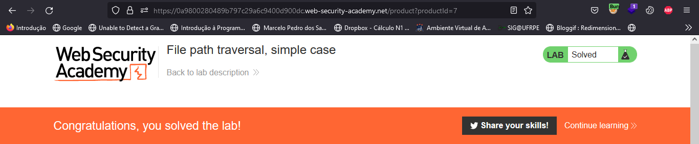

---

## **• File path traversal, traversal sequences blocked with absolute path bypass.**

Nesse laboratório, o objetivo também é acessar o arquivo `"/etc/passwd"` através de um `file path traversal`.

Porém ao tentarmos usar o mesmo método do laboratório anterior, o servidor retorna um erro.

**Request** | **Response** 
:---------: | :------:
 |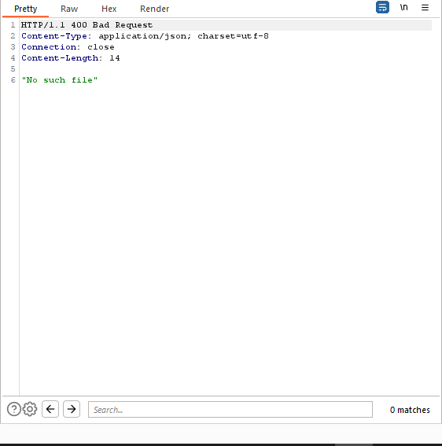

Isso acontece porque o servidor não aceita caminhos absolutos, então para contornar isso, é necessário usar um caminho relativo.

Usando apenas `"/etc/passwd"` podemos dar um bypass no servidor.

**Request** | **Response** 
:---------: | :------:
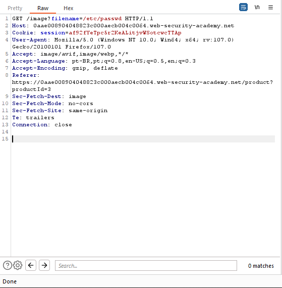 |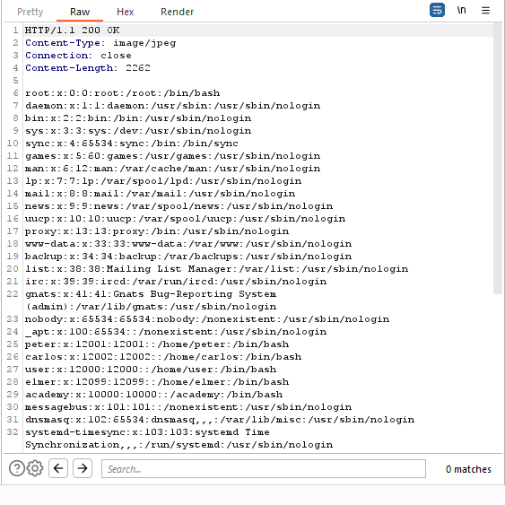

Dessa forma o laboratório é concluído.

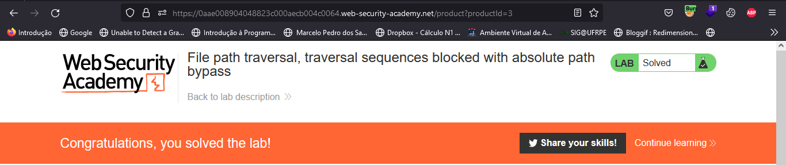

## **• File path traversal, traversal sequences stripped non-recursively**

Nesse laboratório, o objetivo é acessar o arquivo `"/etc/passwd"` através de um `file path traversal`.

porém a aplicação está removendo as sequências de path traversal do nome de arquivo fornecido pelo usuário antes de usá-lo.

Para contornar isso, é necessário usar uma sequência de path traversal que não seja removida, Então enviaremos a seguinte requisição:

**Request** | **Response** 
:---------: | :------:
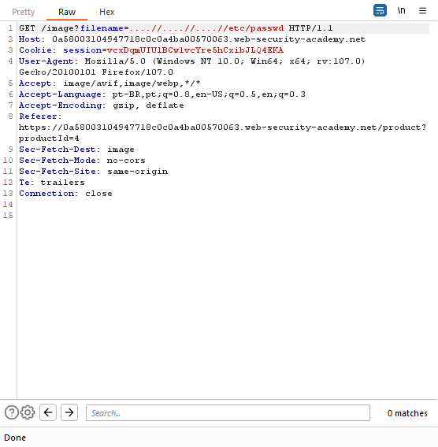 |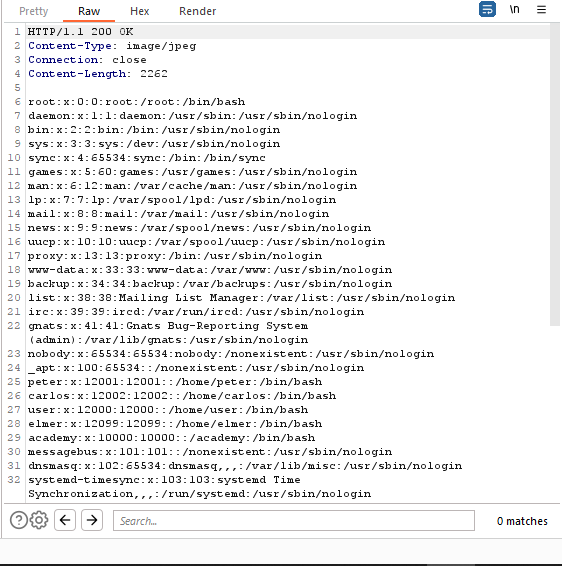

Note que na requisição acima estamos usando `"....//....//....//etc/passwd"`, dessa forma o servidor não remove a sequência de path traversal e conseguimos acessar o arquivo `"/etc/passwd"`.

E assim o laboratório é concluído.

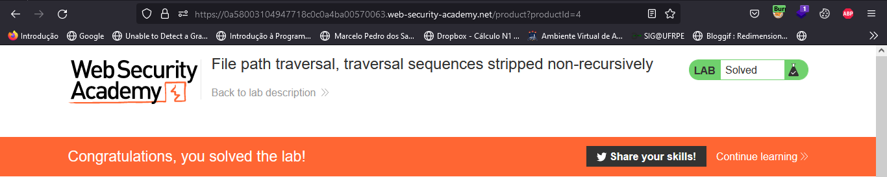

---

## **• File path traversal, validation of start of path.**

Nesse laboratório, ao interceptar a requisição da imagem vemos que o servidor está buscando o arquivo na pasta `"/var/www/images/"`.

``` http

GET /image?filename=/var/www/images/50.jpg HTTP/1.1
Host: 0abe00870435076ac25d987f00690021.web-security-academy.net
Cookie: session=XNgEjrO0tg7GVQxxc2b7RxxH0F1HCrvq
User-Agent: Mozilla/5.0 (Windows NT 10.0; Win64; x64; rv:107.0) Gecko/20100101 Firefox/107.0
Accept: image/avif,image/webp,*/*
Accept-Language: pt-BR,pt;q=0.8,en-US;q=0.5,en;q=0.3
Accept-Encoding: gzip, deflate
Referer: https://0abe00870435076ac25d987f00690021.web-security-academy.net/product?productId=3
Sec-Fetch-Dest: image
Sec-Fetch-Mode: no-cors
Sec-Fetch-Site: same-origin
Te: trailers
Connection: close

```

Então precisamos voltar as pastas até chegar na raiz para poder acessar o arquivo `"/etc/passwd"`.

Para isso, usaremos a seguinte requisição:

**Request** | **Response** 
:---------: | :------:
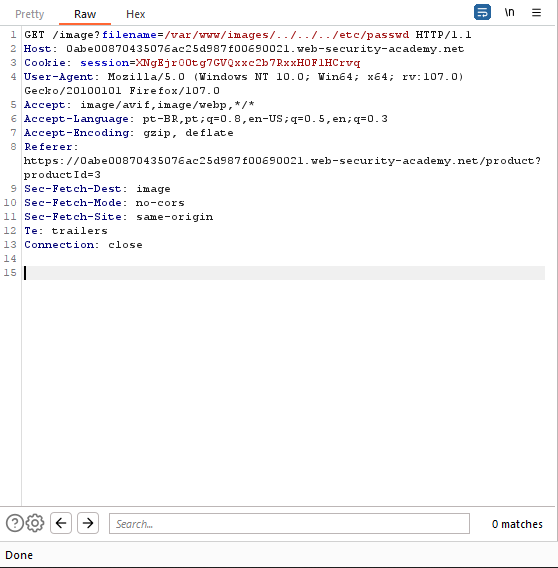 |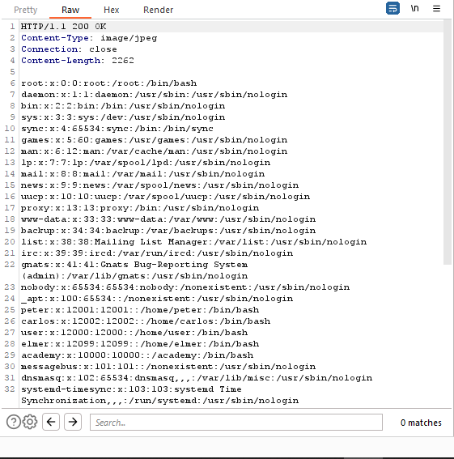

Concluindo assim o laboratório.

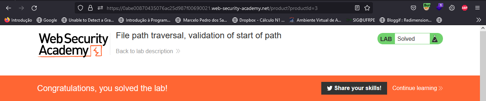

---

## **• File path traversal, validation of file extension with null byte bypass.**

Nesse laboratório, o objetivo é acessar o arquivo `"/etc/passwd"` através de um `file path traversal`.

Porém a aplicação valida se o nome de arquivo fornecido termina com a extensão de arquivo esperada. Para contornar isso, é possível usar um `null byte` para que o servidor não valide a extensão do arquivo.

Para isso, usaremos a seguinte requisição:


**Request** | **Response** 
:---------: | :------:
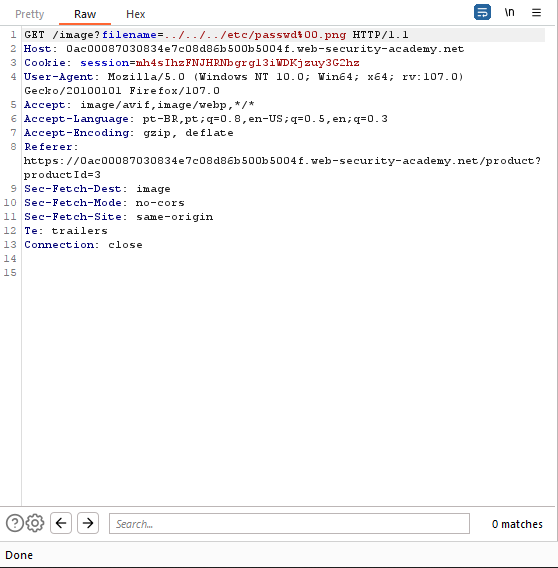 |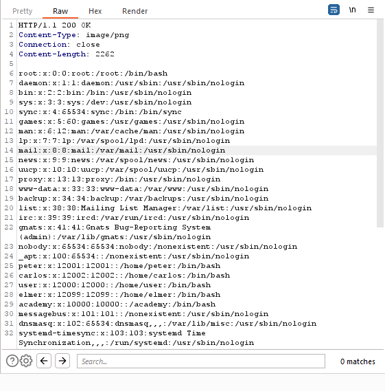

Note que na requisição acima estamos usando `"....//....//....//etc/passwd%00.png"`, dessa forma o servidor não valida a extensão do arquivo e conseguimos acessar o arquivo `"/etc/passwd"`.

E assim o laboratório é concluído.


---

## **• O que é um WAF (web application firewall)?**

Um **Web Application Firewall** (WAF, ou firewall de aplicativo web) é um tipo de software ou hardware projetado para proteger aplicativos web de ataques de segurança. Ele funciona monitorando e filtrando o tráfego da web em tempo real, bloqueando qualquer ação suspeita ou maliciosa antes que ela chegue ao aplicativo web.

O WAF pode ser configurado para detectar e bloquear uma ampla variedade de ataques, como `SQL injection`, `cross-site scripting (XSS)`, ataques de `diretório traversal` e outros. Ele também pode ser configurado para fornecer proteção contra ataques de `negação de serviço distribuída (DDoS)` e outros tipos de tráfego indesejado ou malicioso.

Em resumo, o **WAF** é uma camada adicional de segurança para aplicativos web, que ajuda a proteger os dados e as informações sensíveis de sua empresa de ataques cibernéticos.

---
## **• Mitigação.**

Directory traversal, também conhecido como Path Traversal, é uma vulnerabilidade de segurança que permite a um atacante acessar arquivos e pastas fora do diretório autorizado em um sistema de arquivos. Algumas dicas para mitigar essa vulnerabilidade incluem:

- Validar e sanitizar todas as entradas de usuário: As entradas de usuário devem ser validadas e sanitizadas para garantir que não contenham caracteres de barra invertida ou barra normal ("/", ""), que são comumente usados em ataques de diretório traversal.

- Restringir o acesso a diretórios: Restrinja o acesso a diretórios sensíveis para apenas usuários autorizados. Isso pode ser feito através de permissões de arquivo e diretório ou de configurações de servidor web.

- Usar funções de resolução de caminho: Em vez de permitir que os usuários forneçam caminhos absolutos, use funções de resolução de caminho para garantir que os usuários acessem apenas arquivos e diretórios autorizados.

- Implementar autenticação e autorização fortes: A autenticação e autorização fortes são fundamentais para proteger contra ataques de diretório traversal. Isso inclui a utilização de senhas fortes, autenticação de dois fatores e autorização de acesso baseada em papéis.

- Manter os sistemas atualizados: Mantenha os sistemas e aplicativos atualizados com as últimas correções de segurança para garantir que eles estejam protegidos contra novas vulnerabilidades conhecidas.

---

## **• Dificuldades.**

Nenhuma dificuldade relevante  =)

---

## **• Referências.**

- [Directory traversal](https://owasp.org/www-community/attacks/Path_Traversal)

- [Directory traversal](https://portswigger.net/web-security/file-path-traversal)

- [Directory traversal](https://www.acunetix.com/websitesecurity/directory-traversal/)

- [ChatGPT](https://chat.openai.com/chat)

----

## **• Laboratórios.**

- [Content Discovery (THM).](https://tryhackme.com/room/contentdiscovery)

- [File path traversal, simple case (portswigger).](https://portswigger.net/web-security/file-path-traversal/lab-simple)

- [File path traversal, traversal sequences blocked with absolute path bypass (portswigger).](https://portswigger.net/web-security/file-path-traversal/lab-absolute-path-bypass)

- [File path traversal, traversal sequences stripped non-recursively (portswigger).](https://portswigger.net/web-security/file-path-traversal/lab-sequences-stripped-non-recursively)

- [File path traversal, validation of start of path (portswigger).](https://portswigger.net/web-security/file-path-traversal/lab-validate-start-of-path)

- [File path traversal, validation of file extension with null byte bypass (portswigger).](https://portswigger.net/web-security/file-path-traversal/lab-validate-file-extension-null-byte-bypass)
